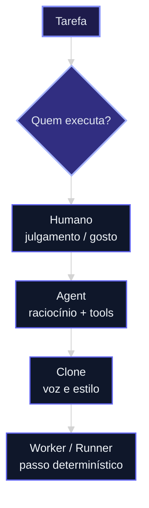
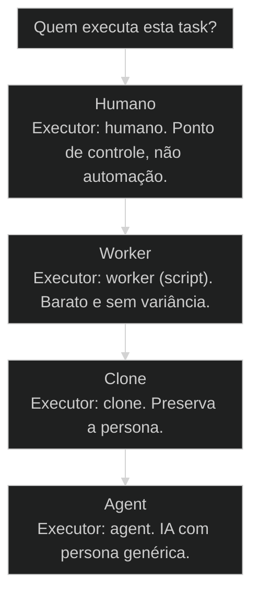

# 4 executores: [[Humano]], [[Agent]], [[Clone]], [[Worker]]

← [[14-anatomia-do-agente|Anatomia de um agente: persona, skills, autoridade, memória]] · ↑ [[modulos/Módulo 1 - Sistema AIOX|M1]] · ⌂ [[Cursos/AIOX Advanced/README|Curso]] · → [[05-ambientes-local-staging-production|Local, Staging, Production]]

## Conceitos

- [[Agentes Orbitais]]
- [[Quatro Executores]]

## Mapa desta aula

A **task** é o centro; o executor é escolha. Lista vertical = alternativas (não é sequência).



> Leia o diagrama antes do texto longo. Depois volte e confira.

> Nem tudo precisa de IA. A task é o centro; o executor é uma escolha. A regra para acertar quem executa cada tarefa.

**Objetivos de aprendizagem:**
- Explicar por que a task é o centro e o executor é uma escolha, não o contrário. _(understand)_
- Diferenciar humano, agent, clone e worker por critério de uso. _(understand)_
- Classificar uma task entre os 4 executores justificando a escolha. _(apply)_
- Identificar tasks que estão na IA mas deveriam estar num worker determinístico. _(analyze)_

---

## O que você consegue no fim desta aula

*G · Destino*

Destino claro antes do conteúdo técnico.

Você classifica qualquer task em humano / agent / clone / worker e justifica
em uma frase. Resultado: 5 tasks da sua semana rotuladas com o executor certo.

- **Destino**: 4 executores: humano, agent, clone, worker
- **Como saber que chegou**: Exercício final da aula com evidência escrita.

---

## O ponto de partida real

*P · Onde você está*

Empatia com o sintoma — sem moralismo.

O erro clássico: jogar tudo na IA. O outro erro: ter medo de delegar o mecânico.
Cara, a task é o centro; o executor é escolha. Se você ainda pergunta 'a IA faz?' em
vez de 'quem deve fazer?', esta aula é o freio e o mapa.

> **Âncora**: Se o sintoma não for o seu, anote o do seu time — a aula ainda vale como mapa.

---

## 4 executores: humano, agent, clone, worker

*Conceito · M1 Sistema · Por Alan Nicolas*

A pergunta que organiza o AIOX não é 'qual prompt', é 'quem executa esta task'. São quatro respostas possíveis, e jogar IA em tudo é o erro mais caro do iniciante.

- **4 executores**: humano, agent, clone, worker
- **1 pergunta**: quem executa esta task?
- **5 tasks**: classificadas no portão da aula

- **status**: aiox advanced · m1 sistema
- **meta**: principio=4-executores
- **meta**: fonte=t2-aula-6 + t2-aula-2
- **ready**: task first, executor second

**Legenda de cores**

Os 4 executores e o anti-padrão

- **Humano** (signal): julgamento e aprovação que não se delega
- **Agent** (insight): IA com persona para raciocínio e linguagem
- **Clone** (bench): preserva a voz e o jeito de uma pessoa
- **Worker** (action): script determinístico, barato e confiável
- **IA pra tudo** (pain): jogar agent em task que um worker resolve melhor

---

## A task é o centro, o executor é escolha

No AIOX a unidade fundamental é a task, não o agente. Toda task tem inputs, outputs, pré-condições, pós-condições e, separadamente, um executor. Trocar o executor não muda a task.

> **A regra que sustenta a aula**: Primeiro a task fica de pé: o que entra, o que sai, como sei que deu certo. Só depois você pergunta quem executa. A task validada é lei; o executor é uma decisão que você revê sem reescrever a task.

**Mentalidade IA-primeiro**
- Joga toda task num agent de IA por reflexo.
- Paga token e aceita variância até em tarefa mecânica.
- Acha que mais IA é sempre mais capacidade.
- Usa IA pra contar item de uma lista.

**Mentalidade task-primeiro**
- Define a task primeiro, depois escolhe o executor.
- Manda tarefa mecânica para um worker determinístico.
- Reserva o agent para raciocínio e linguagem.
- Conta a lista com um script, sem variância.

> **Adriano de Marqui (host T2, t2-aula-6)**: A pergunta-chave é: quem executa essa tarefa? Tem gente usando IA pra contar lista. Worker é determinístico, é mais barato, e pra muita coisa entrega melhor que o agent.

---

## O caminho da aula

Três movimentos: entender os 4 executores, ver o caso da task que estava no executor errado, e classificar tasks suas por critério.

**Os 3 movimentos**

1. **Os 4 executores**: humano, agent, clone, worker e quando usar cada um
2. **Executor errado**: a task na IA que pedia um worker
3. **Classificar**: rodar a pergunta 'quem executa' nas suas tasks

- **Você vai sair sabendo** (O critério de uso de cada um dos 4 executores.; Por que worker bate agent em tarefa mecânica.; Como diagnosticar uma task no executor errado.)
- **Você vai sair fazendo**: A classificação de 5 tasks do seu trabalho entre humano, agent, clone e worker, com justificativa.

**O ritmo da escolha de executor**

Três batidas antes de jogar qualquer task na IA.

- 1 **Define a task**: inputs, outputs, como sei que deu certo
- 2 **Pergunta quem executa**: humano, agent, clone ou worker
- 3 **Justifica por critério**: julgamento, raciocínio, persona ou determinismo

---

## Quem executa esta task?

O eixo de decisão operacional do AIOX. Quatro perguntas em cascata levam a um dos [[Quatro Executores|quatro executores]].

**Árvore de decisão**
_Comece pela natureza da task, não pela ferramenta que você gosta._



- **Humano** — A task exige julgamento, decisão de risco ou aprovação que não se delega.
  → _Executor: humano. Ponto de controle, não automação._
  Ex.: Aprovar o curriculum antes de gerar as aulas; assinar uma decisão regulatória.
- **Worker** — A task é mecânica, determinística, com regra clara e zero ambiguidade.
  → _Executor: worker (script). Barato e sem variância._
  Ex.: Contar itens, renomear arquivos, transformar formato, validar schema.
- **Clone** — A task exige a voz, o estilo ou as heurísticas de uma pessoa específica.
  → _Executor: clone. Preserva a persona._
  Ex.: Escrever no tom do fundador; revisar com o critério de um especialista clonado.
- **Agent** — A task exige raciocínio aberto ou linguagem, sem precisar de uma persona específica.
  → _Executor: agent. IA com persona genérica._
  Ex.: Analisar um texto, propor opções de arquitetura, escrever um rascunho.

**Gate:** Você escolheu o executor pela natureza da task, ou pela ferramenta que tinha à mão? — _Se a resposta foi 'agent' por reflexo, refaça pela natureza da task._

> **O reflexo que custa caro**: Jogar IA em tudo parece moderno. Em tarefa mecânica é mais caro, mais lento e mais incerto que um worker. A IA introduz variância onde você queria garantia.

---

## A task que estava na IA e pedia um worker

Contar e validar uma lista parecia trabalho de IA. Era trabalho de worker. A troca de executor cortou custo e variância sem mudar a task.

> **Adriano de Marqui (host T2, t2-aula-2)**: Os executores são intercambiáveis. A task é a mesma. Você pode trocar quem executa: agent, worker, clone, humano. O worker determinístico é o que mais gente esquece que existe.

### Caso: Parar de usar IA pra contar lista

Quando a task é mecânica, a IA é o executor caro e incerto. O worker entrega o mesmo resultado sempre, por uma fração do custo.

- Começou como: Task de contar e validar itens de uma lista delegada a um agent de IA.
- Virou: A mesma task movida para um worker determinístico (script), com saída idêntica a cada execução.
- Prova: O agent às vezes errava a contagem ou variava o formato. O worker nunca varia.
- Lição: Mudar o executor não muda a task. Muda o custo e a confiabilidade.

---

## O custo de cada executor por tipo de task

O mesmo tipo de task tem custo, variância e velocidade diferentes em cada executor. Escolher errado paga caro em escala.

**Colunas:** Executor | Custo por execução | Variância | Quando usar

- Humano: alto (tempo) | alta | julgamento e aprovação
- Agent: médio (token) | média | raciocínio e linguagem
- Clone: médio (token) | média | voz de uma pessoa
- Worker: quase zero | nula | tarefa mecânica

- **Tarefa mecânica no worker**: 95%
- **Tarefa mecânica no agent**: 40%
- **Raciocínio aberto no agent**: 90%
- **Decisão de risco no humano**: 100%

---

## WHY / WHAT / HOW da escolha de executor

As 3 camadas que sustentam a decisão. Pular a primeira faz você escolher executor por hábito, não por critério.

- **1. WHY - A task é lei, o executor é variável**: Se a task está bem definida, trocar o executor não quebra nada. Isso libera você a escolher o mais barato e confiável para cada caso, em vez de pagar IA por reflexo. [WHY, task-first]
- **2. WHAT - Quatro executores, quatro naturezas**: Humano para julgamento. Agent para raciocínio e linguagem. Clone para a voz de uma pessoa. Worker para o que é mecânico e determinístico. [WHAT, 4 executores]
- **3. HOW - Classificar pela natureza da task**: Pergunte se a task exige decisão humana, persona específica, raciocínio aberto ou regra determinística. A resposta nomeia o executor. Justifique sempre. [HOW, classificar]

---

## O fluxo: da task ao executor

A sequência que leva uma task definida até o executor certo, sem pular pela ferramenta favorita.

**Da task definida ao executor justificado**

1. **Task definida**: inputs, outputs e critério de aceitação no papel.
2. **Natureza**: a task é julgamento, raciocínio, persona ou regra mecânica?
3. **Executor**: humano, agent, clone ou worker, conforme a natureza.
4. **Justificativa**: registra por que esse executor, não outro.

---

## A sequência de classificação

Os passos concretos para classificar uma task entre os 4 executores em uma sessão real.

**Classificar o executor de uma task**
Use antes de delegar qualquer task nova a um agent por reflexo.
- `definir`
- `perguntar`
- `classificar`
- `justificar`
- `definir`: Escreva a task: o que entra, o que sai, como sei que deu certo.
- `perguntar`: Exige decisão humana? Persona específica? Raciocínio? Ou é regra mecânica?
- `classificar`: Nomeie o executor: humano, clone, agent ou worker.
- `justificar`: Escreva em uma frase por que esse executor e não outro.

> **Worker é a primeira pergunta, não a última**: Antes de pensar em agent, pergunte se um worker resolve. Se a regra é clara e a saída é determinística, é worker. A IA fica para o que tem ambiguidade real.

---

## Não confunda os executores

Três confusões comuns que levam a escolher o executor errado e pagar por isso em escala.

- **Worker, não agent barato**: Worker é um script determinístico, não uma IA mais simples.
- **Clone, não agent genérico**: Clone carrega a voz e as heurísticas de uma pessoa específica.
- **Humano, não gargalo a eliminar**: Humano é o executor de julgamento e aprovação, por design.

- **Regra clara e saída fixa** -> executor = worker.
- **Raciocínio aberto, sem persona** -> executor = agent.
- **Precisa da voz de alguém** -> executor = clone.
- **Julgamento ou aprovação** -> executor = humano.

---

## Pipeline: definir-classificar-justificar

As 4 fases que transformam uma intenção de automação em uma task com executor certo e justificado.

**1. Definir a task**
Escreve inputs, outputs, pré e pós-condições e critério de aceitação. A task fica de pé sozinha.
- **Output**: task.yaml com contrato completo
- **Gate**: A task se explica sem citar quem executa?

**2. Classificar a natureza**
Decide se a task é julgamento, raciocínio, persona ou regra mecânica.
- **Output**: natureza-da-task: humano | agent | clone | worker
- **Gate**: A natureza foi decidida pela task, não pela ferramenta?

**3. Justificar o executor**
Registra em uma frase por que esse executor, e não outro, é o certo.
- **Output**: justificativa-executor.md
- **Gate**: Você consegue defender a escolha contra a alternativa mais óbvia?

**4. Revisar na escala**
Quando a task roda muito, revisita: dá pra mover de agent para worker e cortar custo?
- **Output**: log de revisão de executor
- **Gate**: Tasks de alto volume já foram avaliadas para worker?

---

## Os 4 executores em grade

Cada executor com sua natureza, seu custo e seu caso de uso. A grade que você consulta antes de delegar.

- **Humano**: Julgamento, decisão de risco, aprovação. Ponto de controle por design.
- **Agent**: IA com persona. Raciocínio aberto e linguagem, sem precisar do jeito de alguém.
- **Clone**: Preserva voz e heurísticas de uma pessoa. Para tarefas que exigem o jeito dela.
- **Worker**: Script determinístico. Tarefa mecânica, regra clara, custo perto de zero.

**Matriz determinismo x necessidade de raciocínio**

Os quatro quadrantes que apontam o executor.

- **Determinístico + sem raciocínio**: Worker. Regra clara, saída fixa.
- **Não determinístico + raciocínio**: Agent. Ambiguidade real, linguagem.
- **Não determinístico + precisa de persona**: Clone. O jeito de alguém importa.
- **Decisão de risco**: Humano. Julgamento e aprovação.

---

## Mecânicas de troca de executor

O operador amadurece movendo tasks para o executor certo. Cada transição tem uma mecânica concreta.

- **Agent para Worker**: Reconhece que a task é determinística e escreve o script. Corta token e variância.
- **Agent para Clone**: Percebe que a voz de uma pessoa importa e troca o agent genérico por um clone.
- **Worker para Humano**: Identifica que a regra esconde uma decisão de risco e devolve para julgamento humano.
- **Tudo-IA para task-first**: Para de delegar por reflexo e passa a classificar cada task pela natureza.

- **Motor do determinismo**: Toda task com regra clara é candidata a worker antes de qualquer IA.
- **Motor do raciocínio**: Ambiguidade real e linguagem aberta pedem agent, não worker.
- **Motor do julgamento**: Decisão de risco e aprovação ficam com humano, por design.

---

## KPIs da escolha de executor

Os indicadores que separam o operador que classifica do operador que joga IA em tudo.

- **Tasks mecânicas em worker**: acima de 80% / 40% a 80% / abaixo de 40%
- **Justificativa de executor registrada**: sempre / às vezes / nunca
- **Token gasto em tarefa determinística**: perto de zero / moderado / alto

**Colunas:** KPI | Tudo-IA | Classificador | Maduro

- Tasks mecânicas em worker: 0% | maioria | todas
- Custo por automação: alto | baixo | mínimo
- Variância em tarefa mecânica: alta | baixa | nula
- Executor justificado: nunca | quase sempre | sempre

---

## Como adotar sem virar dogma

Classificar executor não pode virar planilha infinita. Adote pelo volume e pelo custo da task, começando pelas que mais rodam.

**Não faça**
- Classificar executor de toda task trivial e isolada.
- Manter agent caro numa task mecânica de alto volume.
- Tratar humano no loop sempre como gargalo.

**Faça**
- Classificar primeiro as tasks que mais rodam e mais custam.
- Mover para worker o que é mecânico e roda muito.
- Manter humano onde a decisão é de risco real.

---

## Caso benchmark: aplicar 4 executores: humano, agent, clone, worker em uma decisão real

Um segundo caso para tirar a aula do conceito isolado e mostrar como o operador transforma o princípio em decisão, execução e evidência.

- **O que mudou na operação**: A aula deixou de ser uma explicação e virou uma lente de decisão. O aluno sabe que sinal observar, qual rota escolher e que evidência precisa produzir. Players: sinal, rota, execução, evidência.
- **Por que isso eleva a qualidade**: O padrão espelha o [[Método S2S]]: capturar o sinal, estruturar o caminho, executar com limite e fechar com prova.

**Matriz de aplicação**

Use esta matriz quando a aula parecer clara, mas a ação ainda estiver vaga.

- **Sinal claro**: O aluno consegue nomear o que a aula ensina a observar.
- **Rota escolhida**: A próxima ação nasce de critério, não de vontade de testar ferramenta.
- **Risco visível**: O erro provável fica explícito antes de executar.
- **Prova mínima**: Existe uma evidência simples para dizer que avançou.

### Caso: Quando o conceito precisou virar critério de execução

O operador já tinha entendido a tese, mas ainda precisava decidir o próximo passo sem cair em improviso.

- Começou como: Conceito entendido em teoria, sem critério de aplicação na task real.
- Virou: Decisão roteada por sinais, riscos, evidências e próximo passo verificável.
- Prova: A saída passou a ter ação, dono, critério e evidência de fechamento.
- Lição: Aula de qualidade não termina em entendimento. Termina quando o aluno consegue agir com critério.

---

## Prática: classifique 5 tasks

Pegue 5 tasks recorrentes do seu trabalho e classifique cada uma entre humano, agent, clone e worker, com justificativa.

**Template da classificação (uma linha por task)**
```yaml
# Preencha antes de delegar. Uma entrada por task recorrente.
tasks:
  - task: "{o que a task faz, em 1 frase}"
    entra: "{inputs}"
    sai: "{outputs}"
    criterio_aceitacao: "{como sei que deu certo}"
    natureza: "{julgamento | raciocinio | persona | mecanica}"
    executor: "{humano | agent | clone | worker}"
    justificativa: "{por que esse executor e nao outro}"

```

> **Portão da aula**: Antes de seguir para a próxima aula: você classificou 5 tasks suas entre os 4 executores e escreveu uma justificativa para cada escolha. Se alguma task mecânica de alto volume ficou no agent, reveja antes de passar.

- 1. **Liste 5 tasks**: Escreva 5 tasks recorrentes do seu trabalho que hoje você delega ou faz na mão.
- 2. **Defina cada uma**: Para cada task, escreva o que entra, o que sai e como você sabe que deu certo.
- 3. **Pergunte a natureza**: Para cada task: é julgamento, raciocínio, persona ou regra mecânica?
- 4. **Nomeie o executor**: Classifique cada task como humano, agent, clone ou worker.
- 5. **Justifique**: Escreva uma frase por task explicando por que esse executor e não outro.

---

## Glossário

Os termos desta aula em uma frase cada.

- **Executor**: Quem executa uma task: humano, agent, clone ou worker. É uma escolha separada da task.
- **Humano**: Executor de julgamento, decisão de risco e aprovação. Ponto de controle por design.
- **Agent**: IA com persona genérica, para raciocínio aberto e linguagem.
- **Clone**: Executor que preserva a voz e as heurísticas de uma pessoa específica.
- **Worker**: Script determinístico para tarefa mecânica. Barato, confiável, sem variância.
- **Task-first**: Definir a task antes de escolher o executor. A task é lei; o executor é variável.

> **Próxima aula**: Você já decompõe o agente e sabe escolher o executor. A partir daqui, M2 cuida do setup operacional: [[Janela de Contexto|janela de contexto]], [[Engenharia de Contexto|engenharia de contexto]] e o formato certo para cada artefato.

***


---

## Navegação

← [[14-anatomia-do-agente|Anatomia de um agente: persona, skills, autoridade, memória]] · ↑ [[modulos/Módulo 1 - Sistema AIOX|M1]] · ⌂ [[Cursos/AIOX Advanced/README|Curso]] · → [[05-ambientes-local-staging-production|Local, Staging, Production]]
