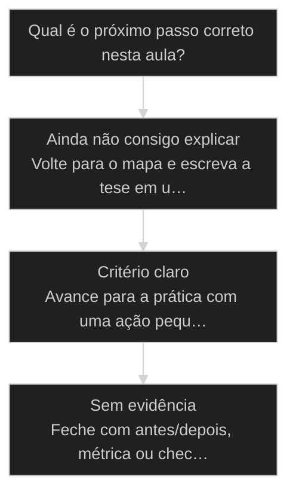
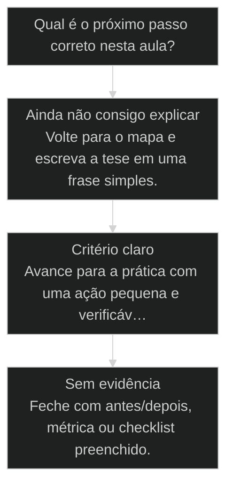

# Engenharia de contexto: limpar comandos, skills e MCPs

← [[16-janela-de-contexto|Janela de contexto: o limite real e a degradação acima de 40K]] · ↑ [[modulos/Módulo 2 - Setup e Contexto|M2]] · ⌂ [[cursos/AIOX Advanced/README|Curso]] · → [[27-otimizacao-claude-md|Otimização do CLAUDE.md: 40% mais magro, mesma capacidade]]

## Conceitos

- [[Janela de Contexto]]
- [[Engenharia de Contexto]]

## Mapa desta aula

Decisão-chave da aula — Qual é o próximo passo correto nesta aula?



> Leia o diagrama antes do texto longo. Depois volte e confira.

> Como reduzir 75K para 24K mantendo a capacidade. A faxina que devolve a nitidez ao modelo e dinheiro ao seu bolso.

**Objetivos de aprendizagem:**
- Explicar como comandos, skills e MCPs carregados ocupam a [[Janela de Contexto|janela de contexto]]. _(understand)_
- Auditar o próprio .claude/commands e identificar o peso morto. _(apply)_
- Aplicar Export e Clear para zerar a janela sem perder o trabalho. _(apply)_
- Medir a ocupação antes e depois da faxina para provar o ganho. _(analyze)_

---

## O que você consegue no fim desta aula

*G · Destino*

Destino claro antes do conteúdo técnico.

Você executa uma faxina de contexto (comandos, skills, MCPs, [[CLAUDE md|CLAUDE.md]]) e mede
antes/depois. Resultado: um setup mais magro com a mesma capacidade — ou prova do que
ainda é sagrado.

- **Destino**: [[Engenharia de Contexto|Engenharia de contexto]]: limpar comandos, skills e MCPs
- **Como saber que chegou**: Exercício final da aula com evidência escrita.

---

## O ponto de partida real

*P · Onde você está*

Empatia com o sintoma — sem moralismo.

Cara, contexto é real estate caro. A galera acumula skill, MCP, comando 'por se
acaso' e depois reclama que o agente ficou burro. Não ficou burro — ficou entulhado.
Esta aula é a faxina com critério, não com ansiedade.

> **Âncora**: Se o sintoma não for o seu, anote o do seu time — a aula ainda vale como mapa.

---

## Engenharia de contexto

*Processo · M2 Setup · Por Alan Nicolas*

Você carrega comandos, skills e MCPs que nunca usa, e cada um come pedaço da janela. A engenharia de contexto é a faxina que tira o peso morto e devolve nitidez ao modelo.

- **75K → 24K**: redução real numa faxina ao vivo
- **3 alvos**: comandos, skills e MCPs carregados
- **Export+Clear**: zerar a janela sem perder o trabalho

- **status**: aiox advanced · m2 setup
- **meta**: principio=engenharia-de-contexto
- **meta**: fonte=aula-02 + aula-08
- **ready**: audit and clean

**Legenda de cores**

Os alvos da faxina

- **Peso morto** (pain): carregado e nunca usado
- **Essencial** (signal): o que a operação precisa
- **Export + Clear** (insight): salva o estado e zera a janela
- **settings.json** (bench): controla o que carrega global vs projeto
- **Medir** (action): antes e depois, com número

---

## Da cohort: subagente barato e faxina de CLAUDE.md

*T1 + T2 · WhatsApp*

Realidade do grupo Advanced — não é slide, é cicatriz.

Dois movimentos que Alan verbalizou no grupo e que fecham esta aula:

1. **Subagentes leves** — preferência por modelo barato de contexto grande (ex.: Grok
   Fast / 1M) para leitura e consolidação, guardando o modelo top pro ouro.
2. **CLAUDE.md acima do budget** — 461 linhas vs ~150 instruções úteis; a faxina é
   engenharia de contexto, não estética.

A turma também descobriu: paralelizar stories em subagents **isola** contexto, mas
**multiplica** gasto. Engenharia de contexto sem conta de token é teatro.

> **Âncora de campo**: Faxina de contexto é o mesmo músculo de token economy — só muda a unidade de medida.

> **Materiais / FAQ**: FAQ-cohort §2 e §6 · materiais de [[Token Economy|economia de tokens]] na pasta cohort-insights.

---

## Tudo que carrega ocupa janela

Comando, skill e MCP não são grátis. Cada um carregado entra no contexto antes de você digitar a primeira palavra. A janela já começa ocupada, e o peso morto rouba a faixa útil.

> **A regra que sustenta a aula**: Você não controla só o que escreve, controla o que carrega. Cada comando, skill e MCP ativo ocupa janela antes da conversa começar. Limpar o que você não usa não é organização: é recuperar a faixa útil do modelo e cortar custo de token.

**Operador acumulador**
- Instala todo comando e MCP que vê pela frente.
- Deixa tudo carregado global, em todo projeto.
- Nunca mede a ocupação inicial da janela.
- Reclama que o modelo está lento e burro.

**Operador que faz faxina**
- Carrega só o que a operação atual usa.
- Separa o que é global do que é por projeto no settings.json.
- Mede antes e depois de cada faxina.
- Recupera nitidez e corta custo cortando peso morto.

> **Pedro Valério (co-founder, aula-08)**: Olha aqui: eu tinha 75K só de coisa carregada antes de começar. Vou tirar os comandos que não uso, as skills que não preciso, os MCPs parados. Caiu pra 24K. Mesma capacidade, janela limpa, modelo nítido.

---

## O caminho da aula

Três movimentos: entender os 3 alvos da faxina, ver o caso da redução de 75K para 24K, e auditar o seu próprio setup.

**Os 3 alvos da faxina**

1. **Comandos**: comandos antigos carregados que você não usa mais.
2. **Skills**: skills ativas que não pertencem à operação atual.
3. **MCPs**: servidores MCP parados ocupando contexto à toa.

- **Você vai sair sabendo** (Por que comandos, skills e MCPs ocupam janela antes da conversa.; Como Export e Clear zeram a janela sem perder o trabalho.; Onde o settings.json controla global vs projeto.)
- **Você vai sair fazendo**: A auditoria do seu .claude/commands, com medição antes e depois da faxina.

**O ritmo da engenharia de contexto**

Três batidas que mantêm a janela enxuta.

- 1 **Mede**: a ocupação inicial, antes de qualquer faxina
- 2 **Corta**: comando, skill e MCP que não pertencem à operação
- 3 **Mede de novo**: prova o ganho com número, não com sensação

---

## A faxina de 75K para 24K

Pedro mediu 75K de ocupação antes de digitar nada. Cortou comandos, skills e MCPs parados. Chegou a 24K com a mesma capacidade. O ganho foi medido, não sentido.

- **Antes: comandos, skills e MCPs carregados**: 75K
- **Depois: só o essencial da operação**: 24K
- **Capacidade de trabalho perdida**: 0

### Caso: Mesma capacidade, um terço da ocupação

A faxina não tira capacidade, tira peso morto. O que você nunca usa estava roubando a faixa útil do modelo o tempo todo.

- Começou como: 75K de janela ocupada antes da primeira mensagem, só de coisa carregada.
- Virou: 24K depois de cortar comandos, skills e MCPs que não pertenciam à operação.
- Prova: A capacidade de trabalho ficou igual: nada que era usado foi removido.
- Lição: Reduzir ocupação carregada é ganho puro: mais janela útil e menos custo, sem perder capacidade.

---

## WHY / WHAT / HOW da faxina

As 3 camadas que transformam acúmulo em janela enxuta e gerenciada.

- **1. WHY - Peso morto rouba a faixa útil**: Cada item carregado ocupa janela antes da conversa. O que você não usa não é neutro: ele estreita a faixa onde o modelo ainda é nítido e aumenta o custo de cada sessão. [WHY, faixa útil]
- **2. WHAT - Três alvos e dois controles**: Os alvos são comandos, skills e MCPs. Os controles são Export+Clear (zera a janela sem perder o trabalho) e settings.json (separa o que carrega global do que carrega por projeto). [WHAT, alvos e controles]
- **3. HOW - Medir, cortar, medir de novo**: A faxina precisa de número. Mede a ocupação inicial, corta o que não pertence à operação, e mede de novo para provar o ganho. Sem o número, vira sensação. [HOW, medir-cortar-medir]

---

## Os 3 alvos por dentro

Cada alvo da faxina tem um critério de corte. A grade que você usa ao auditar o setup.

- **Comandos**: Comandos carregados de projetos antigos. Critério: usei nos últimos 30 dias nesta operação?
- **Skills**: Skills ativas fora do domínio atual. Critério: pertence ao que estou fazendo agora?
- **MCPs**: Servidores MCP parados. Critério: este MCP está sendo chamado nesta operação?

**Matriz uso x escopo do que carregar**

O que deve carregar global, por projeto, ou ser cortado.

- **Usa sempre, em todo projeto**: Carrega global no settings.json.
- **Usa só neste projeto**: Carrega por projeto, não global.
- **Usa raramente**: Carrega sob demanda, não deixa ativo.
- **Não usa há semanas**: Corta. É peso morto.

---

## A sequência da faxina

Os passos concretos para auditar, cortar e zerar a janela em uma sessão real.

**Auditar e limpar o contexto**
Use ao trocar de operação, ou quando a ocupação inicial estiver alta.
- `medir`
- `auditar`
- `cortar`
- `export-clear`
- `/context`: Mede a ocupação inicial antes de qualquer faxina.
- `auditar`: Lista comandos, skills e MCPs carregados e marca o que não usa.
- `cortar`: Remove o peso morto, ajusta o settings.json (global vs projeto).
- `export+clear`: Salva o estado relevante e zera a janela, recomeçando enxuto.

**1. Medir a linha de base**
Roda /context numa sessão limpa e anota a ocupação inicial.
- **Output**: ocupacao-inicial em K
- **Gate**: Você tem o número de antes para comparar depois?

**2. Cortar o peso morto**
Audita comandos, skills e MCPs e remove o que não pertence à operação atual.
- **Output**: lista do que foi cortado
- **Gate**: Nada que você usa de fato foi removido?

**3. Provar o ganho**
Roda /context de novo e compara com a linha de base.
- **Output**: ocupacao-final e delta
- **Gate**: A queda está medida, não só sentida?

---

## Não confunda limpar com perder

Três confusões que travam a faxina por medo de perder algo que, na verdade, você não usa.

- **Export + Clear, não perder o trabalho**: Clear parece apagar o que você fez.
- **Cortar peso morto, não cortar capacidade**: Remover comando e MCP parece reduzir o que você pode fazer.
- **Global vs projeto, não tudo carregado sempre**: Deixar tudo global parece prático.

- **Comando não usado em 30 dias** -> peso morto: corta.
- **Skill de outro domínio ativa** -> fora de escopo: desativa neste projeto.
- **MCP parado carregado** -> ocupação à toa: tira do ativo.

---

## Caso benchmark: aplicar Engenharia de contexto: limpar comandos, skills e MCPs em uma decisão real

Um segundo caso para tirar a aula do conceito isolado e mostrar como o operador transforma o princípio em decisão, execução e evidência.

- **O que mudou na operação**: A aula deixou de ser uma explicação e virou uma lente de decisão. O aluno sabe que sinal observar, qual rota escolher e que evidência precisa produzir. Players: sinal, rota, execução, evidência.
- **Por que isso eleva a qualidade**: O padrão espelha o [[Método S2S]]: capturar o sinal, estruturar o caminho, executar com limite e fechar com prova.

**Matriz de aplicação**

Use esta matriz quando a aula parecer clara, mas a ação ainda estiver vaga.

- **Sinal claro**: O aluno consegue nomear o que a aula ensina a observar.
- **Rota escolhida**: A próxima ação nasce de critério, não de vontade de testar ferramenta.
- **Risco visível**: O erro provável fica explícito antes de executar.
- **Prova mínima**: Existe uma evidência simples para dizer que avançou.

### Caso: Quando o conceito precisou virar critério de execução

O operador já tinha entendido a tese, mas ainda precisava decidir o próximo passo sem cair em improviso.

- Começou como: Conceito entendido em teoria, sem critério de aplicação na task real.
- Virou: Decisão roteada por sinais, riscos, evidências e próximo passo verificável.
- Prova: A saída passou a ter ação, dono, critério e evidência de fechamento.
- Lição: Aula de qualidade não termina em entendimento. Termina quando o aluno consegue agir com critério.

---

## Router de decisão da aula

O ponto em que Engenharia de contexto: limpar comandos, skills e MCPs deixa de ser explicação e vira escolha operacional.

**Árvore de decisão**
_Não escolha comando antes de nomear o tipo de situação._



- **Ainda não consigo explicar** — O aluno repete a frase da aula, mas não consegue aplicar em exemplo próprio.
  → _Volte para o mapa e escreva a tese em uma frase simples._
- **Critério claro** — O aluno identifica sinal, risco e decisão antes da ferramenta.
  → _Avance para a prática com uma ação pequena e verificável._
- **Sem evidência** — A ação foi feita, mas não existe prova de melhoria ou decisão registrada.
  → _Feche com antes/depois, métrica ou checklist preenchido._

**Gate:** Você sabe qual rota seguir e como provar que avançou? — _Se a resposta ainda depende de opinião, volte uma etapa._

#### Entender o princípio
Quando a aula ainda parece uma tese abstrata.
1. **Nomear: escreva a tese em uma frase.
2. **Exemplo: traga um caso próprio pequeno.
3. **Risco: diga o erro que a aula evita.

#### Aplicar em uma task
Quando o critério está claro e falta execução.
1. **Escolher: defina a menor ação verificável.
2. **Executar: faça sem expandir escopo.
3. **Provar: registre o delta produzido.

#### Revisar a decisão
Quando a execução aconteceu, mas a evidência ficou fraca.
1. **Comparar: olhe antes e depois.
2. **Ajustar: corrija a menor falha.
3. **Fechar: só conclua com prova.

**Colunas:** Estado | Pergunta | Sinal saudável | Sinal de risco

- Entendimento: Consigo explicar sem copiar a aula? | frase própria e exemplo próprio | repetição bonita sem aplicação
- Decisão: Escolhi rota antes da ferramenta? | sinal e risco nomeados | comando escolhido por hábito
- Prova: Tenho evidência de avanço? | antes/depois ou checklist | sensação de que ficou melhor

---

## Processo operacional mínimo

A sequência mínima para aplicar Engenharia de contexto: limpar comandos, skills e MCPs sem transformar a aula em teoria solta.

**Aula → Task → Evidência**
Rota curta para transformar o conceito em ação repetível.
- **Plan**: Nomeie o sinal da aula, o risco que ela evita e o artefato que será produzido.
- **Do**: Execute a menor ação que prova o conceito sem abrir novo escopo.
- **Check**: Compare a saída com o critério de aceite da aula.
- **Act**: Registre a regra aprendida e remova o que não será reutilizado.

**Aplicar com evidência**
Use quando a aula fizer sentido, mas a task ainda estiver sem formato.
- `sinal`
- `risco`
- `ação`
- `prova`
- `sinal`: O que esta aula me ensinou a perceber?
- `risco`: Que erro acontece se eu ignorar esse sinal?
- `ação`: Qual é a menor execução que testa o princípio?
- `prova`: Que evidência mostra que a decisão melhorou?

**Do conceito ao comportamento**

1. **Conceito**: entender a tese central da aula.
2. **Critério**: transformar a tese em pergunta de decisão.
3. **Ação**: executar a menor tarefa que prova avanço.
4. **Memória**: registrar o padrão para repetir depois.

---

## Distinções que evitam falsa competência

Três diferenças que protegem Engenharia de contexto: limpar comandos, skills e MCPs de virar jargão ou checklist vazio.

**Parece que aprendeu**
- Repete a tese da aula sem exemplo próprio.
- Escolhe ferramenta antes de escolher critério.
- Fecha a task porque executou algo.

**Aprendeu de verdade**
- Explica o princípio em uma situação própria.
- Escolhe rota, risco e evidência antes do comando.
- Fecha a task quando existe prova de avanço.

- **entender com aplicar**: Entender é conseguir repetir a ideia.
- **ação com evidência**: Fazer algo gera movimento.
- **checklist com processo**: Checklist pode ser preenchido no automático.

**Exemplo preenchido: saída esperada do aluno**

- **Tese**: A aula me ensinou a observar um sinal específico antes de escolher ferramenta.
- **Risco**: Se eu pular esse critério, executo rápido e descubro tarde que a direção estava errada.
- **Ação**: Vou aplicar em uma task pequena, com escopo fechado e antes/depois visível.
- **Prova**: A entrega só fecha quando eu consigo mostrar o critério usado e o delta gerado.

---

## Prática: faça a sua faxina

Meça a ocupação do seu setup, audite comandos, skills e MCPs, corte o peso morto e prove o ganho com número.

**Ficha da faxina (antes e depois)**
```yaml
# Engenharia de contexto. Preencha medindo com /context.
linha_de_base:
  ocupacao_inicial_k: "{numero antes}"
auditoria:
  comandos_cortados: ["{comando 1}", "{comando 2}"]
  skills_desativadas: ["{skill 1}"]
  mcps_removidos: ["{mcp 1}"]
settings_json:
  global: ["{so o que e mesmo de uso geral}"]
  por_projeto: ["{o que e especifico deste projeto}"]
resultado:
  ocupacao_final_k: "{numero depois}"
  delta_k: "{antes menos depois}"

```

> **Portão da aula**: Antes de seguir para a próxima aula: você mediu a ocupação inicial, cortou o peso morto e registrou a queda com número. Se você não tem o antes e o depois medidos, faça a faxina com /context antes de passar.

- 1. **Meça a linha de base**: Rode /context numa sessão limpa e anote a ocupação inicial em K.
- 2. **Liste o carregado**: Liste os comandos, skills e MCPs que estão ativos no seu setup.
- 3. **Marque o peso morto**: Marque o que você não usou nos últimos 30 dias nesta operação.
- 4. **Corte e ajuste**: Remova o peso morto e ajuste o settings.json para separar global de projeto.
- 5. **Prove o ganho**: Rode /context de novo e registre a queda. O ganho precisa de número.

---

## Glossário

Os termos desta aula em uma frase cada.

- **Engenharia de contexto**: A prática de gerenciar o que ocupa a janela: cortar peso morto e manter só o essencial carregado.
- **Peso morto**: Comando, skill ou MCP carregado que você não usa na operação atual. Ocupa janela à toa.
- **Export + Clear**: Salvar o estado relevante e zerar a janela sem perder o trabalho feito.
- **settings.json**: O arquivo que controla o que carrega global (todo projeto) versus por projeto.
- **Linha de base**: A ocupação inicial medida antes da faxina, para provar o ganho depois.

> **Próxima aula**: Você sabe medir e limpar a janela. A seguir, o formato certo para cada artefato: YAML, Markdown ou JSON, o sweet spot que evita ruído no contexto.

***


---

## Navegação

← [[16-janela-de-contexto|Janela de contexto: o limite real e a degradação acima de 40K]] · ↑ [[modulos/Módulo 2 - Setup e Contexto|M2]] · ⌂ [[cursos/AIOX Advanced/README|Curso]] · → [[27-otimizacao-claude-md|Otimização do CLAUDE.md: 40% mais magro, mesma capacidade]]
