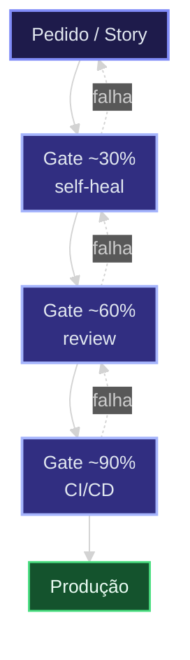
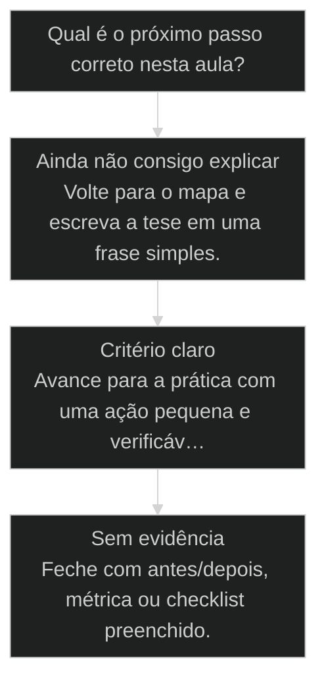

# Determinismo Progressivo: 30, 60, 90

## Conceitos

- [[Determinismo Progressivo]]

## Mapa desta aula

Mapa canônico 30 → 60 → 90 (mesmo padrão da aula de determinismo progressivo).



> Leia o diagrama antes do texto longo. Depois volte e confira.

> O mecanismo que trava a IA no caminho certo, etapa por etapa. Você não solta livre nem prende 100%: você aperta o determinismo em estágios validados.

**Objetivos de aprendizagem:**
- Explicar por que apertar o determinismo em estágios vence soltar a IA livre ou travar 100%. _(understand)_
- Descrever os 3 estágios 30, 60 e 90 e o gate que separa cada um. _(understand)_
- Aplicar os 3 estágios a uma feature própria, identificando onde travar. _(apply)_

---

## O que você consegue no fim desta aula

*G · Destino*

Destino claro antes do conteúdo técnico.

Você aplica 30/60/90 no teu fluxo real e sabe o que fazer em cada FAIL.
Resultado: mapa de gates do teu SDC com dono e ação de falha.

- **Destino**: [[Determinismo Progressivo]]: 30, 60, 90
- **Como saber que chegou**: Exercício final da aula com evidência escrita.

---

## O ponto de partida real

*P · Onde você está*

Empatia com o sintoma — sem moralismo.

Autonomia sem degrau vira deriva. Se o teu 'loop' roda até cansar sem subir
qualidade, você não tem determinismo — tem esperança em loop. Esta aula é a régua:
cada gate compra certeza.

> **Âncora**: Se o sintoma não for o seu, anote o do seu time — a aula ainda vale como mapa.

---

## Determinismo Progressivo

*Princípio · M4 Determinismo · Por Alan Nicolas*

Soltar a IA livre numa tarefa grande é pedir alucinação. Travar 100% é engessar e perder o que ela faz bem. Determinismo progressivo é o meio: você aperta o caminho em estágios, validando cada um antes do próximo.

- **30 → 60 → 90**: os três estágios do aperto
- **3 gates**: um checkpoint validado entre cada estágio
- **0 leap**: nenhum salto grande sem validação no meio

- **status**: aiox advanced · m4 determinismo
- **meta**: principio=determinismo-progressivo
- **meta**: fonte=aula-01 processo certo
- **ready**: 30 then 60 then 90

**Legenda de cores**

Os estágios e os extremos

- **IA livre** (pain): pede tudo de uma vez, alucina o caminho
- **Estágio 30** (signal): o esqueleto determinístico validado
- **Estágio 60** (insight): o corpo sobre o esqueleto aprovado
- **Estágio 90** (bench): o acabamento com o caminho travado
- **Validar cada** (action): gate entre cada estágio

---

## Nem solto, nem engessado

AIOX é processo, não improviso. Em vez de um pedido gigante que a IA tenta adivinhar inteiro, você divide em estágios e valida cada um. O determinismo aperta conforme o caminho fica claro.

> **A regra que sustenta a aula**: Quanto maior o pedido de uma vez, maior a chance de a IA inventar o caminho. Determinismo progressivo quebra o trabalho em 30, 60 e 90: cada estágio tem um gate. Você valida o esqueleto antes de pedir o corpo, e o corpo antes do acabamento. O caminho aperta, a alucinação cai.

**Pedido em um salto**
- Pede a feature inteira de uma vez.
- A IA adivinha estrutura, dados e detalhe juntos.
- Quando vem errado, você reescreve tudo.
- Não há ponto de validação no meio do caminho.

**Determinismo progressivo**
- Pede o esqueleto primeiro (estágio 30) e valida.
- Constrói o corpo sobre o esqueleto aprovado (60).
- Faz o acabamento com o caminho travado (90).
- Cada estágio tem um gate antes do próximo.

> **Pedro Valério (co-founder, aula-01)**: Eu não peço o bagulho inteiro de uma vez. Eu empacoto em etapas, valido cada uma, e só aí avanço. Quando você trava o caminho aos poucos, a IA para de inventar e começa a executar.

---

## O caminho da aula

Três movimentos: entender por que o aperto em estágios vence os extremos, ver o caso do salto que deu errado, e aplicar os 3 estágios a uma feature sua.

**Os 3 estágios**

1. **30 - Esqueleto**: a estrutura mínima determinística, validada antes de seguir.
2. **60 - Corpo**: a lógica construída sobre o esqueleto aprovado.
3. **90 - Acabamento**: o detalhe e o polimento, com o caminho já travado.

- **Você vai sair sabendo** (Por que o salto grande convida a alucinação.; O que cada estágio (30, 60, 90) entrega.; Onde colocar o gate entre os estágios.)
- **Você vai sair fazendo**: A aplicação dos 3 estágios a uma feature sua, marcando onde o caminho trava em cada um.

---

## O salto que virou reescrita

Um pedido grande, de uma vez, voltou estruturalmente errado. Sem estágio nem gate no meio, a única saída foi reescrever do zero. O mesmo trabalho em 30/60/90 teria travado o erro no estágio 30.

- **Pego no estágio 30 (esqueleto)**: barato
- **Pego no estágio 60 (corpo)**: médio
- **Pego no estágio 90 (acabamento)**: caro
- **Pego só no fim (salto único)**: reescrita

### Caso: Sem estágio, o erro só aparece no fim

Quando você pede tudo de uma vez, o erro de estrutura fica escondido sob o detalhe. Você só descobre no fim, quando já não dá pra consertar sem refazer.

- Começou como: Pedido único de uma feature inteira: estrutura, lógica e detalhe juntos.
- Virou: O mesmo trabalho dividido em 30 (esqueleto), 60 (corpo) e 90 (acabamento), com gate em cada um.
- Prova: No fluxo em estágios, o erro de estrutura apareceria no gate do 30, antes de qualquer detalhe.
- Lição: O salto esconde o erro até o fim. O estágio expõe o erro cedo, quando consertar é barato.

---

## WHY / WHAT / HOW do determinismo progressivo

As 3 camadas que transformam um pedido gigante em estágios validados.

- **1. WHY - O erro cedo é barato**: O custo de um erro cresce com o quanto já foi construído sobre ele. Validar o esqueleto no estágio 30 evita reescrever corpo e acabamento. Apertar o determinismo cedo é economia, não burocracia. [WHY, erro cedo]
- **2. WHAT - Três estágios, três gates**: 30 é o esqueleto determinístico. 60 é o corpo sobre o esqueleto aprovado. 90 é o acabamento. Entre cada estágio, um gate que valida antes de avançar. [WHAT, 30/60/90]
- **3. HOW - Pedir, validar, avançar**: Peça só o estágio atual. Valide contra o gate. Só avance quando passar. Nunca peça o estágio 60 antes de o 30 estar validado. O caminho aperta a cada passo. [HOW, pedir-validar-avançar]

---

## Os 3 estágios com gate

Cada estágio entrega uma coisa e tem um gate. O gate é o que faz o determinismo ser progressivo e não um salto disfarçado.

**30 - Esqueleto**
A estrutura mínima determinística: contratos, interfaces, o caminho. Sem lógica de detalhe ainda.
- **Output**: esqueleto: estrutura e contratos definidos
- **Gate**: A estrutura está certa? Se não, conserte aqui, é barato.

**60 - Corpo**
A lógica construída sobre o esqueleto já aprovado. O caminho já está travado pela estrutura.
- **Output**: corpo: lógica funcionando sobre o esqueleto
- **Gate**: A lógica respeita a estrutura aprovada no 30?

**90 - Acabamento**
O detalhe, o polimento, os casos de borda. Feito por último, com o caminho já consolidado.
- **Output**: acabamento: detalhe e bordas tratados
- **Gate**: O acabamento não mexeu na estrutura nem na lógica aprovadas?

---

## A sequência de aplicação

Os passos concretos para aplicar determinismo progressivo a uma feature, em ordem.

**Aplicar os 3 estágios a uma feature**
Use em qualquer feature não trivial, antes de pedir o trabalho inteiro.
- `esqueleto`
- `gate-30`
- `corpo`
- `gate-60`
- `acabamento`
- `esqueleto`: Peça só a estrutura: contratos, interfaces, o caminho. Nada de detalhe.
- `gate-30`: Valide a estrutura. Se está errada, conserte aqui antes de avançar.
- `corpo`: Peça a lógica sobre o esqueleto aprovado. O caminho já está travado.
- `gate-60`: Valide que a lógica respeita a estrutura do 30.
- `acabamento`: Peça o detalhe e as bordas por último, com tudo consolidado.

**Do esqueleto ao acabamento, com gate em cada passo**

1. **30 Esqueleto**: estrutura mínima determinística.
2. **Gate**: valida a estrutura antes de seguir.
3. **60 Corpo**: lógica sobre o esqueleto aprovado.
4. **90 Acabamento**: detalhe com o caminho travado.

---

## Não confunda os extremos

Três confusões que jogam o operador para um dos extremos: soltar demais ou travar demais.

- **Determinismo progressivo, não IA livre**: Pedir tudo de uma vez parece mais rápido.
- **Determinismo progressivo, não travar 100%**: Especificar cada linha parece mais seguro.
- **Gate entre estágios, não revisão só no fim**: Revisar no final parece economizar tempo.

- **IA livre**: Pede tudo de uma vez. Alucina o caminho, erro escondido até o fim.
- **Determinismo progressivo**: Aperta em 30/60/90, gate entre estágios. Erro pego cedo.
- **Travar 100%**: Especifica cada linha. Engessa e perde o que a IA faz bem.

---

## Caso benchmark: aplicar Determinismo Progressivo: 30, 60, 90 em uma decisão real

Um segundo caso para tirar a aula do conceito isolado e mostrar como o operador transforma o princípio em decisão, execução e evidência.

- **O que mudou na operação**: A aula deixou de ser uma explicação e virou uma lente de decisão. O aluno sabe que sinal observar, qual rota escolher e que evidência precisa produzir. Players: sinal, rota, execução, evidência.
- **Por que isso eleva a qualidade**: O padrão espelha o [[Método S2S]]: capturar o sinal, estruturar o caminho, executar com limite e fechar com prova.

**Matriz de aplicação**

Use esta matriz quando a aula parecer clara, mas a ação ainda estiver vaga.

- **Sinal claro**: O aluno consegue nomear o que a aula ensina a observar.
- **Rota escolhida**: A próxima ação nasce de critério, não de vontade de testar ferramenta.
- **Risco visível**: O erro provável fica explícito antes de executar.
- **Prova mínima**: Existe uma evidência simples para dizer que avançou.

### Caso: Quando o conceito precisou virar critério de execução

O operador já tinha entendido a tese, mas ainda precisava decidir o próximo passo sem cair em improviso.

- Começou como: Conceito entendido em teoria, sem critério de aplicação na task real.
- Virou: Decisão roteada por sinais, riscos, evidências e próximo passo verificável.
- Prova: A saída passou a ter ação, dono, critério e evidência de fechamento.
- Lição: Aula de qualidade não termina em entendimento. Termina quando o aluno consegue agir com critério.

---

## Router de decisão da aula

O ponto em que Determinismo Progressivo: 30, 60, 90 deixa de ser explicação e vira escolha operacional.

**Árvore de decisão**
_Não escolha comando antes de nomear o tipo de situação._



- **Ainda não consigo explicar** — O aluno repete a frase da aula, mas não consegue aplicar em exemplo próprio.
  → _Volte para o mapa e escreva a tese em uma frase simples._
- **Critério claro** — O aluno identifica sinal, risco e decisão antes da ferramenta.
  → _Avance para a prática com uma ação pequena e verificável._
- **Sem evidência** — A ação foi feita, mas não existe prova de melhoria ou decisão registrada.
  → _Feche com antes/depois, métrica ou checklist preenchido._

**Gate:** Você sabe qual rota seguir e como provar que avançou? — _Se a resposta ainda depende de opinião, volte uma etapa._

#### Entender o princípio
Quando a aula ainda parece uma tese abstrata.
1. **Nomear: escreva a tese em uma frase.
2. **Exemplo: traga um caso próprio pequeno.
3. **Risco: diga o erro que a aula evita.

#### Aplicar em uma task
Quando o critério está claro e falta execução.
1. **Escolher: defina a menor ação verificável.
2. **Executar: faça sem expandir escopo.
3. **Provar: registre o delta produzido.

#### Revisar a decisão
Quando a execução aconteceu, mas a evidência ficou fraca.
1. **Comparar: olhe antes e depois.
2. **Ajustar: corrija a menor falha.
3. **Fechar: só conclua com prova.

**Colunas:** Estado | Pergunta | Sinal saudável | Sinal de risco

- Entendimento: Consigo explicar sem copiar a aula? | frase própria e exemplo próprio | repetição bonita sem aplicação
- Decisão: Escolhi rota antes da ferramenta? | sinal e risco nomeados | comando escolhido por hábito
- Prova: Tenho evidência de avanço? | antes/depois ou checklist | sensação de que ficou melhor

---

## Processo operacional mínimo

A sequência mínima para aplicar Determinismo Progressivo: 30, 60, 90 sem transformar a aula em teoria solta.

**Aula → Task → Evidência**
Rota curta para transformar o conceito em ação repetível.
- **Plan**: Nomeie o sinal da aula, o risco que ela evita e o artefato que será produzido.
- **Do**: Execute a menor ação que prova o conceito sem abrir novo escopo.
- **Check**: Compare a saída com o critério de aceite da aula.
- **Act**: Registre a regra aprendida e remova o que não será reutilizado.

**Aplicar com evidência**
Use quando a aula fizer sentido, mas a task ainda estiver sem formato.
- `sinal`
- `risco`
- `ação`
- `prova`
- `sinal`: O que esta aula me ensinou a perceber?
- `risco`: Que erro acontece se eu ignorar esse sinal?
- `ação`: Qual é a menor execução que testa o princípio?
- `prova`: Que evidência mostra que a decisão melhorou?

**Do conceito ao comportamento**

1. **Conceito**: entender a tese central da aula.
2. **Critério**: transformar a tese em pergunta de decisão.
3. **Ação**: executar a menor tarefa que prova avanço.
4. **Memória**: registrar o padrão para repetir depois.

---

## Distinções que evitam falsa competência

Três diferenças que protegem Determinismo Progressivo: 30, 60, 90 de virar jargão ou checklist vazio.

**Parece que aprendeu**
- Repete a tese da aula sem exemplo próprio.
- Escolhe ferramenta antes de escolher critério.
- Fecha a task porque executou algo.

**Aprendeu de verdade**
- Explica o princípio em uma situação própria.
- Escolhe rota, risco e evidência antes do comando.
- Fecha a task quando existe prova de avanço.

- **entender com aplicar**: Entender é conseguir repetir a ideia.
- **ação com evidência**: Fazer algo gera movimento.
- **checklist com processo**: Checklist pode ser preenchido no automático.

**Exemplo preenchido: saída esperada do aluno**

- **Tese**: A aula me ensinou a observar um sinal específico antes de escolher ferramenta.
- **Risco**: Se eu pular esse critério, executo rápido e descubro tarde que a direção estava errada.
- **Ação**: Vou aplicar em uma task pequena, com escopo fechado e antes/depois visível.
- **Prova**: A entrega só fecha quando eu consigo mostrar o critério usado e o delta gerado.

---

## Prática: aplique os 3 estágios

Pegue uma feature que você ia pedir inteira e quebre em 30, 60 e 90, marcando o gate de cada estágio.

**Ficha dos 3 estágios (uma por feature)**
```yaml
# Quebre a feature antes de pedir. Um gate por estagio.
feature: "{nome da feature}"
estagio_30:
  esqueleto: "{estrutura, contratos, caminho minimo}"
  gate: "{a estrutura esta certa?}"
estagio_60:
  corpo: "{logica sobre o esqueleto aprovado}"
  gate: "{a logica respeita a estrutura do 30?}"
estagio_90:
  acabamento: "{detalhe, bordas, polimento}"
  gate: "{nao mexeu no que foi aprovado antes?}"
erro_mais_provavel_em: "{30 | 60 | 90}"

```

> **Portão da aula**: Antes de seguir para a próxima aula: você pegou uma feature, quebrou em 30, 60 e 90, escreveu o gate de cada estágio e marcou onde o erro mais provável apareceria. Se você ainda pediria a feature inteira de uma vez, releia o caso do salto.

- 1. **Escolha a feature**: Pegue uma feature não trivial que você ia pedir de uma vez só.
- 2. **Defina o estágio 30**: Escreva qual é o esqueleto: contratos, interfaces, o caminho mínimo.
- 3. **Defina o gate do 30**: Escreva a pergunta que valida a estrutura antes de avançar.
- 4. **Defina 60 e 90**: Escreva o que entra no corpo (60) e no acabamento (90), e o gate de cada um.
- 5. **Marque onde travar**: Identifique em qual estágio o erro mais provável dessa feature apareceria.

---

## Glossário

Os termos desta aula em uma frase cada.

- **Determinismo progressivo**: Apertar o caminho da IA em estágios validados, em vez de pedir tudo de uma vez ou travar cada linha.
- **Estágio 30**: O esqueleto: estrutura, contratos e caminho mínimo, validados antes de avançar.
- **Estágio 60**: O corpo: a lógica construída sobre o esqueleto já aprovado.
- **Estágio 90**: O acabamento: detalhe, bordas e polimento, com o caminho já travado.
- **Gate**: O ponto de validação entre estágios. É o que faz o determinismo ser progressivo e não um salto.

> **Próxima aula**: Você sabe apertar o caminho em estágios. A seguir, a heurística que decide onde usar código determinístico e onde a IA gera ouro de verdade.

***

---

## Operar isto na prática

Esta aula é pré-requisito no curso de squads — quando a missão for real, siga para: Agent Autonomy: `cursos/AIOX-Advanced-Squads/aulas/05-agent-autonomy.md` · ETL Ops: `cursos/AIOX-Advanced-Squads/aulas/08-etl-ops.md` · Runner Ops: `cursos/AIOX-Advanced-Squads/aulas/09-runner-ops.md` · Squad Creator Pro: `cursos/AIOX-Advanced-Squads/aulas/24-squad-creator-pro.md`

## Navegação

← [[lessons/11-goal-vs-loop|Goal vs Loop]] · ↑ [[modulos/Módulo 3 - Determinismo e Comando|M3 — Determinismo e comando]] · ⌂ [[cursos/AIOX Advanced/README|Curso]] · → [[lessons/21-deterministico-primeiro-llm-onde-gera-ouro|Determinístico primeiro, LLM só onde gera ouro]]
