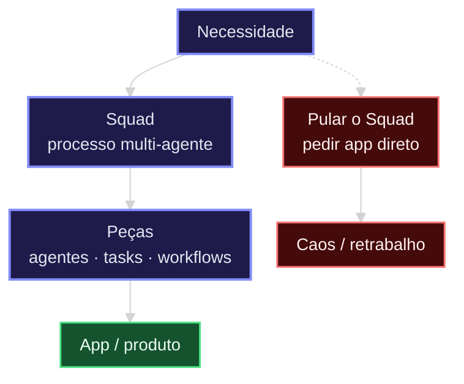
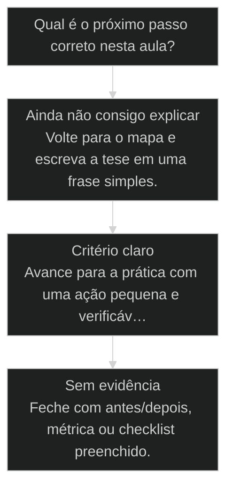

# O que é um Squad (e por que ele vem antes do App)

## Conceitos

- [[Software House no Computador]]
- [[Squad]]
- [[Taxonomia AIOX]]

## Mapa desta aula

Squad **antes** do App: modela a operação, depois materializa produto. Pular o squad → caos.



> Leia o diagrama antes do texto longo. Depois volte e confira.

> Tiers estratégico, tático e operacional. Um squad decorativo não vira dinheiro: ele precisa produzir saída que alguém paga.

**Objetivos de aprendizagem:**
- Explicar [[Squad|o que é um squad]] e por que ele precede o app que produz. _(understand)_
- Diferenciar os 3 tiers de squad: estratégico, tático e operacional. _(understand)_
- Classificar um squad próprio por tier e decidir se ele vira produto. _(analyze)_

---

## O que você consegue no fim desta aula

*G · Destino*

Destino claro antes do conteúdo técnico.

Você explica por que squad vem antes do app e decide se o teu problema pede squad
ou só skill/task. Resultado: veredito escrito SQUAD / NÃO-SQUAD com uma frase de porquê.

- **Destino**: O que é um Squad (e por que ele vem antes do App)
- **Como saber que chegou**: Exercício final da aula com evidência escrita.

---

## O ponto de partida real

*P · Onde você está*

Empatia com o sintoma — sem moralismo.

A tentação é pedir o app. A operação madura modela o time (squad) antes da tela.
Se você já criou pasta de agentes sem processo, já sentiu o cheiro: organograma de
mentira. Aqui a gente vira a ordem — processo primeiro.

> **Âncora**: Se o sintoma não for o seu, anote o do seu time — a aula ainda vale como mapa.

---

## O que é um Squad

*Conceito · M5 AIOX · Por Alan Nicolas*

Squad não é uma pasta de agentes. É um time organizado por domínio, em três tiers, que existe para produzir uma saída concreta. Quem monta squad por enfeite acumula complexidade; quem monta por saída, vira produto.

- **3 tiers**: estratégico, tático, operacional
- **antes do app**: o squad é quem produz o produto
- **saída paga**: o teste de um squad que não é decorativo

- **status**: aiox advanced · m5 aiox
- **meta**: principio=o-que-e-um-squad
- **meta**: fonte=aula-03 + aula-06 + t2-aula-6
- **ready**: tier before build

**Legenda de cores**

Os 3 tiers e o anti-padrão

- **Estratégico** (insight): decide direção
- **Tático** (bench): planeja o trabalho
- **Operacional** (action): executa e entrega
- **Antes do app** (signal): o squad produz o produto
- **Decorativo** (pain): existe mas não produz saída paga

---

## Da cohort: 23 squads e o medo de criar o 24º

*T1 + T2 · WhatsApp*

Realidade do grupo Advanced — não é slide, é cicatriz.

Alan: 'atualmente tenho 23 squads'. A turma responde tentando criar o 24º no
calor do zoom.

O ensinamento de campo não é 'crie menos' por moralismo — é **prior-art + processo**.
Validate/upgrade de squad, comparação entre squads, e a pergunta se o problema é
squad ou só skill. Material da própria turma: compare-squads.md e MAPA-DECISAO-SQUADS.

Squad sem órbita é fantasia. A cohort provou isso na quantidade de zip de
squad-creator que circulou no grupo.

> **Âncora de campo**: Ter 23 squads não autoriza criar o 24º sem mapa de entidade e prior-art.

> **Materiais / FAQ**: materials/compare-squads.md · MAPA-DECISAO-SQUADS-AIOX.pdf · aulas 34 e 55

---

## Squad é time por domínio, não pasta de agentes

O squad organiza agentes em torno de um domínio e de uma saída. Ele vem antes do app porque é quem constrói e opera o app. Sem saída concreta, o squad é decoração que custa contexto e não retorna dinheiro.

> **A regra que sustenta a aula**: Antes de montar um squad, pergunte qual saída ele produz e quem paga por ela. Se a resposta é vaga, o squad é decorativo. Squad de verdade tem domínio claro, três tiers definidos e uma saída que alguém compra ou usa.

**Squad decorativo**
- Monta squad porque parece organizado ter um.
- Enche de agentes sem saída definida.
- Não sabe dizer qual tier cada agente ocupa.
- Custa contexto e não retorna nada.

**Squad que produz**
- Monta squad em torno de uma saída concreta.
- Define os 3 tiers: quem decide, quem planeja, quem executa.
- Sabe quem paga ou usa a saída do squad.
- Decide cedo se o squad vira produto.

> **Adriano de Marqui (host T2, t2-aula-6)**: O squad vem antes do app. Ele é quem produz o app. E tem uma escada: estratégico decide, tático planeja, operacional executa. Squad que não produz saída paga é enfeite no terminal.

---

## O caminho da aula

Três movimentos: entender o squad e seus tiers, ver o caso do squad decorativo versus o que virou produto, e classificar um squad seu.

**Os 3 movimentos**

1. **Squad e tiers**: o que é, e os 3 níveis estratégico/tático/operacional.
2. **Decorativo vs produtivo**: o squad que custava contexto e o que virou produto.
3. **Classificar**: mapear um squad seu por tier e decidir o destino.

- **Você vai sair sabendo** (Por que o squad precede o app.; O que cada um dos 3 tiers faz.; Como reconhecer um squad decorativo.)
- **Você vai sair fazendo**: A classificação de um squad seu pelos 3 tiers, com a decisão de virar produto ou não.

---

## Decorativo versus produto

Dois squads: um existia bonito e não produzia nada que alguém pagasse; o outro nasceu de uma saída concreta e virou produto. A diferença estava nos tiers e na saída, não no número de agentes.

- **Tem saída concreta que alguém paga**: decisivo
- **Tem os 3 tiers definidos**: alto
- **Tem muitos agentes**: irrelevante
- **Parece organizado no terminal**: decorativo

### Caso: O que separa enfeite de produto

Os dois squads tinham agentes e ficavam bonitos no terminal. Só um produzia saída que alguém comprava. A diferença não era estética, era tier e saída.

- Começou como: Um squad montado por organização, sem saída clara nem tiers definidos.
- Virou: Um squad montado em torno de uma saída paga, com os 3 tiers explícitos.
- Prova: O segundo squad gerava entrega que um cliente usava; o primeiro só consumia contexto.
- Lição: Squad sem saída paga é decorativo, por mais agentes que tenha.

---

## WHY / WHAT / HOW dos tiers

As 3 camadas que transformam uma pasta de agentes num squad com tiers e saída.

- **1. WHY - O squad produz o produto**: O app não nasce sozinho: um squad o constrói e opera. Por isso o squad vem primeiro. Definir o squad antes do app é definir quem vai fazer o trabalho e como. [WHY, produz o produto]
- **2. WHAT - Três tiers**: Estratégico decide a direção e o que vale fazer. Tático planeja como a direção vira trabalho. Operacional executa e entrega a saída concreta. Os três precisam existir. [WHAT, 3 tiers]
- **3. HOW - O teste da saída**: Para cada squad, pergunte qual saída ele produz e quem paga por ela. Depois confira se os 3 tiers existem. Se a saída é vaga ou um tier falta, o squad é decorativo. [HOW, teste da saída]

---

## Os 3 tiers por dentro

Cada tier responde uma pergunta e tem um sintoma quando falta. A grade que você usa ao montar ou auditar um squad.

- **Estratégico**: Decide a direção e o que vale a pena fazer. Falta dele: squad executa sem rumo.
- **Tático**: Planeja como a direção vira trabalho concreto. Falta dele: estratégia que não desce pra ação.
- **Operacional**: Executa e entrega a saída. Falta dele: muita conversa, nenhuma entrega.

**Matriz saída x tiers**

O cruzamento que decide se o squad é produto ou enfeite.

- **Saída paga + 3 tiers**: Squad produto. Candidato a virar oferta.
- **Saída paga + tier faltando**: Squad incompleto. Feche o tier que falta.
- **Sem saída + 3 tiers**: Estrutura bonita sem propósito. Defina a saída ou corte.
- **Sem saída + tiers vagos**: Decorativo puro. Não monte ou desmonte.

- **Squad, não pasta de agentes**: Juntar agentes numa pasta parece formar um squad.
- **Tiers, não hierarquia de chefia**: Estratégico parece o chefe dos outros.
- **Vira produto, não nasce produto**: Montar o squad parece já criar o produto.

---

## A sequência de classificação

Os passos concretos para classificar um squad por tier e decidir seu destino.

**Classificar um squad e decidir o destino**
Use antes de montar um squad novo ou ao auditar os que você já tem.
- `saida`
- `quem-paga`
- `tiers`
- `decidir`
- `saida`: Escreva qual saída concreta o squad produz, em uma frase.
- `quem-paga`: Diga quem paga ou usa essa saída. Se ninguém, é decorativo.
- `tiers`: Confira se há estratégico, tático e operacional. Nomeie o que falta.
- `decidir`: Saída paga e tiers completos: candidato a produto. Caso contrário, complete ou corte.

**Da saída à decisão**

1. **Saída**: qual entrega concreta.
2. **Quem paga**: alguém usa ou compra?
3. **Tiers**: os 3 níveis existem?
4. **Destino**: produto, completar ou cortar.

---

## Caso benchmark: aplicar O que é um Squad (e por que ele vem antes do App) em uma decisão real

Um segundo caso para tirar a aula do conceito isolado e mostrar como o operador transforma o princípio em decisão, execução e evidência.

- **O que mudou na operação**: A aula deixou de ser uma explicação e virou uma lente de decisão. O aluno sabe que sinal observar, qual rota escolher e que evidência precisa produzir. Players: sinal, rota, execução, evidência.
- **Por que isso eleva a qualidade**: O padrão espelha o [[Método S2S]]: capturar o sinal, estruturar o caminho, executar com limite e fechar com prova.

**Matriz de aplicação**

Use esta matriz quando a aula parecer clara, mas a ação ainda estiver vaga.

- **Sinal claro**: O aluno consegue nomear o que a aula ensina a observar.
- **Rota escolhida**: A próxima ação nasce de critério, não de vontade de testar ferramenta.
- **Risco visível**: O erro provável fica explícito antes de executar.
- **Prova mínima**: Existe uma evidência simples para dizer que avançou.

### Caso: Quando o conceito precisou virar critério de execução

O operador já tinha entendido a tese, mas ainda precisava decidir o próximo passo sem cair em improviso.

- Começou como: Conceito entendido em teoria, sem critério de aplicação na task real.
- Virou: Decisão roteada por sinais, riscos, evidências e próximo passo verificável.
- Prova: A saída passou a ter ação, dono, critério e evidência de fechamento.
- Lição: Aula de qualidade não termina em entendimento. Termina quando o aluno consegue agir com critério.

---

## Router de decisão da aula

O ponto em que O que é um Squad (e por que ele vem antes do App) deixa de ser explicação e vira escolha operacional.

**Árvore de decisão**
_Não escolha comando antes de nomear o tipo de situação._



- **Ainda não consigo explicar** — O aluno repete a frase da aula, mas não consegue aplicar em exemplo próprio.
  → _Volte para o mapa e escreva a tese em uma frase simples._
- **Critério claro** — O aluno identifica sinal, risco e decisão antes da ferramenta.
  → _Avance para a prática com uma ação pequena e verificável._
- **Sem evidência** — A ação foi feita, mas não existe prova de melhoria ou decisão registrada.
  → _Feche com antes/depois, métrica ou checklist preenchido._

**Gate:** Você sabe qual rota seguir e como provar que avançou? — _Se a resposta ainda depende de opinião, volte uma etapa._

#### Entender o princípio
Quando a aula ainda parece uma tese abstrata.
1. **Nomear: escreva a tese em uma frase.
2. **Exemplo: traga um caso próprio pequeno.
3. **Risco: diga o erro que a aula evita.

#### Aplicar em uma task
Quando o critério está claro e falta execução.
1. **Escolher: defina a menor ação verificável.
2. **Executar: faça sem expandir escopo.
3. **Provar: registre o delta produzido.

#### Revisar a decisão
Quando a execução aconteceu, mas a evidência ficou fraca.
1. **Comparar: olhe antes e depois.
2. **Ajustar: corrija a menor falha.
3. **Fechar: só conclua com prova.

**Colunas:** Estado | Pergunta | Sinal saudável | Sinal de risco

- Entendimento: Consigo explicar sem copiar a aula? | frase própria e exemplo próprio | repetição bonita sem aplicação
- Decisão: Escolhi rota antes da ferramenta? | sinal e risco nomeados | comando escolhido por hábito
- Prova: Tenho evidência de avanço? | antes/depois ou checklist | sensação de que ficou melhor

---

## Processo operacional mínimo

A sequência mínima para aplicar O que é um Squad (e por que ele vem antes do App) sem transformar a aula em teoria solta.

**Aula → Task → Evidência**
Rota curta para transformar o conceito em ação repetível.
- **Plan**: Nomeie o sinal da aula, o risco que ela evita e o artefato que será produzido.
- **Do**: Execute a menor ação que prova o conceito sem abrir novo escopo.
- **Check**: Compare a saída com o critério de aceite da aula.
- **Act**: Registre a regra aprendida e remova o que não será reutilizado.

**Aplicar com evidência**
Use quando a aula fizer sentido, mas a task ainda estiver sem formato.
- `sinal`
- `risco`
- `ação`
- `prova`
- `sinal`: O que esta aula me ensinou a perceber?
- `risco`: Que erro acontece se eu ignorar esse sinal?
- `ação`: Qual é a menor execução que testa o princípio?
- `prova`: Que evidência mostra que a decisão melhorou?

**Do conceito ao comportamento**

1. **Conceito**: entender a tese central da aula.
2. **Critério**: transformar a tese em pergunta de decisão.
3. **Ação**: executar a menor tarefa que prova avanço.
4. **Memória**: registrar o padrão para repetir depois.

---

## Distinções que evitam falsa competência

Três diferenças que protegem O que é um Squad (e por que ele vem antes do App) de virar jargão ou checklist vazio.

**Parece que aprendeu**
- Repete a tese da aula sem exemplo próprio.
- Escolhe ferramenta antes de escolher critério.
- Fecha a task porque executou algo.

**Aprendeu de verdade**
- Explica o princípio em uma situação própria.
- Escolhe rota, risco e evidência antes do comando.
- Fecha a task quando existe prova de avanço.

- **entender com aplicar**: Entender é conseguir repetir a ideia.
- **ação com evidência**: Fazer algo gera movimento.
- **checklist com processo**: Checklist pode ser preenchido no automático.

**Exemplo preenchido: saída esperada do aluno**

- **Tese**: A aula me ensinou a observar um sinal específico antes de escolher ferramenta.
- **Risco**: Se eu pular esse critério, executo rápido e descubro tarde que a direção estava errada.
- **Ação**: Vou aplicar em uma task pequena, com escopo fechado e antes/depois visível.
- **Prova**: A entrega só fecha quando eu consigo mostrar o critério usado e o delta gerado.

---

## Prática: classifique um squad seu

Pegue um squad que você tem ou pensa em montar e classifique pelos 3 tiers, decidindo se ele vira produto.

**Ficha do squad (uma por squad)**
```yaml
# Classifique antes de montar ou manter. Uma ficha por squad.
squad: "{nome do squad}"
saida_concreta: "{o que ele produz, em 1 frase}"
quem_paga_ou_usa: "{cliente, voce, ninguem}"
tiers:
  estrategico: "{quem decide, ou vazio}"
  tatico: "{quem planeja, ou vazio}"
  operacional: "{quem executa, ou vazio}"
decorativo: "{sim | nao}"
destino: "{virar-produto | completar-tier | cortar}"

```

> **Portão da aula**: Antes de seguir para a próxima aula: você classificou um squad seu pelos 3 tiers, disse quem paga pela saída e decidiu o destino. Se você marcou decorativo, decida completar a saída ou cortar antes de passar.

- 1. **Escolha o squad**: Pegue um squad que você tem ou pretende montar.
- 2. **Defina a saída**: Escreva qual saída concreta ele produz, em uma frase.
- 3. **Diga quem paga**: Identifique quem usa ou paga por essa saída. Se ninguém, marque decorativo.
- 4. **Mapeie os tiers**: Nomeie quem é o estratégico, o tático e o operacional. Marque o que falta.
- 5. **Decida o destino**: Saída paga e tiers completos: planeje virar produto. Caso contrário, complete ou corte.

---

## Glossário

Os termos desta aula em uma frase cada.

- **Squad**: Time de agentes organizado por domínio e por uma saída concreta. Vem antes do app porque o produz.
- **Tier estratégico**: O nível que decide a direção e o que vale a pena fazer.
- **Tier tático**: O nível que planeja como a direção vira trabalho concreto.
- **Tier operacional**: O nível que executa e entrega a saída.
- **Squad decorativo**: Squad que existe mas não produz saída que alguém paga ou usa. Custa contexto e não retorna.

> **Próxima aula**: Você sabe o que é um squad e seus tiers. A seguir, o conceito-âncora do AIOX: a entidade como unidade de processo, que nasce, vive e morre.

***

---

## Operar isto na prática

Esta aula é pré-requisito no curso de squads — quando a missão for real, siga para: Skill Creator Ops: `cursos/AIOX-Advanced-Squads/aulas/22-skill-creator-ops.md` · Squad Creator: `cursos/AIOX-Advanced-Squads/aulas/23-squad-creator.md` · Squad Creator Pro: `cursos/AIOX-Advanced-Squads/aulas/24-squad-creator-pro.md`

## Navegação

← [[lessons/50-rider-modo-elicitacao|Rider: quando o operador é o piloto]] · ↑ [[modulos/Módulo 4 - Método e Brownfield|M4 — Método e brownfield]] · ⌂ [[cursos/AIOX Advanced/README|Curso]] · → [[lessons/24-entidade-como-unidade-de-processo|Entidade como unidade de processo: nasce, vive, morre]]
