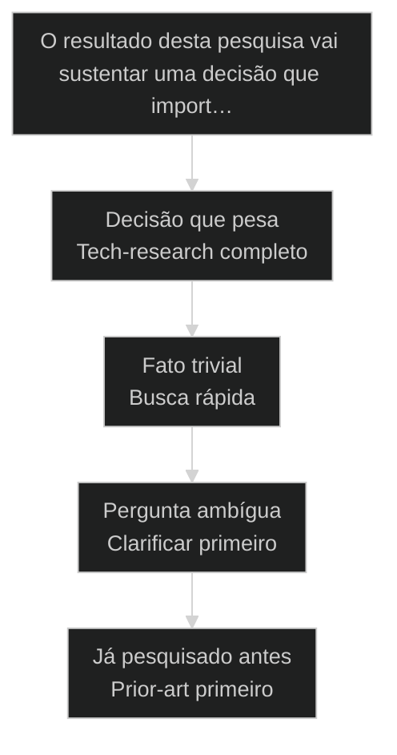
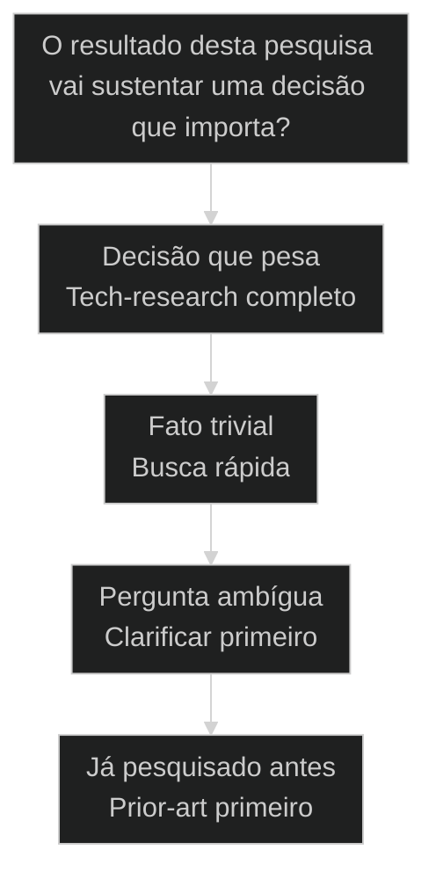

# [[Tech Research]]: pesquisa profunda multi-fonte

← [[35-mesa-redonda-advisory-board|Mesa-redonda e Advisory Board: decidir com clones em vez de um prompt só]] · ↑ [[modulos/Módulo 8 - Pipeline de Research|M8]] · ⌂ [[cursos/AIOX Advanced/README|Curso]] · → [[37-spy-bench-comparativo|Spy/Bench: comparação profunda entre dois projetos]]

## Mapa desta aula

> **Neste acervo:** skill `tech-research` (e `tech-search` para perguntas delimitadas). Pipeline completo e bench: squad `research`.


Decisão-chave da aula — O resultado desta pesquisa vai sustentar uma decisão que import…



> Leia o diagrama antes do texto longo. Depois volte e confira.

> Uma busca solta no Google devolve a primeira página. O tech-research do AIOX devolve um dossiê: várias ondas de busca, score de cobertura, cruzamento de modelos e citações verificadas. Pesquisa vira pipeline, não palpite.

**Objetivos de aprendizagem:**
- Nomear o que distingue uma pesquisa profunda multi-fonte de uma busca rasa no AIOX. _(remember)_
- Distinguir busca multi-onda, score de cobertura e cross-reference dentro do pipeline tech-research. _(understand)_
- Escolher quando rodar tech-research completo em vez de uma busca rápida. _(apply)_
- Explicar por que medir cobertura e verificar citações reduz alucinação na pesquisa. _(understand)_

---

## Pesquisa profunda: o tema varrido em ondas, não numa busca só

*Tech Research AIOX · pesquisa profunda multi-fonte*

Uma busca solta devolve a primeira página e para por aí. O tech-research varre o tema em várias ondas, mede quanto da pergunta foi coberto, cruza modelos diferentes e entrega um dossiê com fontes citadas. Quem aceita a busca rasa pesquisa no escuro.

- **7**: moléculas no pipeline tech-research
- **11**: átomos que compõem as moléculas
- **1**: regra: cobertura medida antes do dossiê

- **status**: tech research
- **meta**: busca rasa=primeira pagina
- **meta**: tech-research=multi-onda + score
- **meta**: regra=clarifica antes, cita depois
- **ready**: ready to dig

**Legenda de cores**

Mapa semantico do Tech Research

- **Multi-fonte** (signal): varias ondas de busca, nao uma so
- **Cobertura** (insight): o score que mede o quanto do tema foi varrido
- **Cross-reference** (bench): cruzar modelos para nao confiar em uma so voz
- **Dossie** (action): o relatorio com fontes citadas e graduadas
- **Busca rasa** (pain): primeira pagina, sem cobertura nem citacao

---

## Comece pela pergunta certa

Antes de listar as fases do pipeline, fixe a pergunta única: a pesquisa precisa ser confiável o bastante para sustentar uma decisão? Se sim, busca rasa não basta. A primeira ação é varrer em ondas e medir cobertura, não aceitar a primeira página.

**Como ler esta aula**

1. **A pergunta aparece**: Uma frase separa busca rasa de pesquisa profunda que sustenta decisão.
2. **Cada peça mostra a cara**: Multi-onda varre, cobertura mede, cross-reference confere, citação verifica.
3. **Vê o caso real**: A skill /tech-research é um primitivo real do AIOX, apontável no repo.
4. **Decide**: Dado um tema, você aponta se ele exige o pipeline completo ou uma busca rápida basta.

- **Objetivos da aula** (Nomear o que distingue pesquisa profunda multi-fonte de busca rasa.; Distinguir multi-onda, score de cobertura e cross-reference.; Escolher quando rodar tech-research completo em vez de busca rápida.; Explicar por que cobertura medida e citação verificada reduzem alucinação.)
- **Onde você está?** (Começando: foque Mapa Simples e a analogia da escavação.; Já usa AIOX: foque Casos Reais e a Decisão.; Vai pesquisar: foque as Moléculas e as Métricas.)
- **Leitura prática**: Em cada bloco, procure uma resposta: estou aceitando a primeira página ou varrendo o tema em ondas com cobertura medida? Quando cada caminho ajuda e quando atrapalha?

**Ritmo da aula**

A distinção fica clara quando cada peça tem definição curta, exemplo real do framework e o gosto de quando usar.

- G **Pergunta antes do detalhe**: Primeiro o critério que separa, depois cada peça do pipeline por dentro.
- 1 **Analogia que ancora**: Busca rasa é olhar a superfície. Pesquisa profunda é escavar em camadas até bater na rocha.
- 2 **Caso real**: A skill /tech-research é apontável no AIOX, com multi-wave e coverage scoring, não teoria.
- 3 **Recap com decisão**: A aula fecha com o aluno decidindo se um tema dele exige o pipeline completo.

---

## A diferença sem jargão

Antes dos termos técnicos, a diferença é só isto: busca rasa aceita a primeira página e para; pesquisa profunda varre o tema em várias ondas, mede o quanto cobriu e cita de onde veio cada afirmação.

> **Em uma frase**: Busca rasa devolve a primeira página de um buscador: rápida, mas cega ao que ficou de fora. Pesquisa profunda multi-fonte varre o tema em ondas, mede a cobertura, cruza modelos diferentes e entrega um dossiê com fontes verificadas. A regra muda: clarifica a pergunta antes, mede a cobertura no meio, cita a fonte no fim.

- **Multi-fonte é varrer em ondas** -> Não uma busca só, mas várias rodadas que cobrem ângulos diferentes do tema. Cada onda fecha um flanco que a anterior deixou aberto.
- **Cobertura é o que se mede** -> Um score que diz quanto da pergunta foi de fato varrido. Sem o score, você não sabe se cobriu o tema ou só a superfície.
- **Cross-reference confere** -> Cruzar mais de um modelo para não confiar numa única voz. Onde os modelos discordam, mora o risco de alucinação.
- **O dossiê é a marca** -> Você sai da pesquisa com um relatório de fontes citadas e graduadas, não com uma resposta solta. Sem dossiê, não houve pesquisa profunda.
- **O erro caro** -> Aceitar a primeira página: decidir com base no que o buscador mostrou primeiro, sem cobertura nem citação. Você confia no raso e descobre o buraco tarde.

**Diagrama principal: da pergunta ao dossiê**

1. **Pergunta**: O tema que você precisa investigar a fundo, clarificado antes de buscar.
2. **Multi-onda**: Várias rodadas de busca cobrem ângulos diferentes do tema.
3. **Cobertura**: Um score mede quanto da pergunta foi de fato varrido.
4. **Dossiê**: O relatório com fontes cruzadas, citadas e graduadas.

**O que a pesquisa profunda evita**
- Decidir pela primeira página do buscador.
- Confiar numa única fonte ou num único modelo.
- Afirmar sem citar de onde veio a informação.
- Achar que cobriu o tema sem medir a cobertura.

**O que ela força**
- Varrer o tema em ondas até cobrir os ângulos.
- Cruzar modelos para flagrar onde eles discordam.
- Citar e graduar cada fonte no dossiê final.
- Medir a cobertura antes de declarar a pesquisa pronta.

---

## A analogia da escavação

A forma mais rápida de fixar a diferença: busca rasa é varrer o chão com a vista; pesquisa profunda é escavar em camadas até bater na rocha. Quem só olha a superfície acha a folha caída, não o que está enterrado.

- **Busca rasa = olhar a superfície**: Você passa os olhos pelo chão e pega o que está à vista. Rápido, mas só vê a primeira camada. O que está enterrado fica invisível.
- **Multi-onda = escavar em camadas**: Cada onda de busca é uma camada de escavação. A primeira tira a folhagem, a segunda a terra solta, a terceira chega ao que importa. Você não para na primeira pá.
- **Cobertura = medir a profundidade**: Você precisa saber até onde cavou. O score de cobertura é a régua: diz se você chegou à rocha ou parou na terra solta achando que era o fundo.
- **Dossiê = o que você desenterrou**: Com tudo escavado, você cataloga cada achado e de onde veio. O dossiê é o registro: não só o objeto, mas a camada e a fonte. Achado sem origem é palpite.

> **E quando a superfície basta?**: Nem todo tema pede escavação. Conferir uma sintaxe rápida ou um fato isolado é raso por natureza, e cavar seria desperdício. O erro é tratar uma decisão de arquitetura como se fosse a checagem de uma sintaxe. Escavação onde a decisão pesa, superfície onde o fato é trivial.

---

## Busca rasa versus pesquisa profunda: o critério da decisão

Esta é a confusão mais cara no início de uma investigação. Os dois falam de buscar informação, então parecem o mesmo trabalho. O critério da decisão separa os dois: o resultado vai sustentar uma escolha que importa ou só matar uma curiosidade?

**Busca rasa (superfície)**
- Uma busca só, aceita a primeira página.
- Sem score: você não sabe o que ficou de fora.
- Uma fonte ou um modelo, sem cruzamento.
- Afirmação sem citação verificada.

**Pesquisa profunda (escavação)**
- Várias ondas que cobrem ângulos diferentes.
- Score de cobertura medindo o varrido.
- Cross-reference entre modelos diferentes.
- Dossiê com fontes citadas e graduadas.

> **A pergunta que separa**: Pergunte: o resultado desta pesquisa vai sustentar uma decisão que importa? Se não, busca rasa basta: rápida e suficiente para um fato trivial. Se sim, é pesquisa profunda: varra em ondas, meça a cobertura e cite as fontes. Confiar numa busca rasa para decidir o que pesa é decidir no escuro.

- **Pesquisa profunda com busca rasa**: Os dois buscam informação, então parecem o mesmo trabalho.
- **Cobertura com quantidade de fontes**: Os dois falam de mais material, então parecem a mesma métrica.
- **Cross-reference com repetir a busca**: Os dois rodam a pesquisa mais de uma vez, então parecem o mesmo passo.

---

## A pesquisa profunda existe de verdade no AIOX

A distinção não é teoria. O tech-research é apontável no framework. Estes dois casos mostram os primitivos reais do AIOX que varrem um tema em ondas, medem a cobertura e cruzam modelos antes de entregar o dossiê.

- **Onde a pesquisa profunda vive no AIOX**: O AIOX tem o primitivo /tech-research: um pipeline de 7 moléculas e 11 átomos que faz multi-wave search, coverage scoring, multi-LLM cross-reference e citation verification, com auto-clarify na entrada. A pesquisa profunda não é abstração: tem skill, tem moléculas nomeadas e tem score de cobertura. Players: /tech-research, 7 moléculas, 11 átomos, multi-wave search, coverage scoring, cross-reference, citation verification.
- **O que muda a decisão**: A pergunta não é se o tema é interessante. É se a pesquisa vai sustentar uma decisão que importa. Tema que decide pede pipeline completo com cobertura medida. Fato trivial e checagem rápida, não.

**Cada conceito num eixo**

A distinção vira sistema quando cada conceito tem definição, lar no framework e o tipo de pesquisa que resolve.

- **Multi-fonte**: Várias ondas de busca que cobrem ângulos diferentes do tema. /tech-research roda em multi-wave.
- **Cobertura**: O score que mede quanto da pergunta foi varrido. O coverage scoring do pipeline.
- **Cross-reference**: Cruzar modelos para não confiar numa só voz. O multi-LLM cross-reference.
- **Dossiê**: O relatório de fontes citadas e graduadas, depois da verificação de citações.

**Colunas:** Conceito | Varre ou confia? | Sinal de uso certo | Sinal de erro

- Multi-fonte: Varre ou confia? | Várias ondas cobrindo ângulos diferentes. | Uma busca só, primeira página aceita.
- Cobertura: Varre ou confia? | Score medindo o quanto do tema foi varrido. | Sem score, cobertura suposta pelo palpite.
- Cross-reference: Varre ou confia? | Modelos cruzados, discordância sinalizada. | Uma só voz, alucinação confiante aceita.
- Dossiê: Varre ou confia? | Fontes citadas e graduadas, depois da verificação. | Afirmação solta sem citação verificada.

### Caso: O /tech-research varre em multi-wave e pontua a cobertura

A pesquisa profunda não é uma metáfora de aula: o AIOX tem a skill /tech-research, um pipeline de 7 moléculas e 11 átomos que faz busca multi-wave, score de cobertura, cross-reference entre modelos e verificação de citações.

- Começou como: Uma pergunta técnica que uma busca rasa responderia pela primeira página, sem saber o que ficou de fora.
- Virou: Um dossiê construído por ondas de busca, com cobertura medida e fontes graduadas antes de qualquer conclusão.
- Prova: A skill /tech-research existe no AIOX com 7 moléculas e 11 átomos, multi-wave search, coverage scoring, multi-LLM cross-reference e citation verification.
- Lição: Pesquisa profunda é primitivo real: tem skill, tem moléculas nomeadas, tem score de cobertura e citação verificada.

### Caso: O cross-reference e o auto-clarify fecham contra a alucinação

Na visão de confiabilidade, a pesquisa profunda não confia numa só voz: /tech-research clarifica a pergunta antes de buscar e cruza modelos diferentes para flagrar onde eles discordam, com as citações verificadas no fim.

- Começou como: Uma pergunta ambígua que um modelo único responderia com confiança, mesmo onde estava errado.
- Virou: Uma pergunta clarificada antes da busca, cruzada entre modelos e fechada com citações verificadas no dossiê.
- Prova: A skill /tech-research existe no AIOX com auto-clarify na entrada, multi-LLM cross-reference e citation verification antes da síntese.
- Lição: Cross-reference e auto-clarify não são luxo: são a peça que separa o dossiê confiável da alucinação confiante.

---

## As moléculas do pipeline tech-research

O tech-research não é um olhar genérico na busca. É um pipeline de moléculas nomeadas, da clarificação da pergunta à síntese do dossiê. Cada molécula fecha antes da próxima abrir.

**Pipeline de pesquisa profunda**
As moléculas ordenadas que varrem um tema em ondas antes de sintetizar o dossiê.
- **1. Clarificar**: Auto-clarify resolve a ambiguidade da pergunta antes de qualquer busca.
- **2. Buscar**: Multi-wave search varre o tema em ondas que cobrem ângulos diferentes.
- **3. Cobrir**: Coverage scoring mede o quanto da pergunta foi de fato varrido.
- **4. Cruzar**: Multi-LLM cross-reference confere a informação entre modelos diferentes.
- **5. Verificar**: Citation verification confirma e gradua cada fonte do dossiê.
- **6. Sintetizar**: O dossiê consolidado nasce das fontes cruzadas e verificadas.

**a cobertura fecha antes da síntese abrir**

1. **Clarificar**: O pipeline resolve a ambiguidade da pergunta antes de buscar.
2. **Varrer**: A busca multi-wave cobre o tema em ondas, ângulo a ângulo.
3. **Medir**: O score de cobertura fecha como gate antes da síntese.
4. **Sintetizar**: O dossiê nasce das fontes cruzadas e citadas, molécula por molécula.

---

## Como pergunta, cobertura e dossiê se combinam

Pergunta, cobertura e dossiê não são rivais; são camadas em sequência. A pergunta delimita, a cobertura mede, o dossiê registra. Entender a direção evita declarar a pesquisa pronta antes de medir o que ficou de fora.

- **1. Delimitar (Pergunta)**: Quem define o alvo da pesquisa. O auto-clarify resolve a ambiguidade antes de buscar. É a única etapa que mira sem ainda escavar. [WHY, delimita, clarifica]
- **2. Medir (Cobertura)**: O quanto foi varrido. O score que diz se a pesquisa cobriu o tema ou parou na superfície. O gate que separa profundo de raso. [WHAT, score, cobertura]
- **3. Registrar (Dossiê)**: Como a pesquisa vira conhecimento. O relatório de fontes cruzadas, citadas e graduadas. Zero palpite, máxima rastreabilidade. [HOW, dossie, citado]

---

## Quando rodar tech-research completo?

Antes de abrir o buscador, decida se o tema merece o pipeline completo. O critério economiza tempo quando você escolhe pela decisão que a pesquisa sustenta, não pela vontade de já ter uma resposta.

**Árvore de decisão**
_Responda pelo peso da decisão antes de pensar em qual buscador usar._



- **Decisão que pesa** — A pesquisa sustenta uma escolha técnica ou de produto com custo alto de erro.
  → _Tech-research completo_
  Ex.: Rode tech-research completo: multi-wave, cobertura medida, cross-reference e citação.
- **Fato trivial** — Você só precisa confirmar uma sintaxe, um número ou um fato isolado.
  → _Busca rápida_
  Ex.: Não precisa do pipeline. Uma busca rasa resolve sem desperdício.
- **Pergunta ambígua** — O tema importa, mas a pergunta tem ambiguidade que muda a resposta.
  → _Clarificar primeiro_
  Ex.: Comece pelo auto-clarify antes de varrer. Pergunta errada não merece pesquisa profunda.
- **Já pesquisado antes** — O tema pode já ter um dossiê anterior no repositório de pesquisa.
  → _Prior-art primeiro_
  Ex.: Consulte o prior-art antes de gastar budget. Reuse o dossiê se a cobertura bate.

**Gate:** Qual é o gate? — _Sem gate, você roda o pipeline por reflexo ou aceita o raso por pressa. Responda: a decisão pesa e ainda não há dossiê? Se sim, tech-research completo. Se não, busca rápida, clarificação ou reuse do prior-art._

> **Regra do critério único**: A escolha não é pela curiosidade do tema; é pela decisão que a pesquisa sustenta. Se a decisão pesa e não há dossiê, o pipeline completo é a peça. Se é um fato trivial, o pipeline é overengineering. Aceitar a primeira página para decidir o que pesa é pesquisar no escuro, o erro mais caro do início.

---

## Rotas de pesquisa

Cada tipo de pergunta tem um modo típico de pesquisa. Saber a rota evita decidir certo pela profundidade e materializar com a ferramenta errada.

#### Pesquisa profunda para decisão técnica
Quando o tema sustenta uma escolha com custo alto de erro.
1. **Sinal: decisão técnica ou de produto que pesa.
2. **Pergunta: você cobriu o tema ou está supondo a cobertura?
3. **Ação: rodar /tech-research em multi-wave com coverage scoring.
4. **Resultado: dossiê com fontes cruzadas, citadas e graduadas.

#### Clarificação antes da busca
Quando o tema importa mas a pergunta é ambígua.
1. **Sinal: pergunta cuja ambiguidade muda a resposta certa.
2. **Pergunta: você sabe exatamente o que está perguntando?
3. **Ação: deixar o auto-clarify resolver a pergunta antes de varrer.
4. **Resultado: pergunta fechada que merece pesquisa profunda.

#### Busca rápida para fato isolado
Quando você só precisa confirmar uma sintaxe ou um número.
1. **Sinal: fato isolado sem peso de decisão.
2. **Pergunta: o erro aqui custa pouco ou muito?
3. **Ação: busca rasa direta, sem o pipeline inteiro.
4. **Resultado: confirmação rápida suficiente para o caso.

**Pesquisa profunda**
Use quando a pesquisa sustenta uma decisão e a cobertura precisa ser medida.
- `/tech-research`: abre o pipeline de 7 moléculas em multi-wave search.
- `medir cobertura`: fechar o coverage scoring antes de sintetizar o dossiê.

**Cross-reference**
Use quando o custo de uma afirmação errada é alto e uma só voz não basta.
- `cruzar modelos`: rodar o multi-LLM cross-reference sobre as afirmações.
- `verificar citações`: confirmar e graduar cada fonte antes de aceitar.

**Prior-art primeiro**
Use quando o tema pode já ter um dossiê anterior no repositório.
- `consultar prior-art`: checar o índice de pesquisas antes de gastar budget.
- `reusar ou focar`: reuse o dossiê se a cobertura bate, senão rode um follow-up focado.

---

## Modelos para ler melhor

Visualizações rápidas para o aluno comparar busca rasa, pesquisa profunda e clarificação, os riscos de cada escolha e o grau de pesquisa que cada cenário exige.

- **Decisão que pesa**: alto (escolha com custo de erro pede pipeline completo.)
- **Pergunta ambígua**: médio (clarifica antes, depois decide a profundidade.)
- **Fato trivial**: baixo (busca rasa basta, cavar seria desperdício.)

- **Decisão sem pesquisa profunda**: decisão (decidir pela primeira página e descobrir o buraco tarde.)
- **Trivial com pipeline pesado**: trivial (gastar budget e tempo cavando o que não precisa.)
- **Ambíguo sem clarificar**: ambíguo (pesquisar a fundo a resposta da pergunta errada.)

**Matriz de Decisão do Aluno**

Em dúvida, escolha a célula que melhor descreve a sua pesquisa.

- **Decisão técnica com custo de erro**: Pesquisa profunda. /tech-research com cobertura medida.
- **Pergunta ambígua que importa**: Auto-clarify antes de varrer o tema.
- **Sintaxe ou número isolado**: Busca rasa. Confirmação rápida sem pipeline.
- **Afirmação que pesa**: Cross-reference entre modelos antes de aceitar.
- **Tema já pesquisado antes**: Consulte o prior-art, reuse se a cobertura bate.
- **Não sabe ainda**: Pergunte: a decisão pesa? Sim, pesquisa profunda.

- **Sinal de pesquisa saudável**: cobertura medida antes de declarar a pesquisa pronta / clarificação resolvida antes de varrer o tema / primeira página aceita sem cobertura nem citação
- **Separação de etapas**: clarifica, varre, mede, cruza e só então cita / busca e verificação em rodadas separadas e rastreáveis / afirmação sintetizada antes de cruzar e verificar

---

## O que cada peça carrega

Cada peça do tech-research tem uma anatomia mínima. Saber o que cada uma guarda ajuda a reconhecer quando você está pulando uma molécula ou usando a ferramenta errada.

- **Multi-fonte: as ondas**: Várias rodadas de busca que cobrem ângulos diferentes do tema. Varredura, não palpite.
- **Cobertura: o score**: A medida do quanto da pergunta foi varrido. O gate que separa profundo de raso.
- **/tech-research: a skill**: O pipeline de 7 moléculas e 11 átomos, da clarificação à síntese do dossiê.
- **Cross-reference: o cruzamento**: O multi-LLM que cruza modelos para flagrar discordância antes de confiar.
- **Citação: a verificação**: A fonte confirmada e graduada no dossiê. Afirmação sem citação verificada é palpite.

---

## Métricas da pesquisa

Sem telemetria, a saúde da pesquisa vira fé. Estas perguntas separam um dossiê confiável de uma busca superficial disfarçada de pesquisa profunda.

**Colunas:** Métrica | Pergunta | Sinal saudável | Sinal de risco

- Cobertura do tema: O score de cobertura mediu quanto da pergunta foi varrido? | Cobertura medida, não suposta pelo palpite. | Pesquisa declarada pronta sem medir o coberto.
- Ordem das moléculas: A pesquisa rodou na ordem, da clarificação à síntese? | Cada molécula fechou antes da próxima abrir. | Síntese antes de cruzar e verificar as fontes.
- Cruzamento de modelos: As afirmações passaram pelo cross-reference? | Modelos cruzados, discordância sinalizada. | Uma só voz aceita como verdade confiante.
- Citação verificada: Cada afirmação do dossiê aponta para uma fonte graduada? | Cada claim traça de volta a uma citação verificada. | Afirmação solta sem âncora numa fonte real.

---

## Quando resistir ao pipeline completo

A distinção ajuda mais quando você resiste ao reflexo de rodar tech-research em tudo. A pesquisa profunda tem custo: tempo de varredura, budget de modelos, verificação de citações. Vale só quando a decisão paga.

**Quando rodar tech-research completo**
- A pesquisa sustenta uma decisão com custo alto de erro.
- O tema é amplo e uma busca só deixaria ângulos de fora.
- O custo de uma afirmação errada justifica o cross-reference.
- Não existe dossiê anterior que cubra a pergunta.

**Quando não rodar**
- É um fato trivial: sintaxe, número ou checagem isolada.
- Um dossiê anterior já cobre a pergunta no prior-art.
- A decisão é reversível e barata de corrigir.
- O custo do pipeline supera o risco da resposta rasa.

---

## Exercício: decida a pesquisa

Pegue um tema real seu e aplique o critério. O objetivo não é pesquisar tudo; é apontar se o tema exige tech-research completo antes de abrir o buscador.

**Um tema, cinco perguntas**
```yaml
pesquisa:
  tema: "o que voce vai investigar?"
  pesa: "sustenta decisao com custo de erro? sim | nao"
  rota: "pesquisa_profunda | clarificacao | busca_rapida"
  ferramenta: "tech_research | auto_clarify | busca_rasa"
  gate: "por que nao a outra rota? (se profunda, qual cobertura precisa atingir?)"

```
*O acerto não é pesquisar tudo. É provar que você escolheu a rota pelo peso da decisão e sabe justificar por que a outra custaria mais sem entregar mais confiança.*

**Exemplo preenchido: escolher um banco de dados versus confirmar uma flag de CLI**

- **Tema A**: Escolher entre dois bancos de dados para um produto novo que vai escalar.
- **Pesa A**: Sim. A escolha trava a arquitetura e errar custa uma migracao cara depois.
- **Rota A**: Pesquisa profunda. Rodo /tech-research em multi-wave, meco cobertura e cruzo modelos antes de decidir.
- **Tema B**: Confirmar qual flag passa o modo verbose num comando de CLI.
- **Rota B**: Busca rapida. Fato isolado, sem peso de decisao, a primeira fonte confiavel resolve.
- **Gate B**: Pesquisa profunda nao se aplica: o erro custa pouco e e reversivel num segundo, entao o pipeline seria desperdicio.

- 1. **Tema**: Descreva em uma frase o tema ou a pergunta que você precisa investigar.
- 2. **Pesa?**: Responda: o resultado sustenta uma decisão com custo de erro, ou é um fato trivial?
- 3. **Rota**: Aponte pesquisa profunda (decisão que pesa), clarificação (pergunta ambígua) ou busca rápida (trivial).
- 4. **Ferramenta**: Diga como rodaria: /tech-research multi-wave para decisão, auto-clarify para ambiguidade, busca rasa para trivial.
- 5. **Gate**: Justifique por que não escolheu a outra rota. Para pesquisa profunda, diga qual cobertura você precisa atingir antes de concluir.

**Funcionou se:**

- O aluno escolhe a rota pelo peso da decisão, não pela curiosidade do tema.
- O aluno separa varrer em ondas (multi-fonte) de confiar na primeira página (busca rasa).
- O aluno define qual cobertura precisa atingir quando escolhe pesquisa profunda.

---

## Glossário do Tech Research

Tradução dos termos para alguém que está vendo a distinção busca rasa versus pesquisa profunda pela primeira vez.

- **Pesquisa profunda multi-fonte**: Investigação que varre o tema em várias ondas, mede a cobertura e cruza modelos antes de entregar um dossiê com fontes citadas.
- **Busca rasa**: Uma busca única que aceita a primeira página do buscador, sem medir cobertura nem verificar citações.
- **Multi-wave search**: A busca em várias ondas do tech-research, cada uma cobrindo ângulos diferentes do tema.
- **Coverage scoring**: O score que mede quanto da pergunta foi de fato varrido, o gate que separa pesquisa profunda de superfície.
- **Cross-reference**: O cruzamento entre modelos diferentes (multi-LLM) para flagrar discordância antes de confiar numa afirmação.
- **Auto-clarify**: A fase de entrada que resolve a ambiguidade da pergunta antes de qualquer busca, para não pesquisar a resposta certa da pergunta errada.
- **Citation verification**: A confirmação e graduação de cada fonte do dossiê, antes de aceitar qualquer afirmação como verdadeira.
- **/tech-research**: A skill do AIOX que faz pesquisa profunda em 7 moléculas e 11 átomos: clarifica, varre em multi-wave, pontua cobertura, cruza modelos e verifica citações.

> **Portão da aula**: A aula só está no padrão quando o aluno nomeia o que distingue pesquisa profunda multi-fonte de busca rasa, distingue varrer em ondas com cobertura medida (multi-wave e coverage scoring) de aceitar a primeira página, e consegue apontar, para um tema real, se ele exige tech-research completo (decisão que pesa, via /tech-research com cross-reference e citação) ou uma busca rápida (fato trivial) antes de abrir o buscador.

***


---

## Navegação

← [[35-mesa-redonda-advisory-board|Mesa-redonda e Advisory Board: decidir com clones em vez de um prompt só]] · ↑ [[modulos/Módulo 8 - Pipeline de Research|M8]] · ⌂ [[cursos/AIOX Advanced/README|Curso]] · → [[37-spy-bench-comparativo|Spy/Bench: comparação profunda entre dois projetos]]
