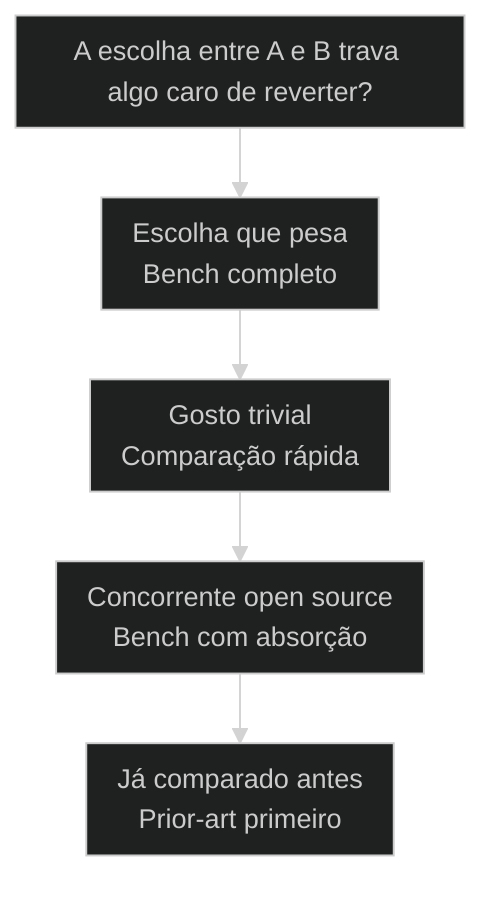
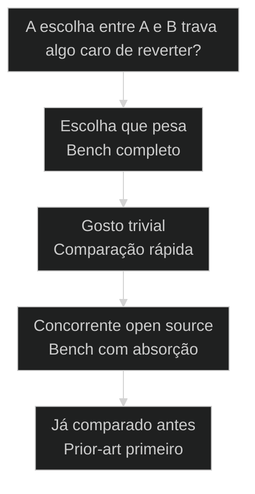

# [[Spy]]/Bench: comparação profunda entre dois projetos

← [[36-tech-research-multi-fonte|Tech Research: pesquisa profunda multi-fonte]] · ↑ [[modulos/Módulo 8 - Pipeline de Research|M8]] · ⌂ [[Cursos/AIOX Advanced/README|Curso]] · → [[38-code-anatomy-domain-decoder|Code Anatomy: engenharia reversa de código com /code-anatomist]]

## Mapa desta aula

> **Sucessor neste acervo:** o domínio Spy/[[Bench]] vive em `squads/research/` (tasks `tasks/benchmark/`) e na skill de entrada `research`. A skill standalone `tech-research` cobre research profunda multi-fonte. Nomes legados: `spy`, `deep-research`, `/research-bench`.


Decisão-chave da aula — A escolha entre A e B trava algo caro de reverter?



> Leia o diagrama antes do texto longo. Depois volte e confira.

> Comparar A com B no olho devolve uma opinião. O /research-bench do AIOX devolve um veredito: scoring quantitativo, matrizes lado a lado, gap analysis e battle cards. A escolha vira benchmark, não palpite.

**Objetivos de aprendizagem:**
- Nomear o que distingue uma comparação A-vs-B com benchmark de uma comparação no olho. _(remember)_
- Distinguir spy, score quantitativo, matriz comparativa e battle card dentro do /research-bench. _(understand)_
- Escolher quando rodar /research-bench completo em vez de uma comparação rápida no olho. _(apply)_
- Explicar por que scoring quantitativo e gap analysis reduzem o viés numa escolha entre dois projetos. _(understand)_

---

## Comparação profunda: A e B medidos eixo por eixo, não no olho

*Spy/Bench AIOX · comparação profunda entre projetos*

Comparar dois projetos no olho devolve uma opinião e para por aí. O /research-bench espia A e B a fundo, pontua cada eixo, monta a matriz lado a lado e entrega um battle card com o gap e a recomendação. Quem compara no olho escolhe pelo achismo.

- **2+**: projetos comparados eixo por eixo
- **1**: placar quantitativo com score por critério
- **1**: regra: critério definido antes do veredito

- **status**: spy bench
- **meta**: comparar no olho=achismo
- **meta**: research-bench=score + matriz + gap
- **meta**: regra=criterio antes, veredito depois
- **ready**: ready to score

**Legenda de cores**

Mapa semantico do Spy/Bench

- **Spy** (signal): olhar A e B a fundo antes de comparar
- **Score** (insight): o placar quantitativo que mede cada eixo
- **Matriz** (bench): A versus B lado a lado, eixo por eixo
- **Battle card** (action): o veredito acionavel com o gap e a recomendacao
- **Comparar no olho** (pain): opiniao sem criterio, sem placar, sem gap

---

## Comece pelo critério certo

Antes de listar as peças do bench, fixe a pergunta única: a comparação precisa ser defensável o bastante para sustentar uma escolha entre A e B? Se sim, comparar no olho não basta. A primeira ação é definir os eixos e pontuar, não declarar um vencedor pela impressão.

**Como ler esta aula**

1. **A pergunta aparece**: Uma frase separa comparar no olho de benchmark que sustenta uma escolha.
2. **Cada peça mostra a cara**: Spy espia, score pontua, matriz alinha, battle card decide.
3. **Vê o caso real**: A skill /research-bench é um primitivo real do AIOX, apontável no repo.
4. **Decide**: Dada uma escolha entre dois projetos, você aponta se ela exige o bench completo ou uma comparação rápida basta.

- **Objetivos da aula** (Nomear o que distingue comparação A-vs-B com benchmark de comparar no olho.; Distinguir spy, score quantitativo, matriz comparativa e battle card.; Escolher quando rodar /research-bench completo em vez de comparar no olho.; Explicar por que score quantitativo e gap analysis reduzem o viés na escolha.)
- **Onde você está?** (Começando: foque Mapa Simples e a analogia do placar.; Já usa AIOX: foque Casos Reais e a Decisão.; Vai comparar: foque as Peças e as Métricas.)
- **Leitura prática**: Em cada bloco, procure uma resposta: estou declarando um vencedor pela impressão ou pontuando A e B eixo por eixo com gap medido? Quando cada caminho ajuda e quando atrapalha?

**Ritmo da aula**

A distinção fica clara quando cada peça tem definição curta, exemplo real do framework e o gosto de quando usar.

- G **Pergunta antes do detalhe**: Primeiro o critério que separa, depois cada peça do bench por dentro.
- 1 **Analogia que ancora**: Comparar no olho é torcer por um time. Benchmark é abrir a súmula e contar os pontos.
- 2 **Caso real**: A skill /research-bench é apontável no AIOX, com score quantitativo e battle cards, não teoria.
- 3 **Recap com decisão**: A aula fecha com o aluno decidindo se uma escolha dele entre dois projetos exige o bench completo.

---

## A diferença sem jargão

Antes dos termos técnicos, a diferença é só isto: comparar no olho escolhe um vencedor pela impressão; o benchmark espia A e B a fundo, pontua cada eixo, alinha os dois numa matriz e entrega o gap com uma recomendação.

> **Em uma frase**: Comparar no olho declara um vencedor pela impressão: rápido, mas cego ao critério que ficou implícito. O Spy/Bench espia os dois projetos a fundo, pontua cada eixo num score quantitativo, monta a matriz lado a lado e entrega um battle card com o gap e a recomendação. A regra muda: define o critério antes, pontua cada eixo no meio, emite o veredito no fim.

- **Spy é olhar a fundo** -> Não um relance, mas uma varredura profunda de A e de B antes de comparar. Cada projeto é investigado como o pipeline `tech-research` / squad `research` investigaria um tema.
- **Score é o que se mede** -> Um placar quantitativo que dá nota a cada eixo. Sem o score, você não sabe se A ganhou de verdade ou só pareceu melhor.
- **A matriz alinha** -> A e B lado a lado, eixo por eixo, na mesma régua. Onde a matriz mostra a coluna vazia, mora a fraqueza que o olho não viu.
- **O battle card é a marca** -> Você sai da comparação com o gap medido e uma recomendação acionável, não com uma preferência. Sem battle card, não houve benchmark.
- **O erro caro** -> Comparar no olho: declarar um vencedor pela impressão, sem critério, sem placar, sem gap. Você confia na simpatia e descobre o trade-off tarde.

**Diagrama principal: da escolha ao battle card**

1. **Escolha**: Os dois projetos que você precisa comparar a fundo, com os eixos definidos antes.
2. **Score**: Cada eixo recebe nota quantitativa para A e para B.
3. **Matriz**: Os dois alinhados lado a lado revelam o gap por eixo.
4. **Battle card**: O veredito acionável com o gap medido e a recomendação.

**O que o benchmark evita**
- Declarar um vencedor pela impressão.
- Comparar A e B com critérios diferentes.
- Afirmar uma vantagem sem medir o gap.
- Achar que escolheu certo sem pontuar os eixos.

**O que ele força**
- Espiar A e B a fundo antes de comparar.
- Pontuar os dois na mesma régua, eixo por eixo.
- Medir o gap e emitir o battle card.
- Definir os critérios antes de declarar o vencedor.

---

## A analogia do placar

A forma mais rápida de fixar a diferença: comparar no olho é torcer por um time; o benchmark é abrir a súmula e contar os pontos. Quem só torce vê o gol bonito, não a posse de bola que decidiu o jogo.

- **Comparar no olho = torcer**: Você assiste e decide pela emoção: o lance bonito, a simpatia, a primeira impressão. Rápido, mas enviesado. O que decidiu o jogo de verdade fica invisível.
- **Score = contar os pontos**: Cada eixo é uma estatística: posse, finalização, passe certo. O score quantitativo dá nota a cada um. Você não decide pelo lance bonito, decide pela súmula.
- **Matriz = a súmula lado a lado**: Os dois times na mesma tabela, estatística por estatística. A matriz mostra onde A ganha, onde B ganha e onde a coluna fica vazia. O gap aparece na régua, não na torcida.
- **Battle card = o relatório do jogo**: Com tudo pontuado, você cataloga o veredito: quem venceu, por quanto e onde. O battle card é o registro acionável: não só o vencedor, mas o gap e a recomendação. Vencedor sem gap é torcida.

> **E quando a impressão basta?**: Nem toda escolha pede súmula. Decidir entre duas libs triviais e intercambiáveis é impressão por natureza, e benchmarkar seria desperdício. O erro é tratar a escolha de uma arquitetura que trava o produto como se fosse a escolha de uma cor. Bench onde a escolha pesa, impressão onde o trade-off é trivial.

---

## Comparar no olho versus benchmark: o critério do peso

Esta é a confusão mais cara no início de uma escolha entre dois projetos. Os dois falam de comparar A com B, então parecem o mesmo trabalho. O critério do peso separa os dois: a escolha trava algo caro de reverter ou só resolve um gosto pessoal?

**Comparar no olho (impressão)**
- Um relance, declara o vencedor pela impressão.
- Sem score: você não sabe por quanto A ganhou.
- Critérios implícitos e diferentes para cada lado.
- Vantagem afirmada sem o gap medido.

**Benchmark (súmula)**
- Spy profundo de A e de B antes de comparar.
- Score quantitativo por eixo, na mesma régua.
- Matriz lado a lado com critérios explícitos.
- Battle card com o gap medido e a recomendação.

> **A pergunta que separa**: Pergunte: a escolha entre A e B trava algo caro de reverter? Se não, comparar no olho basta: rápido e suficiente para um gosto pessoal. Se sim, é benchmark: espie os dois a fundo, pontue cada eixo e meça o gap. Confiar na impressão para uma escolha que trava o produto é decidir pela torcida.

- **Benchmark com comparar no olho**: Os dois comparam A com B, então parecem o mesmo trabalho.
- **Spy com uma busca rápida**: Os dois olham o projeto antes de comparar, então parecem o mesmo passo.
- **Score com lista de prós e contras**: Os dois listam vantagens, então parecem a mesma métrica.

---

## O benchmark existe de verdade no AIOX

A distinção não é teoria. O /research-bench é apontável no framework. Estes dois casos mostram os primitivos reais do AIOX que espiam dois projetos a fundo, pontuam cada eixo e entregam o battle card antes de declarar o vencedor.

- **Onde a comparação profunda vive no AIOX**: O AIOX tem o primitivo /research-bench: compara dois projetos com scoring quantitativo, matrizes lado a lado, gap analyses e battle cards. A comparação profunda não é abstração: tem skill, tem score por eixo e tem battle card acionável. Players: /research-bench, scoring quantitativo, matrizes comparativas, gap analysis, battle cards, spy, absorção open source.
- **O que muda a decisão**: A pergunta não é qual projeto é mais simpático. É se a escolha entre A e B trava algo caro de reverter. Escolha que pesa pede bench completo com score medido. Gosto trivial e libs intercambiáveis, não.

**Cada conceito num eixo**

A distinção vira sistema quando cada conceito tem definição, lar no framework e o tipo de escolha que resolve.

- **Spy**: Olhar A e B a fundo antes de comparar. O /research-bench abre com deep research de cada lado.
- **Score**: O placar quantitativo que dá nota a cada eixo. O scoring quantitativo do pipeline.
- **Matriz**: A versus B lado a lado, eixo por eixo. As matrizes comparativas do bench.
- **Battle card**: O veredito acionável com o gap e a recomendação, depois do gap analysis.

**Colunas:** Conceito | Pontua ou opina? | Sinal de uso certo | Sinal de erro

- Spy: Pontua ou opina? | Deep research de A e de B antes de comparar. | Um relance superficial em cada projeto.
- Score: Pontua ou opina? | Nota quantitativa por eixo, mesma régua. | Vencedor declarado sem placar, pela impressão.
- Matriz: Pontua ou opina? | A e B alinhados lado a lado, gap visível. | Critérios diferentes para cada lado.
- Battle card: Pontua ou opina? | Gap medido e recomendação acionável. | Preferência solta sem gap nem recomendação.

### Caso: O /research-bench pontua A e B e monta a matriz comparativa

A comparação profunda não é uma metáfora de aula: o AIOX tem a skill /research-bench, que compara dois projetos com scoring quantitativo, matrizes lado a lado, gap analysis e battle cards. A escolha vira benchmark, não opinião.

- Começou como: Uma escolha entre dois projetos que a impressão resolveria pela simpatia, sem saber por quanto um ganhou do outro.
- Virou: Um battle card construído por eixos pontuados, com a matriz lado a lado e o gap medido antes de qualquer veredito.
- Prova: A skill /research-bench existe no AIOX e compara projetos com scoring quantitativo, matrizes comparativas, gap analyses e battle cards.
- Lição: Comparação profunda é primitivo real: tem skill, tem score por eixo, tem matriz e tem battle card.

### Caso: O gap analysis vira plano de absorção do open source

Na visão de execução, o benchmark não para no veredito: o gap analysis do /research-bench mostra onde B ganha de A, e esse gap vira um alvo de absorção quando B é open source. Spy não é só comparar, é descobrir o que importar.

- Começou como: Uma comparação que pararia no vencedor, sem saber o que o perdedor poderia importar do vencedor.
- Virou: Um gap analysis que aponta cada eixo onde B ganha, virando um plano de absorção do que o open source faz melhor.
- Prova: MASTER-CO-19 cobre Spy=Deep Research+benchmark (t2-aula-5 CO-03) e Benchmark+absorção open source (aula-07 PC-06); o /research-bench produz gap analyses.
- Lição: O gap analysis não é placar morto: é o mapa do que absorver do projeto que ganhou em cada eixo.

---

## As peças do benchmark /research-bench

O /research-bench não é um olhar genérico em A e B. É um pipeline de peças nomeadas, do spy de cada projeto ao battle card final. Cada peça fecha antes da próxima abrir.

**Pipeline de comparação profunda**
As peças ordenadas que espiam A e B antes de emitir o battle card.
- **1. Definir eixos**: Os critérios de comparação são explicitados antes de olhar qualquer projeto.
- **2. Spy**: Deep research de A e de B, cada projeto investigado a fundo.
- **3. Pontuar**: Scoring quantitativo dá nota a cada eixo, na mesma régua para os dois.
- **4. Matriz**: A e B alinhados lado a lado, eixo por eixo, na matriz comparativa.
- **5. Gap analysis**: Cada eixo onde um ganha do outro fica nomeado como gap.
- **6. Battle card**: O veredito acionável nasce do placar, com gap e recomendação.

**o score fecha antes do battle card abrir**

1. **Spy**: O pipeline investiga A e B a fundo antes de comparar.
2. **Pontuar**: O score quantitativo dá nota a cada eixo, na mesma régua.
3. **Matriz**: A e B alinhados lado a lado revelam o gap por eixo.
4. **Battle card**: O veredito nasce do placar e do gap, peça por peça.

---

## Como spy, score e battle card se combinam

Spy, score e battle card não são rivais; são camadas em sequência. O spy investiga, o score mede, o battle card decide. Entender a direção evita declarar o vencedor antes de pontuar os eixos.

- **1. Investigar (Spy)**: Quem olha A e B a fundo. O deep research de cada projeto antes de comparar. É a única etapa que varre sem ainda pontuar. [WHO, investiga, spy]
- **2. Medir (Score)**: O quanto cada eixo vale. O placar quantitativo que diz por quanto A ganha de B em cada critério. O gate que separa benchmark de impressão. [WHAT, score, matriz]
- **3. Decidir (Battle card)**: Como a comparação vira ação. O veredito com o gap e a recomendação. Zero torcida, máxima rastreabilidade. [HOW, battle card, gap]

---

## Quando rodar /research-bench completo?

Antes de abrir a comparação, decida se a escolha entre A e B merece o pipeline completo. O critério economiza tempo quando você escolhe pelo peso da decisão que a comparação sustenta, não pela vontade de já ter um vencedor.

**Árvore de decisão**
_Responda pelo peso da decisão antes de pensar em qual projeto parece melhor._



- **Escolha que pesa** — A escolha trava uma arquitetura ou dependência com custo alto de reverter.
  → _Bench completo_
  Ex.: Rode /research-bench completo: spy, score quantitativo, matriz e battle card.
- **Gosto trivial** — As opções são intercambiáveis e errar custa quase nada para trocar.
  → _Comparação rápida_
  Ex.: Não precisa do bench. Comparar no olho resolve sem desperdício.
- **Concorrente open source** — Um dos projetos é open source e você pode absorver o que ele faz melhor.
  → _Bench com absorção_
  Ex.: Rode o bench com foco no gap analysis: cada gap vira alvo de absorção.
- **Já comparado antes** — Os dois projetos podem já ter um battle card anterior no repositório.
  → _Prior-art primeiro_
  Ex.: Consulte o prior-art antes de gastar budget. Reuse o battle card se os eixos batem.

**Gate:** Qual é o gate? — _Sem gate, você roda o bench por reflexo ou aceita o olho por pressa. Responda: a escolha pesa e ainda não há battle card? Se sim, /research-bench completo. Se não, comparação rápida, foco no gap (open source) ou reuse do prior-art._

> **Regra do critério único**: A escolha não é pela simpatia do projeto; é pelo peso da decisão que a comparação sustenta. Se a escolha trava algo caro e não há battle card, o pipeline completo é a peça. Se é um gosto trivial, o bench é overengineering. Declarar o vencedor no olho para uma escolha que trava o produto é decidir pela torcida, o erro mais caro do início.

---

## Rotas de comparação

Cada tipo de escolha tem um modo típico de comparar. Saber a rota evita decidir certo pelo peso e materializar com a ferramenta errada.

#### Benchmark completo para escolha que trava
Quando a escolha entre A e B sustenta uma arquitetura com custo alto de reverter.
1. **Sinal: escolha técnica ou de produto que trava algo caro.
2. **Pergunta: você pontuou os eixos ou está supondo o vencedor?
3. **Ação: rodar /research-bench com scoring quantitativo e matriz.
4. **Resultado: battle card com o gap medido e a recomendação.

#### Bench com foco em absorção
Quando um dos projetos é open source e você pode importar o que ele faz melhor.
1. **Sinal: concorrente aberto que ganha em alguns eixos.
2. **Pergunta: onde B supera A e o que dá para absorver?
3. **Ação: rodar o bench e ler o gap analysis como mapa de absorção.
4. **Resultado: plano de importar o que o open source faz melhor.

#### Comparação no olho para gosto trivial
Quando as opções são intercambiáveis e errar custa quase nada.
1. **Sinal: opções triviais sem peso de decisão.
2. **Pergunta: o erro aqui custa pouco ou muito para reverter?
3. **Ação: comparar no olho direto, sem o pipeline inteiro.
4. **Resultado: escolha rápida suficiente para o caso.

**Benchmark completo**
Use quando a escolha entre A e B trava algo caro e o vencedor precisa ser pontuado.
- `/research-bench`: abre o benchmark com spy de A e B e scoring quantitativo.
- `ler battle card`: fechar o gap analysis antes de aceitar o veredito.

**Absorção de open source**
Use quando um dos projetos é open source e você pode importar o que ele faz melhor.
- `ler gap analysis`: nomear cada eixo onde o open source supera o seu projeto.
- `planejar absorção`: transformar cada gap num alvo concreto de importação.

**Prior-art primeiro**
Use quando os dois projetos podem já ter um battle card anterior no repositório.
- `consultar prior-art`: checar o índice de benchmarks antes de gastar budget.
- `reusar ou focar`: reuse o battle card se os eixos batem, senão rode um bench focado.

---

## Modelos para ler melhor

Visualizações rápidas para o aluno comparar olho, benchmark e absorção, os riscos de cada escolha e o grau de comparação que cada cenário exige.

- **Escolha que trava arquitetura**: alto (escolha com custo de reverter pede bench completo.)
- **Concorrente open source**: médio (bench com foco no gap para absorver o que ganha.)
- **Gosto trivial**: baixo (comparar no olho basta, benchmarkar seria desperdício.)

- **Escolha que trava sem bench**: trava (declarar o vencedor no olho e descobrir o trade-off tarde.)
- **Trivial com bench pesado**: trivial (gastar budget e tempo benchmarkando o que não precisa.)
- **Open source sem gap analysis**: open (comparar e não absorver o que o aberto faz melhor.)

**Matriz de Decisão do Aluno**

Em dúvida, escolha a célula que melhor descreve a sua escolha.

- **Escolha que trava arquitetura**: Benchmark completo. /research-bench com score por eixo.
- **Concorrente open source**: Bench com gap analysis virando plano de absorção.
- **Libs intercambiáveis triviais**: Comparar no olho. Escolha rápida sem pipeline.
- **Vantagem que pesa no veredito**: Score quantitativo antes de declarar o vencedor.
- **Projetos já comparados antes**: Consulte o prior-art, reuse se os eixos batem.
- **Não sabe ainda**: Pergunte: a escolha trava algo caro? Sim, benchmark.

- **Sinal de comparação saudável**: score por eixo antes de declarar o vencedor / eixos definidos antes de espiar os projetos / vencedor declarado no olho sem placar nem gap
- **Separação de etapas**: define eixos, espia, pontua, alinha e só então recomenda / spy e scoring em etapas separadas e rastreáveis / veredito emitido antes de pontuar e medir o gap

---

## O que cada peça carrega

Cada peça do /research-bench tem uma anatomia mínima. Saber o que cada uma guarda ajuda a reconhecer quando você está pulando uma peça ou usando a ferramenta errada.

- **Spy: o deep research**: A varredura profunda de A e de B antes de comparar. Investigação, não relance.
- **Score: o placar**: A nota quantitativa por eixo, na mesma régua. O gate que separa benchmark de impressão.
- **/research-bench: a skill**: O pipeline de comparação A-vs-B, do spy ao battle card, com matrizes e gap analysis.
- **Matriz: o lado a lado**: A e B alinhados eixo por eixo. Onde a coluna fica vazia, mora a fraqueza que o olho não viu.
- **Battle card: o veredito**: O gap medido e a recomendação acionável. Vencedor sem gap é torcida.

---

## Métricas da comparação

Sem telemetria, a saúde da comparação vira fé. Estas perguntas separam um battle card confiável de uma comparação no olho disfarçada de benchmark.

**Colunas:** Métrica | Pergunta | Sinal saudável | Sinal de risco

- Score por eixo: Cada eixo recebeu nota quantitativa para A e para B? | Placar medido, não vencedor suposto pela impressão. | Vencedor declarado sem pontuar os eixos.
- Ordem das peças: A comparação rodou na ordem, do spy ao battle card? | Cada peça fechou antes da próxima abrir. | Veredito antes de pontuar e alinhar na matriz.
- Gap medido: O gap entre A e B foi nomeado eixo por eixo? | Gap explícito por eixo, com recomendação. | Vantagem afirmada sem o gap medido.
- Critério único: A e B foram pontuados na mesma régua? | Mesmos eixos e mesma escala para os dois. | Critérios diferentes inflando um dos lados.

---

## Quando resistir ao benchmark completo

A distinção ajuda mais quando você resiste ao reflexo de benchmarkar tudo. A comparação profunda tem custo: tempo de spy, budget de modelos, scoring de cada eixo. Vale só quando a escolha paga.

**Quando rodar /research-bench completo**
- A escolha entre A e B trava algo caro de reverter.
- Um dos projetos é open source e há gap para absorver.
- O custo de declarar o vencedor errado justifica o score.
- Não existe battle card anterior que cubra os mesmos eixos.

**Quando não rodar**
- É um gosto trivial: libs intercambiáveis e baratas de trocar.
- Um battle card anterior já cobre os dois projetos no prior-art.
- A escolha é reversível e barata de corrigir.
- O custo do pipeline supera o risco de comparar no olho.

---

## Exercício: decida a comparação

Pegue uma escolha real sua entre dois projetos e aplique o critério. O objetivo não é benchmarkar tudo; é apontar se a escolha exige /research-bench completo antes de declarar o vencedor.

**Dois projetos, cinco perguntas**
```yaml
comparacao:
  projetos: "A versus B, o que voce vai comparar?"
  trava: "trava algo caro de reverter? sim | nao"
  rota: "benchmark | absorcao | comparar_no_olho"
  ferramenta: "research_bench | gap_analysis | olho"
  gate: "por que nao a outra rota? (se benchmark, quais eixos precisa pontuar?)"

```
*O acerto não é benchmarkar tudo. É provar que você escolheu a rota pelo peso da decisão e sabe justificar por que a outra custaria mais sem entregar mais confiança.*

**Exemplo preenchido: escolher um framework de agentes versus escolher uma cor de log**

- **Projetos A**: Comparar dois frameworks de agentes para a base do produto que vai escalar.
- **Trava A**: Sim. A escolha trava a arquitetura e errar custa uma migracao cara depois.
- **Rota A**: Benchmark completo. Rodo /research-bench, pontuo cada eixo, monto a matriz e leio o battle card antes de decidir.
- **Projetos B**: Escolher entre duas cores de destaque para o log do terminal.
- **Rota B**: Comparar no olho. Gosto trivial, sem peso de decisao, a primeira que ler melhor resolve.
- **Gate B**: Benchmark nao se aplica: o erro custa pouco e e reversivel num segundo, entao o pipeline seria desperdicio.

- 1. **Escolha**: Descreva em uma frase os dois projetos (A e B) que você precisa comparar.
- 2. **Trava?**: Responda: a escolha trava algo caro de reverter, ou é um gosto trivial?
- 3. **Rota**: Aponte benchmark completo (escolha que trava), absorção (open source com gap) ou comparação no olho (trivial).
- 4. **Ferramenta**: Diga como rodaria: /research-bench com score e matriz para escolha que pesa, gap analysis para absorção, olho para trivial.
- 5. **Gate**: Justifique por que não escolheu a outra rota. Para benchmark, diga quais eixos você precisa pontuar antes de declarar o vencedor.

**Funcionou se:**

- O aluno escolhe a rota pelo peso da decisão, não pela simpatia do projeto.
- O aluno separa pontuar eixo por eixo (benchmark) de declarar o vencedor pela impressão (no olho).
- O aluno define quais eixos precisa pontuar quando escolhe benchmark completo.

---

## Glossário do Spy/Bench

Tradução dos termos para alguém que está vendo a distinção comparar no olho versus benchmark pela primeira vez.

- **Spy/Bench**: Comparação profunda entre dois ou mais projetos: espia A e B a fundo, pontua cada eixo, monta a matriz e entrega um battle card com o gap.
- **Comparar no olho**: Uma comparação única que declara o vencedor pela impressão, sem score, sem matriz e sem gap medido.
- **Spy**: O deep research de cada projeto antes de comparar, investigando A e B a fundo em vez de relancear.
- **Scoring quantitativo**: O placar que dá nota a cada eixo na mesma régua para A e B, o gate que separa benchmark de impressão.
- **Matriz comparativa**: A tabela que alinha A e B lado a lado, eixo por eixo, revelando o gap onde uma coluna fica vazia.
- **Gap analysis**: A nomeação de cada eixo onde um projeto supera o outro, virando alvo de absorção quando o concorrente é open source.
- **Battle card**: O veredito acionável com o gap medido e a recomendação, a marca de que houve benchmark e não opinião.
- **/research-bench**: A skill do AIOX que compara dois projetos: spy de cada lado, scoring quantitativo, matrizes comparativas, gap analyses e battle cards.

> **Portão da aula**: A aula só está no padrão quando o aluno nomeia o que distingue comparação A-vs-B com benchmark de comparar no olho, distingue pontuar eixo por eixo com gap medido (scoring quantitativo e matriz) de declarar o vencedor pela impressão, e consegue apontar, para uma escolha real entre dois projetos, se ela exige /research-bench completo (escolha que trava, via score e battle card, com absorção quando há open source) ou uma comparação rápida no olho (gosto trivial) antes de declarar o vencedor.

***


---

## Navegação

← [[36-tech-research-multi-fonte|Tech Research: pesquisa profunda multi-fonte]] · ↑ [[modulos/Módulo 8 - Pipeline de Research|M8]] · ⌂ [[Cursos/AIOX Advanced/README|Curso]] · → [[38-code-anatomy-domain-decoder|Code Anatomy: engenharia reversa de código com /code-anatomist]]
