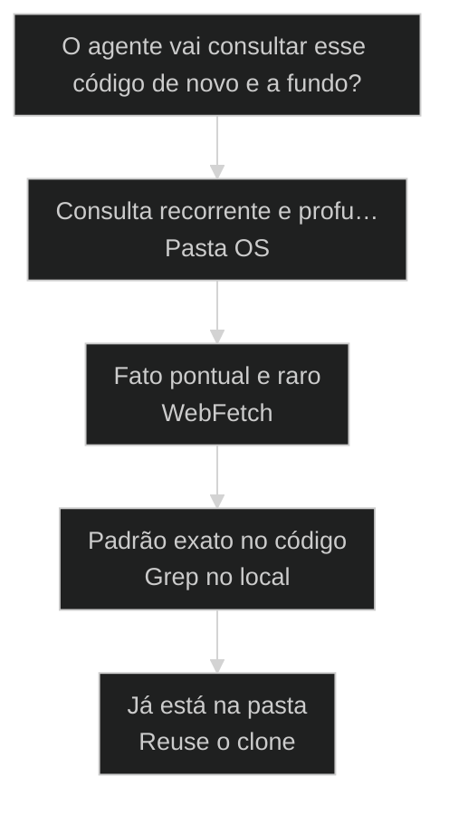
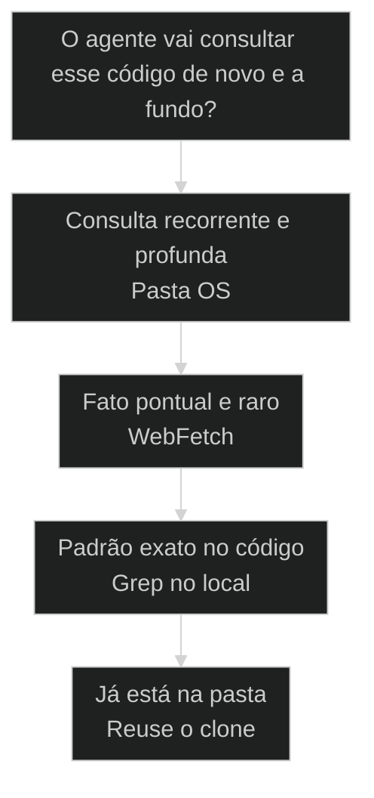

# [[Pasta OS]]: curadoria local de open-source para o agente

← [[38-code-anatomy-domain-decoder|Code Anatomy: engenharia reversa de código com /code-anatomist]] · ↑ [[modulos/Módulo 8 - Pipeline de Research|M8]] · ⌂ [[Cursos/AIOX Advanced/README|Curso]] · → [[40-pipeline-canonico-prd|Pipeline canônico: do nada ao PRD com stories prontas]]

## Mapa desta aula

Decisão-chave da aula — O agente vai consultar esse código de novo e a fundo?



> Leia o diagrama antes do texto longo. Depois volte e confira.

> Pedir ao agente que busque na web devolve o que o WebFetch encontrar na hora: lento, raso, refém da conexão. A Pasta OS clona os repositórios que importam para o disco e deixa o agente fazer Grep no código real. O repertório vira local, indexado e instantâneo.

**Objetivos de aprendizagem:**
- Nomear o que distingue uma consulta a repertório local curado (Pasta OS) de uma busca na web feita na hora (WebFetch). _(remember)_
- Distinguir curar, clonar, Grep e repertório dentro do fluxo da Pasta OS. _(understand)_
- Escolher quando curar um repositório na Pasta OS em vez de deixar o agente buscar na web. _(apply)_
- Explicar por que código local indexado reduz o ruído e a latência de uma consulta do agente. _(understand)_

---

## Repertório local: o código no disco, pronto pro Grep, não buscado na web

*Pasta OS AIOX · curadoria local de open-source*

Pedir ao agente que busque na web devolve o que o WebFetch achar na hora: raso, lento e refém da conexão. A Pasta OS clona os repositórios que importam para o disco e deixa o agente fazer Grep no código real. Quem só busca na web depende da sorte do retorno.

- **1**: pasta no disco com os repos que importam
- **Grep**: no código real, não WebFetch na web
- **1**: regra: curar antes, consultar depois

- **status**: pasta os
- **meta**: webfetch=raso e refem da conexao
- **meta**: pasta os=grep no codigo real
- **meta**: regra=curar antes, grep depois
- **ready**: ready to grep

**Legenda de cores**

Mapa semantico da Pasta OS

- **Curar** (signal): escolher quais repositórios merecem virar repertório local
- **Clonar** (insight): trazer o código real do open-source para o disco
- **Grep** (bench): varrer o código local em vez de pedir à web
- **Repertório** (action): a Pasta OS pronta para o agente consultar instantâneo
- **WebFetch** (pain): buscar na hora: raso, lento, refém da conexão

---

## Comece pela pergunta certa

Antes de listar as peças da Pasta OS, fixe a pergunta única: o agente vai precisar consultar esse código com frequência e profundidade? Se sim, deixar pra buscar na web não basta. A primeira ação é curar e clonar o repositório, não esperar o WebFetch resolver na hora.

**Como ler esta aula**

1. **A pergunta aparece**: Uma frase separa buscar na web de ter o repertório curado no disco.
2. **Cada peça mostra a cara**: Curar escolhe, clonar traz, Grep varre, repertório serve.
3. **Vê o caso real**: A Pasta OS é prática real do AIOX, distribuída ao vivo numa aula T2.
4. **Decide**: Dado um repositório, você aponta se ele merece virar repertório local ou se o WebFetch basta.

- **Objetivos da aula** (Nomear o que distingue repertório local curado de busca na web na hora.; Distinguir curar, clonar, Grep e repertório dentro da Pasta OS.; Escolher quando curar um repositório em vez de deixar o agente buscar na web.; Explicar por que código local indexado reduz o ruído e a latência.)
- **Onde você está?** (Começando: foque Mapa Simples e a analogia da estante.; Já usa AIOX: foque Casos Reais e a Decisão.; Vai montar a pasta: foque as Peças e as Métricas.)
- **Leitura prática**: Em cada bloco, procure uma resposta: estou pedindo pra web buscar na hora ou consultando código que já curei no disco? Quando cada caminho ajuda e quando atrapalha?

**Ritmo da aula**

A distinção fica clara quando cada peça tem definição curta, exemplo real do framework e o gosto de quando usar.

- G **Pergunta antes do detalhe**: Primeiro o critério que separa, depois cada peça da Pasta OS por dentro.
- 1 **Analogia que ancora**: WebFetch é mandar alguém procurar num arquivo público lá fora. Pasta OS é ter o livro na sua estante, pronto pra folhear.
- 2 **Caso real**: A Pasta OS foi distribuída ao vivo numa aula T2 do AIOX, com repo público, não teoria.
- 3 **Recap com decisão**: A aula fecha com o aluno decidindo se um repositório dele merece virar repertório local.

---

## A diferença sem jargão

Antes dos termos técnicos, a diferença é só isto: buscar na web manda o agente procurar lá fora e trazer o que achar na hora; a Pasta OS já tem o código real no disco, curado e clonado, pronto pro Grep varrer em milissegundos.

> **Em uma frase**: Buscar na web (WebFetch) manda o agente procurar lá fora: rápido de pedir, mas raso, lento e refém da conexão e do que o índice público devolver. A Pasta OS cura os repositórios que importam, clona o código real para o disco e deixa o agente fazer Grep no que já está ali. A regra muda: cura o repertório antes, consulta o código local depois, e a web vira exceção, não a fonte primária.

- **Curar é escolher** -> Não clonar tudo, mas decidir quais repositórios open-source merecem virar repertório. Curar é o gosto de saber o que vale ter no disco.
- **Clonar é trazer o código real** -> O repositório inteiro no disco, não um resumo da web. Sem clonar, o agente lê o que o WebFetch raspar da hora, não o código de verdade.
- **Grep varre o local** -> Com o código no disco, o agente faz Grep e acha o padrão em milissegundos. Onde o WebFetch ia de busca em busca, o Grep varre o arquivo real.
- **O repertório é a marca** -> A Pasta OS é o repertório local indexado: instantâneo, denso e independente da conexão. Sem ela, cada consulta recomeça do zero na web.
- **O erro caro** -> Deixar tudo pro WebFetch: pedir à web na hora o que devia estar no disco. Você espera, recebe raso e, se a conexão cai, fica sem nada.

**Diagrama principal: da escolha ao Grep**

1. **Curar**: Os repositórios open-source que o agente vai consultar com frequência.
2. **Clonar**: O código real desce para o disco, inteiro, não raspado da web.
3. **Grep**: O agente varre o código local e acha o padrão na hora.
4. **Repertório**: A Pasta OS curada serve resposta profunda, instantânea, offline.

**O que a Pasta OS evita**
- Pedir à web na hora o que devia estar no disco.
- Receber resposta rasa, raspada de um índice público.
- Ficar refém da conexão para consultar repertório.
- Recomeçar cada consulta do zero, sem código local.

**O que ela força**
- Curar quais repositórios merecem virar repertório.
- Clonar o código real para o disco antes de consultar.
- Fazer Grep no código local, denso e instantâneo.
- Manter o repertório pronto, indexado e offline.

---

## A analogia da estante

A forma mais rápida de fixar a diferença: buscar na web é mandar alguém procurar num arquivo público distante; a Pasta OS é ter o livro na sua estante, pronto pra folhear. Quem só manda buscar espera o mensageiro e aceita o que ele trouxer.

- **WebFetch = mandar buscar no arquivo público**: Você pede e espera: o mensageiro vai à biblioteca pública, copia o que achou e volta. Lento, depende do trânsito e ele só traz o que estava na prateleira de fora.
- **Clonar = trazer o livro pra casa**: Você escolhe o livro que importa e o traz inteiro pra sua estante. Agora o conteúdo é seu, no disco, não um resumo trazido de fora.
- **Grep = folhear a própria estante**: Com o livro na mão, você acha a passagem na hora, sem mandar ninguém buscar. O Grep varre o código local em milissegundos, a fundo e offline.
- **Pasta OS = a estante curada**: Não é qualquer livro: é a coleção que você curou porque vai consultar sempre. A Pasta OS é o repertório local, escolhido a dedo, pronto pra folhear. Estante sem curadoria é depósito.

> **E quando o WebFetch basta?**: Nem toda consulta pede estante. Procurar um fato pontual, raro, que você nunca mais vai consultar é busca na web por natureza, e clonar o repositório seria desperdício de disco e de curadoria. O erro é tratar o framework que você consulta toda semana como se fosse um fato de uma vez só. Pasta OS onde a consulta repete, WebFetch onde o fato é pontual.

---

## Buscar na web versus repertório local: o critério da recorrência

Esta é a confusão mais cara no início de quem monta o ambiente do agente. Os dois falam de o agente consultar código alheio, então parecem o mesmo trabalho. O critério da recorrência separa os dois: o agente vai consultar esse código de novo e a fundo, ou é um fato pontual de uma vez só?

**Buscar na web (WebFetch)**
- Pede à web na hora, recebe o que o índice devolver.
- Resposta rasa: o que estava exposto, não o código todo.
- Refém da conexão e da latência de cada requisição.
- Sem persistência: cada consulta recomeça do zero.

**Repertório local (Pasta OS)**
- Cura e clona o repositório antes de o agente consultar.
- Código real no disco, inteiro, não raspado.
- Grep instantâneo, denso e offline.
- Repertório persistido: consulta sempre o mesmo código.

> **A pergunta que separa**: Pergunte: o agente vai consultar esse código de novo e a fundo? Se não, deixe pro WebFetch: rápido e suficiente para um fato pontual. Se sim, é Pasta OS: cure, clone e deixe o agente fazer Grep no código local. Mandar buscar na web o que você consulta toda semana é pagar latência e rasura por reflexo.

- **Pasta OS com buscar na web**: Os dois deixam o agente consultar código alheio, então parecem o mesmo trabalho.
- **Clonar com baixar um arquivo solto**: Os dois trazem algo de fora para o disco, então parecem o mesmo passo.
- **Grep com pedir um resumo ao agente**: Os dois devolvem uma resposta sobre o código, então parecem a mesma busca.

---

## A Pasta OS existe de verdade no AIOX

A distinção não é teoria. A curadoria local de open-source é prática real do AIOX, distribuída ao vivo numa aula T2 com repo público. Estes dois casos mostram como o ambiente do agente troca o WebFetch pela Pasta OS antes de consultar código alheio.

- **Onde a curadoria local vive no AIOX**: O AIOX tem a Pasta OS: cura quais repositórios open-source importam, clona o código real para o disco e deixa o agente fazer Grep no que está ali. A curadoria local não é abstração: tem repo público, distribuído ao vivo numa aula T2, e troca o WebFetch pelo Grep no código. Players: Pasta OS, curadoria local, clone de repositório, Grep no código, WebFetch (a fonte rasa), repertório local, repo público T2.
- **O que muda a decisão**: A pergunta não é qual fonte é mais cômoda. É se o agente vai consultar esse código de novo e a fundo. Consulta recorrente e profunda pede Pasta OS com Grep. Fato pontual e raro, não: o WebFetch resolve sem encher o disco.

**Cada conceito num eixo**

A distinção vira sistema quando cada conceito tem definição, lar no fluxo e o tipo de consulta que resolve.

- **Curar**: Escolher quais repositórios open-source merecem virar repertório local. O gosto de saber o que vale ter no disco.
- **Clonar**: Trazer o código real e inteiro do repositório para o disco. O clone que vira a base do Grep.
- **Grep**: Varrer o código local e achar o padrão exato. A busca que substitui o WebFetch na hora.
- **Repertório**: A Pasta OS curada, indexada e offline. A consulta profunda e instantânea do agente.

**Colunas:** Conceito | Cura ou busca na hora? | Sinal de uso certo | Sinal de erro

- Curar: Cura ou busca na hora? | Escolhe os repositórios que o agente consulta sempre. | Clona tudo sem critério, lota o disco de ruído.
- Clonar: Cura ou busca na hora? | Código real e inteiro no disco, pronto pro Grep. | Confia no resumo raspado da web pela rede.
- Grep: Cura ou busca na hora? | Varre o código local e devolve a linha exata. | Manda o WebFetch buscar o que está no disco.
- Repertório: Cura ou busca na hora? | Consulta instantânea, profunda e offline. | Cada consulta recomeça do zero na web.

### Caso: A Pasta OS curada e distribuída ao vivo numa aula T2

A curadoria local não é metáfora de aula: o AIOX montou uma Pasta OS de open-source e a distribuiu ao vivo, com repositório público, durante uma aula T2. O agente passou a fazer Grep no código clonado em vez de mandar o WebFetch buscar na web.

- Começou como: Um agente que, para entender uma biblioteca, mandava o WebFetch buscar na web e recebia o que o índice público raspasse na hora.
- Virou: Uma Pasta OS curada com os repositórios que importam, clonados no disco, prontos para o Grep varrer o código real.
- Prova: MASTER-CO-21 registra a Pasta OS como curadoria local de open-source (t2-aula-5 CO-04, ouro), com repo público distribuído ao vivo durante a aula.
- Lição: Repertório local é prática real: tem curadoria, tem repo clonado e tem Grep no código, não busca na web por reflexo.

### Caso: O Grep no código local supera o WebFetch em profundidade e latência

Na visão de execução, a Pasta OS não troca a fonte por capricho: o Grep no código clonado devolve a linha exata, na hora e offline, enquanto o WebFetch devolve o que o índice público expôs, com latência de rede. Curar não é só guardar, é deixar a busca ser profunda.

- Começou como: Consultas que esperavam o WebFetch ir à rede e voltavam com o que estava exposto no índice, raso e dependente da conexão.
- Virou: Consultas que rodam Grep no código clonado e devolvem a linha exata do repositório, profundas, instantâneas e offline.
- Prova: MASTER-CO-21 define a Pasta OS como curadoria local para Grep > WebFetch (t2-aula-5 CO-04, ouro): o ganho é o Grep no código local sobre a busca na web.
- Lição: O Grep no local não é só mais rápido: lê o código real inteiro, não o resumo que o índice da web deixou à mostra.

---

## As peças da Pasta OS

A Pasta OS não é um diretório qualquer com repos jogados dentro. É um fluxo de peças nomeadas, da curadoria do que importa ao Grep no código. Cada peça fecha antes da próxima abrir.

**Fluxo da curadoria local**
As peças ordenadas que transformam open-source disperso em repertório local pronto pro Grep.
- **1. Curar**: Escolher quais repositórios open-source o agente vai consultar com frequência e profundidade.
- **2. Clonar**: Trazer o código real e inteiro de cada repositório para o disco.
- **3. Organizar**: Manter os repos numa Pasta OS clara para o agente alcançar e o Grep navegar.
- **4. Grep**: Varrer o código local em vez de pedir à web, devolvendo a linha exata.
- **5. Consultar**: O agente lê o código real no disco, denso e offline, como repertório.
- **6. Curar de novo**: Revisar o que entrou: o que o agente não consulta sai, o que ele consulta sempre fica.

**a curadoria fecha antes do Grep abrir**

1. **Curar**: O fluxo escolhe quais repositórios merecem virar repertório.
2. **Clonar**: O código real desce inteiro para o disco.
3. **Grep**: O agente varre o código local em vez de pedir à web.
4. **Repertório**: A consulta vira profunda e instantânea, peça por peça.

---

## Como curar, clonar e o Grep se combinam

Curar, clonar e Grep não são rivais; são camadas em sequência. A curadoria escolhe, o clone traz, o Grep varre. Entender a direção evita mandar o WebFetch buscar o que já está no disco.

- **1. Escolher (Curar)**: Quem decide o que entra na Pasta OS. A curadoria dos repositórios que o agente consulta sempre. É a única etapa que julga relevância antes de trazer qualquer código. [WHO, cura, repositórios]
- **2. Trazer (Clonar)**: O código real no disco. O clone que transforma o repositório distante em repertório local. O gate que separa repertório de busca na hora. [WHAT, clone, código real]
- **3. Varrer (Grep)**: Como o repertório vira resposta. O Grep no código local, com a linha exata, offline e na hora. Zero latência de rede, máxima profundidade. [HOW, grep, offline]

---

## Quando curar um repositório na Pasta OS?

Antes de clonar, decida se o repositório merece virar repertório local. O critério economiza disco e curadoria quando você escolhe pela recorrência da consulta, não pela vontade de já ter tudo no disco.

**Árvore de decisão**
_Responda pela recorrência da consulta antes de pensar em clonar o repositório._



- **Consulta recorrente e profunda** — O agente vai voltar a esse código e precisa do detalhe real, não de uma menção.
  → _Pasta OS_
  Ex.: Cure na Pasta OS: clone o repositório e deixe o agente fazer Grep no código local.
- **Fato pontual e raro** — É uma consulta única, rasa, que não vai se repetir.
  → _WebFetch_
  Ex.: Não precisa clonar. O WebFetch busca na hora sem encher o disco.
- **Padrão exato no código** — A consulta precisa da linha exata dentro do framework, não de um resumo.
  → _Grep no local_
  Ex.: Cure e clone para rodar Grep: só o código local devolve a linha exata, offline.
- **Já está na pasta** — O repositório pode já ter sido curado e clonado antes.
  → _Reuse o clone_
  Ex.: Cheque a Pasta OS antes de clonar de novo. Reuse o repo se já está ali.

**Gate:** Qual é o gate? — _Sem gate, você clona por reflexo ou aceita o WebFetch por pressa. Responda: a consulta é recorrente e profunda e o repo ainda não está na pasta? Se sim, cure e clone. Se não, WebFetch (pontual), Grep no que já clonou (padrão exato) ou reuse o clone existente._

> **Regra do critério único**: A escolha não é pela comodidade da fonte; é pela recorrência e profundidade da consulta. Se o agente consulta o código sempre e precisa do detalhe real, a Pasta OS é a peça. Se é um fato pontual, clonar é desperdício de disco e curadoria. Mandar o WebFetch buscar o que você consulta toda semana é pagar latência e rasura por reflexo, o erro mais caro do início.

---

## Rotas de consulta

Cada tipo de consulta tem um modo típico de buscar. Saber a rota evita decidir certo pela recorrência e materializar com a ferramenta errada.

#### Pasta OS para consulta recorrente e profunda
Quando o agente volta ao mesmo código open-source e precisa do detalhe real.
1. **Sinal: código open-source consultado com frequência e a fundo.
2. **Pergunta: o agente vai voltar a esse código ou é consulta única?
3. **Ação: curar e clonar o repositório na Pasta OS.
4. **Resultado: Grep no código local, instantâneo e offline.

#### Grep no local para a linha exata
Quando a consulta precisa do padrão exato dentro do código, não de um resumo.
1. **Sinal: consulta que exige a linha real do framework.
2. **Pergunta: preciso da linha exata ou de uma menção basta?
3. **Ação: rodar Grep no repositório já clonado na Pasta OS.
4. **Resultado: a linha exata do código, offline e na hora.

#### WebFetch para fato pontual e raro
Quando a consulta é única e não justifica clonar o repositório.
1. **Sinal: fato pontual que não vai se repetir.
2. **Pergunta: vou consultar isso de novo ou é uma vez só?
3. **Ação: deixar o WebFetch buscar na hora, sem clonar.
4. **Resultado: resposta rápida suficiente, sem encher o disco.

**Curar e clonar na Pasta OS**
Use quando o agente consulta o mesmo código open-source com frequência e profundidade.
- `git clone <repo>`: trazer o código real para a Pasta OS no disco.
- `organizar na pasta`: deixar o repo alcançável para o agente e o Grep navegar.

**Grep no código local**
Use quando a consulta precisa da linha exata dentro do código já clonado.
- `grep -r <padrão> pasta-os/`: varrer o código local e achar o padrão exato.
- `ler a linha real`: consultar o código de verdade, não um resumo raspado.

**Revisar a curadoria**
Use quando a Pasta OS cresce e alguns repos já não são consultados.
- `checar o que o agente consulta`: ver quais repos viram Grep de verdade.
- `podar o que não usa`: remover o repo que não é consultado, manter o repertório limpo.

---

## Modelos para ler melhor

Visualizações rápidas para o aluno comparar WebFetch, Pasta OS e Grep, os riscos de cada escolha e o grau de curadoria que cada caso exige.

- **Framework consultado toda semana**: alto (consulta recorrente e profunda pede Pasta OS curada.)
- **Padrão exato no código**: médio (clone para Grep achar a linha real, offline.)
- **Fato pontual e raro**: baixo (WebFetch basta, clonar seria desperdício de disco.)

- **Consulta recorrente no WebFetch**: lento (pagar latência e rasura por reflexo, refém da conexão.)
- **Pontual clonado na pasta**: ruído (encher o disco com repo que o agente nunca consulta.)
- **Padrão exato sem Grep local**: raso (aceitar a menção rasa da web em vez da linha exata.)

**Matriz de Decisão do Aluno**

Em dúvida, escolha a célula que melhor descreve a sua consulta.

- **Framework consultado sempre**: Pasta OS curada. Clone e Grep no código local.
- **Padrão exato dentro do código**: Grep no repo já clonado, a linha real offline.
- **Fato pontual e raro**: WebFetch na hora. Sem clonar, sem encher o disco.
- **Consulta que precisa do código real**: Clone antes de consultar, Grep no que está no disco.
- **Repo já curado antes**: Reuse o clone existente, não clone de novo.
- **Não sabe ainda**: Pergunte: vou consultar de novo e a fundo? Sim, Pasta OS.

- **Sinal de curadoria saudável**: repos que o agente consulta de verdade, clonados no disco / pasta organizada para o Grep navegar / tudo clonado sem critério, ou tudo no WebFetch por reflexo
- **Separação de etapas**: cura, clona, organiza, faz Grep e revisa a curadoria / curadoria e Grep em etapas separadas e rastreáveis / consulta na web antes de checar o que já está na pasta

---

## O que cada peça carrega

Cada peça da Pasta OS tem uma anatomia mínima. Saber o que cada uma guarda ajuda a reconhecer quando você está pulando uma peça ou usando a ferramenta errada.

- **Curar: a escolha**: A decisão de quais repositórios open-source viram repertório. Julgamento de relevância, não clone cego.
- **Clonar: o código real**: O repositório inteiro no disco. O gate que separa repertório de busca na hora.
- **Pasta OS: o repertório**: A coleção curada de repos no disco, organizada para o agente e o Grep navegarem.
- **Grep: a varredura**: A busca no código local que devolve a linha exata, offline. Onde a coluna do WebFetch ficava rasa, o Grep lê o real.
- **WebFetch: a fonte rasa**: A busca na web na hora: o que o índice expôs, refém da conexão. Consulta recorrente no WebFetch é reflexo, não repertório.

---

## Métricas da Pasta OS

Sem telemetria, a saúde da Pasta OS vira fé. Estas perguntas separam um repertório local confiável de uma pasta cheia de repos que o agente nunca consulta.

**Colunas:** Métrica | Pergunta | Sinal saudável | Sinal de risco

- Curadoria: Os repos da pasta são consultados de verdade pelo agente? | Cada repo vira Grep recorrente, não peso morto. | Pasta lotada de repos que ninguém consulta.
- Código real: O agente lê o código clonado ou o resumo da web? | Grep no código local, linha exata no disco. | WebFetch buscando o que já está na pasta.
- Recorrência: A consulta se repete o bastante para justificar o clone? | Repo recorrente clonado, fato pontual no WebFetch. | Clone de fato único enchendo o disco.
- Latência: A consulta roda no disco ou depende da rede? | Grep offline, instantâneo, sem refém da conexão. | Cada consulta esperando a rede do WebFetch.

---

## Quando resistir à Pasta OS

A distinção ajuda mais quando você resiste ao reflexo de clonar tudo. A curadoria local tem custo: disco, manutenção, o trabalho de podar o que não se consulta. Vale só quando a consulta paga.

**Quando curar na Pasta OS**
- O agente consulta o código open-source com frequência.
- A consulta precisa da linha exata, não de uma menção.
- A profundidade do código real justifica o disco gasto.
- O repo ainda não está na pasta e vai ser consultado sempre.

**Quando não curar**
- É um fato pontual e raro que não vai se repetir.
- O repo já está na pasta: reuse, não clone de novo.
- A consulta é rasa e o WebFetch resolve na hora.
- O custo de disco e manutenção supera o ganho da consulta.

---

## Exercício: decida a consulta

Pegue uma consulta real sua a código open-source e aplique o critério. O objetivo não é clonar tudo; é apontar se o repositório merece virar repertório na Pasta OS antes de mandar o agente buscar na web.

**Uma consulta, cinco perguntas**
```yaml
consulta:
  codigo: "qual repositorio open-source o agente vai consultar?"
  recorrente: "vai consultar de novo e a fundo? sim | nao"
  rota: "pasta_os | grep_local | webfetch"
  ferramenta: "git_clone+grep | grep | webfetch"
  gate: "por que nao a outra rota? (se pasta os, por que a recorrencia paga o disco?)"

```
*O acerto não é clonar tudo. É provar que você escolheu a rota pela recorrência da consulta e sabe justificar por que a outra custaria mais sem entregar mais profundidade.*

**Exemplo preenchido: um framework consultado toda semana versus um trecho de doc lido uma vez**

- **Código A**: Um framework open-source que o agente consulta toda semana para entender padrões internos.
- **Recorrente A**: Sim. O agente volta sempre e precisa da linha exata do código, não de uma menção.
- **Rota A**: Pasta OS. Clono o repositório, organizo na pasta e deixo o agente fazer Grep no código local.
- **Código B**: Um trecho de documentação que preciso confirmar uma única vez.
- **Rota B**: WebFetch. Fato pontual, raro, sem peso de recorrência: buscar na hora resolve.
- **Gate B**: Pasta OS nao se aplica: clonar um repo inteiro para um fato lido uma vez encheria o disco sem retorno.

- 1. **Consulta**: Descreva em uma frase qual código open-source o agente precisa consultar.
- 2. **Recorrente?**: Responda: o agente vai consultar isso de novo e a fundo, ou é um fato pontual?
- 3. **Rota**: Aponte Pasta OS (recorrente e profunda), Grep no local (padrão exato no código já clonado) ou WebFetch (fato pontual).
- 4. **Ferramenta**: Diga como faria: git clone e Grep para consulta recorrente, Grep no repo já clonado para padrão exato, WebFetch para o pontual.
- 5. **Gate**: Justifique por que não escolheu a outra rota. Para Pasta OS, diga por que a recorrência justifica o disco gasto.

**Funcionou se:**

- O aluno escolhe a rota pela recorrência da consulta, não pela comodidade da fonte.
- O aluno separa Grep no código local (repertório) de buscar na web na hora (WebFetch).
- O aluno define por que a recorrência justifica o disco quando escolhe a Pasta OS.

---

## Glossário da Pasta OS

Tradução dos termos para alguém que está vendo a distinção buscar na web versus repertório local pela primeira vez.

- **Pasta OS**: A curadoria local de open-source: os repositórios que importam, clonados no disco, prontos para o agente fazer Grep no código real.
- **WebFetch**: A busca na web na hora: o agente pede à rede e recebe o que o índice público expôs, raso e refém da conexão.
- **Curar**: Escolher quais repositórios open-source merecem virar repertório local, em vez de clonar tudo sem critério.
- **Clonar**: Trazer o código real e inteiro de um repositório para o disco, base do Grep local.
- **Grep**: Varrer o código local e devolver a linha exata, denso, instantâneo e offline, em vez de mandar buscar na web.
- **Repertório local**: A Pasta OS curada e indexada: a consulta profunda do agente ao código que está no disco, não na web.
- **Grep > WebFetch**: A regra da Pasta OS: a busca profunda no código local vence a busca rasa na web para o que o agente consulta sempre.
- **Repo público T2**: O repositório da Pasta OS distribuído ao vivo numa aula T2 do AIOX, prova de que a curadoria local é prática real.

> **Portão da aula**: A aula só está no padrão quando o aluno nomeia o que distingue repertório local curado (Pasta OS) de busca na web na hora (WebFetch), distingue fazer Grep no código real clonado (profundo, offline) de pedir à web na hora (raso, refém da conexão), e consegue apontar, para uma consulta real a código open-source, se ela exige a Pasta OS curada (consulta recorrente e profunda, via clone e Grep) ou um WebFetch pontual (fato raro) antes de mandar o agente buscar.

***


---

## Navegação

← [[38-code-anatomy-domain-decoder|Code Anatomy: engenharia reversa de código com /code-anatomist]] · ↑ [[modulos/Módulo 8 - Pipeline de Research|M8]] · ⌂ [[Cursos/AIOX Advanced/README|Curso]] · → [[40-pipeline-canonico-prd|Pipeline canônico: do nada ao PRD com stories prontas]]
