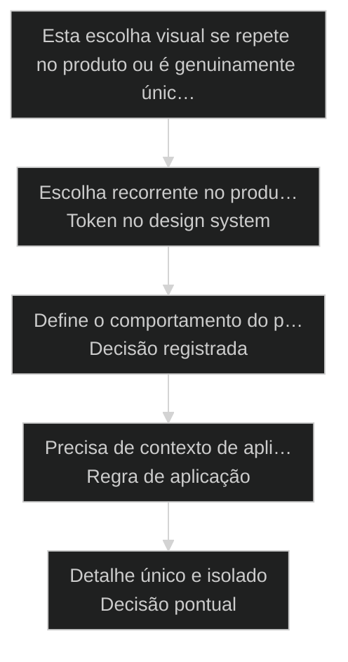
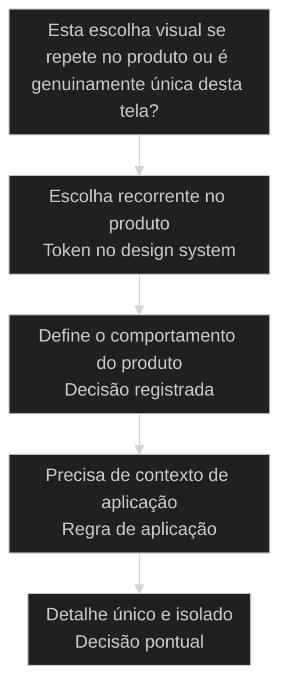

# [[Design System]] é decisão, não estética

← [[40-pipeline-canonico-prd|Pipeline canônico: do nada ao PRD com stories prontas]] · ↑ [[modulos/Módulo 9 - Design System|M9]] · ⌂ [[cursos/AIOX Advanced/README|Curso]] · → [[42-design-atomico-brad-frost|Design atomico: a interface se monta de peca pequena pra peca grande]]

## Conceitos

- [[DESIGN md|DESIGN.md]]

## Mapa desta aula

Decisão-chave da aula — Esta escolha visual se repete no produto ou é genuinamente únic…



> Leia o diagrama antes do texto longo. Depois volte e confira.

> Escolher cor por gosto a cada tela é decidir mil vezes a mesma coisa e errar diferente toda vez. Design system inverte isso: você decide uma vez como o produto se comporta, registra a decisão em token e regra, e toda tela seguinte herda. Design vira decisão de arquitetura, não pincelada por reflexo.

**Objetivos de aprendizagem:**
- Nomear o que transforma design de gosto na hora em decisão registrada: decidir uma vez, token e regra de aplicação. _(remember)_
- Distinguir design como decisão de arquitetura de design como estética por reflexo, pelo que cada um produz quando uma tela nova aparece. _(understand)_
- Escolher, diante de uma escolha visual recorrente, se ela vira token no design system ou fica decisão pontual da tela. _(apply)_
- Explicar por que decidir uma vez e registrar em token reduz retrabalho e mantém o produto coerente entre telas. _(understand)_

---

## Design system: decida uma vez, registre em token, deixe toda tela herdar

*Design system AIOX · decisão registrada, não estética por gosto*

Escolher cor, espaço e tamanho por gosto a cada tela é decidir mil vezes a mesma coisa e errar diferente toda vez. Design system inverte: você decide uma vez como o produto se comporta, registra a decisão em token e regra, e a próxima tela herda em vez de redecidir. Design deixa de ser pincelada por reflexo e vira decisão de arquitetura.

- **1**: decisão tomada uma vez, não a cada tela
- **token**: a decisão virada valor que toda tela herda
- **0**: telas redecidindo cor e espaço no gosto

- **status**: design system
- **meta**: estetica por gosto=decidir mil vezes
- **meta**: design system=decidir uma vez
- **meta**: regra=decisao vira token, token vira heranca
- **ready**: ready to decide

**Legenda de cores**

Mapa semantico do design system como decisao

- **Decisão** (signal): definir uma vez como o produto se comporta, não pincelar por gosto
- **Token** (insight): a decisão registrada como valor reutilizável, não hardcode por tela
- **Regra** (bench): a fronteira que diz quando aplicar cada token, não improviso
- **Herança** (action): toda tela nova consome a decisão já tomada, sem redecidir
- **Estética por gosto** (pain): escolher cor e espaço na hora, errando diferente em cada tela

---

## Da cohort: quando o design system vira discussão de verdade

*T1 + T2 · WhatsApp*

Realidade do grupo Advanced — cicatriz, não slide.

No Advanced, o design system só vira conversa séria depois que o setup
e os agentes param de ser o único assunto — e aí explode: monorepo com vários
produtos, tokens, Storybook, 'dá pra usar o DS do Alan no meu mentor-hub?'.

Campo: aluno quer um **sistema base** e produtos derivados (mesmo dono, várias
marcas/apps). A resposta pedagógica desta aula: design system é **decisão
repetível**, não pasta de componentes bonitos. Se cada app inventa botão, você
não tem DS — tem galeria de arrependimentos.

Rafael e a turma marcaram o momento: quem ainda duvidava que DS importa, viu o
efeito composto no código ruim que o processo impede de entregar.

> **Âncora de campo**: DS não é estética de [[Squad|squad]] — é freio de absurdo visual em escala.

> **Materiais / FAQ**: Aulas 42–43, 56–57 · materials na cohort se houver design-md.zip / Storybook packs

---

## Comece pela pergunta certa

Antes de falar de token ou paleta, fixe a pergunta única: esta escolha visual é gosto da hora ou decisão que vale pro produto inteiro? Se você escolhe cor por reflexo a cada tela, está decidindo mil vezes e errando diferente. A primeira ação não é pintar, é decidir uma vez e registrar a decisão.

**Como ler esta aula**

1. **A pergunta aparece**: Uma frase separa gosto da hora de decisão de produto.
2. **Cada peça mostra a cara**: Decisão decide uma vez, token registra, regra delimita, herança propaga.
3. **Vê o caso real**: O AIOX trata design como decisão: design-ops e [[DESIGN md|DESIGN.md]] são prática real do repositório.
4. **Decide**: Diante de uma escolha visual recorrente, você aponta se ela vira token ou fica pontual.

- **Objetivos da aula** (Nomear o que transforma design de gosto em decisão: decidir uma vez, token e regra.; Distinguir design como decisão de arquitetura de design como estética por reflexo.; Escolher se uma escolha visual recorrente vira token ou fica decisão pontual.; Explicar por que decidir uma vez reduz retrabalho e mantém o produto coerente.)
- **Onde você está?** (Começando: foque Mapa Simples e a analogia do código de obras.; Já usa AIOX: foque Casos Reais e a Decisão.; Vai montar um produto: foque os Tokens e as Métricas.)
- **Leitura prática**: Em cada bloco, procure uma resposta: esta escolha visual eu decido uma vez e registro, ou estou pintando no gosto e vou errar diferente na próxima tela?

**Ritmo da aula**

A diferença fica clara quando cada peça tem definição curta, exemplo real do AIOX e o gosto de quando ela entra.

- G **Pergunta antes do detalhe**: Primeiro o critério que separa gosto de decisão, depois token, regra e herança por dentro.
- 1 **Analogia que ancora**: Estética por gosto é cada pedreiro escolhendo a medida do tijolo. Design system é o código de obras decidido uma vez que toda parede segue.
- 2 **Caso real**: O AIOX trata design como decisão: o squad design-ops e o [[DESIGN md|DESIGN.md]] registram a decisão visual como token e regra.
- 3 **Recap com decisão**: A aula fecha com você decidindo se uma escolha visual sua vira token ou fica pontual.

---

## A diferença sem jargão

Antes dos termos técnicos, a diferença é só isto: estética por gosto escolhe cor, espaço e tamanho na hora, em cada tela, e erra diferente toda vez; design system decide uma vez como o produto se comporta, registra essa decisão em token e regra, e a próxima tela herda em vez de redecidir.

> **Em uma frase**: Estética por gosto trata cada tela como uma decisão nova: você escolhe a cor que parece bonita hoje, o espaço que cabe agora, o tamanho que deu na telha. Mil telas, mil decisões, erro diferente em cada. Design system inverte a ordem: a decisão acontece uma vez, vira token (o valor registrado) e regra (quando aplicar), e cada tela nova consome a decisão já tomada. A regra muda: decida uma vez, registre, e deixe herdar, em vez de pincelar por reflexo.

- **Decisão decide uma vez** -> Você define como o produto se comporta visualmente uma vez só. Sem clarificar a decisão, cada tela vira um palpite novo que contradiz o anterior.
- **Token registra a decisão** -> A decisão vira um valor reutilizável, não um hardcode por tela. O token é a memória da decisão: toda tela puxa dele em vez de reinventar.
- **Regra delimita quando aplicar** -> Olhar a tela e improvisar devolve incoerência. A regra diz qual token entra em qual contexto: veredito, não gosto da hora.
- **Herança propaga sem redecidir** -> A próxima tela não recomeça do zero. Ela herda a decisão registrada. Decidir uma vez paga em toda tela seguinte.
- **O erro caro** -> Escolher tudo no gosto, a cada tela: você decide mil vezes a mesma coisa e erra diferente toda vez. Coerência morre e o retrabalho vira rotina.

**Diagrama principal: do gosto à decisão registrada**

1. **Decisão**: Você decide uma vez como o produto se comporta visualmente.
2. **Token**: A decisão vira valor registrado e reutilizável.
3. **Regra**: A fronteira diz quando cada token entra em jogo.
4. **Herança**: Toda tela nova consome a decisão sem redecidir no gosto.

**O que o design system evita**
- Escolher cor e espaço no gosto, tela a tela.
- Decidir mil vezes a mesma coisa e errar diferente.
- Hardcodar valor visual em cada componente solto.
- Telas que contradizem umas às outras por improviso.

**O que ele força**
- Decidir uma vez como o produto se comporta.
- Registrar a decisão em token reutilizável.
- Delimitar com regra quando cada token entra.
- Deixar toda tela nova herdar a decisão tomada.

---

## A analogia do código de obras

A forma mais rápida de fixar a diferença: estética por gosto é cada pedreiro escolhendo a medida do tijolo na hora; design system é o código de obras decidido uma vez que toda parede segue. Quem deixa cada pedreiro decidir refaz a obra quando as paredes não encaixam.

- **Decisão = aprovar o código de obras**: Antes da primeira parede, o engenheiro decide a medida padrão de uma vez. Não é gosto de cada pedreiro: é a decisão registrada que vale pra obra inteira.
- **Token = a medida padrão registrada**: A medida fica escrita na planta, não na cabeça de cada um. Todo pedreiro puxa do mesmo valor em vez de chutar o próprio tijolo.
- **Regra = onde cada medida entra**: O código de obras não diz só o tamanho: diz onde aplicar cada um. Parede de carga puxa uma medida, divisória outra. Veredito, não improviso na hora.
- **Herança = a próxima parede já segue**: Decidido o código e escritas as medidas, a parede seguinte não redecide nada: ela herda o padrão. Parede sem código padrão é retrabalho garantido quando o prédio não fecha.

> **E quando dá pra decidir pontual?**: Nem toda escolha visual precisa virar token. Um detalhe único de uma tela isolada, que não se repete em lugar nenhum, pode ser decisão pontual: registrar como token só agrega cerimônia. O erro é o contrário: tratar uma escolha que se repete em dez telas como detalhe pontual e redecidir dez vezes no gosto. Token onde a decisão se repete, pontual onde ela é genuinamente única.

---

## Decisão versus estética: o critério da repetição

Esta é a confusão mais cara no design de produto. Os dois parecem trabalho de design: escolher cor bonita parece progresso, decidir token parece burocracia. O critério da repetição separa os dois: esta escolha vai aparecer de novo em outra tela, ou é genuinamente única?

**Estética por gosto**
- Escolhe a cor bonita de hoje, sem registrar.
- Mostra tela bonita cedo, em cima de decisão solta.
- Descobre a incoerência quando junta as telas.
- Refaz tudo quando uma tela contradiz a outra.

**Design system (decisão registrada)**
- Decide uma vez como o produto se comporta.
- Registra a decisão em token antes de espalhar.
- Delimita com regra qual token entra onde.
- Deixa toda tela herdar antes de pintar a próxima.

> **A pergunta que separa**: Pergunte: esta escolha visual se repete no produto ou é genuinamente única desta tela? Se é um detalhe único e isolado, decisão pontual basta. Se vai reaparecer em outra tela, é decisão de produto: decida uma vez, registre em token, delimite com regra e deixe herdar. Tratar uma escolha recorrente como gosto da hora é pagar incoerência e retrabalho por reflexo, o erro mais caro do design de produto.

- **Design system com decorar a tela bonita**: Os dois mexem em cor e espaço, então parecem o mesmo trabalho.
- **Token com hardcode de cor na tela**: Os dois guardam um valor de cor, então parecem o mesmo passo.
- **Regra de aplicação com gosto do designer**: Os dois dizem onde a cor vai, então parecem a mesma escolha.

---

## Design como decisão existe de verdade no AIOX

O princípio não é teoria. No AIOX, design é tratado como decisão de arquitetura: o squad design-ops registra a decisão visual e o DESIGN.md guarda token e regra, em vez de cada tela escolher cor no gosto. Estes dois casos mostram como o ambiente troca a estética por reflexo pela decisão registrada uma vez.

- **Onde design como decisão vive no AIOX**: O AIOX trata design como decisão de arquitetura: o squad design-ops decide e governa, o DESIGN.md registra a decisão em token e regra, e a convenção design-md-convention mantém o registro herdável. A separação não é abstração: é squad, artefato e regra existindo no repositório, para que toda tela puxe da mesma decisão em vez de pintar no gosto. Players: design-ops, DESIGN.md, tokens, atomic-design-taxonomy, design-md-convention, render-contract.
- **O que muda a decisão**: A pergunta não é qual cor fica mais bonita nesta tela. É se a escolha se repete no produto ou é única. Escolha recorrente vira token registrado e herdável. Detalhe genuinamente único de uma tela isolada pode ficar pontual: virar token só agregaria cerimônia.

**Cada peça num eixo**

A decisão vira sistema quando cada peça tem definição, lar na ordem e o que ela entrega antes da próxima abrir.

- **Decisão**: Definir uma vez como o produto se comporta. A peça que evita decidir mil vezes no gosto.
- **Token**: A decisão registrada como valor reutilizável. O que toda tela puxa em vez de hardcodar.
- **Regra**: Onde cada token entra. A peça que devolve veredito em vez de improviso por tela.
- **Herança**: A próxima tela consome a decisão. A peça que fecha o sistema em coerência.

**Colunas:** Peça | Decisão ou gosto? | Sinal de uso certo | Sinal de erro

- Decisão: Decisão ou gosto? | Define uma vez como o produto se comporta visualmente. | Reescolhe cor e espaço no gosto a cada tela.
- Token: Decisão ou gosto? | Registra a decisão como valor reutilizável. | Hardcoda a cor solta dentro de cada componente.
- Regra: Decisão ou gosto? | Delimita qual token entra em qual contexto. | Improvisa a aplicação no olho, tela a tela.
- Herança: Decisão ou gosto? | A próxima tela puxa a decisão registrada. | Cada tela recomeça a escolha visual do zero.

### Caso: O squad design-ops trata design como decisão, não pincelada

A separação não é metáfora de aula: o AIOX tem um squad inteiro, o design-ops, dedicado a tratar design como decisão de arquitetura. As escolhas visuais não nascem no gosto de cada tela: nascem como decisão registrada, com regras próprias de extração e tokens que valem pro produto, não pra uma tela só.

- Começou como: Design tratado como estética por gosto: cada tela escolhendo cor e espaço na hora, sem decisão registrada que valesse pro produto inteiro.
- Virou: Um squad design-ops que trata design como decisão de arquitetura, com regras de extração e tokens registrados em vez de gosto tela a tela.
- Prova: O AIOX mantém o squad design-ops com regras próprias (atomic-design-taxonomy, design-md-convention, tokens) no repositório: design é decisão governada, não pincelada por reflexo.
- Lição: Design de produto é decisão: tem squad, regra e token registrados, não escolha de cor por gosto a cada tela.

### Caso: O DESIGN.md registra a decisão visual em token e regra

Na visão de execução, a decisão de design não pode ficar na cabeça de quem desenhou: precisa virar artefato que toda tela consome. No AIOX, o DESIGN.md é onde a decisão visual fica registrada como token e regra, extraída uma vez e herdada por quem gera as telas. Decidir não basta, tem que registrar onde herda.

- Começou como: Decisão visual presa na cabeça de quem desenhou a tela, sem artefato que as outras telas pudessem herdar.
- Virou: Um DESIGN.md que registra a decisão como token e regra, extraído uma vez e consumido por quem gera cada tela seguinte.
- Prova: O AIOX trata o DESIGN.md como o artefato canônico da decisão de design (extração com tokens e render-contract), governado pela regra design-md-convention: a decisão fica registrada, não na memória de uma pessoa.
- Lição: O DESIGN.md não é só um documento: é onde a decisão de design vira token e regra que toda tela herda.

---

## As peças do design system

O design system não é um amontoado de cores escolhidas em qualquer ordem. É uma sequência de peças nomeadas, da decisão à herança. Cada peça fecha antes da próxima abrir, e a decisão vem antes da pincelada sempre.

**Fluxo do design system**
As peças ordenadas que transformam uma escolha visual de gosto da hora em decisão registrada e herdável por toda tela.
- **1. Decidir uma vez**: Definir como o produto se comporta visualmente uma vez, não tela a tela.
- **2. Registrar em token**: Virar a decisão num valor reutilizável que toda tela puxa.
- **3. Delimitar com regra**: Dizer qual token entra em qual contexto, não no improviso.
- **4. Tornar herdável**: Deixar o artefato (DESIGN.md) pronto para a próxima tela consumir.
- **5. Propagar por herança**: Cada tela nova puxa a decisão registrada em vez de redecidir.
- **6. Revisar a coerência**: Conferir se as telas seguem a decisão antes de espalhar mais telas.

**a decisão fecha antes da tela puxar**

1. **Decisão**: O fluxo decide uma vez como o produto se comporta.
2. **Token**: A decisão vira valor registrado e reutilizável.
3. **Regra**: A fronteira diz qual token entra em qual contexto.
4. **Herança**: Toda tela nova consome a decisão sem redecidir.

---

## Como decisão, token e regra se combinam

Decidir, registrar e delimitar não são rivais; são camadas em sequência. A decisão define o comportamento, o token guarda o valor, a regra diz onde aplicar. Entender a direção evita pintar a tela que a decisão ainda nem fixou.

- **1. Decidir (a decisão)**: Quem define como o produto se comporta visualmente. A escolha tomada uma vez que vale pro produto inteiro. É a única camada que parte do gosto bruto para a decisão registrada. [WHAT, decisao, uma vez]
- **2. Registrar (o token)**: O valor que guarda a decisão. O token que toda tela puxa em vez de hardcodar. O gate que separa coerência herdável de cor solta espalhada. [WHERE, token, registro]
- **3. Delimitar (a regra)**: Como a decisão vira aplicação certa. A regra que diz qual token entra em qual contexto, com a herança propagando. Zero improviso, máxima coerência. [HOW, regra, heranca]

---

## Vira token ou fica pontual?

Antes de registrar qualquer cor, decida se a escolha visual merece virar token ou fica decisão pontual da tela. O critério economiza tempo quando você escolhe pela repetição da escolha, não pela vontade de já ver uma tela bonita.

**Árvore de decisão**
_Responda pela repetição da escolha antes de pensar na cor que parece bonita._



- **Escolha recorrente no produto** — A mesma escolha visual vai reaparecer em outras telas.
  → _Token no design system_
  Ex.: Vire token: decida uma vez, registre no DESIGN.md e deixe toda tela herdar.
- **Define o comportamento do produto** — A escolha diz como o produto se comporta, não só como esta tela fica.
  → _Decisão registrada_
  Ex.: Decida no design system: comportamento de produto é decisão registrada, não gosto da tela.
- **Precisa de contexto de aplicação** — O mesmo valor entra diferente conforme o contexto da tela.
  → _Regra de aplicação_
  Ex.: Escreva a regra: delimite qual token entra em qual contexto antes de espalhar.
- **Detalhe único e isolado** — É um detalhe genuinamente único de uma tela que não se repete.
  → _Decisão pontual_
  Ex.: Deixe pontual: virar token só agrega cerimônia onde a escolha não herda.

**Gate:** Qual é o gate? — _Sem gate, você tokeniza tudo por insegurança ou pinta tudo no gosto por reflexo. Responda: a escolha se repete? Se sim, vira token. Se define o comportamento do produto, é decisão registrada. Se o valor muda por contexto, escreva a regra. Se é detalhe único e isolado, deixe pontual._

> **Regra do critério único**: A escolha não é pela pressa de ver uma tela bonita; é pela repetição da escolha e pelo comportamento do produto. Se a escolha se repete, o token é a peça. Se é um detalhe único e isolado, tokenizar é cerimônia à toa. Pintar no gosto uma escolha que se repete é pagar incoerência e retrabalho por reflexo, o erro mais caro do design de produto.

---

## Rotas de registro

Cada tipo de escolha visual tem um modo típico de entrar no design system. Saber a rota evita decidir certo pela repetição e registrar com a peça errada.

#### Token para escolha que se repete no produto
Quando a mesma cor, espaço ou tamanho vai reaparecer em outras telas.
1. **Sinal: escolha visual que volta a aparecer em telas diferentes.
2. **Pergunta: isso se repete ou é único desta tela?
3. **Ação: decidir uma vez e registrar a decisão como token.
4. **Resultado: valor que toda tela herda sem redecidir no gosto.

#### Regra para o token que entra diferente por contexto
Quando o mesmo valor precisa de critério de quando aplicar.
1. **Sinal: token que entra diferente conforme o contexto da tela.
2. **Pergunta: qual contexto puxa qual token?
3. **Ação: escrever a regra de aplicação antes de espalhar.
4. **Resultado: aplicação por veredito, não por improviso na hora.

#### Decisão pontual para o detalhe que não se repete
Quando a escolha é genuinamente única de uma tela isolada.
1. **Sinal: detalhe único, sem repetição em outras telas.
2. **Pergunta: preciso herdar isso ou é só desta tela?
3. **Ação: decidir pontual, sem virar token nem regra.
4. **Resultado: decisão da tela sem cerimônia de sistema à toa.

**Extrair a decisão visual**
Use quando já existe uma referência visual e a decisão precisa virar token.
- `/design-md <url>`: extrair a decisão visual da referência como DESIGN.md com tokens.
- `DESIGN.md (tokens + render-contract)`: registrar a decisão em token e regra herdável.

**Decidir como o produto se comporta**
Use quando a decisão visual define o comportamento do produto, não só a tela.
- `/DS:design-chief`: orquestrar a decisão de design no squad design-system.
- `/DOPS:design-chief`: registrar token e regra com o design-ops.

**Deixar a tela herdar a decisão**
Use quando a decisão está registrada e cada tela precisa consumir o mesmo token.
- `design-md-convention`: manter o DESIGN.md no padrão herdável pela convenção.
- `tokens (puxados por tela)`: cada tela consome o token registrado em vez do gosto.

---

## Modelos para ler melhor

Visualizações rápidas para o aluno comparar estética por gosto com decisão registrada, os riscos de cada escolha e o grau de tokenização que cada escolha visual exige.

- **Cor de marca que se repete em tudo**: alto (escolha que volta em toda tela pede token registrado.)
- **Espaçamento padrão de componente**: médio (token de espaço antes de espalhar pelas telas.)
- **Detalhe único de uma tela isolada**: baixo (decisão pontual basta, token seria cerimônia à toa.)

- **Pintar no gosto escolha que se repete**: incoerência (decidir mil vezes e errar diferente em cada tela.)
- **Tokenizar detalhe genuinamente único**: cerimônia (registrar o que não herda, gastando atenção à toa.)
- **Token sem regra de contexto**: ambíguo (o mesmo valor aplicado errado por falta de regra.)

**Matriz de Decisão do Aluno**

Em dúvida, escolha a célula que melhor descreve a sua escolha visual.

- **Escolha que se repete**: Token. Decide uma vez, registra no DESIGN.md e deixa herdar.
- **Comportamento do produto**: Decisão registrada. Define como o produto se comporta, não a tela.
- **Valor que muda por contexto**: Regra de aplicação. Delimita qual token entra onde.
- **Detalhe único e isolado**: Decisão pontual. Sem token, sem cerimônia de sistema.
- **Referência visual existente**: Extrair com /design-md antes de pintar no gosto.
- **Não sabe ainda**: Pergunte: isso se repete? Sim, vira token.

- **Sinal de design saudável**: escolha recorrente registrada em token antes de espalhar / decisão tomada uma vez antes de pintar a tela / cor escolhida no gosto, tela a tela, por reflexo
- **Separação de peças**: decide, registra em token, delimita com regra e deixa herdar / decisão e token em peças separadas e rastreáveis / pintar a tela antes de registrar a decisão

---

## O que cada peça carrega

Cada peça do design system tem uma anatomia mínima. Saber o que cada uma entrega ajuda a reconhecer quando você está pulando uma peça ou usando a ferramenta errada.

- **Decisão: o comportamento**: A escolha de como o produto se comporta visualmente. Definição uma vez, não gosto tela a tela.
- **Token: o valor registrado**: A decisão virada valor reutilizável. O gate que separa coerência herdável de cor solta.
- **Regra: o contexto**: Onde cada token entra. O veredito de aplicação em vez do improviso na hora.
- **DESIGN.md: o registro**: O artefato canônico que guarda token e regra. A decisão herdável, não a memória de uma pessoa.
- **Herança: a propagação**: A tela puxando a decisão registrada. Pintar no gosto em vez de herdar é reflexo, não sistema.

---

## Métricas do design system

Sem telemetria, a saúde do design system vira fé. Estas perguntas separam um produto fundado em decisão registrada de um produto que pintou tela a tela no gosto.

**Colunas:** Métrica | Pergunta | Sinal saudável | Sinal de risco

- Decisão única: A escolha visual foi decidida uma vez? | O comportamento do produto foi definido e registrado. | Cada tela reescolheu cor e espaço no gosto.
- Tokenização: A escolha recorrente virou token? | Valor registrado e puxado por toda tela. | Cor hardcodada solta dentro de cada componente.
- Regra de contexto: Há regra de quando aplicar cada token? | Contexto de aplicação delimitado e rastreável. | Token aplicado no olho, diferente em cada tela.
- Herança: As telas novas herdam a decisão? | Toda tela puxa o token do DESIGN.md. | Tela nova recomeça a escolha visual do zero.

---

## Quando deixar pontual

O design system ajuda mais quando você resiste ao reflexo de tokenizar tudo. Registrar tem custo: a decisão, o token, a regra, a manutenção. Vale só quando a escolha se repete e a coerência entre telas cobra.

**Quando registrar no design system**
- A escolha visual se repete em várias telas.
- A escolha define como o produto se comporta.
- A incoerência entre telas já custa retrabalho.
- O valor entra diferente por contexto e pede regra.

**Quando deixar pontual**
- É um detalhe único de uma tela isolada.
- A escolha não se repete em lugar nenhum.
- Registrar agregaria só cerimônia, sem herança.
- O custo de manter o token supera o ganho de herdar.

---

## Exercício: decida o token

Pegue uma escolha visual recorrente de um produto seu e aplique o critério. O objetivo não é tokenizar tudo por reflexo; é apontar se a escolha vira token no design system ou fica decisão pontual antes de pintar a próxima tela no gosto.

**Uma escolha, cinco perguntas**
```yaml
escolha_visual:
  descricao: "qual cor, espaco ou tamanho voce vai avaliar?"
  repete: "se repete em outras telas? sim | nao"
  peca: "token | regra | decisao_pontual"
  registro: "onde a decisao fica registrada (ex: design.md) + nome do token"
  gate: "por que nao pintar no gosto? (se token, por que a repeticao paga decidir uma vez?)"

```
*O acerto não é tokenizar tudo. É provar que você escolheu a peça pela repetição da escolha e sabe justificar por que pintar no gosto custaria mais incoerência.*

**Exemplo preenchido: uma cor de marca que aparece em todo botão versus um degradê único de uma tela de boas-vindas**

- **Escolha A**: A cor primária da marca, que aparece em todo botão de ação do produto.
- **Repete A**: Sim, em todas as telas com botão de ação. Escolha recorrente do produto.
- **Peça A**: Token. Decide uma vez, registra no DESIGN.md e todo botão herda a cor.
- **Escolha B**: Um degradê decorativo único da tela de boas-vindas, que não aparece em nenhuma outra.
- **Peça B**: Decisão pontual. O degradê é único desta tela: virar token só agregaria cerimônia.
- **Gate B**: Tokenizar nao se aplica: registrar um degrade que nao se repete em nenhuma outra tela gastaria manutencao sem herdar para lugar nenhum.

- 1. **Escolha**: Descreva em uma frase qual escolha visual (cor, espaço, tamanho) você está avaliando.
- 2. **Repete?**: Responda: essa escolha se repete em outras telas, ou é genuinamente única desta tela?
- 3. **Peça**: Aponte a peça: token (escolha recorrente), regra (entra diferente por contexto) ou decisão pontual (detalhe único).
- 4. **Registro**: Se vira token, diga onde a decisão fica registrada para herdar (ex.: DESIGN.md) e qual nome o token teria.
- 5. **Gate**: Justifique por que não pintou direto no gosto. Para o token, diga por que a repetição justifica decidir uma vez.

**Funcionou se:**

- O aluno escolhe a peça pela repetição da escolha, não pela pressa de ver a tela bonita.
- O aluno separa decidir uma vez (design system) de pintar no gosto (estética por reflexo).
- O aluno aponta onde a decisão fica registrada e justifica por que a repetição paga o token.

---

## Glossário do design system como decisão

Tradução dos termos para alguém que está vendo a diferença decidir uma vez versus pintar no gosto pela primeira vez.

- **Design system**: A decisão registrada de como o produto se comporta visualmente: decidir uma vez, em token e regra, e deixar toda tela herdar.
- **Decisão de design**: A escolha de como o produto se comporta, tomada uma vez, não o gosto reescolhido tela a tela.
- **Token**: A decisão visual registrada como valor reutilizável que toda tela puxa, em vez de hardcode por componente.
- **Regra de aplicação**: A fronteira que diz qual token entra em qual contexto, veredito em vez de improviso na hora.
- **Herança**: A próxima tela consumindo a decisão registrada, sem redecidir a escolha visual no gosto.
- **DESIGN.md**: O artefato canônico do AIOX que registra a decisão de design em token e regra, governado pela convenção design-md-convention.
- **design-ops**: O squad do AIOX que trata design como decisão de arquitetura, com regras de extração e tokens próprios.
- **Estética por gosto**: Escolher cor, espaço e tamanho na hora, tela a tela: decidir mil vezes a mesma coisa e errar diferente toda vez.

> **Portão da aula**: A aula só está no padrão quando o aluno nomeia as peças do design system (decisão, token, regra e herança), distingue decidir uma vez e registrar (fundar em decisão de arquitetura) de pintar no gosto tela a tela (fundar na estética por reflexo), e consegue apontar, para uma escolha visual recorrente real, se ela vira token no design system ou fica decisão pontual antes de pintar a próxima tela.

***


---

## Navegação

← [[40-pipeline-canonico-prd|Pipeline canônico: do nada ao PRD com stories prontas]] · ↑ [[modulos/Módulo 9 - Design System|M9]] · ⌂ [[cursos/AIOX Advanced/README|Curso]] · → [[42-design-atomico-brad-frost|Design atomico: a interface se monta de peca pequena pra peca grande]]
