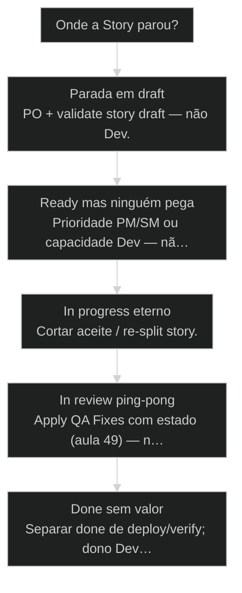
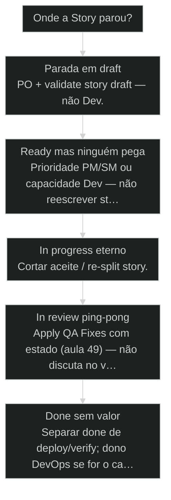

# Ciclo de vida do Story: [[Draft]] → [[Ready]] → in progress → in review → [[Done]]

← [[46-etapas-de-desenvolvimento|Briefing, PRD, Stories: as 3 etapas antes do código]] · ↑ [[modulos/Módulo 3 - Ciclo SDC|M3]] · ⌂ [[Cursos/AIOX Advanced/README|Curso]] · → [[48-quality-gate-completo|Quality Gate: QA + Apply QA Fixes + CodeRabbit]]

## Mapa desta aula

Decisão-chave da aula — Onde a Story parou?

> Leia o diagrama antes do texto longo. Depois volte e confira.

> Quem move cada transição, o que faz a Story travar, e por que pular gate vira retrabalho garantido.

**Objetivos de aprendizagem:**
- Nomear os 5 estados do Story e o dono típico de cada transição. _(remember)_
- Explicar por que draft→ready é o gate crítico e o que ele bloqueia. _(understand)_
- Aplicar o gate draft→ready antes de qualquer desenvolvimento numa Story real. _(apply)_
- Diagnosticar Story travada: falta de dono, aceite ou evidência na seta certa. _(analyze)_

---

## O que você consegue no fim desta aula

*G · Destino*

Destino claro antes de qualquer fluxo de status no board.

Ao final desta aula você vai conseguir três coisas concretas:

1. Desenhar de cabeça os **cinco estados** e a seta entre eles.
2. Nomear **quem move cada seta** no teu time (mesmo se for você com chapéus).
3. Olhar uma Story parada e dizer **por que travou** — sem "está urgente".

Se você sair daqui ainda tratando Story como post-it sentimental, a aula falhou.
Story é **entidade com estado**. Estado sem dono é monólogo com git.

- **Objetivos da aula** (Nomear 5 estados e donos de transição; Aplicar validate (draft→ready) de verdade; Diagnosticar trava com estado + seta + critério)
- **Resultado tangível**: Uma Story sua mapeada: estado atual, próxima seta, dono, critério.
- **Não é o destino**: Preencher board bonito. É handoff com contexto — sem reexplicar o filme.

---

## O monólogo do Dev e a fofoca com git

*P · Onde você está*

Empatia com o ponto de partida real do operador.

Cara, Story não é post-it sentimental. É entidade com estado: draft, ready,
in progress, in review, done. Cada seta tem alguém com autoridade pra mover.

Quando ninguém "passa o bastão", a story vira **monólogo do Dev**. Quando todo
mundo move sem gate, vira **fofoca com git** — status muda, contexto some,
QA descobre no PR que o aceite nunca existiu.

Se você está aqui, provavelmente já sentiu um destes sintomas:

- Dev pegou draft porque "é urgente" e reescreveu o produto no diff.
- Board diz ready, mas ninguém sabe o aceite de verdade.
- Done = merge, e o usuário ainda não viu nada (done ≠ deploy).
- Review ping-pong sem lista de findings nem re-gate.

Beleza. A partir daqui a gente troca pressa de coluna por **disciplina de seta**.

**Onde a maioria trava**
- Dev pega draft porque 'é urgente'
- Status muda sem critério de passagem
- Done confunde com deploy

**Onde o operador vai**
- Validate antes de branch de feature
- Cada seta com dono e critério
- Done com prova; deploy com dono próprio

---

## Cinco estados, quatro setas que importam

*S · Rota*

O ciclo existe pra contexto não se perder entre handoffs.

O [[Ciclo do Story|ciclo de vida do Story]] no AIOX:

1. **draft** — intenção ainda sem aceite operacional.
2. **ready** — validada: pode desenvolver.
3. **in progress** — Dev executando na unidade.
4. **in review** — PR / QG / evidência.
5. **done** — fechada com prova. Deploy pode ser **outro ciclo**.

PM→PO→Dev→QA→Close sem reexplicar o filme toda hora. Isso é [[SDC]] na prática —
não cerimônia de stand-up.

Prior-art: a aula 10 (processo ciclo do story) é ouro de referência no mapa
completo e nos donos. Aqui a gente **treina diagnóstico e handoff diário** —
trava, seta, critério — com a trinca da aula 46 (etapas) já no bolso.

- **5**: estados canônicos
- **1**: gate crítico (validate)
- **0**: espaço pra seta órfã

- **status**: story lifecycle
- **meta**: draft→ready→in_progress→in_review→done
- **meta**: gate=validate draft→ready
- **ready**: ready to handoff

**Legenda de cores**

O que cada cor sinaliza nesta aula

- **Estado** (signal): coluna onde a story dorme agora
- **Dono** (insight): órbita com autoridade na seta
- **Gate** (bench): critério objetivo de passagem
- **Handoff** (action): contexto passa com o bastão
- **Trava** (pain): sem dono, sem aceite ou sem evidência

**Como ler esta aula**

1. **Estados**: Os cinco e o que cada um significa.
2. **Donos**: Quem move cada seta (mapa típico).
3. **Gate ready**: Por que nunca desenvolver draft.
4. **Diagnóstico**: Story travada → rota de destravar.

---

## Os cinco estados sem romantismo

Memoriza o contrato de cada coluna.

**draft** — rascunho. Pode (e deve) ser feio. Não é contrato. Não autoriza branch
de feature "de verdade".

**ready** — contrato. Aceite testável, escopo fechado o suficiente, links pro
épico/PRD. Alguém validou. A partir daqui Dev tem mandado.

**in progress** — execução. Escopo rastejando aqui é trapaça: ou corta aceite,
ou re-split. Não "só mais um arquivo".

**in review** — prova. PR aberto, QG, [[CodeRabbit]], checklist ligado ao aceite.
Não é "lgtm" no feeling.

**done** — story fechada com evidência. **Deploy** muitas vezes é outro trilho
(DevOps). Confundir done com "já está em prod" é como confundir nota fiscal com
entrega na porta.

- **draft**: Intenção escrita sem validação operacional completa.
- **ready**: Contrato validado: pode desenvolver sem adivinhar aceite.
- **in progress**: Implementação ativa na unidade — escopo não deve rastejar.
- **in review**: Diff sob gate: evidência, QA, review automatizado.
- **done**: Ciclo da story fechado com prova — não sinônimo automático de prod.

> **Nunca desenvolver draft**: Draft é rascunho. Ready é contrato. Codar draft é assinar cheque em branco pro retrabalho — com juros de contexto da IA.

---

## Quem move cada seta

Autoridade exclusiva — eco da aula dos 12 orbitais.

Mapa típico AIOX (ajuste no teu core-config, mas **não deixe órfão**):

- **→ ready**: PO / validate story draft (aceite, escopo, links, DoD mínimo).
- **→ in progress**: Dev pega story **ready** (não draft).
- **→ in review**: Dev abre PR; QA e CodeRabbit entram.
- **→ done**: QA/PO fecham com evidência — não "lgtm" no feeling.
- **deploy / verify**: muitas vezes DevOps em ciclo separado.

Então o que acontece se o mesmo humano usa todos os chapéus? Ainda assim **nomeia
o papel da seta**. Senão você vira juiz e réu no mesmo commit e o gate morre.

Travar é sintoma: aceite vago, dono ausente, ou alguém pulou ready. Não é
"falta de vontade" — é falha de contrato na seta.

**Trava**
- Dev pega draft porque 'é urgente'
- Review sem evidência de aceite
- Done = merge sem QG

**Fluxo**
- Validate antes de branch de feature
- Review com checklist ligado ao aceite
- Done com prova; deploy com dono

- **1. Gate ready**: PO/validate: contrato antes de código. [bloqueio]
- **2. Execução**: Dev só em ready; escopo fechado. [build]
- **3. Prova**: QA/CR/evidência → done (deploy à parte). [gate]

> **Prior-art**: Aula 10 detalha o SDC e os estados com profundidade de referência. Aula 45 (12 orbitais) amarra o dono por órbita. Aqui o foco é operar a seta e destravar o board.

---

## Caso: a story 'urgente' que virou três features

O filme clássico de pular ready.

Sexta, 16h. Slack: "preciso disso pra demo de segunda". Story em draft com
três parágrafos e zero aceite. Dev (ou @Dev) abre branch. Segunda de manhã:
40 arquivos, auth "por enquanto", e um dashboard que ninguém pediu.

O que faltou não foi café. Faltou **seta draft→ready**:

1. PO corta o escopo da demo em **uma** unidade com aceite.
2. Validate marca ready (ou recusa e pede split).
3. Dev implementa a unidade — não o sonho do cliente.
4. In review prova o aceite da demo.
5. Done da story; o resto vira stories novas, não surpresa no PR.

Então o que acontece se você "não tem tempo de validar"? Você **tem tempo de
refazer** — só que depois, com vergonha e com contexto já podre.

**Handoff saudável (bastão)**

1. **SM/PO**: Draft com intenção
2. **PO**: Validate → ready
3. **Dev**: In progress na unidade
4. **QA/CR**: In review + evidência
5. **Close**: Done (deploy se couber)

---

## Por que esta Story travou?

Estado atual + última seta tentada.

**Árvore de decisão**
_Estado atual + última seta tentada — sem drama de prioridade ainda._

- **Parada em draft** — Ninguém validou; aceite fraco ou ausente.
  → _PO + validate story draft — não Dev._
  Ex.: Texto longo sem aceite testável.
- **Ready mas ninguém pega** — Contrato ok, fila parada.
  → _Prioridade PM/SM ou capacidade Dev — não reescrever story._
  Ex.: Backlog ready inchado, zero WIP.
- **In progress eterno** — Escopo rastejando ou story inchada.
  → _Cortar aceite / re-split story._
  Ex.: Branch com 3 features escondidas.
- **In review ping-pong** — QG falha em loop sem delta.
  → _Apply QA Fixes com estado (aula 49) — não discuta no vácuo._
  Ex.: 10 comments, zero self-heal, zero re-gate.
- **Done sem valor** — Mergeu, usuário não viu.
  → _Separar done de deploy/verify; dono DevOps se for o caso._
  Ex.: Main verde, prod velho.

**Gate:** Você nomeia estado atual, dono da próxima seta e critério de passagem? — _Sem os três, a story está à deriva._

#### Rota destravar draft
Contrato antes de código.
1. **Ler aceite: Existe e é testável?
2. **Links: Épico/PRD/paths mínimos.
3. **Validate: draft → ready ou recusa.
4. **Só então branch: Dev na unidade ready.

#### Rota destravar build
WIP sob controle.
1. **Diff vs aceite: O que saiu do contrato?
2. **Cortar ou split: Não 'só mais um'.
3. **PR cedo: In review com unidade clara.
4. **QG: Evidência, não feeling.

#### Rota destravar review
Loop com estado.
1. **Listar findings: Block/major/nit.
2. **Apply fixes: Mesma story/PR.
3. **Re-gate: Delta explícito.
4. **Done: Prova no checklist do aceite.

---

## Mapeie uma Story real (15 min)

Board, vault ou papel — mas escrito.

Vamos lá. Sem isso a aula vira podcast. Pega **uma** story real — até a que
está te envergonhando no board serve.

- 1. **Escolha**: Uma Story do teu projeto (ideal: travada ou 'urgente').
- 2. **Estado**: Escreva o estado atual real (não o que o board finge).
- 3. **Seta**: Nomeie a próxima transição (de → para).
- 4. **Dono**: Um agente/papel com autoridade nessa seta (anti-papel também).
- 5. **Critério**: Uma frase: o que prova que a seta pode mover.

**Funcionou se:**

- Você listou os 5 estados sem colar cheatsheet.
- A próxima seta tem um dono exclusivo e um critério de passagem.
- Se a story está em progress/review, você sabe se o ready foi honesto.
- Você distingue done da story de deploy/prod.

---

## Glossário sem jargão de vaidade

- **SDC**: Story Development Cycle — ciclo da unidade com donos e gates, não só kanban.
- **Handoff**: Passagem de bastão com contexto: estado, aceite, evidência.
- **Validate / gate ready**: Ritual draft→ready: contrato operacional antes de codar.
- **Done ≠ deploy**: Fechar a story com prova não implica automaticamente produção.
- **Escopo rastejante**: Story in progress que engorda sem re-split nem novo aceite.
- **Seta órfã**: Transição sem dono nomeado — status muda por vibe.

---

## Portão da aula

Você passou quando, sem cheatsheet, nomeia estado, dono da próxima seta e
critério de passagem — e recusa desenvolver draft.

A IA é a seta. O X é seu — inclusive **passar o bastão** sem sumir com o contexto.

> **Próximo na trilha**: Com o ciclo na mão, o [[Quality Gate]] completo (QA + Apply Fixes + CodeRabbit) vira a coleira da borda in review→done (posição 48).

> **GATE-MODULE (auto)**: GPS Goal/Position/Steps presentes · caso + do/dont · decisão · prática com evidência · glossário. Alvo DL ≥70 atingido na construção enrich-W1.

***

---

## Navegação

← [[46-etapas-de-desenvolvimento|Briefing, PRD, Stories: as 3 etapas antes do código]] · ↑ [[modulos/Módulo 3 - Ciclo SDC|M3]] · ⌂ [[Cursos/AIOX Advanced/README|Curso]] · → [[48-quality-gate-completo|Quality Gate: QA + Apply QA Fixes + CodeRabbit]]
