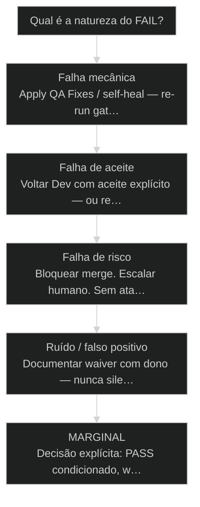
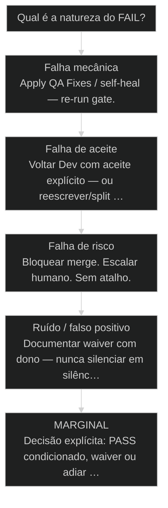

# [[Quality Gate]]: QA + Apply QA Fixes + CodeRabbit

O QG materializa [[No-self-review]]: findings de outro motor/pessoa antes de [[PASS]] / [[FAIL]] / [[CONCERNS]] / [[WAIVED]].

## Mapa desta aula

Decisão-chave da aula — Qual é a natureza do [[FAIL]]?

> Leia o diagrama antes do texto longo. Depois volte e confira.

> A coleira que mantém a IA controlada: bloquear merge sem [[PASS]] e remediar sem perder o estado da Story.

**Objetivos de aprendizagem:**
- Listar as três camadas do QG (evidência QA, remediação, CodeRabbit) e o papel de cada uma. _(remember)_
- Explicar por que gate sem bloqueio físico de merge é teatro de qualidade. _(understand)_
- Executar um ciclo QG completo numa PR real e interpretar PASS/FAIL/MARGINAL. _(apply)_
- Diagnosticar falha de QG e escolher remediar, reescrever story, bloquear ou waiver. _(analyze)_

---

## O que você consegue no fim desta aula

*G · Destino*

Destino claro antes de qualquer checklist de review.

Ao final desta aula você vai conseguir três coisas concretas:

1. Desenhar as **três camadas** do [[Quality Gate]] e o que cada uma bloqueia.
2. Olhar um FAIL e **classificar** (mecânico, aceite, risco, ruído) sem brigar com o bot.
3. Dizer se o teu merge está **fisicamente bloqueado** até PASS — ou se você só tem enfeite.

Se você sair daqui ainda achando que "por favor revisa" é gate, a aula falhou.
Autonomia sem coleira é roleta com branding de produtividade.

- **Objetivos da aula** (Listar as 3 camadas do QG; Rodar ciclo com veredito legível; Diagnosticar FAIL e escolher rota)
- **Resultado tangível**: Uma PR sua com QG nomeado: critério, [[Finding|findings]], veredito, próximo passo.
- **Não é o destino**: Zero bugs pra sempre. É bloqueio honesto + loop curto de remediação.

---

## Roleta com CI verde

*P · Onde você está*

Empatia com o ponto de partida real do operador.

Cara, sem quality gate a autonomia vira roleta. O modelo gera, você mergeia,
o usuário acha o bug. A "coleira" não é desconfiança — é **engenharia**.

O pior: CI verde com teatro. Lint passou, typecheck passou, ninguém provou o
aceite da story. Você confunde "máquina feliz" com "produto certo".

Se você está aqui, provavelmente já sentiu um destes sintomas:

- Comment no PR sem status check obrigatório — merge livre.
- QA "no final do mês" enquanto a main engorda.
- CodeRabbit gritando e o time silenciando o bot sem dono.
- Correção em branch paralela que nunca volta pra story original.

Beleza. A partir daqui a gente troca opinião de review por **bloqueio + evidência**.

**Teatro de qualidade**
- Comment no PR sem bloquear merge
- QA no final do mês
- Corrigir em branch solta sem vínculo com a story

**QG de verdade**
- Status check obrigatório
- QG na borda in review → done / pre-merge
- Fixes no mesmo ciclo com evidência

---

## Coleira em três camadas

*S · Rota*

Critério, remediação e review automático — conversando.

Quality Gate completo no AIOX tem três camadas que se conversam:

1. **QA / evidência** — o que precisa ser verdade (aceite, testes, checklist).
2. **Apply QA Fixes** — loop de correção sem perder o estado da story.
3. **CodeRabbit** — review automatizado no PR, o olho que não cansa.

Bloqueio físico: PR não vira main sem PASS (ou waiver **assinado**, com dono).
Se for só "por favor revisa", não é gate — é educação sentimental.

Prior-art: a aula 06 ([[CodeRabbit|Code Rabbit]] Boost) mostra o reviewer silencioso do bootstrap
e o ganho de qualidade. A aula 09 ([[Determinismo Progressivo|determinismo progressivo]]) amarra a ideia de
travar o caminho. Aqui a gente **monta a coleira inteira** na borda da story.

- **3**: camadas do QG
- **1**: bloqueio de merge
- **0**: espaço pra lgtm no feeling

- **status**: quality gate
- **meta**: qa+fixes+coderabbit
- **meta**: merge=blocked_until_pass
- **ready**: ready to gate

**Legenda de cores**

O que cada cor sinaliza nesta aula

- **Critério** (signal): aceite + checks que definem verdade
- **Remediação** (insight): fail → fix → re-gate com estado
- **CodeRabbit** (bench): varredura automática no PR
- **Bloqueio** (action): merge impossível sem PASS/waiver
- **Teatro** (pain): verde cosmético sem prova de aceite

**Como ler esta aula**

1. **Camadas**: Critério, remediação, CR.
2. **Veredito**: PASS/FAIL/MARGINAL/[[WAIVED]].
3. **Bloqueio**: O que torna o gate real.
4. **Diagnóstico**: FAIL → rota sem drama.

---

## Da cohort: task completed no meio do QG loop

*T1 + T2 · WhatsApp*

Realidade do grupo Advanced — não é slide, é cicatriz.

Learning real capturado no T2: team-lead marcou task da Fase 3 como **completed**
ao entrar no quality-gate loop. O correto: permanecer **in_progress** durante todo
o loop de QG/fixes.

Isso é a coleira em forma de status machine. Gate não é só check verde no CI — é
estado honesto da Story enquanto a remediação roda. O bug foi parar no learning
log; a aula internaliza para ninguém repetir.

> **Âncora de campo**: Completed no meio do QG loop é mentira educada com fogo no PR.

> **Materiais / FAQ**: Aulas 47 e 49 · nunca mentir done no meio do self-heal

---

## As três camadas do QG

Sem critério, review é teatro. Sem remediação, gate é muro. Sem CR, só olho cansado.

**Camada 1 — Critério.** Aceite da story + checks objetivos (teste, typecheck,
lint, smoke). Sem critério, review é teatro de gosto. QA aqui não é "opinião
de pessoa chata" — é **arquiteto de prova**.

**Camada 2 — Remediação.** Apply QA Fixes: achados viram correção na **mesma**
story, com estado preservado. Não abre "issue solta" e some. A aula 49 aprofunda
o loop; aqui você precisa saber que a coleira **fecha o circuito**.

**Camada 3 — Review automático.** CodeRabbit (e pares) apontam cheiro de bug,
segurança, inconsistência. Humano decide; máquina varre. Prior-art 06: o boost
silencioso no bootstrap — 60–70% de sensação de qualidade não é mágica do modelo.

Self-heal cobre uma fatia. O resto é loop curto: falhou → corrige → re-roda gate.
Então o que acontece se você só tem a camada 3? Vira spam de comment. Se só tem
a 1 sem bloqueio? Checklist de museu.

- **1. Evidência / QA**: Aceite + checks objetivos. Define o que é verdade. [critério]
- **2. Apply QA Fixes**: Findings → patch na mesma story/PR → re-gate. [loop]
- **3. CodeRabbit**: Review automatizado contínuo no PR. [olho]

> **Gate = bloqueio**: Se dá pra mergear ignorando o vermelho, você tem um enfeite, não um gate.

- **PASS**: Critérios satisfeitos; merge liberado pelo contrato do gate.
- **FAIL**: Pelo menos um bloqueador objetivo ou de aceite em aberto.
- **MARGINAL**: Zona cinzenta: risco residual documentado — exige julgamento explícito.
- **WAIVED**: Exceção assinalada com dono e motivo — nunca silêncio.

---

## Veredito legível e bloqueio físico

O gate precisa falar a mesma língua pro humano e pro CI.

Um QG que só "conversa" no chat não escala. O veredito precisa ser **máquina-legível
o suficiente** pra status check e **humano-legível o suficiente** pra decidir rota.

Mínimo operacional:

- **O que rodou** (checks + aceite referenciado).
- **O que falhou** (lista priorizada, não novelinha).
- **Veredito** (PASS / FAIL / MARGINAL / WAIVED).
- **Próximo passo** (fix na story / re-split / escalar / waiver).

Determinismo progressivo (aula 09) entra aqui: quanto mais do gate for **caminho
travado** (script, CI, checklist), menos você depende de "o modelo lembrar de
revisar". A IA gera; o gate **segura**.

> **Prior-art**: Aula 06 aprofunda CodeRabbit no bootstrap e no template de Story. Aula 09 amarra determinismo. Esta aula une as três camadas no merge boundary.

**O que o gate precisa emitir**

- **Critério**: Aceite + suite mínima nomeada
- **Findings**: Block / major / nit com dono de ação
- **Veredito**: PASS|FAIL|MARGINAL|WAIVED
- **Bloqueio**: Status check ou regra de branch real

---

## Caso: PR 'quase ok' que quebrou staging

Quando o verde cosmético mente.

PR de onboarding. Lint verde. Typecheck verde. CodeRabbit com 4 nits. Ninguém
rodou o caminho do aceite ("trial completa passo 2 com fallback se API cair").
Merge sexta 18h. Staging segunda: tela branca no passo 2.

Autópsia honesta:

1. **Critério** existia na story — não entrou no gate como check.
2. **Remediação** não rolou porque ninguém FAIL-ou de verdade.
3. **CodeRabbit** falou de estilo; o buraco era de aceite.

Coleira certa teria: teste/smoke do caminho feliz **ou** checklist de QA
bloqueante ligado ao aceite + status check. Nits de nome de variável não salvam
produto. Aceite não provado é FAIL — mesmo com CI cosmético verde.

**Ciclo QG na borda da story**

1. **PR**: Diff da unidade ready
2. **CR**: Varredura automática
3. **QA**: Aceite + evidência
4. **FAIL?**: Apply fixes / re-gate
5. **PASS**: Merge liberado

---

## QG falhou — e agora?

Classifique antes de brigar com o bot.

**Árvore de decisão**
_Classifique antes de brigar com o bot ou desligar o check._

- **Falha mecânica** — Lint, typecheck, teste objetivo vermelho.
  → _Apply QA Fixes / self-heal — re-run gate._
  Ex.: CI vermelho em unit test do caminho.
- **Falha de aceite** — Funciona, mas não é o que a story pediu.
  → _Voltar Dev com aceite explícito — ou reescrever/split story._
  Ex.: Botão existe, fluxo do usuário não.
- **Falha de risco** — Segurança, dados, prod, secret, RLS.
  → _Bloquear merge. Escalar humano. Sem atalho._
  Ex.: RLS ausente, secret commitado.
- **Ruído / falso positivo** — CR ou check flaky conhecido.
  → _Documentar waiver com dono — nunca silenciar em silêncio._
  Ex.: Warning cosmético catalogado.
- **MARGINAL** — Risco residual, trade-off consciente.
  → _Decisão explícita: PASS condicionado, waiver ou adiar merge._
  Ex.: Feature flag off em prod, debt aceito com data.

**Gate:** O merge está fisicamente bloqueado até PASS ou waiver assinado? — _Se não, ainda não é quality gate._

#### Loop curto
Fail → fix → re-gate.
1. **Ler findings: Blockers primeiro.
2. **Apply fixes: Mesma story/PR.
3. **Re-run: Delta explícito.
4. **PASS: Só então merge.

#### Loop de aceite
Produto errado, não só código.
1. **Reler story: Aceite ainda vale?
2. **Ajustar ou split: Não infle no escuro.
3. **Evidência: Prova do caminho.
4. **QG de novo: Veredito limpo.

#### Rota risco
Sem atalho de sexta.
1. **Bloquear: Merge impossível.
2. **Escalar: Humano dono do risco.
3. **Mitigar: Fix ou flag/rollback plan.
4. **Re-gate: PASS só com prova.

---

## Audite o QG de uma PR real (15 min)

PR aberta, última merge, ou simulação honesta.

Vamos lá. Sem isso a aula vira podcast. Pega uma PR real do teu repo — ou a
última que você mergeou "no feeling".

- 1. **PR**: Escolha uma PR (aberta ou recente) ligada a uma Story.
- 2. **Camadas**: Anote o que existe: critério/aceite, CR, QA, status check.
- 3. **Bloqueio**: Dá pra mergear com vermelho? Resposta sim/não com prova.
- 4. **Veredito**: Escreva PASS/FAIL/MARGINAL/WAIVED com uma linha de motivo.
- 5. **Rota**: Se FAIL: classifique (mecânico/aceite/risco/ruído) e o próximo passo.

**Funcionou se:**

- Você nomeou as três camadas e quais existem de verdade no teu fluxo.
- Você sabe se o merge está fisicamente bloqueado.
- Há veredito escrito e rota se não for PASS.
- Nenhum 'lgtm' substituiu evidência de aceite.

---

## Glossário sem jargão de vaidade

- **Quality Gate**: Barreira com critério + bloqueio + veredito antes de promover código.
- **Bloqueio físico**: Impossibilidade real de merge sem PASS/waiver — não só pedido educado.
- **CodeRabbit**: Reviewer automatizado no PR; camada de varredura, não substituto de aceite.
- **Apply QA Fixes**: Loop de remediação na mesma story/PR sem perder estado.
- **Self-heal**: Correção automática de fatia dos findings; o resto é loop humano/agente.
- **Teatro de qualidade**: Processo que parece review mas não impede merge ruim.

---

## Portão da aula

Você passou quando descreve as três camadas, emite veredito legível e prova se
o merge está bloqueado de verdade. Coleira de enfeite não conta.

A IA é a seta. O X é seu — inclusive **segurar o merge** quando o vermelho mente menos que o ego.

> **Próximo na trilha**: O subprocesso Apply QA Fixes Loop (posição 49) aprofunda fail→fix→re-gate sem perder estado — o oxigênio da coleira.

> **GATE-MODULE (auto)**: GPS Goal/Position/Steps presentes · caso + do/dont · decisão · prática com evidência · glossário. Alvo DL ≥70 atingido na construção enrich-W1.

***

---

## Operar isto na prática

Esta aula é pré-requisito no curso de squads — quando a missão for real, siga para: Research: `cursos/AIOX-Advanced-Squads/aulas/02-research.md` · AIOX SOP: `cursos/AIOX-Advanced-Squads/aulas/07-aiox-sop.md` · Design System: `cursos/AIOX-Advanced-Squads/aulas/14-design-system.md` · Design Ops: `cursos/AIOX-Advanced-Squads/aulas/15-design-ops.md`

## Navegação

← [[lessons/46-etapas-de-desenvolvimento|Briefing, PRD, Stories: as 3 etapas antes do código]] · ↑ [[modulos/Módulo 2 - SDC e Qualidade|M2 — SDC e qualidade]] · ⌂ [[cursos/AIOX Advanced/README|Curso]] · → [[lessons/49-apply-qa-fixes-loop|Apply QA Fixes Loop: QA volta para Dev sem perder estado]]
