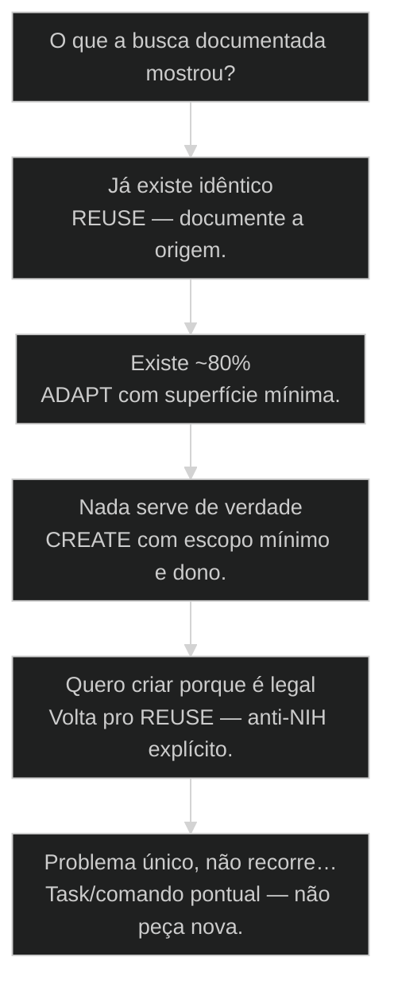
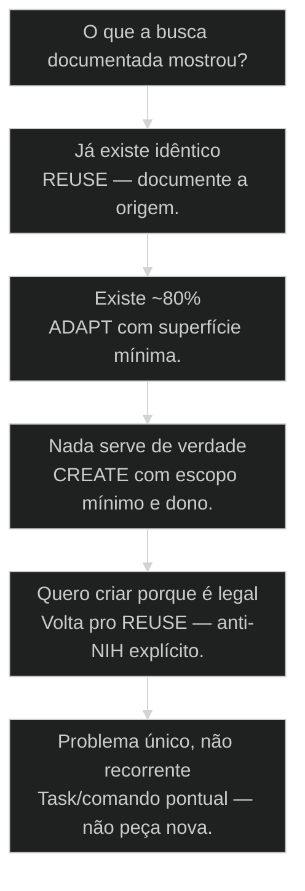

# [[REUSE]] > [[ADAPT]] > [[CREATE]]: a heurística antes de criar nada

← [[32-design-system-greenfield-brownfield|Design System: greenfield versus brownfield]] · ↑ [[modulos/Módulo 7 - Criar Squad|M7]] · ⌂ [[Cursos/AIOX Advanced/README|Curso]] · → [[33-anatomia-de-um-squad|Anatomia de um Squad AIOX]]

## Mapa desta aula

Decisão-chave da aula — O que a busca documentada mostrou?

> Leia o diagrama antes do texto longo. Depois volte e confira.

> Anti-NIH: reutilize, adapte, só então crie — com justificativa e prova de busca. Senioridade é achar o que já existe.

**Objetivos de aprendizagem:**
- Recitar a ordem REUSE > ADAPT > CREATE e o custo de pular a busca. _(remember)_
- Explicar NIH (not invented here) e como ele se disfarça de 'engenharia limpa'. _(understand)_
- Aplicar R/A/C em três cenários com prova de busca escrita. _(apply)_
- Justificar CREATE apenas quando REUSE e ADAPT falham com evidência — ou matar o CREATE. _(evaluate)_

---

## O que você consegue no fim desta aula

*G · Destino*

Destino claro antes de qualquer agent.md novo.

Ao final desta aula você vai conseguir três coisas concretas:

1. Aplicar **REUSE → ADAPT → CREATE** sem pular etapa por empolgação.
2. Montar **prova de busca** (o que achou, por que não serve).
3. Matar pelo menos um CREATE que era ego ou preguiça disfarçada.

Se você sair daqui ainda "criando o agente perfeito" sem vasculhar o core,
a aula falhou. CREATE sem busca é dívida com perfume de inovação.

- **Objetivos da aula** (Ordem sagrada R > A > C; Prova de busca antes de CREATE; Detectar NIH no próprio comportamento)
- **Resultado tangível**: Três cenários classificados + um CREATE morto trocado por REUSE/ADAPT.
- **Não é o destino**: Proibir CREATE pra sempre. É exigir vergonha boa e evidência.

---

## NIH mata [[Squad|squad]] (e skill, e [[Runner|runner]])

*P · Onde você está*

Empatia com o vício de inventar o que o monorepo já resolve.

Cara, NIH mata squad. Todo mundo quer criar o agente perfeito em vez de achar
o que já existe no AIOX, no repo, no open source, na pasta vizinha.

A heurística é brutal e libertadora: **REUSE** primeiro, **ADAPT** se couber,
**CREATE** por último e com vergonha na cara — vergonha boa, a que te faz
procurar de novo antes de abrir o scaffold.

Se você está aqui, provavelmente já sentiu um destes sintomas:

- Três skills que fazem "research" com nomes diferentes.
- Squad novo que é 90% cópia de um existente com emoji novo.
- "Não confio no core" sem nunca ter lido o core.
- CREATE na sexta, manutenção órfã na segunda.

Beleza. A partir daqui a gente coloca **custo de manutenção** na conta antes
do commit de vaidade.

**Onde a maioria trava**
- CREATE porque é legal / mais limpo no meu gosto
- Busca de 30 segundos e desistência
- Fork completo quando bastava um param

**Onde o operador vai**
- REUSE se cobre o caso
- ADAPT com superfície mínima
- CREATE só com gap e dono de manutenção

---

## A ordem sagrada do ecossistema

*S · Rota*

Não é religião. É economia de atenção e de manutenção.

[[Prior-art|prior-art]]: taxonomia (28), anatomia e creator de squad (33–34), pasta OS (39).
O ecossistema **já é grande**. Criar sem triagem é poluir o grafo de manutenção.

Lanes de busca (mínimo):

1. Core AIOX / skills e agentes instalados
2. Repo atual (`.claude`, squads, runners)
3. Irmãos no monorepo / org
4. Open source e prior-art externo (quando domínio for novo)

Sem prova de busca, CREATE é preguiça disfarçada de engenharia. Com prova e
gap real, CREATE é coragem com dono.

- **3**: degraus (R→A→C)
- **1**: prova de busca por CREATE
- **0**: espaço pra NIH sem nome

- **status**: R > A > C
- **meta**: busca=core→repo→oss
- **meta**: create=gap+dono
- **ready**: ready to search

**Legenda de cores**

O que cada cor sinaliza nesta aula

- **REUSE** (signal): serve como está — use
- **ADAPT** (insight): quase serve — fork mínimo
- **CREATE** (bench): gap real + custo aceito
- **Prova** (action): o que foi achado e rejeitado
- **NIH** (pain): inventar por ego ou preguiça

**Como ler esta aula**

1. **Ordem**: R → A → C com custo.
2. **Prova**: Como documentar a busca.
3. **Caso**: Logger reescrito por orgulho.
4. **Prática**: Matar um CREATE da semana.

---

## REUSE, ADAPT, CREATE — contratos

Cada degrau tem teste de saída. Não suba por tédio.

**REUSE** — usa como está. Cobre o caso. Zero fork. Documenta a origem.
Teste de saída: "serve 100% do happy path que eu preciso?"

**ADAPT** — fork ou extensão **mínima**. Param, wrapper, um agente a mais,
um passo no workflow. Não é reescrita com o mesmo nome.
Teste de saída: "80%+ serve e o delta cabe em superfície pequena?"

**CREATE** — peça nova com gap comprovado, escopo mínimo e **dono** de
manutenção. Inclui porquê escrito e links do que não serviu.
Teste de saída: "busca falhou de verdade e o problema é recorrente?"

Então o que acontece se você ADAPT virando rewrite de 2k linhas? Você mentiu
o rótulo. Chame de CREATE e pague o preço mental — ou volte ao REUSE.

- **1. REUSE**: Origem nomeada; zero delta de manutenção local. [0 fork]
- **2. ADAPT**: Delta mínimo; upstream ainda reconhecível. [fork min]
- **3. CREATE**: Gap + dono + prova de busca anexada. [último]

> **Lei anti-NIH**: CREATE sem prova de busca é inválido. A bela ideia não isenta a varredura.

- **ADAPT** != **Rewrite**: Adapt preserva o núcleo do original; rewrite é CREATE disfarçado.
- **Não achei em 2 min** != **Não existe**: Busca rasa não é evidência de gap.

---

## Prova de busca: o artefato que falta no PR

Sem isso, a conversa vira gosto. Com isso, vira engenharia.

Template mínimo de prova (cole na story ou no PR):

1. **Query** — o que procurei (termos, paths, repos).
2. **Achados** — 2–5 candidatos com path/link.
3. **Por que não serve** — uma frase cada (ou "serve → REUSE").
4. **Decisão** — REUSE / ADAPT (com delta) / CREATE (com gap).
5. **Dono** — quem mantém se CREATE/ADAPT.

Cara, isso leva dez minutos. CREATE sem isso custa meses. A assimetria é o
argumento inteiro.

NIH se disfarça de: "quero API limpa", "não confio no legado", "é mais rápido
escrever do que ler". Às vezes é verdade. Quase sempre é preguiça com
PowerPoint.

**Prova em 5 linhas**

1. **Query**: O que e onde buscou.
2. **Achados**: Candidatos reais.
3. **Rejeição**: Por que cada um falha.
4. **Decisão**: R / A / C com delta.

- **NIH**: Not Invented Here — rejeitar o existente por ego, hábito ou preguiça de ler.
- **Prova de busca**: Registro do que foi encontrado e por que não cobre o caso.
- **Gap comprovado**: Ausência real após busca honesta — não ausência de 2 minutos.
- **Superfície de ADAPT**: Tamanho do delta; se explode, é CREATE.

> **Prior-art**: Squad-creator e forja AIOX assumem REUSE-first. Esta aula treina o músculo humano que a ferramenta não pode fingir: a honestidade da busca.

---

## Caso: o logger reescrito por orgulho

CREATE 'limpo' que gerou dois padrões e zero ganho.

Dev novo: "o logger do monorepo é feio". Escreve `ultra-log` com API "moderna".
Três serviços adotam. Seis ficam no antigo. Observabilidade parte no meio.
Dois meses depois, alguém pede correlation id único. Ninguém tem.

Prova de busca que faltou:

- Achado 1: `@aiox/logger` — cobre 90%, falta correlation id opcional.
- Achado 2: skill de instrumentação no core — ADAPT de um param.
- Decisão correta: **ADAPT** no logger existente (+ option), não CREATE.

O CREATE "porque é legal" gerou NIH clássico: custo de manutenção duplicado
e integração pior. Vergonha boa teria economizado o trimestre.

Então o que acontece quando o CREATE é legítimo? Domínio regulatório único,
busca documentada falhou, problema bate toda semana, dono nomeado. Aí sim —
e ainda com escopo mínimo.

**Caminho honesto**

1. **Dor**: Preciso de X
2. **Busca**: Core/repo/oss
3. **Achados**: Lista + rejeição
4. **R/A/C**: Decisão com dono
5. **Ship**: Menor superfície

**NIH**
- Reescrever por estética
- Busca rasa e CREATE
- Sem dono de manutenção

**Heurística**
- ADAPT com param
- Prova de busca no PR
- CREATE com gap e dono

---

## REUSE, ADAPT ou CREATE?

Evidência da busca manda. Ego desce.

**Árvore de decisão**
_Sem busca, a única resposta válida é: pare e busque._

- **Já existe idêntico** — Cobre o caso no happy path.
  → _REUSE — documente a origem._
  Ex.: Skill de research no core.
- **Existe ~80%** — Falta detalhe pequeno / param / passo.
  → _ADAPT com superfície mínima._
  Ex.: Template de story quase certo.
- **Nada serve de verdade** — Busca documentada falhou; gap recorrente.
  → _CREATE com escopo mínimo e dono._
  Ex.: Domínio regulatório único do cliente.
- **Quero criar porque é legal** — Motivação é ego/estética/tédio.
  → _Volta pro REUSE — anti-NIH explícito._
  Ex.: Reescrever logger 'mais limpo'.
- **Problema único, não recorrente** — Acontece uma vez; não justifica artefato.
  → _Task/comando pontual — não peça nova._
  Ex.: Migração pontual de um cliente.

**Gate:** Você anexa prova de busca (query + achados + rejeições)? — _Sem anexo, CREATE não passa no portão desta aula._

#### Busca
Antes de código.
1. **Core: Skills/agentes/runners instalados.
2. **Repo: Pastas locais e monorepo.
3. **OSS/prior-art: Se domínio for novo.
4. **Decisão: R/A/C com prova.

#### ADAPT mínimo
Quase serve.
1. **Nomear delta: O que falta em uma frase.
2. **Menor patch: Param, wrapper, passo.
3. **Upstream: Não perder a origem.
4. **QG: Provar o caso que faltava.

#### CREATE mínimo
Gap real.
1. **Spec: Problema e não-objetivos.
2. **Superfície: Menor peça possível.
3. **Dono: Quem mantém e por quanto.
4. **Doc do porquê: Prova de busca colada.

---

## Mate um CREATE (15 min)

Três cenários reais da sua semana.

Vamos lá. Sem isso a aula vira podcast. Pega coisas que você **criaria** ou
já criou nos últimos dias.

- 1. **3 cenários**: Liste 3 coisas que você criaria (ou criou) esta semana.
- 2. **Busque**: Para cada uma, 2+ candidatos reais (path/link).
- 3. **Aplique**: R/A/C em cada uma com uma frase de porquê.
- 4. **Mate uma**: Troque um CREATE por REUSE ou ADAPT de verdade.
- 5. **Prova**: Cole a prova de busca do pior candidato a NIH.

**Funcionou se:**

- Três cenários têm decisão R/A/C e pelo menos um achado citado.
- Pelo menos um CREATE foi morto ou rebaixado.
- CREATE restante (se houver) tem gap e dono explícitos.
- Você sabe nomear NIH no próprio comportamento sem se defender.

---

## Glossário sem jargão de vaidade

- **REUSE**: Usar artefato existente sem fork quando cobre o caso.
- **ADAPT**: Extensão ou fork mínimo preservando a origem reconhecível.
- **CREATE**: Nova peça só após gap comprovado, escopo mínimo e dono.
- **NIH**: Not Invented Here — preferir inventar a reutilizar sem evidência.
- **Prova de busca**: Registro de query, achados, rejeições e decisão R/A/C.
- **Vergonha boa**: Desconforto produtivo que te força a procurar de novo antes de criar.

---

## Portão da aula

Você passou quando CREATE só sobrevive com busca falha documentada. REUSE é
senioridade. ADAPT é ofício. CREATE é exceção com dono.

A IA é a seta. O X é seu — inclusive engolir o ego e apontar pro path que já existia.

> **Próximo na trilha**: Se a tentação é squad novo, a aula 55 (triagem de squad) formaliza a fase-zero de prior-art + research loop.

> **GATE-MODULE (auto)**: GPS Goal/Position/Steps presentes · caso + do/dont · decisão · prática com evidência · glossário. Alvo DL ≥70 atingido na construção enrich-W2.

***

---

## Navegação

← [[32-design-system-greenfield-brownfield|Design System: greenfield versus brownfield]] · ↑ [[modulos/Módulo 7 - Criar Squad|M7]] · ⌂ [[Cursos/AIOX Advanced/README|Curso]] · → [[33-anatomia-de-um-squad|Anatomia de um Squad AIOX]]
