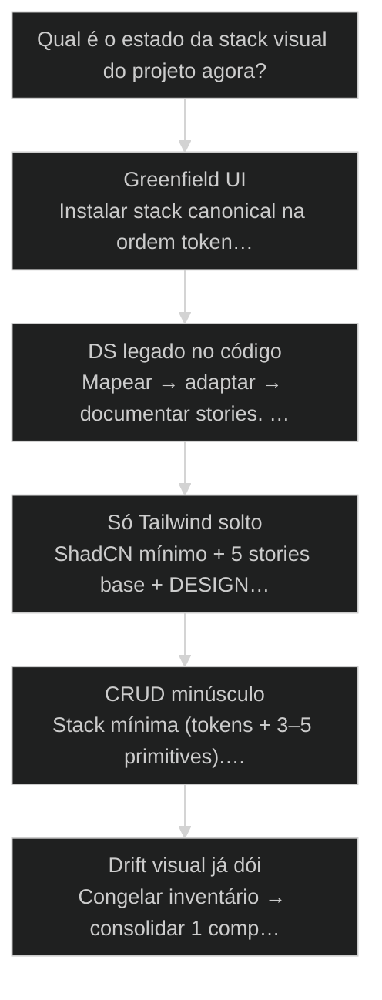
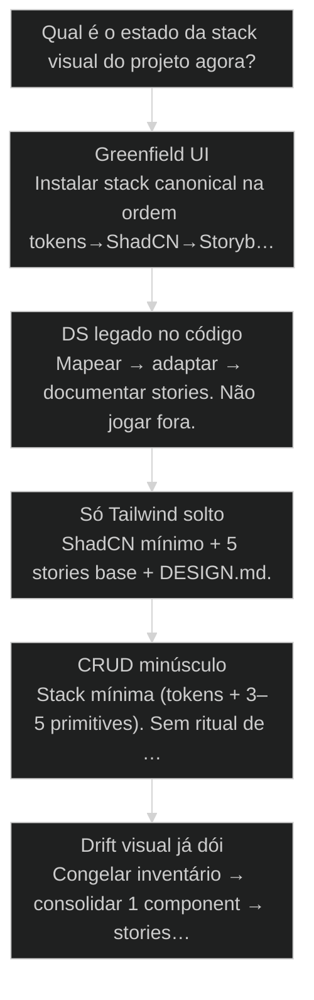

# Tailwind + ShadCN + [[Storybook]]: stack canonical para IA

← [[42-design-atomico-brad-frost|Design atomico: a interface se monta de peca pequena pra peca grande]] · ↑ [[modulos/Módulo 9 - Design System|M9]] · ⌂ [[Cursos/AIOX Advanced/README|Curso]] · → [[43-design-md-novo-contrato|DESIGN.md: o novo contrato que a IA lê antes de gerar tela]]

## Mapa desta aula

Decisão-chave da aula — Qual é o estado da stack visual do projeto agora?

> Leia o diagrama antes do texto longo. Depois volte e confira.

> Tokens, componentes e museu vivo: a stack que a IA reusa em vez de inventar botão novo a cada prompt.

**Objetivos de aprendizagem:**
- Justificar Tailwind+ShadCN+Storybook como stack canonical para geração por IA. _(understand)_
- Desenhar a ordem de setup: tokens → primitives ShadCN → stories → [[DESIGN md|DESIGN.md]]. _(apply)_
- Ligar DESIGN.md e Storybook como contrato antes de gerar qualquer tela. _(apply)_
- Diagnosticar stack legada e escolher adaptar, mapear ou canonicalizar sem jogar fora. _(analyze)_

---

## O que você consegue no fim desta aula

*G · Destino*

Destino claro antes de qualquer install de UI.

Ao final desta aula você vai conseguir três coisas concretas:

1. Explicar **por que** Tailwind + ShadCN + Storybook é stack canonical pra IA — sem virar fanboy de lib.
2. Montar (ou auditar) a **ordem mínima**: tokens → primitives → stories → DESIGN.md.
3. Olhar um prompt de "faz a tela X" e **recusar** se o contrato visual não existe.

Se você sair daqui ainda pedindo "UI bonita" sem catálogo, a aula falhou.
Criatividade no produto. Determinismo no botão.

- **Objetivos da aula** (Justificar a trinca canônica; Ordenar setup sem ritual excessivo; Contratar DESIGN.md antes de gerar tela)
- **Resultado tangível**: Checklist da stack no teu repo + 1 componente no Storybook apontado no DESIGN.md.
- **Não é o destino**: Migrar o mundo pra ShadCN em um fim de semana. Isso é vaidade, não stack.

---

## O erro do botão inventado

*P · Onde você está*

Empatia com o ponto de partida real do operador de UI com IA.

Cara, eu vejo o mesmo filme toda semana. A pessoa abre o agente e manda:
"faz um dashboard clean com cards e botões modernos". O modelo obedece.
Nasce um botão. Depois outro. Depois um terceiro com radius diferente.
Em três stories você tem um [[Design System]] acidental — e ninguém assinou.

Por quê? Porque a IA é boa em **preencher vazio**. Se o vazio é "como é
um botão aqui?", ela inventa. Se o vazio é "use o Button do catálogo com
variant=outline", ela reusa.

Se você está aqui, provavelmente já sentiu um destes sintomas:

- Cada tela tem padding e tipografia "quase iguais".
- Dark mode quebra em metade dos componentes.
- O designer (ou o teu olho) reclama de inconsistência e o agent "conserta"
  inventando mais CSS.

Beleza. A partir daqui a gente troca inventário mental por **catálogo no repo**.

**Onde a maioria trava**
- Prompt de vibe: 'UI moderna e clean'
- Tailwind solto sem primitives
- Storybook como afterthought de marketing

**Onde o operador vai**
- Prompt de contrato: 'use Button/Card do catálogo'
- Tokens + ShadCN + stories antes da feature
- Storybook como SoT que a IA e o humano leem

---

## Três camadas, uma verdade visual

*S · Rota*

Tailwind fala, ShadCN compõe, Storybook prova.

A stack canonical não é religião de framework. É **redução de graus de
liberdade** onde a alucinação visual custa caro.

1. **Tailwind** — linguagem de utilitários estável. O modelo já "pensa" em
   classes; tokens semânticos viram restrição, não decoração.
2. **ShadCN** — componentes **no teu código** (não black-box npm opaco).
   Você copia, adapta, versiona. A IA edita o mesmo arquivo que o humano.
3. **Storybook** — museu vivo. Variantes, estados, a11y, dark. Se não está
   no Storybook, não existe pro contrato.

Prior-art: as aulas de design system e DESIGN.md plantaram o contrato.
Aqui a gente **instancia a stack que materializa** esse contrato pra IA.

- **3**: camadas canônicas
- **1**: contrato DESIGN.md
- **0**: botão inventado por vibe

- **status**: tailwind-shadcn-storybook
- **meta**: ordem=tokens→shadcn→stories→design.md
- **meta**: regra=catalog first
- **ready**: ready to map

**Legenda de cores**

O que cada cor sinaliza nesta aula

- **Tailwind** (signal): utilitários + tokens semânticos
- **ShadCN** (insight): primitives compostas no repo
- **Storybook** (bench): SoT visual e estados
- **Contrato** (action): DESIGN.md aponta o catálogo
- **Drift** (pain): CSS one-off fora do catálogo

**Como ler esta aula**

1. **Por quê**: Canonical = menos alucinação.
2. **Camadas**: Papel de cada peça da trinca.
3. **Ordem**: Setup e [[Brownfield Discovery|brownfield]] sem drama.
4. **Contrato**: Gerar tela só com catálogo.

---

## Da cohort: stack que a turma tenta encaixar no PRO

*T1 + T2 · WhatsApp*

Realidade do grupo Advanced — cicatriz, não slide.

No WhatsApp, design-ops, design-chief e packs de DS circulam como zip.
A dúvida não é 'Tailwind é legal?' — é **como plugar no projeto real** sem
quebrar o que já existe.

Esta aula é o canteiro: stack canonical para IA (Tailwind + ShadCN + Storybook)
porque reduz graus de liberdade. A cohort Advanced é o laboratório onde isso
vira suporte: 'instalei e não veio o /design-system'. Stack + ativação + contrato.

> **Âncora de campo**: Menos liberdade visual = menos alucinação de UI. Isso é feature.

> **Materiais / FAQ**: cohort-insights/FAQ · packs design da turma como prior-art, não como verdade única

---

## O que cada peça carrega (e o que NÃO carrega)

Autoridade exclusiva entre utilitário, componente e museu.

Decora a órbita de cada um — senão você usa Storybook como portfolio e
Tailwind como desculpa pra não ter design system.

**Tailwind** — fala a linguagem. Tokens (cores, spacing, radius, type)
vivem aqui ou num layer CSS variables que o Tailwind consome. Anti-papel:
não é "jogar className até ficar bonito" sem token semântico.

**ShadCN/ui** — peças com comportamento (Button, Dialog, Form…). Vivem no
teu `components/ui`. Anti-papel: não é tema de Figma; é código versionado.
Você escolhe o que importa. O resto não polui.

**Storybook** — prova estados. Default, hover, disabled, loading, error,
dark, mobile. Anti-papel: não é substituto de produto. É laboratório e
contrato. Se a story mente, a IA e o QA mentem juntos.

Lei: **criatividade no fluxo de produto; determinismo no átomo visual.**

- **1. Tailwind + tokens**: Linguagem e restrições semânticas. [fala]
- **2. ShadCN**: Primitives compostas no repositório. [peça]
- **3. Storybook**: Estados visíveis e testáveis. [prova]

> **Lei do catálogo**: Se o componente não tem story, ele não entra no prompt de geração. Ponto. Sem story é rumor.

- **Design system no Figma só** != **Catálogo no código**: IA lê o repo. Figma sem espelho vira slide.
- **Mais componentes** != **Menos alucinação**: Volume sem tokens e stories piora o drift.

---

## Ordem de setup que evita retrabalho

Tokens primeiro. Feature depois. Sempre.

Ordem que eu uso — e que a IA respeita quando você exige:

1. **Tokens** — cor, type, space, radius, shadow. Nomes semânticos
   (`bg-primary`, não `#3B82F6` espalhado).
2. **Primitives ShadCN** — Button, Input, Card, Dialog… o mínimo do domínio.
3. **Stories base** — cada primitive com variantes reais (size, state, theme).
4. **DESIGN.md** — aponta tokens, paths do catálogo, regras do/dont, a11y.
5. **Só então** — feature/tela gerada com "use apenas o catálogo".

Greenfield: essa ordem é barata. Brownfield: você **mapeia** o que já existe
pro catálogo, não joga o monólito fora na sexta à noite.

CRUD de duas telas? Stack mínima ainda vale — mas sem ritual de 40 stories
de showcase. Canônico ≠ cerimônia.

**Pipeline do canteiro UI**

1. **Tokens**: Semântica no Tailwind/CSS vars
2. **ShadCN**: Primitives no repo
3. **Stories**: Estados no Storybook
4. **DESIGN.md**: Contrato legível por IA
5. **Tela**: Gerar com reuso obrigatório

**Atalho de escala**

- **Greenfield app**: Stack full canônica desde o dia 0
- **DS legado**: Mapear + adaptar; não reescrever tudo
- **Só Tailwind solto**: Adicionar ShadCN + 5 stories base
- **CRUD minúsculo**: Mínimo: tokens + Button/Input/Card

---

## Caso: três botões e um só contrato

Como o catálogo mata o drift em uma sprint.

Time gerava telas com agente. Em duas semanas: botão primary em três
raios, dois tons de verde "quase brand", loading spinner diferente em
cada modal. QA visual era "abre e vê se tá ok".

Intervenção: extrair **um** Button ShadCN, tokens de brand, stories
default/outline/ghost/destructive + loading + disabled + dark. DESIGN.md
com "proibido className one-off em Button".

Resultado em uma sprint: o agent passou a copiar variants. Drift caiu.
Não porque a IA "melhorou" — porque o **vazio acabou**.

Então o que acontece se você pula Storybook? O contrato existe só na
cabeça de quem escreveu o componente. Em uma semana a cabeça muda.

> **Métrica que importa**: Conte quantos botões 'quase iguais' o repo tem. Se >1 sem variant explícita, você tem dívida de catálogo — não de 'estilo'.

---

## Qual é a próxima ação correta na UI?

Árvore curta pra não over-engineerar nem inventar.

**Árvore de decisão**
_Escolha pela evidência no repo, não pela vontade de migrar._

- **Greenfield UI** — App novo ou pasta frontend vazia de DS.
  → _Instalar stack canonical na ordem tokens→ShadCN→Storybook→DESIGN.md._
  Ex.: SaaS novo com Next + AIOX.
- **DS legado no código** — Já existem componentes e tokens próprios.
  → _Mapear → adaptar → documentar stories. Não jogar fora._
  Ex.: Design system interno com 40 componentes.
- **Só Tailwind solto** — Utilitários sem primitives nem stories.
  → _ShadCN mínimo + 5 stories base + DESIGN.md._
  Ex.: Landing bagunçada que virou produto.
- **CRUD minúsculo** — 2–3 telas, time de 1, prazo curto.
  → _Stack mínima (tokens + 3–5 primitives). Sem ritual de showcase._
  Ex.: Admin interno de inventário.
- **Drift visual já dói** — Mesmos padrões com N implementações.
  → _Congelar inventário → consolidar 1 component → stories → banir one-off._
  Ex.: Três Button.tsx em pastas diferentes.

**Gate:** Você consegue apontar o path do Button canônico e a story correspondente? — _Se não aponta path + story, ainda não tem contrato — tem opinião._

#### Rota greenfield
Do zero, sem inventar framework.
1. **Tokens: CSS vars + Tailwind theme.
2. **ShadCN: Button, Input, Card, Dialog, Form.
3. **Stories: Variants + dark + disabled.
4. **DESIGN.md: Paths + do/dont + a11y.

#### Rota brownfield
Adaptar sem reescrever o mundo.
1. **Inventário: Listar componentes reais.
2. **Mapear: Equivalência ShadCN/token.
3. **Story: Cobrir o que já existe.
4. **Gate: Novo UI só via catálogo.

#### Rota geração
Agente só depois do contrato.
1. **Ler DESIGN.md: Contrato na sessão.
2. **Listar stories: Peças permitidas.
3. **Compor tela: Sem CSS one-off.
4. **QG visual: Diff + Storybook.

---

## Audite e contrate a stack (20 min)

Repo real ou pasta de UI — escrito, não mental.

Vamos lá. Sem isso a aula vira podcast de preferência de CSS. Cronometra.

- 1. **Repo**: Abra o projeto onde a UI vive (ou o monorepo da pasta web).
- 2. **Checklist**: Marque: tokens? ShadCN/ui (ou DS)? Storybook? DESIGN.md apontando paths?
- 3. **Inventário**: Liste 3 componentes críticos (ex: Button, Input, Card) e se têm story.
- 4. **Gap**: Escreva a menor próxima ação (1 componente + 1 story + 3 linhas no DESIGN.md).
- 5. **Prompt**: Escreva o prompt de geração de UMA tela que force reuso do catálogo (cite paths).

**Funcionou se:**

- Você tem checklist marcado com evidência de path (não 'acho que tem').
- Pelo menos 1 componente tem story ou um plano de 1 story criado.
- O prompt de tela cita o catálogo e proíbe inventar primitive.

---

## Glossário sem jargão de vaidade

- **Stack canonical**: Conjunto padrão (Tailwind+ShadCN+Storybook) que reduz graus de liberdade da geração por IA.
- **Token semântico**: Nome de design com significado (primary, muted) em vez de valor cru espalhado.
- **Primitive**: Componente base reutilizável (Button, Input) no catálogo do repo.
- **SoT visual**: Source of Truth — Storybook + DESIGN.md como verdade compartilhada humano/IA.
- **CSS one-off**: Estilo local que foge do catálogo e cria drift silencioso.

---

## Portão da aula

Você passou quando aponta: tokens, path do primitive, story e linha do
DESIGN.md — e recusa gerar tela sem isso. Stack legível por humano e por
IA não é luxo de design system enterprise. É coleira visual.

A IA é a seta. O X é seu — inclusive decidir **o que** pode ser inventado.

> **Próximo na trilha**: A aula 57 aprofunda Storybook como bateria de variantes (a11y, dark, responsivo) — o museu vira QA em massa.

> **GATE-MODULE (auto)**: GPS Goal/Position/Steps presentes · caso + do/dont · decisão · prática com evidência · glossário. Alvo DL ≥70 atingido na construção enrich-W3.

***

---

## Navegação

← [[42-design-atomico-brad-frost|Design atomico: a interface se monta de peca pequena pra peca grande]] · ↑ [[modulos/Módulo 9 - Design System|M9]] · ⌂ [[Cursos/AIOX Advanced/README|Curso]] · → [[43-design-md-novo-contrato|DESIGN.md: o novo contrato que a IA lê antes de gerar tela]]
