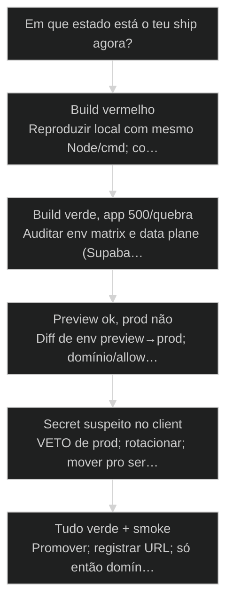
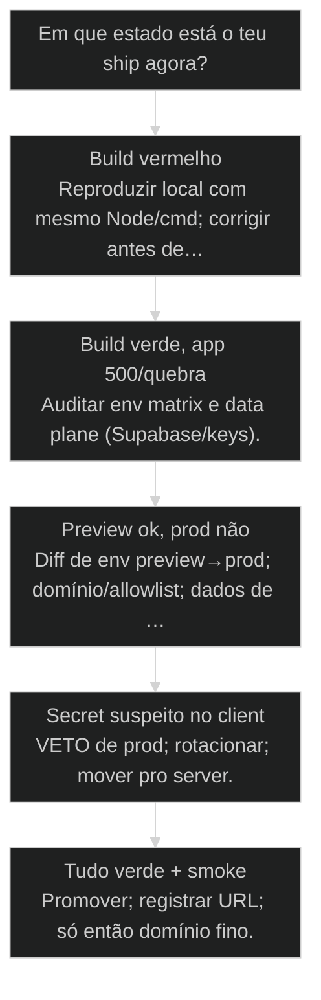

# [[Vercel]] Deploy: do localhost ao mundo

> **Papel curricular:** extensão aplicada ao AIOX. Base técnica canônica: `cursos/AIOX-Fundamentos-de-Arquitetura/aulas/18-cicd-deploy-rollback.md`.

← [[70-supabase-via-data-engineer|Supabase: setup via @data-engineer]] · ↑ [[modulos/Módulo 12 - Deploy Profissional|M12]] · ⌂ [[cursos/AIOX Advanced/README|Curso]] · → [[72-cicd-pipeline-completa|CI/CD Pipeline completa: GitHub Actions + Quality Gate pré-merge]]

## Mapa desta aula

Decisão-chave da aula — Em que estado está o teu ship agora?

> Leia o diagrama antes do texto longo. Depois volte e confira.

> Build, env vars, preview e produção — sair do localhost com checklist de adulto, sem vazar secret.

**Objetivos de aprendizagem:**
- Publicar um [[Deploy]] Vercel com env vars corretas por ambiente. _(apply)_
- Verificar build, preview e produção sem vazar secret no client. _(apply)_
- Diagnosticar falha comum de build/env/domínio com checklist. _(analyze)_
- Separar o que é preview vs produção e quando promover. _(evaluate)_

---

## O que você consegue no fim desta aula

*G · Destino*

Destino claro antes de clicar Deploy.

Ao final desta aula você vai conseguir três coisas concretas:

1. Subir um projeto na **Vercel** com build limpo e env por ambiente.
2. Usar **preview** como portão antes de produção — não "push na main e reza".
3. Rodar **smoke** pós-deploy e achar o culpado quando quebrar (build vs env vs runtime).

Se você sair daqui achando que "URL verde = produto no ar", a aula falhou.
URL é sintoma. Done de deploy é **evidência**: build, env, domínio, smoke.

- **Objetivos da aula** (Deploy com env correto; Preview antes de prod; Diagnosticar build/env/smoke)
- **Resultado tangível**: Checklist de deploy preenchido + URL de preview verificada.
- **Não é o destino**: Clicar Deploy com .env local na cabeça e secret no NEXT_PUBLIC_.

---

## O erro do 'na minha máquina funciona'

*P · Onde você está*

Empatia com o ponto de partida real do operador.

Cara, eu vejo o mesmo filme toda semana. App lindo no localhost. `npm run
build` o cara nem rodou. Conecta o repo na Vercel, deploy falha em 40s por
env que só existia no `.env.local`. Ou pior: build passa, página sobe, API
quebra porque a key de Supabase é de outro projeto. Ou ainda pior: key de
service role no `NEXT_PUBLIC_` "só pra destravar".

Localhost é laboratório. Mundo é **ambientes**. Preview é o ensaio. Produção
é o palco. Misturar os três é o jeito mais rápido de vazar secret e culpar a
plataforma.

Se você está aqui, provavelmente já sentiu um destes sintomas:

- Build verde local, vermelho na Vercel (ou o contrário).
- "Funciona no preview, quebra em prod" sem lista de env diff.
- Domínio apontando e SSL/ok, app 500 por runtime config.
- Secret commitado "temporário" que virou permanente.

Beleza. A partir daqui a gente troca clique mágico por **checklist de ship**.

**Onde a maioria trava**
- Deploy direto na main sem preview
- Env só na máquina local
- Secret com prefixo público

**Onde o operador vai**
- Preview por PR como lei
- Env matrix por ambiente
- Smoke pós-deploy obrigatório

---

## Do repo à URL com evidência

*S · Rota*

Conexão, build, env, preview, prod, smoke — nessa ordem mental.

Vercel brilha em frontend/fullstack moderno (Next e afins): git push → build
→ URL. O erro é achar que a mágica substitui engenharia de ambiente.

Mapa operacional:

1. **Repo conectado** com branch de produção definida.
2. **Build** reproduzível (`install` + `build` iguais ao CI).
3. **Env vars** por Preview / [[Local Staging Production|production]] (e Development se usar).
4. **Preview** em todo PR relevante.
5. **Promoção** pra prod com smoke.
6. **Domínio** só depois do app estável na URL da plataforma.

Prior-art: ambientes local/staging/prod (05), Supabase (70). Deploy sem env
alinhado com o banco é teatro de URL.

- **3**: camadas de env
- **1**: smoke mínimo
- **0**: secrets no client

- **status**: vercel deploy path
- **meta**: preview → smoke → production
- **meta**: env=matrix · secrets=server
- **ready**: ready to ship

**Legenda de cores**

O que cada cor sinaliza nesta aula

- **Build** (signal): compilação e typecheck no pipeline
- **Env** (insight): variáveis por ambiente
- **Preview** (bench): ensaio isolado do PR
- **Smoke** (action): prova de vida pós-deploy
- **Vazamento** (pain): segredo exposto no bundle

**Como ler esta aula**

1. **Build**: O que precisa passar antes da URL.
2. **Env**: Matrix e anti-vazamento.
3. **Caso**: Deploy verde, app morto.
4. **Checklist**: Do zero ao smoke.

---

## Da cohort: do localhost ao aviso de segurança

*T1 + T2 · WhatsApp*

Realidade do grupo Advanced — cicatriz, não slide.

Campo T2: alertas sobre conta Google Workspace na Vercel, env, preview.
A turma quer 'subir'. Esta aula é o adulto na sala: build, env server vs public,
smoke, não commitar secret.

O Advanced enche o grupo de print de dashboard. Deploy de verdade é o momento em
que o checklist desta aula deixa de ser chato e vira colete salva-vidas.

> **Âncora de campo**: URL pública sem smoke e sem mapa de env não é ship — é exposição.

> **Materiais / FAQ**: FAQ deploy · cruzar com 72 CI/CD e 73 prontidão

---

## Build limpo e matrix de env

Se o build mente, a URL mente junto.

**Build limpo** significa: o mesmo comando que a Vercel roda passa na tua
máquina (ou no CI) sem `--force` mental. Typeerror que "só aparece em prod"
quase sempre já estava no build que você pulou.

**Matrix de env** — três bolsos mentais:

- **Development** — local; `.env.local` fora do git.
- **Preview** — PRs; chaves de staging/Supabase de preview.
- **Production** — só o que o palco precisa; mínimo privilégio.

Regras de ouro:

1. Nada de secret no git. Nunca. Nem "um commit só".
2. Prefixo público (`NEXT_PUBLIC_` etc.) **só** para o que pode vazar.
3. Service role, webhook secrets, private keys → server only.
4. Diff de env entre preview e prod **escrito** — não na cabeça.
5. Rotacionar o que já vazou; não "confiar que ninguém viu".

- **1. Build**: Install + compile iguais ao pipeline. [binário]
- **2. Config**: Env por ambiente, sem secret no repo. [config]
- **3. Runtime**: Smoke na URL real com paths críticos. [prova]

> **Lei do prefixo público**: Se tem no bundle do browser, trate como público. Se não pode ser público, não pode ter prefixo público.

- **Build passou** != **App funciona**: Runtime env e dados podem quebrar com build verde.
- **Mesmo nome de var** != **Mesmo valor**: Preview e prod com mesmo NOME e valores errados é clássico.

---

## Preview como portão, prod como privilégio

Promover é decisão — não reflexo de merge.

**Preview** é o staging barato e automático da Vercel: cada PR (quando
configurado) ganha URL. Use pra:

- Validar UI e fluxos com env de staging.
- Pegar regressão antes da main.
- Compartilhar com quem valida aceite sem "roda local".

**Production** sobe quando:

- Preview (ou staging equivalente) passou no smoke.
- Env de prod está completa e revisada.
- Não há secret novo sem dono.
- Rollback mental existe (redeploy anterior / revert).

Domínio customizado é fase 2. Primeiro a app respira na URL da plataforma.
Depois DNS. Gente que briga com domínio com app 500 está otimizando a pintura
do carro sem motor.

> **Smoke mínimo**: Home carrega · auth (se houver) · uma escrita/leitura crítica · uma URL de API. Se isso falha, não é 'detalhe' — é deploy incompleto.

**Onde olhar quando quebra**

- **Build log**: Compile, monorepo path, node version
- **Env missing**: Runtime error de undefined config
- **CORS/Auth**: Domínio novo vs allowlist
- **Data plane**: Supabase/project errado no env

---

## Caso: deploy verde, app zumbi

Quando a plataforma aplaude e o usuário vê erro.

Aluno conectou Next + Supabase. Build na Vercel: verde. URL: sobe. Login:
falha. Motivo: `NEXT_PUBLIC_SUPABASE_URL` apontava pro projeto de dev; a
`ANON_KEY` era de outro; e a service role tinha ido parar num `NEXT_PUBLIC_`
"temporário" no primeiro push.

O conserto não foi "mística de Vercel". Foi checklist:

1. Matrix de env reescrita (preview ≠ prod, nomes iguais, valores certos).
2. Service role removida do client; rota server-only.
3. Smoke documentado: login + create row + read row.
4. Preview obrigatório no próximo PR.

Tempo perdido: um dia. Lição: **verde de build ≠ verde de produto**.

**Pipeline mental de deploy**

1. **Build local/CI**: Mesmo comando da Vercel
2. **Env matrix**: Preview e prod preenchidos
3. **Preview URL**: Smoke no ensaio
4. **Promote**: Prod com rollback mental
5. **Smoke prod**: Mesmos checks no palco

---

## O deploy quebrou — ou está pronto?

Árvore curta de diagnóstico e promoção.

**Árvore de decisão**
_Separe build, config e runtime antes de culpar a plataforma._

- **Build vermelho** — Compile/install falha no log da Vercel.
  → _Reproduzir local com mesmo Node/cmd; corrigir antes de env._
  Ex.: Type error só no monorepo path.
- **Build verde, app 500/quebra** — URL sobe, runtime explode.
  → _Auditar env matrix e data plane (Supabase/keys)._
  Ex.: Undefined API URL em prod.
- **Preview ok, prod não** — Ensaio passa, palco falha.
  → _Diff de env preview→prod; domínio/allowlist; dados de prod._
  Ex.: Redirect URL de auth só tinha preview.
- **Secret suspeito no client** — Key sensível em NEXT_PUBLIC_ ou bundle.
  → _VETO de prod; rotacionar; mover pro server._
  Ex.: Service role no browser.
- **Tudo verde + smoke** — Build, env, smoke críticos ok.
  → _Promover; registrar URL; só então domínio fino._
  Ex.: PR mergeado com preview validado.

**Gate:** Você tem smoke escrito e executado na URL alvo? — _Sem smoke, 'deployed' é opinião._

#### Rota primeiro deploy
Do zero à URL honestamente.
1. **Build: Passar local/CI igual Vercel.
2. **Project: Conectar repo + branch.
3. **Env: Preencher preview e prod.
4. **Smoke: Paths críticos na URL.

#### Rota PR diário
Preview como hábito.
1. **PR: Abrir com preview automático.
2. **Smoke: Validar no ensaio.
3. **Review: QG + olhos humanos se preciso.
4. **Merge: Prod só com gate.

#### Rota incidente
Prod quebrou após ship.
1. **Classificar: Build vs env vs data.
2. **Rollback: Redeploy anterior se preciso.
3. **Fix: Corrigir na branch + preview.
4. **Post: O que faltou no checklist.

---

## Checklist de deploy adulto (15–20 min)

No teu projeto ou num demo — evidência, não teoria.

Vamos lá. Sem checklist você vai clicar Deploy no feeling de novo.

- 1. **Build**: Rode o mesmo comando de build da Vercel localmente; anote o resultado.
- 2. **Matrix**: Liste env vars de preview e prod; marque quais são secret.
- 3. **Client audit**: Ache qualquer secret com prefixo público; planeje remoção.
- 4. **Smoke**: Escreva 4 checks mínimos (home, auth, write, read ou equivalentes).
- 5. **Preview**: Garanta (ou desenhe) preview por PR no fluxo do time.
- 6. **Rollback**: Uma frase: como voltar a versão anterior em 5 minutos.

**Funcionou se:**

- Build foi exercitado, não assumido.
- Matrix de env existe por escrito.
- Smoke e rollback estão definidos.

---

## Glossário sem jargão de vaidade

- **Preview deployment**: URL temporária por branch/PR para validar antes de produção.
- **Env matrix**: Mapa de variáveis por Development/Preview/Production.
- **Smoke**: Checagens mínimas pós-deploy que provam vida do produto.
- **Promote**: Ato consciente de levar o que passou no ensaio para o palco.
- **Rollback mental**: Caminho pré-pensado de voltar versão sem heroísmo.

---

## Portão da aula

Você passou quando build, env, preview e smoke têm dono e checklist — e
secret no client é veto, não detalhe. Localhost é ensaio privado. Mundo
exige evidência.

A IA é a seta. O X é seu — inclusive não promover no feeling.

> **Próximo na trilha**: Deploy manual ainda é frágil: a aula de CI/CD completa (72) transforma o portão em lei do repo com GitHub Actions e QG pré-merge.

> **GATE-MODULE (auto)**: GPS Goal/Position/Steps presentes · caso + do/dont · decisão 5 branches · prática com evidência · glossário. Alvo DL ≥70 atingido na construção enrich-W5.

***

---

## Navegação

← [[70-supabase-via-data-engineer|Supabase: setup via @data-engineer]] · ↑ [[modulos/Módulo 12 - Deploy Profissional|M12]] · ⌂ [[cursos/AIOX Advanced/README|Curso]] · → [[72-cicd-pipeline-completa|CI/CD Pipeline completa: GitHub Actions + Quality Gate pré-merge]]
