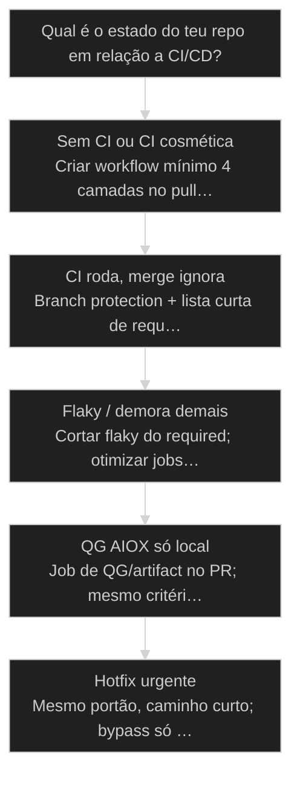
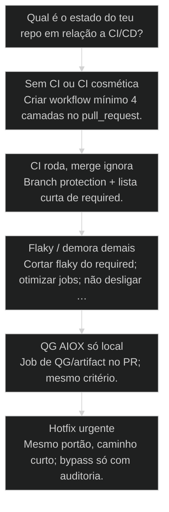

# [[CI-CD|CI/CD]] Pipeline completa: GitHub Actions + Quality Gate pré-[[Merge|merge]]

← [[71-vercel-deploy|Vercel Deploy: do localhost ao mundo]] · ↑ [[modulos/Módulo 12 - Deploy Profissional|M12]] · ⌂ [[Cursos/AIOX Advanced/README|Curso]] · → [[73-prontidao-de-producao|Prontidão de produção: checklist final]]

## Mapa desta aula

Decisão-chave da aula — Qual é o estado do teu repo em relação a CI/CD?

> Leia o diagrama antes do texto longo. Depois volte e confira.

> PR não passa sem PASS — pipeline como lei social do repo, não enfeite de badge verde.

**Objetivos de aprendizagem:**
- Desenhar uma pipeline CI com lint, typecheck, test e [[Quality Gate|quality gate]]. _(apply)_
- Configurar branch protection exigindo checks obrigatórios antes do merge. _(apply)_
- Explicar o papel do QG pré-merge no [[Determinismo Progressivo|determinismo progressivo]] do AIOX. _(understand)_
- Decidir o que bloqueia merge versus o que só reporta, com critério explícito. _(evaluate)_

---

## O que você consegue no fim desta aula

*G · Destino*

Destino claro antes de copiar YAML de Actions.

Ao final desta aula você vai conseguir três coisas concretas:

1. Desenhar a **pipeline mínima séria**: lint → typecheck → test → QG.
2. Ligar **branch protection** pra merge sem PASS ser fisicamente mais difícil.
3. Separar o que é **bloqueante** do que é informativo — sem teatro de 40 jobs.

Se você sair daqui com badge verde que ninguém respeita, a aula falhou.
Pipeline sem proteção de branch é enfeite. Proteção sem QG de verdade é
burocracia. Os dois juntos são **lei social do repo**.

- **Objetivos da aula** (Desenhar CI com QG; Branch protection real; Bloqueante vs informativo)
- **Resultado tangível**: Mapa da pipeline + lista de required checks + regra de merge.
- **Não é o destino**: Copiar workflow monstro de internet e bypassar com admin toda sexta.

---

## O erro do badge cosmética

*P · Onde você está*

Empatia com o ponto de partida real do operador.

Cara, eu vejo o mesmo filme toda semana. Repo com GitHub Actions "completo":
lint, test, build, [[Deploy|deploy]], análise de segurança, linter de markdown, cache de
cache. Aí o merge na sexta? Admin bypass. "É urgente." Segunda-feira o main
está vermelho e ninguém sabe desde quando.

CI/CD no AIOX não é coleção de YAML. É **determinismo progressivo em escala
de time**: o que a story exige no QG local vira check no PR. O que o PR exige
vira lei na branch. O que a branch exige vira hábito. Sem isso, o processo
AIOX morre no primeiro "depois a gente arruma".

Se você está aqui, provavelmente já sentiu um destes sintomas:

- Checks existem mas não são required.
- Test flaky → time aprendeu a re-run até verde.
- Deploy no push da main sem gate de PR.
- [[CodeRabbit]]/QG roda e o merge ignora o veredito.

Beleza. A partir daqui a gente troca cosmético por **portão com dente**.

**Onde a maioria trava**
- Muitos jobs, zero required
- Bypass de admin como hábito
- QG local que não existe no PR

**Onde o operador vai**
- Poucos checks, todos que importam required
- Bypass excepcional e auditado
- Mesmo critério local e remoto

---

## Pipeline como lei, não como enfeite

*S · Rota*

CI verifica. CD promove. Protection trava o atalho.

Definições sem poesia:

- **CI** — a cada push/PR: o código ainda merece existir no main?
- **CD** — com evidência: o artefato pode ir pra preview/prod?
- **Quality Gate** — veredito PASS/FAIL com critérios do produto AIOX.
- **Branch protection** — o GitHub recusa merge se o check falhou.

Ordem de implementação (não pule):

1. Um workflow que roda no PR.
2. Jobs mínimos que falham de verdade (não `continue-on-error` em tudo).
3. Required checks na branch principal.
4. CD só depois do merge (ou preview no PR, prod no main protegido).

Prior-art: quality gate (48), apply-qa-fixes (49), Vercel (71). Aqui a gente
**industrializa o portão** no GitHub.

- **4**: camadas mínimas de CI
- **1**: branch protegida de verdade
- **0**: merge no feeling

- **status**: ci+cd pipeline
- **meta**: lint · type · test · qg
- **meta**: required-checks=on
- **ready**: ready to gate

**Legenda de cores**

O que cada cor sinaliza nesta aula

- **CI** (signal): verificação contínua no PR
- **QG** (insight): critério de qualidade bloqueante
- **Protection** (bench): regra da branch principal
- **CD** (action): promoção com evidência
- **Bypass** (pain): atalho que corrói a lei

**Como ler esta aula**

1. **Camadas**: O que compõe a CI mínima.
2. **QG**: Como o gate AIOX entra no PR.
3. **Caso**: Main vermelho por bypass.
4. **Desenho**: Sua pipeline + protection.

---

## Da cohort: merge no feeling vs lei do repo

*T1 + T2 · WhatsApp*

Realidade do grupo Advanced — cicatriz, não slide.

Enquanto o grupo discute agente e token, o que segura o produto no longo
prazo é **branch protection**. A cohort quebra no QG e no status de task; CI/CD
é a mesma moral em YAML: ninguém mergeia no vermelho.

Se a turma ainda mergeia local e reza, esta aula é o degrau 90% do determinismo
progressivo em forma de Actions.

> **Âncora de campo**: Badge verde opcional é enfeite. Required check é civilização.

> **Materiais / FAQ**: 48 Quality Gate · 09/20 Determinismo progressivo

---

## As quatro camadas que importam

Menos teatro. Mais dente.

Pipeline mínima séria (ajuste nomes ao teu stack):

1. **Lint / format check** — estilo e erros burros baratos.
2. **Typecheck / compile** — contratos de tipo e build headless.
3. **Test** — unit/integration no que é crítico (não coverage de vaidade).
4. **Quality Gate** — o veredito AIOX: AC, CodeRabbit, checks de story,
   secrets scan, o que o teu DoD exige.

O que sobra (e-2e pesado, visual, perf) entra **quando está estável**.
Flaky no required check ensina o time a odiar o portão. Prefira menos checks
honestos a muitos checks mentirosos.

CD em cima:

- **Preview** no PR (Vercel/outros) — ensaio.
- **Deploy prod** no main após merge — palco.
- Nunca "deploy direto do laptop" como caminho normal.

- **1. Barato e rápido**: Lint + typecheck: falha em minutos. [shift-left]
- **2. Prova de comportamento**: Tests no caminho crítico. [signal]
- **3. Veredito de produto**: QG AIOX alinhado ao DoD da story. [gate]

> **Lei do required check**: Se o check não é required, ele é sugestão. Sugestão não é pipeline — é newsletter no PR.

- **Job existe** != **Job protege**: Só required + fail real protege o main.
- **CD automático** != **CD seguro**: Automático sem CI dente é acelerador de incidente.

---

## Quality Gate pré-merge no AIOX

O mesmo critério da story, agora no GitHub.

No AIOX o QG não nasce no Actions — nasce na **story** (aceite, review,
CodeRabbit, evidência). A pipeline **espelha** esse critério:

- Se a story exige testes, o CI roda testes.
- Se a story exige review de agente, o check espera o veredito (ou artifact).
- Se a story exige "sem secret no client", um job grepa o bundle/diff.

Determinismo progressivo: o que era disciplina humana vira **máquina chata**.
Máquina chata é feature. Time maduro ama portão previsível.

Branch protection — checklist mental:

1. Require [[Pull Request]] antes do merge.
2. Require status checks (os da pipeline mínima).
3. Require branches atualizadas (quando fizer sentido).
4. Restringir quem bypassa; logar quando bypassar.
5. CODEOWNERS se o risco pedir.

> **Mesmo DoD, dois lugares**: Se o QG local diz FAIL e o PR mergeia verde, você tem duas verdades. Unifique. Uma verdade só.

**Bloqueante vs informativo**

- **Bloqueante**: Lint erro, type, test crítico, QG FAIL, secret
- **Informativo**: Coverage trend, lint warning negociado, sugestões
- **Ainda não**: E2E flaky, perf sem baseline
- **Nunca required**: Job com continue-on-error eterno

- **Required check**: Status que o GitHub exige verde para permitir merge.
- **Bypass**: Atalho admin que ignora protection — deve ser raro e auditado.
- **Flaky**: Teste que falha sem mudança real — veneno de required check.

---

## Caso: a sexta do admin bypass

Quando a urgência vira cultura e o main vira roleta.

Time de cinco. Pipeline "completa" há meses. Sexta 18h: hotfix de copy no
checkout. Checks ainda rodando. Alguém com admin mergeia com bypass.
Segunda: main quebrado desde sexta — um typeerror num path que o hotfix
tocou sem querer. Três deploys de cliente pegaram o vermelho. Ninguém sabia
porque o badge do README ainda mostrava o último verde antigo.

O conserto não foi "mais jobs". Foi:

1. Required checks de verdade (lint, type, test, QG).
2. Bypass só para dois papéis, com issue obrigatória.
3. Hotfix no mesmo portão — mais curto, não sem dente.
4. CD prod só do main protegido.

Urgência real existe. Lei social fraca é o que transforma urgência em hábito.

**Caminho do PR adulto**

1. **Push**: Branch de story
2. **CI**: Lint · type · test · QG
3. **Preview**: Smoke no ensaio
4. **Review**: Humano + agente
5. **Merge**: Só com required verde

---

## O que a pipeline deve fazer agora?

Árvore curta de desenho e operação.

**Árvore de decisão**
_Seja cruelmente honesto sobre bypass e required checks._

- **Sem CI ou CI cosmética** — Não roda no PR ou ninguém olha.
  → _Criar workflow mínimo 4 camadas no pull_request._
  Ex.: Só README com badge genérico.
- **CI roda, merge ignora** — Checks não required ou bypass crônico.
  → _Branch protection + lista curta de required._
  Ex.: Verde opcional na UI do PR.
- **Flaky / demora demais** — Time odeia esperar ou re-run vira ritual.
  → _Cortar flaky do required; otimizar jobs; não desligar o portão._
  Ex.: E2E 40 min required em todo PR.
- **QG AIOX só local** — Story gate existe, PR não espelha.
  → _Job de QG/artifact no PR; mesmo critério._
  Ex.: CodeRabbit no laptop, zero no Actions.
- **Hotfix urgente** — Prod quebrou de verdade.
  → _Mesmo portão, caminho curto; bypass só com auditoria._
  Ex.: Checkout quebrado em horário comercial.

**Gate:** Um dev júnior consegue mergear no main com check vermelho? — _Se sim, você não tem lei — tem sugestão._

#### Rota implantar CI
Do zero ao dente.
1. **Workflow: pull_request → 4 camadas.
2. **Falhar de verdade: Sem continue-on-error no crítico.
3. **Required: Marcar checks na branch main.
4. **Cultura: Bypass excepcional + post.

#### Rota alinhar QG
Story e PR falam a mesma língua.
1. **DoD: Listar o que é PASS na story.
2. **Mapear: Cada item → job ou check.
3. **Bloquear: Required nos que são lei.
4. **Informar: Resto como report.

#### Rota CD
Promoção depois do portão.
1. **Preview: No PR, com smoke.
2. **Merge: Só main protegido.
3. **Prod: Deploy automático ou botão com log.
4. **Verify: Smoke prod + rollback path.

---

## Desenhe a lei do teu repo (20 min)

YAML mental ou real — mas com required checks nomeados.

Vamos lá. Sem desenho você vai copiar workflow monstro e bypassar na primeira
urgência.

- 1. **Inventário**: Liste o que roda hoje no PR (se nada, escreva 'zero').
- 2. **Mínimo**: Defina os 4 jobs: lint, type/build, test, QG — comandos reais do repo.
- 3. **Required**: Marque quais serão required checks (nome estável).
- 4. **Bypass**: Quem pode bypassar? Em que condição? Como audita?
- 5. **CD**: Onde entra preview e prod na linha do tempo do PR.
- 6. **Gap**: Uma linha: o que o QG da story exige e o CI ainda não espelha.

**Funcionou se:**

- Há mapa de jobs com comandos reais, não genéricos.
- Required checks estão nomeados.
- Política de bypass está explícita (mesmo que seja 'ninguém').

---

## Glossário sem jargão de vaidade

- **CI**: Integração contínua — verifica qualidade a cada mudança (push/PR).
- **CD**: Entrega/deploy contínuo — promove artefato com evidência.
- **Branch protection**: Regras do GitHub que impedem merge sem checks/PR.
- **Required check**: Job cujo status verde é obrigatório para merge.
- **Quality Gate**: Veredito PASS/FAIL alinhado ao DoD da story/produto.

---

## Portão da aula

Você passou quando a pipeline tem dente: checks honestos, required de verdade,
bypass raro, QG da story espelhado no PR. Badge sem lei é decoração. Lei sem
flaky é cultura.

A IA é a seta. O X é seu — inclusive recusar merge vermelho "só dessa vez".

> **Próximo na trilha**: Pipeline boa não basta se o go-live for no feeling: a aula de prontidão de produção (73) fecha o checklist final antes de chamar de produção.

> **GATE-MODULE (auto)**: GPS Goal/Position/Steps presentes · caso + do/dont · decisão 5 branches · prática com evidência · glossário. Alvo DL ≥70 atingido na construção enrich-W5.

***

---

## Navegação

← [[71-vercel-deploy|Vercel Deploy: do localhost ao mundo]] · ↑ [[modulos/Módulo 12 - Deploy Profissional|M12]] · ⌂ [[Cursos/AIOX Advanced/README|Curso]] · → [[73-prontidao-de-producao|Prontidão de produção: checklist final]]
