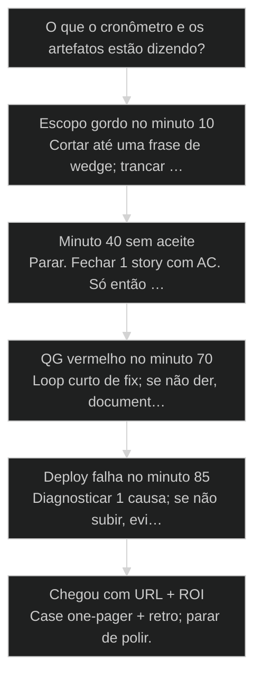
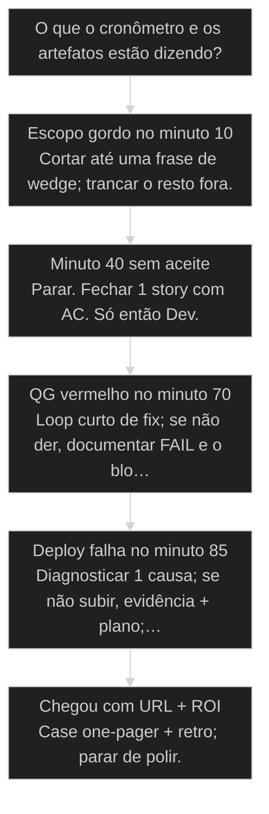

# Caso integrado end-to-end: do briefing ao deploy em 90 minutos

← [[44-metodo-s2s|Método S2S: converter sinais em sistemas]] · ↑ [[modulos/Módulo C - Capstone|MC]] · ⌂ [[cursos/AIOX Advanced/README|Curso]] · → [[75-faq-cohort-campo|FAQ de campo: o que a turma Advanced realmente pergunta]]

## Mapa desta aula

Decisão-chave da aula — O que o cronômetro e os artefatos estão dizendo?

> Leia o diagrama antes do texto longo. Depois volte e confira.

> Prova de maestria sob timer: briefing → PRD → stories → dev → QG → deploy → ROI. Processo sob pressão, não slide.

**Objetivos de aprendizagem:**
- Executar um caso E2E do briefing ao deploy com artefatos obrigatórios em 90 minutos. _(create)_
- Registrar ROI (horas e/ou R$) da fatia entregue com premissas explícitas. _(apply)_
- Aplicar o playbook cronometrado sem pular etapas de processo sob pressão. _(apply)_
- Refletir falhas de processo e ajustar o próprio playbook para a próxima corrida. _(evaluate)_

---

## O que você consegue no fim desta aula

*G · Destino*

Destino do capstone — prova, não assistir.

Ao final desta aula você vai conseguir três coisas concretas:

1. Rodar um **playbook de 90 minutos** do briefing ao deploy com artefatos.
2. Entregar **URL (ou evidência de ship)** + **ROI em uma linha** com premissa.
3. Sair com **retrospectiva de processo** — onde o timer te expôs.

Se você sair daqui só com teoria de "como seria", a aula falhou. Capstone
é suor cronometrado. A pressão é feature: ela mostra onde o teu AIOX ainda
é slide.

- **Objetivos da aula** (Playbook 90m executado; Artefatos E2E completos; URL + ROI + retro)
- **Resultado tangível**: Case one-pager: wedge, links dos artefatos, URL, ROI, 1 melhoria de processo.
- **Não é o destino**: Feature monstro pela metade sem aceite, sem gate, sem número.

---

## O erro de querer o produto inteiro no timer

*P · Onde você está*

Empatia com o ponto de partida real do operador.

Cara, eu vejo o mesmo filme em todo capstone. A pessoa escolhe "refazer o
CRM". Minuto 40: ainda no PRD. Minuto 70: primeira linha de código. Minuto
90: desespero e desculpa. O timer não é inimigo. O **escopo gordo** é.

A unidade certa é o **wedge** — fatia vertical mínima com valor real: um
fluxo que um usuário (ou você amanhã) completa de ponta a ponta. Não o
produto. Não a plataforma. O fio que prova o sistema AIOX: clareza → planta
→ story → build → gate → ship → número.

Se você está aqui, já passou por 69–73 (escada, dados, deploy, CI, prontidão)
ou equivalente. Agora junta. Sob pressão. Sem pular o que dói.

Sintomas de quem ainda não está pronto pro timer:

- Não consegue descrever o wedge em uma frase.
- Pula briefing porque "já sei o que é".
- Chama done sem QG.
- Deploy sem smoke.
- ROI inventado sem premissa.

Beleza. A partir daqui o cronômetro manda — e o playbook te segura.

**Onde a maioria trava**
- Escopo de produto inteiro
- Pular artefato pra 'ganhar tempo'
- ROI de slide sem premissa

**Onde o operador vai**
- Wedge vertical em uma frase
- Cada fase com artefato mínimo
- ROI com conta feia e honesta

---

## O arco E2E em uma tela

*S · Rota*

Sete artefatos. Um timer. Zero teatro.

Artefatos obrigatórios do capstone:

1. **Brief** — dor e outcome em poucas linhas.
2. **PRD curto** — planta do wedge (não do universo).
3. **1–3 stories** com aceite.
4. **Implementação** (diff/PR ou evidência equivalente).
5. **QG** — veredito PASS/WAIVED com motivo.
6. **URL / evidência de deploy** (preview conta se for o palco combinado).
7. **ROI** — horas ou R$ com premissa explícita.

Isso amarra o curso Advanced no ato: processo + agentes + ship + negócio.
Prior-art: etapas (46), [[Ciclo do Story|story cycle]] (47), QG (48), ROI (64), 69–73.

Se sobrar tempo no fim, o escopo estava folgado. Se faltar processo, o timer
mostrou o músculo fraco. Os dois diagnósticos valem ouro.

- **90**: minutos no relógio
- **7**: artefatos obrigatórios
- **1**: wedge vertical

- **status**: e2e capstone
- **meta**: 90m · 7 artifacts
- **meta**: pass=url+roi+retro
- **ready**: ready to run

**Legenda de cores**

O que cada cor sinaliza nesta aula

- **Wedge** (signal): fatia mínima de valor real
- **Playbook** (insight): blocos de tempo fixos
- **Artefato** (bench): prova de cada fase
- **Chegada** (action): URL + ROI
- **Gordo** (pain): escopo que estoura o timer

**Como ler esta aula**

1. **Wedge**: Como cortar o que cabe.
2. **Playbook**: Os blocos de 90 min.
3. **Caso**: Corrida modelo.
4. **Correr**: Prática cronometrada.

---

## Da cohort: 90 minutos com as cicatrizes do grupo

*T1 + T2 · WhatsApp*

Realidade do grupo Advanced — cicatriz, não slide.

O capstone não é inventado no vácuo. As falhas que a turma Advanced já
colecionou viram o script do timer:

- setup/PRO que não traz [[Squad|squad]]  
- story sem ready  
- paralelo que multiplica token  
- QG com status mentiroso  
- deploy sem env  

Em 90 minutos você prova o sistema inteiro — e prova que leu o grupo, não só o
PDF. Brief → PRD → stories → build → QG → ship → ROI em uma linha.

> **Âncora de campo**: Maestria é processo sob pressão com as mesmas dores da cohort — não slide novo.

> **Materiais / FAQ**: SYNTHESIS.md + FAQ-cohort.md · materials/fluxo-ideia-ao-deploy.md

---

## Wedge: a fatia que cabe em 90 minutos

Se não cabe no timer, não é wedge — é ambição.

**Wedge** bom tem:

- Um **usuário** (mesmo que seja você).
- Uma **dor mensurável** (tempo, erro, dinheiro).
- Um **fluxo ponta a ponta** (entrada → resultado).
- Dependências que você **já tem** (auth pronta, Supabase ok, deploy já
  configurado) — ou o setup entra no escopo e o resto encolhe.

Exemplos que costumam caber:

- Gerar relatório X a partir de form e mandar pra pasta/URL.
- CRUD mínimo de entidade já modelada com RLS ok.
- Automação de um passo manual diário com [[Runner|runner]] + UI fina.
- Landing + waitlist + planilha/Supabase com confirmação.

Exemplos que **não** cabem:

- "O app completo".
- Multi-tenant do zero + billing + design system novo.
- Migrar stack no meio do capstone.

Regra: se o brief passa de meia página, você já está gordo.

> **Lei do wedge**: Uma frase de valor + um fluxo + um número de ROI. Se precisa de roadmap pra explicar, corta.

- **1. Dor**: O que dói hoje, em tempo ou R$. [por quê]
- **2. Fluxo**: Entrada → processamento → saída. [o quê]
- **3. Prova**: URL + ROI com premissa. [e daí]

- **MVP de produto** != **Wedge de 90 min**: MVP pode ser semanas; wedge é fatia de prova sob timer.
- **Muitas stories** != **Progresso**: 1 story afiada vence 5 rascunhos.

---

## Playbook cronometrado: os blocos

Memoriza os blocos. No dia D você não negocia com o relógio — executa.

**Playbook oficial do capstone (90 min):**

| Bloco | Tempo | Foco | Artefato |
|-------|-------|------|----------|
| 0 | 0–5 | Escolher wedge + timer ligado | Frase do wedge |
| A | 5–15 | Brief + PRD curto | Brief + planta |
| B | 15–25 | 1–3 stories com aceite | Stories ready |
| C | 25–65 | Build (Dev) | Diff/PR |
| D | 65–80 | QG + fixes curtos | Veredito QG |
| E | 80–88 | Deploy + smoke | URL |
| F | 88–90 | ROI + retro em 1 linha cada | Case one-pager |

Folgas conscientes:

- Se o build estoura: **corta escopo**, não o QG.
- Se o QG falha: **loop curto** — não minta PASS.
- Se o deploy falha: documente evidência e o bloqueio; ROI ainda registra
  o que o processo pouparia quando destravar — com honestidade.

Agentes: use as órbitas. Não chame @Dev no minuto 3. Não chame deploy no
feeling no minuto 89 sem smoke.

**Linha do tempo 90m**

1. **0–15**: Wedge · brief · PRD
2. **15–25**: Stories + aceite
3. **25–65**: Build focado
4. **65–80**: QG + fix curto
5. **80–90**: Deploy · ROI · retro

> **Buffer embutido**: Os blocos já assumem fricção. Se você 'otimiza' pulando brief, o buffer vira dívida no minuto 70.

**Se o timer apertar**

- **Corta feature**: Nunca corta aceite crítico
- **Corta polish**: Nunca corta smoke mínimo
- **Corta story 2–3**: Uma story done > três meias
- **Não corta QG**: FAIL honesto > PASS mentiroso

---

## Caso: a corrida do relatório semanal

Modelo de wedge que cabe — e o que o playbook produziu.

Operador: toda sexta, 2h montando relatório de leads à mão. Wedge: form
interno → normaliza → PDF/URL → pasta do time.

- **0–15:** brief ("2h → 10 min") + PRD de uma página (campos, output, quem usa).
- **15–25:** 2 stories — (1) ingestão + schema, (2) geração + link.
- **25–65:** Supabase já existia; Dev na story 1+2 finas; runner no miolo.
- **65–80:** QG — teste dos dois paths; um fix de validação.
- **80–88:** Preview Vercel + smoke (submit → link).
- **88–90:** ROI: 2h × 4 semanas × R$ valor/hora interno = linha no case.
  Retro: "quase gastei 15 min escolhendo lib de PDF — devia ter travado no minuto 5".

Não era SaaS. Era **prova de sistema**. O degrau da escada subiu com evidência.

> **ROI honesto**: Premissa à mostra: (tempo economizado por ocorrência) × (frequência) × (custo da hora) − (custo de rodar). Número feio e verdadeiro vence slide redondo.

- **One-pager de case**: Wedge + links + URL + ROI + 1 retro em uma página.
- **PASS mentiroso**: Declarar done com QG vermelho ou smoke pulado.
- **Loop curto**: Fix mínimo no QG sem reabrir o produto inteiro.

---

## No meio da corrida — o que fazer?

Árvore de sobrevivência sob timer.

**Árvore de decisão**
_Proteja o processo. O ego quer código cedo e done mentiroso._

- **Escopo gordo no minuto 10** — Brief já vira épico.
  → _Cortar até uma frase de wedge; trancar o resto fora._
  Ex.: CRM completo → só 'criar lead + listar'.
- **Minuto 40 sem aceite** — Código sem story ready.
  → _Parar. Fechar 1 story com AC. Só então Dev._
  Ex.: Refatorando UI sem DoD.
- **QG vermelho no minuto 70** — Gate falhou.
  → _Loop curto de fix; se não der, documentar FAIL e o bloqueio._
  Ex.: Teste de isolamento quebrado.
- **Deploy falha no minuto 85** — Env/build/smoke.
  → _Diagnosticar 1 causa; se não subir, evidência + plano; ROI ainda conta processo._
  Ex.: Env de preview faltando.
- **Chegou com URL + ROI** — Artefatos 1–7 ok.
  → _Case one-pager + retro; parar de polir._
  Ex.: Smoke ok, número escrito.

**Gate:** Você consegue apontar o artefato da fase atual em 5 segundos? — _Se não tem artefato, você não está na fase — está improvisando._

#### Rota playbook padrão
Seguir a tabela de blocos.
1. **0–15: Wedge · brief · PRD
2. **15–25: Stories ready
3. **25–65: Build
4. **65–90: QG · deploy · ROI · retro

#### Rota corte de emergência
Timer comeu o build.
1. **Uma story: Mate as outras.
2. **Happy path: Só o fluxo que prova valor.
3. **QG mínimo: Aceite crítico + smoke.
4. **Ship: URL feia > local herói

#### Rota pós-capstone
Depois do bip.
1. **Case: One-pager com links.
2. **Retro: 1 falha de processo.
3. **Ajuste: Atualizar teu playbook pessoal.
4. **Repetir: Outro wedge em 7 dias.

---

## Playbook 90 min — corrida real

Capstone: cronômetro ligado. Artefatos ou não passou.

Isso não é exercício de 15 minutos. É a **corrida de 90**. Prepare o ambiente
antes (repo, Supabase, Vercel, CI se já tiver). Depois: timer. Sem pausa de
"deixar pro depois" no meio do bloco — só corte de escopo.

**Pré-voo (antes do timer, 10 min à parte):**
- Repo clona/builda.
- Acessos ok (Supabase/Vercel/GitHub).
- Template de one-pager aberto.
- Lista de órbitas (@PM/@PO/@Dev/@QA/@DevOps/@data-engineer) à mão.

- 0. **0:00 — Start**: Ligue o timer de 90. Escreva a frase do wedge. Se não couber em uma frase, corte agora.
- 1. **0:05–0:15 — Brief+PRD**: Dor, outcome, fluxo, fora de escopo. PRD de 1 página do wedge. Nada de épico.
- 2. **0:15–0:25 — Stories**: 1–3 stories com aceite testável. Marque ready só o que for buildar.
- 3. **0:25–1:05 — Build**: Implemente só o ready. Commits pequenos. Se atrasar, mate story — não qualidade do miolo.
- 4. **1:05–1:20 — QG**: Rode o gate (testes, review, checklist AIOX). Loop curto de fix. Sem PASS mentiroso.
- 5. **1:20–1:28 — Deploy+smoke**: Preview/prod combinado. Smoke mínimo. Cole a URL.
- 6. **1:28–1:30 — ROI+retro**: ROI com premissa. Uma frase de retro de processo. One-pager fechado.
- 7. **Pós-bip**: Arquive links dos 7 artefatos. Se falhou: o que o timer expôs vira backlog de processo, não de ego.

**Funcionou se:**

- Os 7 artefatos existem (mesmo que algum seja 'bloqueado com evidência').
- Há URL ou prova de tentativa de ship com diagnóstico.
- ROI tem premissa numérica; retro tem 1 melhoria de processo.
- Nenhuma fase foi 'pulada em silêncio' — corte foi explícito.

---

## Prática: conduza um wedge do briefing ao ROI no seu projeto real

Você vai produzir um mini-caso end-to-end no seu projeto de verdade: os 7 artefatos do capstone encadeados sob timer, fechados em um one-pager de case.

**Exemplo preenchido: automatizar o follow-up de propostas paradas**

- **Wedge (0–5)**: "Vendedor cola a lista de propostas paradas → sistema devolve follow-up pronto por proposta". Evidência: frase única no topo do one-pager — se precisou de parágrafo, corte agora.
- **Brief + PRD curto (5–15)**: dor ("40 min/dia caçando proposta parada"), outcome, fluxo, fora de escopo. Evidência: PRD de 1 página do wedge, sem épico (etapas em `lessons/46-etapas-de-desenvolvimento.md`).
- **Stories com aceite (15–25)**: 2 stories — (1) ingestão da lista, (2) geração do follow-up — marcadas ready. Evidência: cada aceite responde "como eu provo que fechou?" (formato em `lessons/47-ciclo-de-vida-do-story.md`).
- **Build (25–65)**: implementar só o que está ready, commits pequenos; se atrasar, mate story — não qualidade. Evidência: diff/PR apontável em 5 segundos.
- **QG (65–80)**: rodar o gate; loop curto de fix se vier vermelho. Evidência: veredito PASS/WAIVED com motivo escrito — nunca PASS mentiroso (critérios em `lessons/48-quality-gate-completo.md`).
- **Deploy + smoke (80–88)**: preview/prod combinado + smoke mínimo (submit → resultado). Evidência: URL colada no case — ou bloqueio documentado com 1 causa e plano (`lessons/71-vercel-deploy.md`).
- **ROI + retro (88–90)**: conta feia e honesta: (tempo poupado × frequência × custo/hora) − custo de rodar (base em `lessons/64-vender-pela-dor-e-roi.md`). Evidência: ROI com premissa explícita + 1 frase de retro de processo.
- **One-pager de case (pós-bip)**: wedge, links dos 7 artefatos, URL, ROI e retro em uma página arquivada. Evidência: outra pessoa entende a corrida sem te perguntar nada.

> **Teste rápido**: Se em qualquer minuto da corrida você aponta o artefato da fase atual em 5 segundos, o processo aguentou o timer.

---

## Portão da aula

*Gate*

O capstone só conta com a prova completa nas mãos, não com corrida "quase" fechada.

> **Portão da aula**: Você só passa do capstone quando consegue apresentar os 7 artefatos da sua corrida — do brief ao ROI com premissa — com URL ou bloqueio documentado, sem nenhuma fase pulada em silêncio.

---

## Glossário sem jargão de vaidade

- **Caso E2E**: Exercício ponta a ponta com artefatos, evidência e chegada mensurável.
- **Playbook 90m**: Blocos de tempo fixos do capstone do briefing ao ROI.
- **Wedge**: Menor fatia vertical de valor real que prova o sistema.
- **ROI de sessão**: Horas ou R$ economizados/gerados pela fatia, com premissa explícita.
- **One-pager de case**: Registro final: wedge, links, URL, ROI, retro.

---

## Portão do capstone

Você passou quando tem case E2E com artefatos, URL (ou bloqueio honesto) e
ROI com premissa — e uma retro que muda o próximo playbook. Maestria AIOX
não é decorar agente. É **processo sob pressão** com evidência.

O Advanced não termina em slide. Termina em corrida. A IA é a seta. O X é
seu — inclusive apertar o cronômetro de novo na semana que vem.

> **Depois do capstone**: Arquive o one-pager. Repita com outro wedge. A escada sobe com provas empilhadas, não com um único herói de 90 minutos.

> **GATE-MODULE (auto)**: GPS Goal/Position/Steps presentes · caso + do/dont · decisão 5 branches · prática 90min playbook · glossário. Alvo DL ≥70 atingido na construção enrich-W5 · CAPSTONE.

***

---

## Navegação

← [[44-metodo-s2s|Método S2S: converter sinais em sistemas]] · ↑ [[modulos/Módulo C - Capstone|MC]] · ⌂ [[cursos/AIOX Advanced/README|Curso]] · → [[75-faq-cohort-campo|FAQ de campo: o que a turma Advanced realmente pergunta]]
