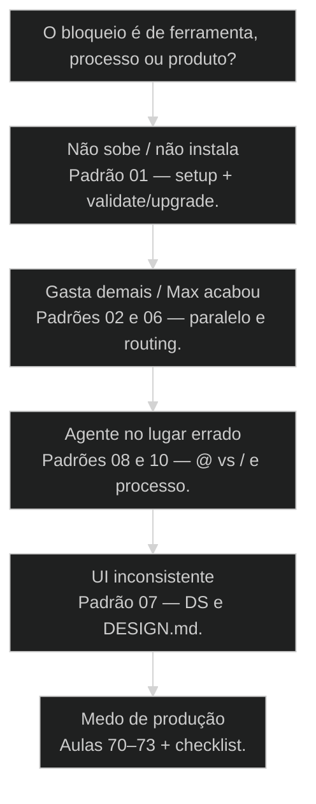
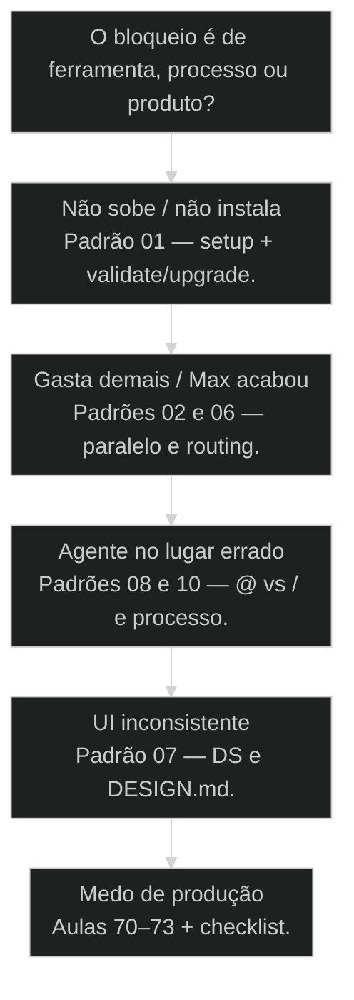

# FAQ de campo: o que a turma Advanced realmente pergunta

← [[74-caso-integrado-end-to-end|Caso integrado end-to-end: do briefing ao deploy em 90 minutos]] · ↑ [[support/README|Suporte]] · ⌂ [[cursos/AIOX Advanced/README|Curso]]

## Mapa desta aula

Decisão-chave da aula — O bloqueio é de ferramenta, processo ou produto?

> Leia o diagrama antes do texto longo. Depois volte e confira.

> Dez padrões de dúvida dos grupos WhatsApp — com resposta de operação, não de marketing. Use como mapa de suporte e como índice reverso das aulas.

**Objetivos de aprendizagem:**
- Reconhecer os 10 padrões de dúvida mais frequentes da cohort Advanced. _(remember)_
- Aplicar a resposta de operação correta (não o atalho de marketing) em cada padrão. _(apply)_
- Roteirizar cada dúvida para a aula canônica do curso (índice reverso). _(apply)_
- Diagnosticar se o bloqueio é setup, processo, token ou produto. _(analyze)_

---

## O que você consegue com este FAQ

*G · Destino*

Ao final desta aula você consegue:

1. Ouvir uma dúvida da turma (ou a sua) e **classificar o padrão**.
2. Dar a **resposta de operação** sem enrolar.
3. Mandar a pessoa (ou você) para a **aula certa** — não para mais um zip.

Isto não substitui as 74 aulas. É o **mapa de suporte** que o WhatsApp escreveu
com sangue de Max semanal e print de erro.

- **Destino**: 10 padrões · resposta · link de aula
- **Não é o destino**: Decorar thread do grupo. O destino é operar sem repetir o mesmo buraco.

---

## O grupo não é ruído — é curriculum escondido

*P · Campo*

Cara, o Advanced gerou milhares de mensagens. A maior parte é logística. O ouro
está nos padrões que **se repetem**: PRO sem [[Squad|squad]], paralelo que multiplica token,
[[CLAUDE md|CLAUDE.md]] novela, Ralph no dev, QG com status mentiroso, deploy no feeling.

Se você é aluno: use este FAQ antes de mandar "alguém me ajuda?" de novo.
Se você é mentor: use como roteiro de plantão.

> **Fonte**: Exports WhatsApp T1 (~10k msgs) e T2 (~3k msgs). Síntese em cohort-insights/SYNTHESIS.md.

---

## Os 10 padrões em uma tela

- **status**: faq cohort campo
- **meta**: padroes=10
- **meta**: t1+t2=whatsapp
- **ready**: ready to route

**Ordem de frequência na prática de suporte**

1. **PRO/squads**: Install que não traz o arsenal.
2. **Paralelo/token**: Subagents e Max estourado.
3. **CLAUDE.md**: Global vs projeto, arquivo gordo.
4. **Squad creator**: Open vs PRO, prior-art.
5. **Ralph/dev**: Paralelo no lugar errado.
6. **QG/status**: Done mentiroso no loop.
7. **Design DS**: Base + derivados.
8. **Deploy**: Env, Vercel, medo de prod.
9. **@ vs /**: Sintaxe sem processo.
10. **Processo**: IA no lugar burro.

---

## 00 — Não acho o que foi compartilhado / qual é a última versão?

*Findability*

A dor #0 da turma: WhatsApp não é repositório.

**Dor (a mais cara em tempo de suporte):** o aluno chega no meio do cohort, o grupo
tem 9 `squad-creator.zip`, 8 `design.zip`, 6 `hormozi.zip`… e ninguém sabe o LATEST.
"Manda de novo", "cadê o guia de tokens?", "qual versão do creator?".

**Operação:**
1. Abra `cohort-insights/CATALOG.md` (ou peça o link pinado).
2. `Cmd+F` no nome do pack.
3. Use só a linha **LATEST** (data + cohort + nome do arquivo).
4. Se não tiver o binário local: peça reenvio **dessa** versão — não "o squad-creator".
5. Squad: depois do download, `*validate-squad` / upgrade — zip não instala sozinho.

**Por quê isso existe:** o WhatsApp é correio. Correio acumula. Catálogo resolve.

**Aulas / artefatos:** `cohort-insights/CATALOG.md`, `FINDABILITY.md`, `catalog.yaml`.

> **Regra da casa**: WhatsApp não é CDN. LATEST = CATALOG.md. Mensagem de pack novo = nome com data/semver + 1 linha de changelog.

> **Resposta-padrão do mentor**: Não sobe o grupo — abre o CATALOG.md e busca o product_key. LATEST está marcado.

**Piores multi-versão no export T1**

9. **squad-creator**: LATEST tende a squad-creator-pro.zip
8. **design.zip**: 8 dumps — só LATEST
6. **hormozi.zip**: 6 dumps
4. **economia-tokens / openclaw / tech-research**: Várias revisões

---

## 01 — Instalei o PRO e os squads não vieram

**Dor:** install novo, pasta sem os squads da aula, print no grupo.

**Operação:** (1) reinstalar/atualizar PRO; (2) se falhar, pacote zip da turma;
(3) `*validate-squad` e `*upgrade-squad`. Contagem de 90 dias a partir da
**ativação**, não do marketing do site.

**Aulas:** 45 (canteiro/órbitas), 34, 55.

> **Regra**: Zip sem validate é enfeite. Validate + upgrade é o ritual.

---

## 02 — Várias stories em subagents para não estourar contexto?

**Dor:** medo da janela; esperança de que paralelo “economiza”.

**Operação:** isola contexto **por task**, mas **multiplica gasto** (N × 80–120k).
Particione ownership de arquivo. Meça wall-clock. Paralelo sem mapa é
atropelamento + fatura.

**Aulas:** 16, 17, 58, 59, 61.

> **Campo Alan**: Tasks isoladas podem somar contexto de TEAM enorme; isso não autoriza um agente só entupido.

---

## 03 — CLAUDE.md global vs do projeto

**Dor:** boas práticas, arquivo monstro, medo de perder regra.

**Operação:** global magro; projeto com leis locais; budget ~150 instruções.
461 linhas é dívida. Resto vira doc linkado.

**Aulas:** 03, 27 · material `escrevendo-um-bom-claude-md.md`.

> **Budget**: Lei curta se obedece. Manual longo a IA finge que leu.

---

## 04 — Squad creator sumiu do open / uso o pack pronto?

**Dor:** creator no GitHub some; zips de squad inundam o grupo.

**Operação:** núcleo open não carrega o modelo de negócio completo; caminho é
PRO/curadoria da turma. Pack pronto serve se você **entende a órbita**;
creator continua sendo músculo com prior-art.

**Aulas:** 34, 55, 23.

> **Ordem**: Prior-art → validate → upgrade → só então create.

---

## 05 — Ralph para desenvolver feature?

**Dor:** terminal com 20 Ralphs parece produtividade.

**Operação (Alan no grupo):** vários Ralphs para **ETL**; **nunca** como padrão
de desenvolvimento de feature sem partição. Dev sem ownership é conflito
agendado.

**Aulas:** 58, 22, 59.

> **Regra de ouro**: Ralph multiplica força e conflito — partição primeiro.

---

## 06 — Acabou o Max semanal: vou de API?

**Dor:** limite semanal, pânico, upgrade de cartão.

**Operação:** API como ponte; jogo longo = **menos generativo, mais determinístico**
([[Runner|runner]], script, processo). Routing de modelo 40–60% de corte quando bem feito.

**Aulas:** 01, 21, 30, 60 · materiais de [[Token Economy|economia de tokens]].

> **Campo**: Gastar muito costuma ser processo errado, não falta de crédito.

---

## 07 — Design system em vários produtos da mesma empresa

**Dor:** base + derivados, monorepo, 'meu mentor-hub com o DS de vocês'.

**Operação:** base compartilhada, derivados por produto; [[DESIGN md|DESIGN.md]] + Storybook
como contrato; não reinventar token em cada app.

**Aulas:** 41–43, 56–57.

> **Contrato**: Se a IA não leu DESIGN.md, ela está no default dela — não no seu DS.

---

## 08 — Sem / o agente responde igual?

**Dor:** confusão de sintaxe, 'ele chamou sozinho'.

**Operação:** @ = persona; / = ritual/comando com greeting e processo.
Sem processo a IA vai pro lugar burro — e gasta teu token com confiança.

**Aulas:** 45, 14, 15.

> **Alan**: Conhecer o sistema e direcionar > torcer pro modelo adivinhar.

---

## 09 — [[Quality Gate]] e status da task

**Dor / learning T2:** task marcada completed **no meio** do QG loop.

**Operação:** durante apply-fixes / re-gate a task fica **in_progress**.
Completed só quando o loop fecha. Done mentiroso queima PR e moral.

**Aulas:** 47, 48, 49.

> **Estado honesto**: QG em andamento ≠ done. Mentir status é bug de processo.

---

## 10 — “IA sem processo”

**Dor:** modelo no caminho errado, você corrige no feeling, repete amanhã.

**Operação:** processo (story, gate, órbita, runner) é o superpoder.
Token economy e qualidade são o mesmo músculo.

**Aulas:** 08, 09, 21, 28 · frase-guia da cohort.

> **Frase-guia**: IA sem processo é desperdício de tokens.

---

## Qual padrão é a sua dúvida agora?

**Árvore de decisão**
_Classifique antes de mandar mais um zip no grupo._

- **Não sobe / não instala** — PRO, squad, comando some.
  → _Padrão 01 — setup + validate/upgrade._
  Ex.: Install limpo sem squads.
- **Gasta demais / Max acabou** — Fatura ou limite semanal.
  → _Padrões 02 e 06 — paralelo e routing._
  Ex.: 10 subagents na mesma tarde.
- **Agente no lugar errado** — Diff inútil, órbita confusa.
  → _Padrões 08 e 10 — @ vs / e processo._
  Ex.: @Dev reescrevendo produto.
- **UI inconsistente** — Cada tela um planeta.
  → _Padrão 07 — DS e DESIGN.md._
  Ex.: Botão novo a cada prompt.
- **Medo de produção** — Localhost ok, cliente amanhã.
  → _Aulas 70–73 + checklist._
  Ex.: Sem RLS, sem CI.

**Gate:** Você consegue apontar o padrão (01–10) e a próxima aula em 10 segundos? — _Se não aponta, ainda está no modo 'alguém me ajuda' sem mapa._

#### Suporte rápido
Plantão mentor.
1. **Ouvir: Uma frase do bloqueio.
2. **Classificar: Padrão 01–10.
3. **Responder: Operação em 3 bullets.
4. **Encaminhar: Aula canônica.

#### Auto-destravar
Aluno solo.
1. **Ler FAQ: Achar o padrão.
2. **Fazer o ritual: Validate/upgrade, gate, etc.
3. **Só então grupo: Com evidência do que tentou.

---

## Plantão simulado (10 min)

Três tickets inventados — ou três prints reais do teu histórico.

- 1. **Ticket A**: Classifique no padrão 01–10 e escreva a resposta de operação.
- 2. **Ticket B**: Outro padrão — linke a aula canônica.
- 3. **Ticket C**: Se for o seu bloqueio atual, execute o ritual hoje.

**Funcionou se:**

- Três tickets com padrão + resposta + aula.
- Nenhuma resposta foi só 'reinstala tudo' sem critério.
- Você sabe a diferença entre zip e validate.

---

## Glossário de campo

- **Padrão de cohort**: Dúvida que se repete o suficiente para merecer FAQ e aula, não só reply avulso.
- **Resposta de operação**: Passos e ritual (validate, gate, partição) — não motivação vazia.
- **Índice reverso**: Da dúvida para a aula canônica, em vez da aula para um exercício artificial.
- **Cicatriz**: Aprendizado pago com token, tempo ou merge ruim — base deste FAQ.

---

## Portão da aula

Portão: você classifica dúvida de campo em 10 padrões, responde com operação e
aponta a aula certa. O grupo Advanced escreveu este FAQ sem saber — agora ele
trabalha a favor do curso.

> **Próximo**: Volte para a trilha: se o padrão for token/determinismo, 01 e 21; se for órbita, 45; se for ship, 70–74.

> **Fontes**: cohort-insights/SYNTHESIS.md · FAQ-cohort.md · materials/

***

---

## Navegação

← [[74-caso-integrado-end-to-end|Caso integrado end-to-end: do briefing ao deploy em 90 minutos]] · ↑ [[support/README|Suporte]] · ⌂ [[cursos/AIOX Advanced/README|Curso]]
