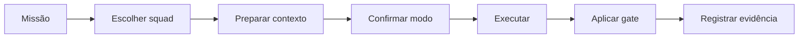

# Guia de execução

[⌂ Curso](README.md) · [Mapa de decisão](Mapa-de-decisao.md) · [Aula 00](aulas/00-como-usar-este-curso.md) · [Pré-requisitos Advanced](ponte/pre-requisitos-advanced.md)

## Instalação no seu projeto

```bash
cp -R squads/<nome-do-squad> /seu-projeto/squads/
```

Este curso vive em `cursos/`; os pacotes executáveis vivem em `squads/` (e skills opcionais em `skills/`).

## As quatro superfícies de uso

Um squad pode aparecer com mais de uma superfície, conforme o ambiente. **Nenhuma é universal** — só use a sintaxe depois de confirmar o runtime e a instalação.

| Superfície | Significado | Onde costuma existir |
|------------|-------------|----------------------|
| `$nome-da-skill` ou skill por nome | Wrapper de entrada (`skills/<nome>/SKILL.md`) | Claude Code (skills instaladas); Codex (se skills do projeto estiverem configuradas) |
| `@nome-do-agente` | Ativar orquestrador/especialista | Claude Code / harness AIOX quando o mapeamento `@` existe |
| `*comando` | Task do agente já ativado | Harness que expõe tasks do agente |
| `/prefixo:...` | Comando registrado no runtime | Claude Code / AIOX quando o pack foi registrado |

As aulas mostram a superfície documentada pelo próprio squad. Se ela não existir no seu runtime, use o **prompt genérico** da rota em [agent-router.json](agent-router.json) e o briefing copiável da aula. Não invente um comando parecido.

### Compatibilidade por runtime

- **Codex:** forneça [AGENT-GUIDE.md](AGENT-GUIDE.md) + [agent-router.json](agent-router.json) como contexto, ou instale `$aiox-squads`. Carregue a aula e `squads/<id>/`. **Não** assuma que `@agent`, `*comando` ou `/comando` executam.
- **Claude Code:** instale `$aiox-squads` ou a skill do squad no diretório de skills do projeto; como alternativa, forneça o guia e o roteador como contexto. Use `@agent`, `*comando` ou `/comando` **somente** se o pacote estiver registrado no projeto.
- **Outro agente:** leia [AGENT-GUIDE.md](AGENT-GUIDE.md) + [agent-router.json](agent-router.json). O `generic_prompt` de cada rota funciona sem sintaxe proprietária.

## Ciclo universal de uso



1. Escreva a missão como transformação observável.
2. Use o [Mapa de decisão](Mapa-de-decisao.md) e confira o anti-escopo da aula.
3. Prepare objetivo, contexto, entradas, restrições e formato de saída.
4. Confirme maturidade, runtime e qualquer efeito externo.
5. Ative o orquestrador; acesse especialista direto apenas quando a rota já estiver clara.
6. Exija o gate indicado na aula.
7. Salve decisão, artefato, validação e próximo passo.

## Briefing universal

```text
Use o squad {nome}.

Objetivo: {mudança observável desejada}
Estado atual: {o que existe hoje}
Entradas disponíveis: {arquivos, dados, links ou decisões}
Público/usuário: {quem recebe ou usa a saída}
Restrições: {prazo, stack, marca, segurança, orçamento}
Saída esperada: {artefato e formato}
Critérios de aceite: {3 a 5 testes objetivos}
Fora de escopo: {o que não deve ser alterado}

Antes de executar, confirme a rota, as dependências ausentes e qualquer efeito externo.
```

## Quando parar

Pare e peça direção se faltar credencial, autoridade para escrever em serviço externo, escolha de negócio que altera o resultado ou dado essencial que não pode ser inferido. Falha de validação não é motivo para encerrar: diagnostique, corrija e rode o gate novamente.

## Evidência mínima

Toda execução deve deixar quatro peças:

- `briefing`: o contrato de entrada;
- `decision-log`: por que este squad e esta rota foram escolhidos;
- `deliverable`: o artefato produzido;
- `validation`: checklist, teste, score ou revisão que sustentou o aceite.
