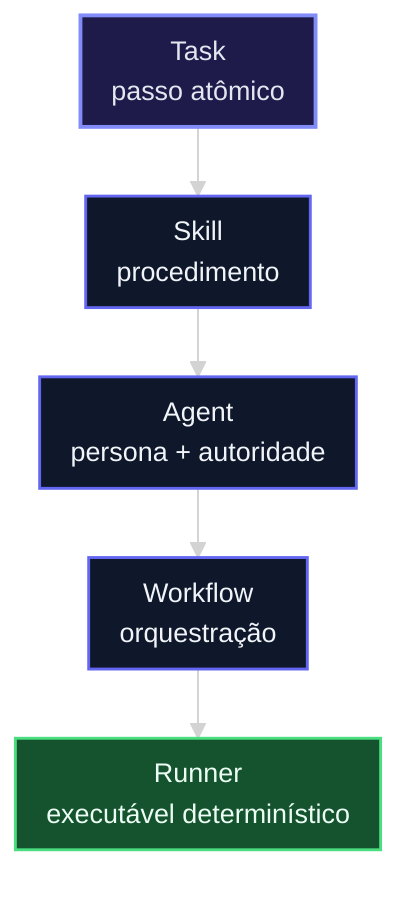
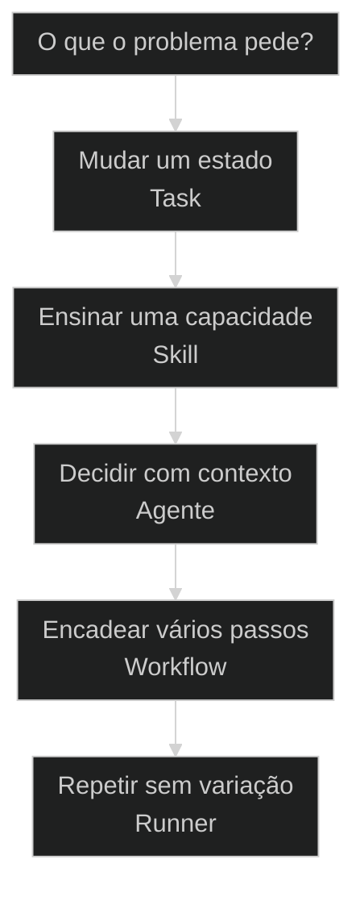

# Taxonomia AIOX: Task, Skill, Agente, Workflow e Runner

← Entidade como unidade de processo: nasce, vive, morre · ↑ M5 · ⌂ Curso · → Sub-agents versus Swarm-agents: isolado ou em rede

## Conceitos

- Taxonomia AIOX
- Runner

## Mapa desta aula

Taxonomia AIOX: do passo atômico ao executável determinístico (só desce o nível).



> Leia o diagrama antes do texto longo. Depois volte e confira.

> Os cinco primitivos do framework numa escala única: do átomo de trabalho (Task) ao executável determinístico (Runner). Saber a ordem evita usar a peça errada.

**Objetivos de aprendizagem:**
- Nomear os cinco primitivos AIOX e a ordem da escala que os conecta. _(remember)_
- Distinguir Skill de Agente usando a analogia livro versus chef. _(understand)_
- Escolher o primitivo certo para um problema dado antes de criar arquivo. _(apply)_
- Explicar por que o Runner é o nível mais determinístico da escala. _(understand)_

---

## Cinco primitivos numa escala única

*Taxonomia AIOX · Task < Skill < Agente < Workflow < Runner*

Task, Skill, Agente, Workflow e Runner não são sinônimos. São cinco níveis numa escala que vai do átomo de trabalho ao executável determinístico. Confundir os níveis é a causa raiz de squad inflado.

- **5**: primitivos na escala
- **1**: ordem que conecta tudo
- **0**: sinônimos entre eles

- **status**: primitive scale
- **meta**: escala=task<skill<agente<workflow<runner
- **meta**: analogia=letra<palavra<frase<paragrafo<livro
- **meta**: regra=peca_certa_para_o_problema_certo
- **ready**: ready to compose

**Legenda de cores**

Mapa semantico dos cinco primitivos

- **Task** (signal): transformacao de estado, unidade atomica
- **Skill** (insight): capacidade ensinavel, arquivo md
- **Agente** (bench): persona que decide e executa skills
- **Workflow** (action): sequencia orquestrada de passos
- **Runner** (pain): executavel deterministico do workflow

---

## Comece pela escala

Antes dos nomes técnicos um a um, vem o movimento geral: tudo se compõe de baixo para cima. Cada nível usa os anteriores.

**Como ler esta aula**

1. **A escala aparece**: Cinco níveis ordenados: Task, Skill, Agente, Workflow, Runner.
2. **Cada nível compõe**: Skill agrupa tasks, agente executa skills, workflow orquestra agentes, runner roda o workflow.
3. **Vê casos reais**: Cada primitivo existe de verdade no repo, em squads/ e .claude/.
4. **Escolhe a peça**: Na prática, dado um problema, você aponta qual nível resolve.

- **Objetivos da aula** (Nomear os cinco primitivos e a ordem da escala.; Distinguir Skill de Agente (livro vs chef).; Escolher o primitivo certo antes de criar arquivo.; Explicar por que o Runner é o nível determinístico.)
- **Onde você está?** (Começando: foque Mapa Simples e a analogia ortográfica.; Já usa AIOX: foque Casos Reais e a Decisão.; Vai criar squad: foque Composição e Determinismo.)
- **Leitura prática**: Em cada bloco, procure uma resposta: que nível é este, o que ele compõe abaixo e quem o usa acima.

**Ritmo da aula**

A taxonomia fica clara quando cada nível tem definição curta, exemplo real e relação com o vizinho.

- G **Escala antes dos termos**: Primeiro a ordem geral, depois cada nome técnico.
- 1 **Analogia que ancora**: Letra, palavra, frase, parágrafo, livro. E livro vs chef para Skill vs Agente.
- 2 **Caso real por nível**: Cada primitivo é apontável no repositório, não abstrato.
- 3 **Recap com decisão**: A aula fecha com o aluno escolhendo a peça para um problema dele.

---

## A escala sem jargão

Antes dos nomes técnicos, a taxonomia é só isto: pedaços pequenos se juntam em pedaços maiores, e o maior de todos é o que roda sozinho.

> **Em uma frase**: Task é a menor unidade de trabalho. Skill ensina a fazer. Agente decide e faz. Workflow encadeia. Runner executa o encadeamento sem improviso.

- **Task não é o objetivo final** -> É um passo: transforma um estado em outro. Pequena de propósito.
- **Skill não age sozinha** -> É conhecimento ensinável em arquivo. Precisa de alguém que a leia e aplique.
- **Agente não é só um md** -> É a persona que decide qual skill usar e quando. Tem julgamento.
- **Workflow não é uma task grande** -> É a sequência de passos que vários agentes percorrem em ordem.
- **Runner não pensa** -> É o executável que roda o workflow igual toda vez. Determinismo, não decisão.

**Diagrama principal: do menor ao maior**

1. **Task**: Uma transformação de estado. Ex: validar um story draft.
2. **Skill**: Capacidade ensinável que agrupa tasks. Ex: review-story.
3. **Agente**: Persona que escolhe e executa skills. Ex: @qa.
4. **Workflow**: Sequência de agentes e passos. Ex: full-sdc (validate→develop→review→close).
5. **Runner**: Executável determinístico do workflow. Ex: runner-lib em infrastructure/.

**O que a escala evita**
- Criar agente quando bastava uma skill.
- Tratar workflow como se fosse uma task gigante.
- Esperar decisão de um runner determinístico.
- Misturar conhecimento (skill) com persona (agente).

**O que ela força**
- Escolher o menor primitivo que resolve.
- Compor de baixo para cima, não inflar.
- Deixar o determinístico no runner, o julgamento no agente.
- Separar o que ensina do que decide.

---

## A analogia ortográfica

A forma mais rápida de fixar a escala: ela tem a mesma lógica da escrita. Letras viram palavras, que viram frases, que viram parágrafos, que viram um livro.

- **Task = letra**: A menor unidade com sentido. Sozinha faz pouco, mas é a base de tudo. Transforma um estado em outro.
- **Skill = palavra**: Junta letras em algo ensinável e reusável. Um arquivo md que descreve uma capacidade fechada.
- **Agente = frase**: Usa palavras para dizer algo com intenção. A persona que escolhe quais skills aplicar e em que ordem.
- **Workflow = parágrafo**: Encadeia frases num argumento. A sequência orquestrada de agentes e passos com começo, meio e fim.

> **E o livro?**: O Runner é o livro impresso: o resultado fixo, igual em cada cópia. O workflow é o manuscrito que ainda pode mudar; o runner é a edição publicada que roda determinística toda vez.

---

## Skill versus Agente: livro versus chef

Esta é a confusão mais cara da escala. Skill e Agente parecem a mesma coisa porque os dois moram em arquivos md. A analogia do chef separa os dois de vez.

**Skill (o livro de receitas)**
- É conhecimento escrito: passos, regras, exemplos.
- Não decide nada sozinho; espera ser aberto.
- Reusável por qualquer agente que saiba ler.
- Mudar a skill muda a receita, não quem cozinha.

**Agente (o chef)**
- É a persona que decide qual receita usar.
- Tem julgamento: escolhe a skill certa para o caso.
- Combina várias skills numa entrega.
- Mudar o agente muda quem cozinha, não as receitas.

> **A pergunta que separa**: Pergunte: isso decide algo ou só descreve como fazer? Se descreve, é Skill. Se decide, é Agente. Um livro de receitas não escolhe o jantar; o chef escolhe e usa o livro.

- **skill com agente**: Os dois são arquivos md, então parecem iguais.
- **agente com workflow**: Um agente que faz várias coisas parece um workflow.
- **task com skill**: Uma skill pequena parece uma task.

---

## Os primitivos existem no repo

A taxonomia não é teoria. Cada primitivo é apontável no AIOX. Estes dois casos mostram a escala inteira rodando em squads/ e .claude/.

- **Onde cada primitivo mora no repo**: Skills ficam em skills/. Agentes ficam em squads/{name}/agents/ e .aiox-core/development/agents/. Workflows ficam em squads/{name}/workflows/. Runners no runtime canônico em infrastructure/runner-lib. Tasks são as transformações de estado dentro das skills. Players: skills/, squads/*/agents/, squads/*/workflows/, infrastructure/runner-lib/, squads/*/tasks/.
- **O que muda a decisão**: A pergunta não é qual primitivo é mais poderoso. É qual é o menor que resolve. KISS manda escolher o nível mais baixo que entrega; subir na escala sem necessidade é overengineering.

**Cada primitivo num eixo**

A escala vira sistema quando cada nível tem papel, lar no repo e relação com o vizinho.

- **Task**: Transformação de estado. A unidade atômica que as skills agrupam.
- **Skill**: Capacidade ensinável em md. O livro de receitas, passivo até ser lido.
- **Agente**: Persona com julgamento. O chef que escolhe e aplica skills.
- **Workflow**: Sequência orquestrada. O parágrafo que encadeia agentes.
- **Runner**: Executável determinístico. O livro impresso, igual em cada cópia.

**Colunas:** Primitivo | Decide algo? | Sinal de uso certo | Sinal de erro

- Task: Decide algo? | Transforma um estado claro em outro. | Virou um objetivo inteiro disfarçado de passo.
- Skill: Decide algo? | Descreve como fazer, reusável por agentes. | Começou a decidir; virou agente sem assumir.
- Agente: Decide algo? | Escolhe skills com julgamento por contexto. | Só executa passos fixos; era um runner.
- Workflow: Decide algo? | Orquestra agentes numa sequência com gates. | Inflou uma única task até parecer pipeline.

### Caso: A cadeia do review-story

Quando você acompanha um story sendo validado, vê os cinco primitivos numa fila só.

- Começou como: Um story draft que precisa virar Done.
- Virou: Uma cadeia Task→Skill→Agente→Workflow visível no repo.
- Prova: skill review-story, agente @qa, workflow full-sdc, todos reais.
- Lição: A escala não é didática; é a anatomia do framework.

### Caso: O Runner que não pensa

Quando o workflow precisa rodar igual toda vez, ele vira Runner.

- Começou como: Um workflow que dependia de julgamento a cada execução.
- Virou: Um executável determinístico em infrastructure/runner-lib.
- Prova: runner-lib roda passos fixos; o que decide fica no agente, não no runner.
- Lição: Determinismo mora no runner; julgamento mora no agente.

---

## Como os níveis se compõem

A escala não é uma lista; é uma pilha. Cada nível usa os de baixo. Entender a direção da composição evita inverter a hierarquia.

**a pilha dos primitivos**

1. **Task**: A base. Transformações de estado, pequenas e atômicas.
2. **Skill agrupa tasks**: Uma capacidade ensinável feita de várias transformações.
3. **Agente executa skills**: A persona decide quais skills aplicar e em que ordem.
4. **Workflow orquestra agentes**: A sequência que coloca agentes em passos com gates.
5. **Runner roda o workflow**: O executável que congela a sequência num caminho determinístico.

- **1. Conhecimento (Skill)**: O que sabemos fazer, escrito de forma ensinável. Passivo: existe para ser lido e aplicado, não para decidir. [WHAT, passivo, .md]
- **2. Julgamento (Agente)**: Quem decide qual conhecimento usar. A persona com contexto que escolhe a skill certa para o caso presente. [WHO, decide, persona]
- **3. Execução (Runner)**: Quando o caminho já é provado, vira executável determinístico. O julgamento sai; o passo fixo entra. [HOW, deterministico, .exe]

---

## Qual peça usar?

Antes de criar arquivo, decida o nível. A escala economiza trabalho quando você escolhe o menor primitivo que resolve.

**Árvore de decisão**
_Identifique o menor primitivo que resolve antes de subir na escala._



- **Mudar um estado** — Há uma transformação clara: de A para B, sem decisão complexa.
  → _Task_
  Ex.: Use Task. Defina a entrada, a saída e o critério de pronto.
- **Ensinar uma capacidade** — Existe um como-fazer reusável que vários agentes vão aplicar.
  → _Skill_
  Ex.: Use Skill. Escreva a receita em md, sem embutir julgamento.
- **Decidir com contexto** — É preciso escolher entre skills conforme o caso.
  → _Agente_
  Ex.: Use Agente. Defina a persona, as skills disponíveis e o julgamento.
- **Encadear vários passos** — Vários agentes precisam agir em ordem, com gates entre eles.
  → _Workflow_
  Ex.: Use Workflow. Defina a sequência e os pontos de validação.
- **Repetir sem variação** — O caminho já é provado e precisa rodar igual toda vez.
  → _Runner_
  Ex.: Use Runner. Materialize o workflow num executável determinístico.

**Gate:** Qual é o gate? — _Sem gate, você cria o primitivo errado. Responda: este problema decide algo? Precisa de julgamento? Precisa repetir igual?_

> **Regra do menor primitivo**: Escolha sempre o nível mais baixo que resolve. Criar um agente quando bastava uma skill, ou um workflow quando bastava um agente, é overengineering. Subir na escala é decisão, não reflexo.

---

## Rotas de criação

Cada primitivo tem um caminho típico de criação. Saber a rota evita pular níveis e criar peças órfãs.

#### Capacidade ensinável
Quando um como-fazer reusável aparece e precisa virar arquivo.
1. **Sinal: uma sequência de tasks se repete em vários casos.
2. **Pergunta: isso ensina a fazer ou decide algo?
3. **Ação: escrever a receita em skills/ sem julgamento embutido.
4. **Resultado: skill md reusável por qualquer agente.

#### Persona que decide
Quando é preciso julgamento para escolher entre skills.
1. **Sinal: a mesma decisão de qual skill usar aparece de novo.
2. **Pergunta: existe contexto que muda a escolha?
3. **Ação: definir persona, skills disponíveis e critério de decisão.
4. **Resultado: agente em squads/{name}/agents/.

#### Executável determinístico
Quando um workflow provado precisa rodar igual toda vez.
1. **Sinal: o mesmo workflow roda muitas vezes com o mesmo caminho.
2. **Pergunta: ainda preciso de julgamento por execução?
3. **Ação: materializar o workflow num runner sobre runner-lib.
4. **Resultado: executável determinístico e auditável.

**Criar uma Skill**
Use quando uma capacidade ensinável e reusável se desenha.
- `/skill-creator`: guiar a criação e o empacotamento da skill.
- `/validate-skill`: validar contra as regras de compliance.

**Criar um Agente / Squad**
Use quando o problema pede uma persona que decide entre skills.
- `/squadCreator:squad-chief`: criar squad, agentes e workflows via scaffolding.
- `/aiox-validate-squad`: validar a estrutura do squad.

**Criar um Runner**
Use quando um workflow provado precisa virar executável determinístico.
- `/create-runner`: scaffold do runner a partir dos templates do runner-lib.
- `/runner-ops:runner-chief`: validar e integrar o runner ao runtime.

---

## Modelos para ler melhor

Visualizações rápidas para o aluno comparar níveis, riscos e o grau de determinismo de cada primitivo.

- **Task**: média (uma transformação clara, mas ainda contextual.)
- **Skill**: média (receita fixa, aplicação varia por agente.)
- **Agente**: baixo (julgamento por contexto reduz previsibilidade.)
- **Workflow**: média (sequência fixa, decisões por passo variam.)
- **Runner**: alto (mesma entrada, mesma saída, sempre.)

- **Skill vira agente**: skill (embutir julgamento numa receita que devia ser passiva.)
- **Agente vira runner**: agente (criar persona que só executa passos fixos.)
- **Task vira workflow**: task (inflar uma transformação até parecer pipeline.)

**Matriz de Decisão do Aluno**

Em dúvida, escolha a célula que melhor descreve o seu problema.

- **Só mudar um estado**: Use Task. Não suba na escala sem necessidade.
- **Ensinar como fazer**: Use Skill. Escreva a receita sem embutir decisão.
- **Decidir entre skills**: Use Agente. Defina a persona e o julgamento.
- **Encadear agentes**: Use Workflow. Defina sequência e gates.
- **Repetir sem variação**: Use Runner. Materialize o caminho provado.
- **Não sabe ainda**: Comece pelo menor primitivo e suba só se travar.

- **Sinal de escala saudável**: menor primitivo escolhido / subiu um nível com motivo / criou runner para caso único
- **Separação de papéis**: skill ensina, agente decide / agente com skill embutida / skill decidindo sozinha

---

## O que cada primitivo guarda

Cada nível tem uma anatomia mínima. Saber o que cada um carrega ajuda a reconhecer quando uma peça está no nível errado.

- **Task: estado e critério**: Entrada, transformação, saída e definição de pronto. Nada de persona.
- **Skill: passos e regras**: Frontmatter, descrição da capacidade, passos e exemplos. Passiva.
- **Agente: persona e julgamento**: Identidade, skills disponíveis, critério de decisão e autoridade.
- **Workflow: sequência e gates**: Passos ordenados, agentes por passo e pontos de validação.
- **Runner: passos fixos**: Executável sobre runner-lib, sem julgamento por execução.

---

## Métricas da escala

Sem telemetria, a escala vira estética. Estas perguntas separam taxonomia viva de squad inflado.

**Colunas:** Métrica | Pergunta | Sinal saudável | Sinal de risco

- Menor primitivo: A peça escolhida é o menor nível que resolve? | Skill onde bastava skill. | Agente onde bastava skill.
- Papel separado: Skill ensina e agente decide, sem misturar? | Receita passiva, chef decide. | Skill começou a decidir sozinha.
- Determinismo certo: O que repete virou runner; o que julga ficou no agente? | Caminho provado no runner. | Agente forçado a repetir igual.
- Composição limpa: Cada nível usa só os de baixo, sem inverter? | Workflow orquestra agentes. | Task inflada virou pseudo-workflow.

---

## Quando subir na escala

A taxonomia ajuda mais quando você resiste ao reflexo de criar a peça grande. Subir de nível é decisão com custo, não sinal de sofisticação.

**Quando subir um nível**
- A mesma decisão de qual skill usar aparece repetidas vezes (vira agente).
- Vários agentes precisam agir em ordem com gates (vira workflow).
- Um workflow provado roda muitas vezes igual (vira runner).
- Há ganho real de reuso ou auditoria ao subir.

**Quando ficar onde está**
- O problema é uma transformação única (fica em task).
- A capacidade é passiva e reusável (fica em skill).
- O caso ainda muda a cada execução (fica em agente).
- Subir só adicionaria estrutura sem benefício medível.

---

## Exercício: escolha a peça

Pegue um problema real seu e percorra a escala. O objetivo não é nomear bonito; é apontar o menor primitivo que resolve.

**Um problema, cinco perguntas**
```yaml
taxonomia:
  problema: "o que precisa acontecer?"
  decide: "exige julgamento por contexto? sim | nao"
  nivel: "task | skill | agente | workflow | runner"
  compoe_abaixo: "que primitivos este nivel usa?"
  usado_acima: "quem usa este primitivo?"
  gate: "por que nao o nivel imediatamente acima?"

```
*O acerto não é o nome técnico. É provar que você escolheu o menor primitivo que resolve e sabe justificar por que não subiu.*

**Exemplo preenchido: validar stories repetidamente**

- **Problema**: Preciso validar todo story draft contra os criterios de aceite antes de codar.
- **Decide**: Sim em parte: ha julgamento se um AC esta claro. Mas a sequencia de checagem e a mesma.
- **Nivel**: Skill (review-story). A capacidade de revisar e ensinavel e reusavel; o veredito final fica com o agente @qa.
- **Composicao**: Abaixo: tasks de validacao de cada AC. Acima: o agente @qa aplica a skill, e o workflow full-sdc a encadeia.
- **Gate**: Nao virou agente porque a revisao em si nao decide; ela descreve como revisar. O julgamento mora no @qa, nao na skill.

- 1. **Problema**: Descreva em uma frase o que você precisa que aconteça.
- 2. **Decide?**: Responda: isso exige julgamento por contexto ou só executa um caminho?
- 3. **Nível**: Aponte o menor primitivo que resolve: Task, Skill, Agente, Workflow ou Runner.
- 4. **Composição**: Liste o que esse primitivo usa abaixo dele e quem o usa acima.
- 5. **Gate**: Justifique por que não escolheu o nível imediatamente acima.

**Funcionou se:**

- O aluno escolhe o menor primitivo antes de subir na escala.
- O aluno separa o que ensina (skill) do que decide (agente).
- O aluno justifica por que não escolheu o nível acima.

---

## Glossário dos primitivos

Tradução dos cinco termos para alguém que está vendo a taxonomia AIOX pela primeira vez.

- **Task**: A menor unidade de trabalho: uma transformação de estado, de A para B.
- **Skill**: Uma capacidade ensinável em arquivo md. O livro de receitas, passivo até ser lido.
- **Agente**: A persona com julgamento que decide quais skills usar. O chef que escolhe a receita.
- **Workflow**: A sequência orquestrada de agentes e passos, com gates entre eles.
- **Runner**: O executável determinístico do workflow. Roda o caminho provado igual toda vez.
- **Composição**: A direção da escala: cada nível usa os de baixo. Skill agrupa tasks, agente usa skills, e assim por diante.
- **Menor primitivo**: A regra de escolher sempre o nível mais baixo que resolve o problema.
- **Determinismo**: Mesma entrada, mesma saída. Cresce conforme se sobe da skill para o runner.

> **Portão da aula**: A aula só está no padrão quando o aluno nomeia os cinco primitivos na ordem, distingue Skill de Agente pela analogia livro versus chef e consegue apontar, para um problema real, o menor primitivo que resolve antes de criar qualquer arquivo.

***


---

## Origem curricular

Adaptação autocontida da aula 28 do AIOX Advanced. A fonte histórica permanece registrada em `source_path`; este curso é o dono da progressão atual.

## Navegação

[Curso](../README.md) · [Próxima aula →](02-entidade-e-ciclo-de-vida.md)
