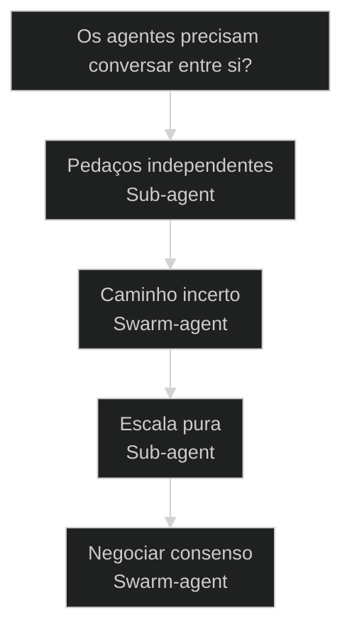
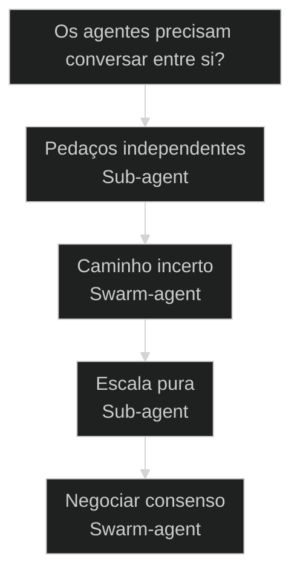

# Sub-agents versus Swarm-agents: isolado ou em rede


## Mapa desta aula

Decisão-chave da aula — Os agentes precisam conversar entre si?



> Leia o diagrama antes do texto longo. Depois volte e confira.

> Dois modos de paralelizar trabalho no AIOX. sub-agent roda numa sessão isolada e não conversa. Swarm-agent troca mensagens e debate. Saber qual usar muda o resultado.

**Objetivos de aprendizagem:**
- Nomear os dois modos de paralelismo do AIOX e o que distingue cada um. _(remember)_
- Distinguir sessão isolada de rede que conversa usando o critério send_message. _(understand)_
- Escolher entre sub-agent e swarm-agent para um problema dado antes de despachar. _(apply)_
- Explicar por que swarm é ouro para descoberta de caminhos e sub é ouro para fan-out isolado. _(understand)_

---

## Dois modos de rodar agentes em paralelo

*Paralelismo AIOX · Sub-agent versus Swarm-agent*

Paralelizar não é uma coisa só. Sub-agent roda numa sessão isolada que não fala com ninguém. Swarm-agent roda numa rede onde os agentes trocam mensagens e debatem. Usar o modo errado é a causa raiz de resultado morno.

- **2**: modos de paralelismo
- **1**: critério que separa: send_message
- **0**: conversa entre sub-agents

- **status**: parallelism modes
- **meta**: sub_agent=sessao_isolada sem cross-talk
- **meta**: swarm_agent=rede com send_message
- **meta**: regra=precisa_debate? sim_swarm nao_sub
- **ready**: ready to dispatch

**Legenda de cores**

Mapa semantico dos dois modos

- **Sub-agent** (signal): sessao isolada, spawn via Agent tool
- **Swarm-agent** (insight): rede que conversa, send_message
- **Isolamento** (bench): contexto proprio, sem cross-talk
- **Debate** (action): trocam mensagens, descobrem caminhos
- **Erro comum** (pain): esperar debate de quem esta isolado

---

## Comece pelo critério

Antes de comparar campo a campo, fixe o critério único: os agentes precisam conversar entre si? Se sim, swarm. Se não, sub. Todo o resto deriva daí.

**Como ler esta aula**

1. **O critério aparece**: Uma pergunta separa os dois modos: precisa de send_message?
2. **Cada modo mostra a cara**: Sub roda isolado e devolve resultado. Swarm roda em rede e debate caminhos.
3. **Vê casos reais**: Spawn via Agent tool versus /swarm-execute, ambos existem no AIOX.
4. **Escolhe o modo**: Dado um problema, você aponta sub ou swarm e justifica.

- **Objetivos da aula** (Nomear os dois modos de paralelismo do AIOX.; Distinguir sessão isolada de rede pelo critério send_message.; Escolher entre sub-agent e swarm-agent antes de despachar.; Explicar quando swarm é ouro e quando sub é ouro.)
- **Onde você está?** (Começando: foque Mapa Simples e a analogia das ilhas.; Já usa AIOX: foque Casos Reais e a Decisão.; Vai orquestrar: foque Composição e Métricas.)
- **Leitura prática**: Em cada bloco, procure uma resposta: este modo conversa ou não? Quando isso ajuda e quando atrapalha?

**Ritmo da aula**

A distinção fica clara quando cada modo tem definição curta, exemplo real do framework e o gosto de quando usar.

- G **Critério antes do detalhe**: Primeiro a pergunta que separa, depois cada modo por dentro.
- 1 **Analogia que ancora**: Sub é uma ilha sem ponte. Swarm é uma mesa redonda que conversa.
- 2 **Caso real por modo**: Agent tool e /swarm-execute são apontáveis no AIOX, não abstratos.
- 3 **Recap com decisão**: A aula fecha com o aluno escolhendo o modo para um problema dele.

---

## A diferença sem jargão

Antes dos termos técnicos, a diferença é só isto: um modo trabalha sozinho e entrega, o outro trabalha em grupo e discute antes de entregar.

> **Em uma frase**: Sub-agent é um trabalhador numa sala fechada: recebe a tarefa, faz, devolve o resultado. Swarm-agent é uma equipe numa sala aberta: os agentes trocam mensagens, debatem e descobrem o caminho juntos.

- **Sub-agent não conversa** -> Roda numa sessão isolada, com contexto próprio. Não vê os outros sub-agents nem fala com eles.
- **Swarm-agent conversa** -> Usa send_message para trocar informação com os colegas. O debate é a mecânica, não um efeito colateral.
- **Sub é fan-out** -> Você dispara N sub-agents para N pedaços independentes. Cada um devolve a sua parte.
- **Swarm é descoberta** -> Quando o caminho não está claro, os agentes exploram e debatem rotas até convergir.
- **O erro caro** -> Esperar que sub-agents combinem entre si. Eles não combinam: são ilhas. Quem combina é o swarm.

**Diagrama principal: isolado ou em rede**

1. **Sub-agent**: Sessão isolada. Spawn via Agent tool, resultado volta pro pai. Sem cross-talk.
2. **Swarm-agent**: Rede de agentes que trocam send_message. Debatem e descobrem caminhos.
3. **Fan-out**: Sub brilha quando os pedaços são independentes e você só quer escala.
4. **Debate**: Swarm brilha quando a solução exige negociação entre perspectivas.

**O que a distinção evita**
- Usar sub-agents esperando que eles conversem.
- Montar swarm para tarefas totalmente independentes.
- Tratar paralelismo como uma coisa só.
- Pagar o custo de debate quando não precisava.

**O que ela força**
- Escolher sub quando os pedaços são isolados.
- Escolher swarm quando a rota exige debate.
- Decidir pelo critério send_message, não pela intuição.
- Reservar a conversa para quando ela muda o resultado.

---

## A analogia das ilhas e da mesa redonda

A forma mais rápida de fixar a diferença: sub-agents são ilhas sem ponte; swarm-agents são uma mesa redonda. Ilhas trabalham em paralelo mas não se falam. A mesa redonda existe para falar.

- **Sub-agent = ilha sem ponte**: Cada ilha tem o seu próprio chão e recursos. Faz o trabalho dela e manda o resultado de barco pro continente. Nenhuma ilha vê a outra.
- **Swarm-agent = mesa redonda**: Todos sentam juntos e falam. A mesa existe justamente para trocar ideia. O resultado nasce do debate, não de um isolamento.
- **Escala = muitas ilhas**: Quando você só quer dividir um lote grande, multiplica ilhas. Cada uma processa um pedaço. Velocidade por paralelismo puro.
- **Caminho = uma mesa**: Quando o caminho é incerto, uma ilha solitária só chuta. A mesa redonda compara hipóteses e acha a rota que ninguém via sozinho.

> **E quando misturar?**: A mesa redonda (swarm) pode mandar um membro abrir uma ilha (sub) para uma sub-tarefa isolada e trazer o resultado de volta pra mesa. Os modos compõem: debate no topo, isolamento nos galhos. O erro é inverter e esperar debate de quem está na ilha.

---

## Sub versus Swarm: o critério send_message

Esta é a confusão mais cara do paralelismo AIOX. Os dois modos disparam vários agentes ao mesmo tempo, então parecem iguais. O critério send_message separa os dois de vez.

**Sub-agent (a ilha)**
- Roda numa sessão isolada, contexto próprio.
- Não tem send_message: não fala com pares.
- Devolve o resultado direto ao agente pai.
- Mudar um sub não muda os outros: são independentes.

**Swarm-agent (a mesa)**
- Roda numa rede com send_message ativo.
- Conversa com os pares: o debate é a mecânica.
- Converge num resultado negociado entre vários.
- Mudar a conversa muda a saída: tudo está acoplado.

> **A pergunta que separa**: Pergunte: estes agentes precisam trocar informação entre si para resolver? Se sim, é swarm (send_message é obrigatório). Se cada um resolve o seu pedaço sozinho, é sub (isolamento é a vantagem). Sub-agents não conversam; swarm-agents debatem.

- **sub-agent com swarm-agent**: Os dois rodam vários agentes em paralelo, então parecem o mesmo recurso.
- **swarm com workflow sequencial**: Um swarm que coordena vários agentes parece um workflow.
- **sub-agent com uma simples chamada de skill**: Um sub-agent pequeno parece só executar uma skill.

---

## Os dois modos existem no AIOX

A distinção não é teoria. Cada modo é apontável no framework. Estes dois casos mostram sub-agent isolado e swarm-agent em rede rodando de verdade.

- **Onde cada modo vive no AIOX**: Sub-agents nascem do Agent tool, em sessões isoladas. Swarm-agents nascem de /swarm-execute, sobre o Swarm OS nativo, com send_message ativo. A diferença não é o número de agentes; é se eles conversam. Players: Agent tool (sub), /swarm-execute (swarm), Swarm OS nativo, send_message, sessão isolada.
- **O que muda a decisão**: A pergunta não é qual modo é mais poderoso. É se a tarefa precisa de debate. Pedaços independentes pedem sub (isolamento limpo). Caminho incerto pede swarm (debate que descobre rotas).

**Cada modo num eixo**

A distinção vira sistema quando cada modo tem mecânica, lar no framework e o tipo de problema que resolve.

- **Sub-agent**: Sessão isolada via Agent tool. Sem send_message. Fan-out limpo de tarefas independentes.
- **Swarm-agent**: Rede via /swarm-execute. send_message ativo. Debate para descobrir caminhos.
- **Isolamento**: Contexto próprio por agente. Zero cross-talk. Máximo paralelismo sem acoplamento.
- **Debate**: Troca de mensagens entre pares. Negocia rota. O consenso é o produto.

**Colunas:** Modo | Conversa? | Sinal de uso certo | Sinal de erro

- Sub-agent: Conversa? | Pedaços independentes rodando isolados em paralelo. | Você esperava que os filhos combinassem entre si.
- Swarm-agent: Conversa? | Agentes debatendo rotas num problema aberto. | Tarefa totalmente independente pagando custo de debate.
- Isolamento: Conversa? | Sub-agent com contexto próprio, sem vazamento. | Forçar sub a coordenar; vira gambiarra de mensagem manual.
- Debate: Conversa? | send_message convergindo num consenso útil. | Debate infinito sem gate de convergência.

### Caso: O sub-agent via Agent tool

Quando você dispara um sub-agent pelo Agent tool, ele abre uma sessão isolada e não fala com mais ninguém.

- Começou como: Uma tarefa que pode ser feita sozinha, sem coordenação.
- Virou: Um sub-agent rodando numa sessão isolada com contexto próprio.
- Prova: Spawn via Agent tool: o resultado volta pro pai, sem send_message entre filhos.
- Lição: Sub-agent é fan-out isolado: escala sem conversa.

### Caso: O /swarm-execute que debate

Quando o caminho não está claro, /swarm-execute coloca agentes numa rede que conversa e descobre a rota.

- Começou como: Um problema aberto onde a melhor abordagem não é óbvia.
- Virou: Um swarm de agentes trocando send_message e debatendo rotas em paralelo.
- Prova: /swarm-execute roda batches em paralelo via Swarm OS; os agentes conversam para convergir.
- Lição: Swarm é ouro para descoberta de caminhos: o debate acha o que ninguém vê sozinho.

---

## Como os modos se combinam

Sub e swarm não são rivais; são camadas. Um swarm no topo pode abrir sub-agents nos galhos. Entender a direção da composição evita inverter e esperar debate de quem está isolado.

**debate no topo, isolamento nos galhos**

1. **Swarm no topo**: A mesa redonda recebe a missão e começa a debater a rota.
2. **Distribui sub-tarefas**: Quando um pedaço é isolável, o swarm dispara um sub-agent para ele.
3. **Sub-agent executa**: O sub roda isolado, sem falar com ninguém, e devolve o resultado.
4. **Volta pra mesa**: O resultado isolado entra de novo no debate do swarm.
5. **Convergência**: O swarm fecha a rota com os resultados dos galhos isolados em mãos.

- **1. Coordenação (Swarm)**: Quem negocia a rota. A rede de agentes que troca send_message e descobre o caminho que ninguém vê sozinho. [WHO, debate, send_message]
- **2. Execução isolada (Sub)**: Quem faz o pedaço sem coordenar. A sessão isolada que recebe uma sub-tarefa independente e devolve o resultado limpo. [WHAT, isolado, Agent tool]
- **3. Convergência (Resultado)**: Quando os galhos isolados voltam pra mesa, o swarm fecha a rota. O paralelismo isolado alimenta o debate, não o substitui. [HOW, consenso, rota final]

---

## Qual modo usar?

Antes de despachar, decida o modo. O critério economiza tempo e tokens quando você escolhe pelo send_message, não pela intuição de paralelismo.

**Árvore de decisão**
_Responda pelo send_message antes de pensar em quantos agentes disparar._



- **Pedaços independentes** — Cada pedaço se resolve sozinho, sem precisar do que o outro descobriu.
  → _Sub-agent_
  Ex.: Use Sub-agent. Spawn via Agent tool, um por pedaço, sem cross-talk.
- **Caminho incerto** — A melhor rota não é óbvia e várias perspectivas podem encontrá-la juntas.
  → _Swarm-agent_
  Ex.: Use Swarm. Dispare /swarm-execute para os agentes debaterem a rota.
- **Escala pura** — Você só quer dividir um lote grande em N partes idênticas e rápidas.
  → _Sub-agent_
  Ex.: Use Sub-agent. Fan-out isolado é o modo mais limpo de escalar.
- **Negociar consenso** — O resultado precisa nascer de um acordo entre visões diferentes.
  → _Swarm-agent_
  Ex.: Use Swarm. O debate via send_message é a mecânica que gera o consenso.

**Gate:** Qual é o gate? — _Sem gate, você dispara o modo errado. Responda: estes agentes precisam trocar informação? Se não, sub isolado. Se sim, swarm com send_message._

> **Regra do critério único**: A escolha não é por quantidade de agentes; é por conversa. Se eles não precisam falar entre si, sub-agent isolado é mais barato e mais limpo. Se a solução depende do debate, swarm é ouro. Pagar debate sem necessidade é overengineering; negar debate quando ele descobre o caminho é desperdício.

---

## Rotas de despacho

Cada modo tem um caminho típico de disparo. Saber a rota evita escolher o modo certo e despachar do jeito errado.

#### Fan-out isolado
Quando os pedaços são independentes e você só quer escala limpa.
1. **Sinal: a tarefa se quebra em N pedaços que não precisam negociar.
2. **Pergunta: algum pedaço depende do que outro descobriu?
3. **Ação: spawnar sub-agents via Agent tool, um por pedaço.
4. **Resultado: N sessões isoladas devolvendo partes ao pai.

#### Rede que debate
Quando o caminho é incerto e o debate descobre a rota.
1. **Sinal: várias abordagens possíveis, nenhuma obviamente melhor.
2. **Pergunta: o resultado melhora se os agentes conversarem?
3. **Ação: disparar /swarm-execute com batches sobre o Swarm OS.
4. **Resultado: rede com send_message convergindo num caminho acordado.

#### Ondas coordenadas
Quando o swarm precisa rodar em ondas com gates entre elas.
1. **Sinal: o trabalho do swarm tem fases dependentes em ordem.
2. **Pergunta: uma onda precisa terminar antes da próxima começar?
3. **Ação: estruturar o swarm em waves com gate entre cada onda.
4. **Resultado: execução paralela por onda, sequencial entre ondas.

**Despachar Sub-agents**
Use quando os pedaços são independentes e você quer fan-out isolado.
- `Agent tool (spawn)`: abrir uma sessão isolada por pedaço, sem send_message.
- `coletar resultados`: agregar as partes que cada sub devolve ao pai.

**Despachar um Swarm**
Use quando o caminho é incerto e o debate entre agentes descobre a rota.
- `/swarm-execute`: lançar batches em paralelo no Swarm OS com send_message ativo.
- `/swarm-architect`: desenhar a topologia do swarm antes de disparar, se for complexo.

**Despachar em Ondas**
Use quando o swarm precisa rodar em fases dependentes com gates.
- `/wave-execute`: executar o trabalho em ondas com gate entre cada uma.
- `validar gate`: confirmar que a onda fechou antes de liberar a próxima.

---

## Modelos para ler melhor

Visualizações rápidas para o aluno comparar os dois modos, os riscos de cada escolha e o grau de coordenação que cada um carrega.

- **Sub-agent**: baixo (isolado de propósito, zero cross-talk.)
- **Swarm-agent**: alto (send_message faz a coordenação ser a mecânica.)
- **Wave Execute**: médio-alto (coordenação por ondas com gates entre fases.)

- **Sub esperando debate**: sub (esperar que ilhas conversem; elas nunca conversam.)
- **Swarm sem necessidade**: swarm (pagar custo de debate para tarefa independente.)
- **Debate sem gate**: swarm (swarm que nunca converge por falta de critério de parada.)

**Matriz de Decisão do Aluno**

Em dúvida, escolha a célula que melhor descreve o seu problema.

- **Pedaços independentes**: Use Sub-agent. Fan-out isolado, sem send_message.
- **Caminho incerto**: Use Swarm. O debate descobre a rota.
- **Só quer escala**: Use Sub-agent. Multiplicar ilhas é o jeito limpo.
- **Precisa de consenso**: Use Swarm. send_message gera o acordo.
- **Fases dependentes**: Use Wave Execute. Ondas com gate entre elas.
- **Não sabe ainda**: Pergunte: eles precisam conversar? Não, sub. Sim, swarm.

- **Sinal de paralelismo saudável**: modo escolhido pelo critério send_message / swarm com gate de convergência claro / sub-agents esperando combinar entre si
- **Separação de responsabilidades**: swarm coordena, sub executa isolado / swarm aninhando sub nos galhos / sub forçado a coordenar via gambiarra

---

## O que cada modo carrega

Cada modo tem uma anatomia mínima. Saber o que cada um guarda ajuda a reconhecer quando você está usando o modo errado para o problema.

- **Sub-agent: sessão isolada**: Contexto próprio, tarefa única, retorno ao pai. Sem send_message. Sem visão dos irmãos.
- **Swarm-agent: rede**: Canal de send_message, pares visíveis, debate ativo. O consenso é o produto.
- **Agent tool: o spawn**: O mecanismo que abre a sessão isolada do sub-agent. Um filho por chamada.
- **/swarm-execute: o dispatch**: Lança batches em paralelo no Swarm OS, com send_message ligado entre os agentes.
- **Wave: a onda**: Estrutura o swarm em fases dependentes, com gate de validação entre cada onda.

---

## Métricas do paralelismo

Sem telemetria, a escolha do modo vira intuição. Estas perguntas separam paralelismo certo de paralelismo desperdiçado.

**Colunas:** Métrica | Pergunta | Sinal saudável | Sinal de risco

- Critério do modo: A escolha sub/swarm veio do critério send_message? | Sub para isolado, swarm para debate. | Swarm escolhido por reflexo de paralelismo.
- Isolamento limpo: Os sub-agents rodam sem esperar uns dos outros? | Cada sub devolve a parte dele e pronto. | Sub-agents esperando uma coordenação que não existe.
- Convergência do swarm: O debate do swarm tem gate de parada? | send_message converge num consenso útil. | Debate infinito sem critério de fechar.
- Composição certa: Swarm no topo, sub nos galhos, sem inverter? | Mesa redonda abre ilhas para sub-tarefas. | Ilha forçada a fazer o papel da mesa redonda.

---

## Quando ir de sub para swarm

A distinção ajuda mais quando você resiste ao reflexo de montar swarm para tudo. Subir para o debate é decisão com custo, não sinal de sofisticação.

**Quando ir para swarm**
- O caminho é incerto e várias visões podem encontrá-lo juntas.
- O resultado precisa nascer de um consenso negociado.
- Os pedaços dependem do que os outros descobrem.
- Há ganho real de qualidade no debate, não só na velocidade.

**Quando ficar no sub**
- Os pedaços são totalmente independentes (fica em sub).
- Você só quer escala: dividir um lote grande (fica em sub).
- A rota já é conhecida e cada parte se resolve sozinha (fica em sub).
- O debate só adicionaria custo sem mudar o resultado (fica em sub).

---

## Exercício: escolha o modo

Pegue um problema real seu de paralelização e aplique o critério. O objetivo não é parecer sofisticado; é apontar o modo que resolve com o menor custo.

**Um problema, cinco perguntas**
```yaml
paralelismo:
  problema: "o que precisa rodar em paralelo?"
  conversa: "os agentes precisam trocar info? sim | nao"
  modo: "sub_agent | swarm_agent"
  despacho: "agent_tool | swarm_execute | wave_execute"
  gate: "por que nao o outro modo? (se swarm, qual o criterio de convergencia?)"

```
*O acerto não é o nome bonito. É provar que você escolheu o modo pelo critério send_message e sabe justificar por que o outro custaria mais sem entregar mais.*

**Exemplo preenchido: analisar 50 arquivos versus achar uma arquitetura**

- **Problema A**: Preciso resumir 50 arquivos independentes o mais rapido possivel.
- **Conversa A**: Nao. Cada arquivo se resume sozinho, sem depender dos outros.
- **Modo A**: Sub-agent. Spawn de N sub-agents via Agent tool, um por arquivo. Fan-out isolado.
- **Problema B**: Preciso decidir a melhor arquitetura para um sistema novo, sem rota obvia.
- **Modo B**: Swarm-agent via /swarm-execute. Os agentes debatem hipoteses com send_message e convergem numa arquitetura.
- **Gate B**: Convergencia: o debate fecha quando as visoes acordam numa rota ou o orquestrador declara consenso. Sem isso, o swarm nao para.

- 1. **Problema**: Descreva em uma frase o trabalho que você quer rodar em paralelo.
- 2. **Conversa?**: Responda: os agentes precisam trocar informação entre si para resolver?
- 3. **Modo**: Aponte sub-agent (isolado) ou swarm-agent (debate) com base na resposta.
- 4. **Despacho**: Diga como dispararia: Agent tool para sub, /swarm-execute para swarm.
- 5. **Gate**: Justifique por que não escolheu o outro modo. Para swarm, defina o gate de convergência.

**Funcionou se:**

- O aluno escolhe o modo pelo critério send_message, não pela intuição.
- O aluno separa fan-out isolado (sub) de debate negociado (swarm).
- O aluno define um gate de convergência quando escolhe swarm.

---

## Glossário do paralelismo

Tradução dos termos para alguém que está vendo a distinção sub versus swarm pela primeira vez.

- **Sub-agent**: Um agente disparado numa sessão isolada via Agent tool. Não conversa com pares; devolve o resultado ao pai.
- **Swarm-agent**: Um agente numa rede que troca send_message com os pares. Debate e descobre caminhos em paralelo.
- **send_message**: O canal de troca de mensagens entre swarm-agents. É o critério que separa swarm de sub: sub não tem.
- **Agent tool**: O mecanismo que spawna um sub-agent em sessão isolada. Um filho por chamada, sem cross-talk.
- **/swarm-execute**: O comando que lança batches em paralelo no Swarm OS, com send_message ativo entre os agentes.
- **Swarm OS**: O runtime nativo que executa os swarm-agents em paralelo e carrega o canal de send_message.
- **Wave Execute**: Modo de rodar o swarm em ondas dependentes, com gate de validação entre cada onda.
- **Fan-out**: Disparar N agentes isolados para N pedaços independentes. A forma limpa de escalar com sub-agents.

> **Portão da aula**: A aula só está no padrão quando o aluno nomeia os dois modos, distingue sessão isolada de rede pelo critério send_message e consegue apontar, para um problema real, se ele pede sub-agent (isolado) ou swarm-agent (debate) antes de despachar qualquer agente.

***


---

## Origem curricular

Adaptação autocontida da aula 29 do AIOX Advanced. A fonte histórica permanece registrada em `source_path`; este curso é o dono da progressão atual.

## Navegação

[← Aula anterior](02-taxonomia-da-capacidade.md) · [↑ M0](../modulos/M0-arquitetura-da-capacidade.md) · [Curso](../README.md) · [Próxima aula →](04-runner-deterministico.md)
