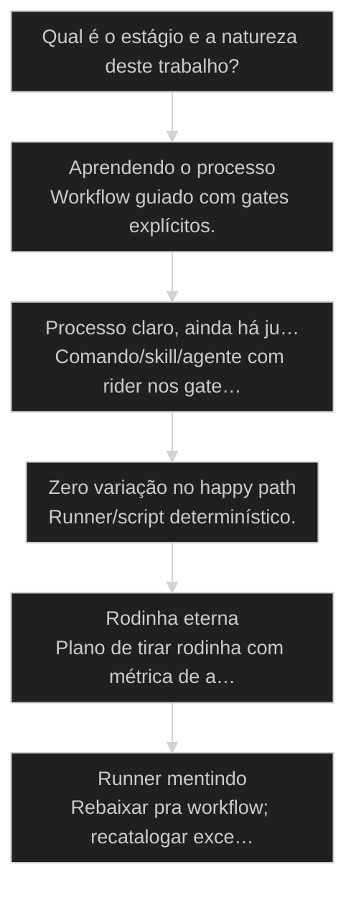
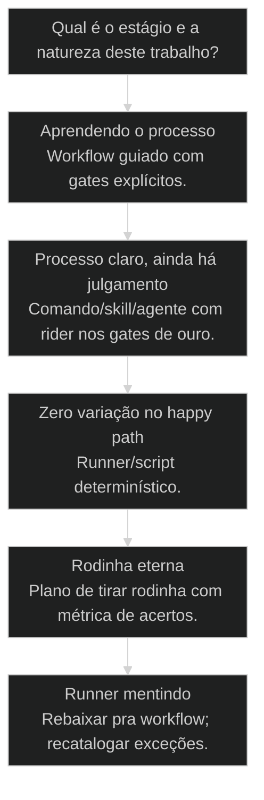

# Workflow pronto vs comando manual: bicicleta com rodinha

> **Papel curricular:** extensão aplicada ao AIOX. Base técnica canônica: `cursos/Introducao-a-Arquitetura-de-Sistemas/aulas/11-workflow-pipeline-batch-stream.md`.

## Mapa desta aula

Decisão-chave da aula — Qual é o estágio e a natureza deste trabalho?

> Leia o diagrama antes do texto longo. Depois volte e confira.

> Três opções — workflow, comando, script/runner — e quando tirar a rodinha. Maturidade do processo manda, não o hype da ferramenta.

**Objetivos de aprendizagem:**
- Listar os três modos de execução (workflow, comando, runner) e o contrato de cada um. _(remember)_
- Explicar a metáfora da rodinha e por que maturidade do processo define o modo. _(understand)_
- Classificar tarefas reais nos três modos com critério de variação e julgamento. _(apply)_
- Decidir quando tirar a rodinha (promover a runner/comando) e quando voltar ao workflow. _(evaluate)_

---

## O que você consegue no fim desta aula

*G · Destino*

Destino claro antes de qualquer /comando mágico.

Ao final desta aula você vai conseguir três coisas concretas:

1. Nomear os **três modos** e o que cada um promete (e não promete).
2. Classificar o trabalho da semana em **workflow / comando / runner**.
3. Montar um plano de **tirar a rodinha** com métrica — ou de voltar a ela.

Se você sair daqui ainda escolhendo ferramenta por hype ("agora tudo é agent"),
a aula falhou. Modo errado é fricção cara com carinha de modernidade.

- **Objetivos da aula** (Comparar os 3 modos; Escolher por maturidade e variação; Saber promover ou rebaixar o modo)
- **Resultado tangível**: Tabela de 5 tarefas com modo, justificativa e próximo upgrade.
- **Não é o destino**: Achar que workflow é pra iniciante e runner é status. É engenharia.

---

## Rodinha eterna ou pedalar no trânsito

*P · Onde você está*

Os dois erros que custam ritmo e segurança.

Cara, bicicleta com rodinha não é humilhação — é como se aprende sem cair no
meio do trânsito. Workflow pronto é rodinha: te leva no caminho certo, com
gates e ordem. Comando manual é pedalar com atenção. Runner é estrada batida
em velocidade — mesma entrada, mesma saída.

O erro é ficar na rodinha pra sempre **ou** sair sem saber frear. Eu vejo time
sênior preso em wizard porque "é o processo oficial" e júnior rodando script
de prod no feeling.

Se você está aqui, provavelmente já sentiu um destes sintomas:

- Só sabe operar pela UI/wizard e trava fora do caminho feliz.
- Dispara skill solta e esquece metade dos gates.
- Automatizou cedo demais e agora o runner esconde exceção mortal.
- Confunde "eu sei o comando" com "o processo está maduro no time".

Beleza. A partir daqui a gente escolhe modo pela **maturidade do processo**,
não pelo ego de quem já "sabe pedalar".

**Onde a maioria trava**
- Rodinha eterna por medo de CLI
- Comando solto sem gate
- Runner antes de estabilizar o caminho

**Onde o operador vai**
- Workflow enquanto o músculo forma
- Comando quando o caminho é claro e há julgamento
- Runner quando a variação morreu

---

## Três modos, uma pergunta: quão maduro está o caminho?

*S · Rota*

Ferramenta é consequência. Processo é causa.

Prior-art: taxonomia task/skill/agent/workflow/runner (28) e runner determinístico
(30) já batizaram as peças. Goal vs loop (11) lembra o que se persegue. Aqui
o treino é **escolher o modo no dia a dia** sem religião de ferramenta.

Eixos simples:

- **Variação** alta → não congele em runner ainda.
- **Julgamento** alto → comando/agente com humano (rider) nos gates.
- **Variação zero + julgamento zero** → runner/script.
- **Aprendizado / primeira vezes** → workflow guiado.

Metáfora que cola: rodinha ensina equilíbrio. Pedal opera. Estrada industrializa.
Tirar a rodinha cedo demais = tombos. Tarde demais = atrofia.

- **3**: modos de execução
- **2**: eixos (variação × julgamento)
- **1**: plano de tirar rodinha

- **status**: mode select
- **meta**: workflow|comando|runner
- **meta**: criterio=maturidade
- **ready**: ready to choose

**Legenda de cores**

O que cada cor sinaliza nesta aula

- **Workflow** (signal): orquestra passos e ensina o músculo
- **Comando** (insight): dispara skill/agente com contexto
- **Runner** (bench): mesma entrada, mesma saída
- **Upgrade** (action): promover modo com evidência
- **Mismatch** (pain): modo errado pro estágio do processo

**Como ler esta aula**

1. **3 modos**: Contrato de cada um.
2. **Rodinha**: Quando ensina e quando atrofia.
3. **Caso**: Brownfield com os 3 modos.
4. **Tabela**: Classificar a tua semana.

---

## Workflow, comando, runner — contratos

Sem misturar as promessas.

**Workflow (rodinha / guia)**
Orquestra passos com ordem, gates e handoffs. Ensina o caminho. Custa tempo.
Serve quando o time ainda erra a sequência ou quando o processo é multi-fase.

**Comando / skill / @agente (pedal)**
Você dispara um ritual ou persona pontual. Precisa saber **qual** e **quando**.
Serve quando o caminho é conhecido e ainda há julgamento ou contexto variável.

**Runner / script (estrada)**
Zero improviso no happy path: mesma entrada, mesma saída. Serve quando a
variação morreu e o erro é bug, não "interpretação".

Então o que acontece se você usa runner no processo instável? Você congela
exceção errada. E se usa workflow pra formatar arquivo? Você cospe cerimônia
onde bastava um script.

- **1. Workflow**: Ensina e amarra multi-passo com gates. [aprender]
- **2. Comando**: Operação pontual com julgamento residual. [operar]
- **3. Runner**: Industrializa o caminho sem surpresa. [escalar]

**Atalho variação × julgamento**

- **Alta variação + julgamento**: Workflow ou comando com rider
- **Baixa variação + julgamento**: Comando/skill com gate
- **Zero variação + zero julgamento**: Runner/script
- **Primeira vezes no processo**: Workflow guiado

> **Lei do modo**: Escolha o modo pela estabilidade do caminho e pela necessidade de julgamento — nunca pelo que está na moda no Twitter.

---

## Quando tirar a rodinha (e quando recolocar)

Promoção com métrica. Rebaixamento sem vergonha.

Critérios pra **promover** workflow → comando/runner:

- O time acertou o caminho **N vezes seguidas** (ex.: 5) sem pular gate.
- Exceções estão catalogadas — não "a gente improvisa".
- Há dono do modo e checklist de regressão se o processo mudar.
- O custo da cerimônia do workflow já dói mais que o risco de sair.

Critérios pra **rebaixar** runner/comando → workflow:

- Taxa de falha sobe ou exceções explodem.
- Novo membro não consegue operar sem herói da tribo.
- Mudou o domínio e o caminho antigo mentiu.

Cara, rebaixar não é demissão. É honestidade. Rodinha de novo até o músculo
voltar. Ego que se dane.

**Plano de tirar rodinha**

1. **Baseline**: Conte acertos seguidos no workflow.
2. **Exceções**: Liste e decida se entram no happy path.
3. **Promover**: Comando ou runner com dono.
4. **Medir**: Falha → rebaixar sem drama.

- **Saber o comando** != **Processo maduro**: Um herói saber CLI não significa que o time internalizou o caminho.
- **Automatizar** != **Congelar**: Runner bom congela o certo; runner precoce congela o chute.

> **Prior-art**: Taxonomia (28) e runner (30) definem as peças. Esta aula é a decisão operacional de qual peça encaixa no estágio do processo.

---

## Caso: discovery brownfield nos três modos

Mesmo domínio, modos diferentes por maturidade.

Cliente entrega monólito. Time AIOX precisa de discovery → mapa → enhancement.

**Semana 1–2:** workflow guiado de brownfield discovery. Todo mundo segue as
fases, gates de "não codar ainda", checklist de módulos. Rodinha pesada. Certa.

**Semana 3:** o mapa está estável. Operação vira **comandos**: `/code-anatomy`
pontual num módulo, `@architect` pra trade-off, skill de gerar ADR. Pedal.

**Semana 6:** inventário de deps e relatório semanal de drift — **runner** no CI.
Zero julgamento no happy path; se falhar, issue com log.

Time que pulou pra runner na semana 1 gerou relatório lindo e errado. Time que
ficou no wizard na semana 8 perdeu dois dias por release. Modo certo no tempo
certo.

Então o que acontece? A ferramenta não muda o domínio — a **maturidade** muda
o modo.

**Maturidade do discovery**

1. **Workflow**: Aprender o caminho
2. **Comandos**: Operar com julgamento
3. **Runner**: Congelar o estável
4. **Medir**: Falha reabre workflow
5. **Evoluir**: Novo domínio = rodinha de novo

**Mismatch**
- Runner no dia 1 do monólito desconhecido
- Wizard eterno pra lint
- Skill solta sem QG no caminho crítico

**Fit**
- Workflow enquanto o mapa nasce
- Comando no trade-off pontual
- Runner no inventário repetível

---

## Qual modo agora?

Maturidade e variação mandam.

**Árvore de decisão**
_Escolha pela evidência de estabilidade, não pela ansiedade de velocidade._

- **Aprendendo o processo** — Primeira ou segunda vez; caminho ainda erra.
  → _Workflow guiado com gates explícitos._
  Ex.: Primeiro brownfield discovery do time.
- **Processo claro, ainda há julgamento** — Sabe a sequência; decisões de papel restam.
  → _Comando/skill/agente com rider nos gates de ouro._
  Ex.: /review pontual; @po no aceite.
- **Zero variação no happy path** — Repete igual; falha = bug.
  → _Runner/script determinístico._
  Ex.: Publicar release notes template; inventário CI.
- **Rodinha eterna** — Time já acerta e ainda só usa wizard.
  → _Plano de tirar rodinha com métrica de acertos._
  Ex.: Cinco SDC iguais só pela UI.
- **Runner mentindo** — Exceções explodem ou onboarding impossível.
  → _Rebaixar pra workflow; recatalogar exceções._
  Ex.: Script de deploy com 12 ifs secretos.

**Gate:** Você consegue citar variação, julgamento e número de acertos recentes? — _Sem esses três, a escolha ainda é feeling._

#### Aprender
Workflow.
1. **Seguir: Ordem e gates do guia.
2. **Notar: Onde o time erra a seta.
3. **Anotar exceções: Virará catálogo.
4. **Medir acertos: Base pro upgrade.

#### Operar
Comando.
1. **Skill certa: Órbita e sintaxe corretas.
2. **Contexto: Núcleo + artefato da vez.
3. **QG: Prova antes de seguir.
4. **Rider: Elicit só no ouro.

#### Industrializar
Runner.
1. **Congelar passos: Happy path escrito.
2. **Mesma entrada: Contrato de input.
3. **Mesma saída: Artefato verificável.
4. **Alarme: Falha reabre humano/workflow.

---

## Tabela da semana (15 min)

Cinco tarefas reais. Zero exemplo inventado de tutorial.

Vamos lá. Sem isso a aula vira podcast. Abre o board ou o calendário da semana.

- 1. **Pegue**: 5 tarefas reais da sua semana (feitas ou planejadas).
- 2. **Classifique**: workflow / comando / runner — uma coluna cada.
- 3. **Justifique**: Variação + julgamento em uma linha por tarefa.
- 4. **Encontre uma**: Que ainda está na rodinha sem precisar.
- 5. **Plano**: Upgrade ou rebaixamento com métrica (ex.: 5 acertos).

**Funcionou se:**

- As 5 tarefas têm modo e justificativa por variação/julgamento.
- Pelo menos um upgrade ou rebaixamento está nomeado.
- Nenhuma escolha é só 'porque a ferramenta é legal'.
- Você sabe o anti-padrão: rodinha eterna e runner precoce.

---

## Glossário sem jargão de vaidade

- **Workflow**: Orquestração guiada de passos com ordem e gates; ensina o caminho.
- **Comando/skill**: Disparo pontual de ritual ou persona quando o caminho já é conhecido.
- **Runner/script**: Execução determinística: mesma entrada, mesma saída no happy path.
- **Rodinha**: Metáfora do workflow que protege enquanto o músculo do processo forma.
- **Tirar a rodinha**: Promover o modo de execução quando estabilidade e catálogo de exceções existem.
- **Mismatch de modo**: Usar ferramenta/cerimônia incompatível com o estágio do processo.

---

## Portão da aula

Você passou quando escolhe o modo pela **maturidade do processo**, não pelo hype
da ferramenta. Rodinha pra aprender. Pedal pra operar. Estrada pra escalar.

A IA é a seta. O X é seu — inclusive recusar automação precoce e recusar cerimônia eterna.

> **GATE-MODULE (auto)**: GPS Goal/Position/Steps presentes · caso + do/dont · decisão · prática com evidência · glossário. Alvo DL ≥70 atingido na construção enrich-W2.

***

---

## Origem curricular

Adaptação autocontida da aula 52 do AIOX Advanced. A fonte histórica permanece registrada em `source_path`; este curso é o dono da progressão atual.

## Navegação

[← Aula anterior](05-entidade-e-ciclo-de-vida.md) · [↑ M0](../modulos/M0-arquitetura-da-capacidade.md) · [Curso](../README.md) · [Próxima aula →](07-mesa-redonda-e-advisory-board.md)
