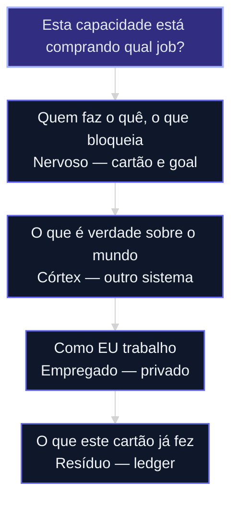

# Quatro jobs, um store não

O PRD da aula [12](12-research-ao-prd.md) já existe. Antes de construir o squad, nomeie **o que a capacidade precisa lembrar** — senão o próximo passo é “um cérebro” e quatro verdades no mesmo lugar.

Evidência: [fonte 78](../sources/78-quatro-jobs-de-memoria.md). Tudo que você precisa está nessa nota e nesta aula.

## Mapa desta aula

Decisão-chave da aula — Esta capacidade está comprando qual job?

> Leia o diagrama antes do texto longo. Depois volte e confira.

> “Cérebro” e “memória” não são um job só. Quem cola quatro jobs no mesmo store perde a fonte da verdade e acha que o agente sabe a empresa quando só leu o último cartão.

**Objetivos de aprendizagem:**
- Nomear os quatro jobs: nervoso, córtex, empregado, resíduo. _(remember)_
- Classificar um briefing real em um job e dizer o que esse store recusa. _(apply)_
- Recusar o monólito que tenta ser os quatro. _(evaluate)_

---

## O que você consegue no fim desta aula

Uma **linha no PRD**: `compra: … / recusa: …`. Sem ranking de produto. Sem instalar nada.

Se você sair daqui querendo “o melhor cérebro”, a aula falhou.

---

## Quatro compras, não quatro camadas obrigatórias

| Job | Pergunta | O que entra | O que *não* entra |
|---|---|---|---|
| **1. Sistema nervoso** | Quem faz o quê, por quê, o que está bloqueado? | Goal, assignment, cartão, custo do run | Wiki de cliente, tom de marca, transcrição |
| **2. Córtex institucional** | O que é verdade sobre o mundo? | Pessoa, empresa, deal, reunião — com citação | Org-chart, fan-in da wave, folha de pagamento |
| **3. Memória do empregado** | Como *este* humano ou agente trabalha? | Preferência, identidade, caderno pessoal | Fato da firma, prova, board compartilhado |
| **4. Resíduo do trabalho** | O que *este* cartão já fez? | Ledger, issue, PRD, “agora / feito / não fazer” | Enciclopédia, identidade pessoal |

A recusa é o design. O nervoso **não** é wiki. O córtex **não** é o board. O caderno pessoal **não** vai para o prompt da equipe. O ledger da story **não** sintetiza o cliente.

Sistemas de referência (GitHub na [lista de FONTES](../FONTES.md#acesso-ao-material-github); detalhe na [fonte 78](../sources/78-quatro-jobs-de-memoria.md) — você **não** precisa instalá-los):

- nervoso → [Paperclip](https://github.com/paperclipai/paperclip);
- córtex → [gbrain](https://github.com/garrytan/gbrain);
- arquivo fiel (eixo do córtex) → [mempalace](https://github.com/milla-jovovich/mempalace);
- empregado → [OpenClaw](https://github.com/openclaw/openclaw), [LifeOS](https://github.com/danielmiessler/LifeOS);
- resíduo → [gsd-2](https://github.com/gsd-build/gsd-2) e o cartão da [20b](20b-grafo-codigo-e-memoria-de-processo.md);
- log de ação → [Memori](https://github.com/MemoriLabs/Memori);
- SDK para plugar memória → [mem0](https://github.com/mem0ai/mem0), [supermemory](https://github.com/supermemoryai/supermemory).
- arquivo fiel (eixo do córtex) → [mempalace](https://github.com/milla-jovovich/mempalace)
- log de ação → [Memori](https://github.com/MemoriLabs/Memori)
- SDK para plugar memória → [mem0](https://github.com/mem0ai/mem0), [supermemory](https://github.com/supermemoryai/supermemory)

Um store só para os quatro é o anti-padrão. Vaza privacidade e mente: “o agente sabe a empresa” quando só leu o último issue.

---

## Teste de roteamento

Informação nova → **um** lugar:

| Informação nova | Job |
|---|---|
| “Alice é VP e lidera a migração” | Córtex |
| “A estratégia do trimestre foi aprovada” | Nervoso |
| “Prefiro diffs pequenos” | Empregado |
| “O checkout da story A falhou com 409” | Resíduo |
| Transcrição da call, palavra por palavra | Arquivo fiel (aula [12c](12c-arquivo-fiel-vs-sintese.md)) — não a síntese no mesmo arquivo |

---

## Sequência

1. Reescreva “lembrar a empresa” como **uma** das quatro perguntas.
2. Marque um job. Dois jobs = duas capacidades, ou você está misturando.
3. Escreva a recusa: o que este store **não** guarda.
4. Leve a linha para o PRD. Sem ela, ou declara “não há memória persistente”, ou o PRD está incompleto.

**Evite:** um banco para tudo; caderno pessoal no contexto da equipe; tratar arquivo de estudo como fato da firma.

**Faça:** job antes da ferramenta; recusa escrita; heartbeat fino (ninguém acorda com a wiki).

---

## Exercício

Quinze minutos. Capacidade do seu PRD. Sem instalar nada.

1. Pedido em uma das quatro perguntas.
2. Job (1–4). Se vacilar, escreva por que não são o mesmo store.
3. Linha: `compra: … / recusa: …`
4. Essa linha entra no PRD ou é um “não faremos”?

**Funcionou se:** a linha não diz “cérebro”; há recusa concreta; você sabe se o próximo passo é [12c](12c-arquivo-fiel-vs-sintese.md), [12f](12f-menor-cerebro-suficiente.md) ou só o ledger da [20b](20b-grafo-codigo-e-memoria-de-processo.md).

---

## Glossário

- **Nervoso:** quem, por quê, o que bloqueia.
- **Córtex:** o que a operação sabe do *mundo*.
- **Empregado:** padrão da pessoa ou do agente. Privado.
- **Resíduo:** o que este cartão já fez.
- **Recusa:** o job que este store declara *não* ser.

## Portão

O PRD tem **um job e uma recusa** — ou declara que não há memória persistente.

## Origem curricular

Síntese ([fonte 78](../sources/78-quatro-jobs-de-memoria.md)). Não depende de arquivo fora deste acervo.

## Navegação

[← Aula anterior](12-research-ao-prd.md) · [↑ M1b](../modulos/M1b-memoria-e-grafo-da-capacidade.md) · [Curso](../README.md) · [Próxima aula →](12c-arquivo-fiel-vs-sintese.md)
