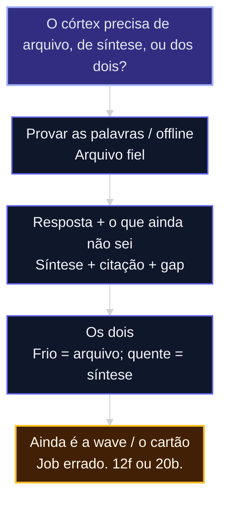

# Arquivo fiel vs cérebro que sintetiza

A aula [12b](12b-quatro-jobs-um-store.md) marcou o **job 2**. Esta aula escolhe o eixo: guardar o original, sintetizar com gap, ou os dois em camadas.

Se o job não for 2, não está nesta aula. Vá para [12f](12f-menor-cerebro-suficiente.md) ou, se for resíduo de wave, para a [20b](20b-grafo-codigo-e-memoria-de-processo.md).

Evidência: [fonte 79](../sources/79-arquivo-fiel-vs-sintese.md).

## Mapa desta aula

Decisão-chave da aula — O córtex precisa de arquivo, de síntese, ou dos dois?

> Leia o diagrama antes do texto longo. Depois volte e confira.

> O arquivo é a melhor memória. O cérebro é o melhor cérebro. Escolher pelo marketing sem essa frase compra o eixo errado.

**Objetivos de aprendizagem:**
- Distinguir arquivo fiel de cérebro que sintetiza. _(understand)_
- Escolher arquivo, síntese ou camadas e escrever o que não entra. _(apply)_
- Tratar grafo como projeção com recibo, não como oráculo. _(evaluate)_

---

## O que você consegue no fim desta aula

Um **contrato de córtex** de uma tela — ou a confirmação de que o job 2 era falso e você volta à 12f.

Se você sair daqui instalando um banco de grafos “para a capacidade lembrar”, a aula falhou. Exemplo a recusar: [Neo4j](https://github.com/neo4j/neo4j) — ver [FONTES](../FONTES.md#acesso-ao-material-github).

---

## Arquivo vs síntese

| | Arquivo fiel ([mempalace](https://github.com/milla-jovovich/mempalace)) | Cérebro que sintetiza ([gbrain](https://github.com/garrytan/gbrain)) |
|--|---|---|
| Devolve | Trechos | Resposta citada + o que falta |
| Path quente | Sem API no raw | Embed + síntese |
| Confiança | Auditável palavra por palavra | Útil, interpretada |
| Imbatível quando | Offline, compliance, o agente já sintetiza | Multi-hop, reunião com buraco |

**Camadas:** frio = arquivo; quente = síntese. O cérebro nunca vira SoT de fidelidade. O arquivo nunca precisa virar daemon da empresa.

**Anti-padrão:** só síntese e esperar zero-custo offline; só arquivo e esperar “o que eu ainda não sei?”.

Não instale um produto para decidir o eixo. A [fonte 79](../sources/79-arquivo-fiel-vs-sintese.md) basta.

Se o córtex precisar de *relações* (pessoa–empresa, claim–prova), a aula [12d](12d-grafo-projecao-nao-oraculo.md) é obrigatória. Este grafo **não** entra no fan-in da wave — isso é a [20b](20b-grafo-codigo-e-memoria-de-processo.md).

---

## Sequência

1. Confirme job 2. Se for 4, pare — 12f ou 20b.
2. Eixo: arquivo / síntese / camadas. Uma frase.
3. Fronteira: o córtex não guarda goal, fan-in, caderno pessoal.
4. Grafo: “não há” ou as regras da [12d](12d-grafo-projecao-nao-oraculo.md).
5. Pull, não push: pergunta do mundo *puxa* o córtex. O dispatch da story não empurra wiki.

**Evite:** banco de grafos na wave; emprego por pasta; health bonito com store vazio.

**Faça:** eixo nomeado; uma escrita; gap explícito (“não estabelecido”).

---

## Exercício

Vinte minutos. PRD da aula 12 + linha da 12b. Sem store novo.

1. O job ainda é 2? Se não, escreva o veto e vá à [12f](12f-menor-cerebro-suficiente.md).
2. Eixo em uma frase.
3. O que o córtex *não* guarda.
4. Grafo: nenhum, ou as regras I1–I8 da 12d.
5. Uma pergunta do mundo cuja resposta honesta hoje é “não estabelecido”.

**Funcionou se:** o contrato cabe em uma tela; wave/cartão e córtex não compartilham writer; chute zero.

---

## Glossário

- **Arquivo fiel:** original. Retrieval devolve trecho.
- **Cérebro que sintetiza:** resposta + buraco.
- **Compiled truth:** síntese do agora. Não é a prova.
- **Timeline:** evidência append-only. É a prova.
- **Grafo ≠ oráculo:** aresta aponta; não autoriza.

## Portão

Você nomeia **arquivo, síntese ou camadas** — e sabe por que isso não entra no fan-in.

## Origem curricular

Síntese ([fonte 79](../sources/79-arquivo-fiel-vs-sintese.md)). Não depende de arquivo fora deste acervo.

## Navegação

[← Aula anterior](12b-quatro-jobs-um-store.md) · [↑ M1b](../modulos/M1b-memoria-e-grafo-da-capacidade.md) · [Curso](../README.md) · [Próxima aula →](12d-grafo-projecao-nao-oraculo.md)
