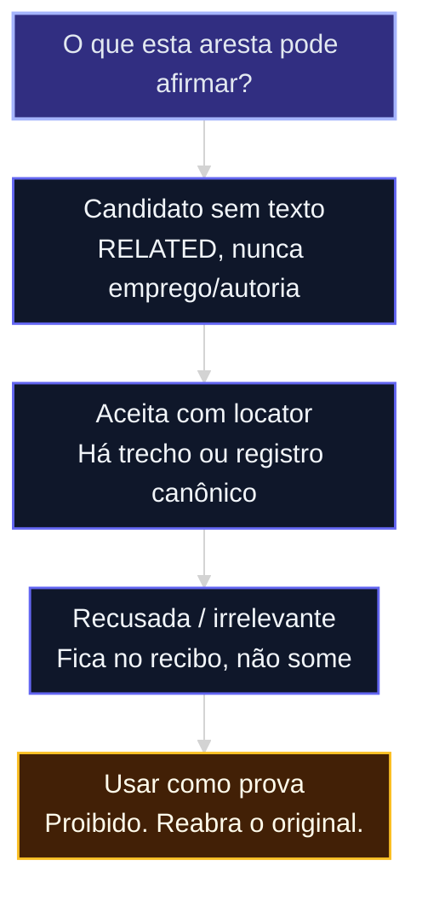

# Grafo é projeção, não oráculo

Só continue se a aula [12c](12c-arquivo-fiel-vs-sintese.md) pediu relações (pessoa–empresa, story–arquivo, claim–prova). Se não precisa de aresta, vá para [12f](12f-menor-cerebro-suficiente.md).

O Graph colorido do vault de estudo (mini-curso Obsidian-IA, aula do Graph do acervo) é **mapa humano**. Esta aula é **índice da capacidade**, com recibo. Mesma palavra, jobs diferentes.

Evidência: [fonte 80](../sources/80-grafo-projecao-nao-oraculo.md).

## Mapa desta aula

Decisão-chave da aula — O que o grafo desta capacidade pode afirmar?

> O desenho não falha por “não ter grafo”. Falha por silêncio, tipo sem texto, duas fontes, tempo quebrado, vazamento e health mentirosa.

**Objetivos:**
- Tratar grafo como projeção regenerável, não como verdade. _(understand)_
- Aplicar invariantes fail-closed no desenho da capacidade. _(apply)_
- Recusar aresta forte sem base e recusar “zero arestas = erro” quando o recusar for correto. _(evaluate)_

---

## Invariantes (o desenho falha fechado se…)

| # | Se isto acontecer | A capacidade deve |
|---|-------------------|-------------------|
| I1 | Havia candidatos e o run sai “ok” sem dizer o que foi de cada um | Exigir *disposição*: aceito / recusado / ambíguo / irrelevante. Zero aceitos **pode** ser correto. |
| I2 | Predicado forte (`trabalha_em`, `escreveu`) sem trecho | No máximo candidato `relacionado_a` |
| I3 | Dois caminhos de extract divergem | Um reconciler; mesmo conjunto de arestas |
| I4 | Item apagado ainda aparece na travessia | O mesmo filtro de ciclo de vida em toda leitura |
| I5 | Saúde “verde” com cobertura 0, ou o contrário do que a busca vê | Métrica = a mesma consulta do produto |
| I6 | “Ana” pessoa funde com “Ana” empresa por parecer igual | Identidade = tipo + apelido + espaço da capacidade |
| I7 | Markdown, banco e grafo são todos “canônicos” | Uma escrita; o resto reconstrói |
| I8 | A síntese cita a aresta e não reabre o original | Sem extract reaberto, sem conclusão |

Não force aresta para “ter grafo”. Isso fabrica fato: pasta `pessoas/ana` ao lado de `empresas/museu` não autoriza “Ana trabalha no museu”. Sem trecho, no máximo *relacionado a*.

Health mentirosa: o relatório diz cobertura zero e densidade no teto **ao mesmo tempo**. Se os números discordam, o health falha — não tira nota.

Banco de grafos “para lembrar” não é o próximo passo. Índice no disco da capacidade, com recibo, basta.

---

## Sequência

1. Liste as arestas que a capacidade *precisa* (não as que ficam bonitas no desenho).
2. Para cada tipo, escreva a base (texto ou registro). Sem base → candidato.
3. Copie I1–I8 para o contrato. Risque o que não se aplica — não invente tipo novo sem regra.
4. Prove: apagar a projeção (o arquivo do grafo) **não** apaga a prova. Se apagar, você tinha dual-write.

A aula [12e](12e-identidade-tempo-isolamento.md) aprofunda identidade, tempo e vazamento.

---

## Exercício

Desenhe o grafo da *sua* capacidade em uma página: nós, arestas, base de cada tipo, o que é só candidato. Marque I1–I8 com passa / não se aplica / falta.

**Funcionou se:** nenhuma aresta forte sem locator; I1 não exige aresta aceita; apagar o desenho não apaga o ledger.

## Portão

Você explica, sem jargão, por que **aresta não autoriza conclusão**.

## Origem curricular

[Fonte 80](../sources/80-grafo-projecao-nao-oraculo.md). Autocontida.

## Navegação

[← Aula anterior](12c-arquivo-fiel-vs-sintese.md) · [↑ M1b](../modulos/M1b-memoria-e-grafo-da-capacidade.md) · [Curso](../README.md) · [Próxima aula →](12e-identidade-tempo-isolamento.md)
