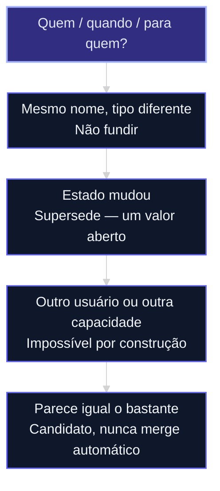

# Identidade, tempo e isolamento

A aula [12d](12d-grafo-projecao-nao-oraculo.md) proibiu aresta sem base. Agora o contrato responde três perguntas que fabricam fato em silêncio: *quem é?*, *ainda vale?*, *quem pode ver?*

Evidência: [fonte 81](../sources/81-identidade-tempo-isolamento.md).

## Mapa desta aula

Decisão-chave da aula — O que este fato afirma sobre quem, quando e para quem?



**Objetivos:**
- Identificar entidade por tipo + apelido + espaço da capacidade. _(apply)_
- Tratar estado mutável com um sucessor, não com dois fatos eternos. _(apply)_
- Recusar vazamento entre usuários, stories ou capacidades. _(evaluate)_

---

## Três invariantes

**Identidade.** Nome igual não é a mesma entidade. “Apple” pessoa ≠ “Apple” empresa. Apelido entra num registro; semelhança de texto é *candidato*. Merge automático por “parece 95%” vaza e mente.

**Tempo.** Cargo, status, contagem: um valor aberto por vez. Intervalo invertido (fim antes do começo) o store **recusa**. “Ontem” / “março” sem data estrita não pode devolver o mesmo vazio de “não há fato”. Substituição é uma operação (`supersede`), não apagar + criar na mão no mesmo dia.

**Isolamento.** Toda aresta carrega o espaço da capacidade (e, se houver pessoa, a atribuição). Header opcional “não esqueça o projeto” não é isolamento. Caderno do empregado (job 3) **nunca** entra no índice compartilhado.

Atribuição vazia (`""`) rejeita. Dois escritores no mesmo unit serializam.

---

## Contrato de uma página

Preencha e cole no PRD:

```yaml
memoria:
  job: "1|2|3|4"
  identidade: "tipo + apelido + espaco; merge so com humano"
  tempo: "estado mutavel usa supersede; datas estritas"
  isolamento: "aresta.espaco = capacidade; empregado fora"
  esquecer: "quem apaga, o que some da leitura, o recibo"
```

Sem a linha `esquecer`, você só sabe lembrar.

---

## Exercício

Uma página. Caso real.

1. Duas entidades que um modelo fundiria (mesmo nome, tipo diferente). Como o contrato as separa?
2. Um fato que muda (cargo, status). Como o sucessor substitui o anterior?
3. Uma coisa que **não** pode vazar para outro usuário ou para o board. Onde vive?

**Funcionou se:** o contrato cabe em uma tela e recusa merge por semelhança.

## Portão

Você explica um caso em que “parecer igual” **não** autoriza fundir.

## Origem curricular

[Fonte 81](../sources/81-identidade-tempo-isolamento.md). Autocontida.

## Navegação

[← Aula anterior](12d-grafo-projecao-nao-oraculo.md) · [↑ M1b](../modulos/M1b-memoria-e-grafo-da-capacidade.md) · [Curso](../README.md) · [Próxima aula →](12f-menor-cerebro-suficiente.md)
