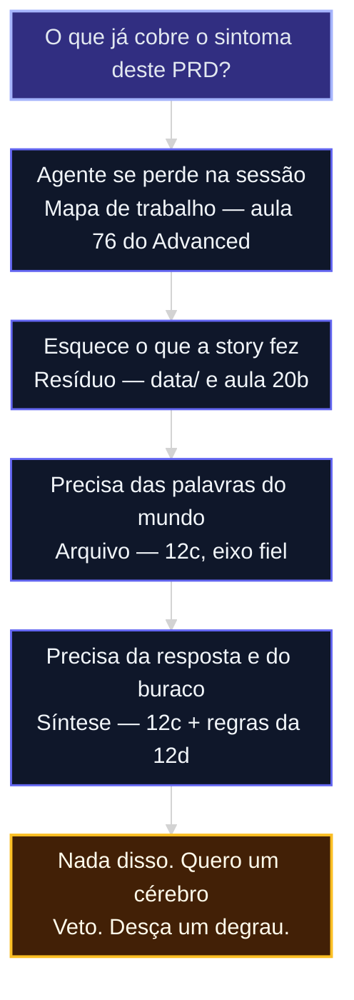

# O menor cérebro suficiente

A aula [12b](12b-quatro-jobs-um-store.md) nomeou o job. A [12c](12c-arquivo-fiel-vs-sintese.md) só existe se o job for córtex. Esta aula fecha o módulo: **o que já basta** neste acervo antes de um store novo.

Evidência: [fonte 82](../sources/82-menor-cerebro-suficiente.md).

## Mapa desta aula

Decisão-chave da aula — O que já cobre o sintoma deste PRD?



> Leia o diagrama antes do texto longo. Depois volte e confira.

> A maior parte das capacidades não precisa de córtex. Precisa de um ledger que sobreviva à compactação e de uma recusa escrita.

**Objetivos de aprendizagem:**
- Ordenar a escada: mapa → resíduo → arquivo → síntese → nervoso. _(understand)_
- Apontar o degrau que já cobre o sintoma do PRD. _(apply)_
- Escrever um veto auditável — ou a condição que autoriza subir. _(evaluate)_

---

## O que você consegue no fim desta aula

Uma linha no PRD:

```text
degrau: {0–5}
basta: {o que já existe}
veto / condição: {frase observável}
```

Se você sair daqui com um backlog de “instalar o cérebro”, a aula falhou.

---

## Escada (menor primeiro)

| Degrau | Já existe | Chega quando |
|---|---|---|
| 0 | Sessão + CLAUDE.md magro | Pedido único |
| 1 | Mapa de trabalho (aula 76 do Advanced) | Esquece tom, posição, raio |
| 2 | `data/` do squad + cartão da [20b](20b-grafo-codigo-e-memoria-de-processo.md) | Wave / fan-in |
| 3 | Arquivo fiel ([12c](12c-arquivo-fiel-vs-sintese.md)) | Palavras originais |
| 4 | Síntese + regras da 12d | Resposta *e* gap |
| 5 | Nervoso (12b job 1) | N agents, N humanos, bloqueio recorrente |

Subir um degrau exige prova de que o atual falhou. Pular para 4 sem 1–2 é o monólito da 12b.

Não confunda as pontes:

- Context Brief do Obsidian-IA — estudo → projeto. Não é memória da capacidade.
- Pasta OS — código para Grep. Não é recall de fato.
- Graph colorido do vault — navegação humana. Não é knowledge graph.

---

## Sequência

1. Relia a linha `compra / recusa` da 12b.
2. Marque o **menor** degrau que cobre o sintoma. Não o mais impressionante.
3. Se for 0–2: escreva o veto de córtex e siga para o [M2](../modulos/M2-construcao-de-capacidade.md).
4. Se for 3–4: o contrato da 12c entra no PRD como Must; a wave continua sem esse store.
5. Se for 5: você não está mais desenhando uma capacidade — está desenhando um control plane. Pare e reescreva o PRD.

**Evite:** “vamos de grafo porque memória”. **Faça:** degrau + veto com condição observável.

---

## Exercício

Quinze minutos. PRD + linha da 12b.

1. Sintoma em uma frase (“esquece o fan-in”, “não sabe quem é o cliente”, “perde o tom”).
2. Degrau (0–5) que já cobre. Justifique com um artefato existente ou declarado.
3. Veto ou condição: `Não subimos para {N} até {evidência}`.
4. O que entra no PRD como Won't.

**Funcionou se:** o degrau não é 4 “por precaução”; o Won't é auditável; você sabe a próxima aula (13 ou 20b), não o próximo produto.

---

## Glossário

- **Menor cérebro suficiente:** o degrau mais baixo que mata o sintoma.
- **Veto:** recusa com condição de reabrir.
- **Teleporte:** pular para síntese/nervoso sem mapa nem resíduo.

## Portão

O PRD declara um **degrau**, um **Won't** e a próxima aula de construção — sem store novo, a menos que 3–4 estejam justificados.

## Origem curricular

Síntese ([fonte 82](../sources/82-menor-cerebro-suficiente.md)). Fecha o M1b. A construção continua na aula 13.

## Navegação

[← Aula anterior](12e-identidade-tempo-isolamento.md) · [↑ M1b](../modulos/M1b-memoria-e-grafo-da-capacidade.md) · [Curso](../README.md) · [Próxima aula →](13-reuse-adapt-create.md)
