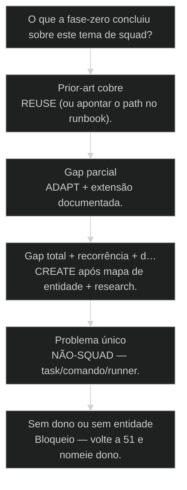
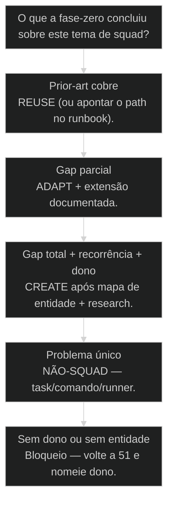

# Triagem de Squad novo: fase-zero de prior-art + research loop

## Mapa desta aula

Decisão-chave da aula — O que a fase-zero concluiu sobre este tema de squad?

> Leia o diagrama antes do texto longo. Depois volte e confira.

> Prior-art antes de criar — não duplica o que o ecossistema já resolve. Fase-zero escrita ou o creator não abre.

**Objetivos de aprendizagem:**
- Listar os itens do checklist de triagem de squad novo (prior-art, gap, recorrência, dono). _(remember)_
- Explicar o research loop busca→síntese→decisão e por que busca sem síntese é turismo. _(understand)_
- Rodar uma fase-zero completa para um tema de squad com evidências escritas. _(apply)_
- Emitir veredito REUSE / ADAPT / CREATE / NÃO-SQUAD com uma frase verificável. _(evaluate)_

---

## O que você consegue no fim desta aula

*G · Destino*

Destino claro antes de qualquer scaffold de squad.

Ao final desta aula você vai conseguir três coisas concretas:

1. Rodar **fase-zero** de triagem com checklist e evidências.
2. Executar um **research loop** curto (busca → síntese → decisão).
3. Emitir veredito **REUSE / ADAPT / CREATE / NÃO-SQUAD** sem empolgação.

Se você sair daqui ainda abrindo squad-creator porque "o tema é legal", a aula
falhou. Duplicar squad é pior que duplicar função — é duplicar **cultura de
manutenção**.

- **Objetivos da aula** (Checklist de triagem completo; Research loop com síntese; Veredito verificável antes do creator)
- **Resultado tangível**: Uma página fase-zero: prior-art, gap, recorrência, dono, veredito.
- **Não é o destino**: Proibir squads novos. É exigir porta fechada até a triagem passar.

---

## O creator como vício

*P · Onde você está*

Empatia com a empolgação que clona ecossistema.

Cara, duplicar squad é pior que duplicar função — é duplicar cultura de
manutenção. Cada squad novo traz agentes, workflows, gates, onboarding,
expectativas. Se o core já resolvia 80%, você pagou 100% de custo por 20%
de ego.

O vício: sentir dor na segunda-feira e na terça já estar no squad-creator.
Sem prior-art. Sem mapa de entidade (aula 51). Sem R>A>C (aula 54). Só
empolgação e YAML.

Se você está aqui, provavelmente já sentiu um destes sintomas:

- Dois squads de research que ninguém sabe qual chamar.
- "Squad de compliance" que é um checklist e um agente genérico.
- Creator rodou; manutenção órfã em 30 dias.
- Research de mercado virou abas abertas sem síntese.

Beleza. A partir daqui a **fase-zero** é portão duro. Creator é prêmio, não
reflexo.

**Onde a maioria trava**
- Squad-creator no impulso da dor
- Busca sem síntese (turismo)
- CREATE sem recorrência nem dono

**Onde o operador vai**
- Fase-zero escrita antes do scaffold
- Síntese de prior-art em bullets
- Veredito R/A/C/NÃO-SQUAD com evidência

---

## Fase-zero: a porta do squad-creator

*S · Rota*

Vasculhar. Sintetizar. Decidir. Só então forjar.

Prior-art de curso: entidades (51), REUSE>ADAPT>CREATE (54), squad-creator (34),
tech-research (36). Esta aula **instancia o ritual** que une os três: triagem
de squad novo como subprocesso explícito.

Sequência canônica da fase-zero:

tema → checklist de triagem → research loop → síntese → veredito →
(só se CREATE) mapa de entidade + creator.

Metáfora: antes de abrir filial da rede, você audita se a loja da esquina já
vende o mesmo prato. Abrir filial por impulso é franquia de prejuízo.

- **1**: fase-zero obrigatória
- **4**: vereditos possíveis
- **0**: creator sem triagem

- **status**: squad triage
- **meta**: fase0=prior-art+loop
- **meta**: veredito=R|A|C|nao
- **ready**: ready to scan

**Legenda de cores**

O que cada cor sinaliza nesta aula

- **Fase-zero** (signal): portão antes do creator
- **Prior-art** (insight): core, repo, mercado, papers
- **Síntese** (bench): o que a busca significa
- **Veredito** (action): R/A/C ou não-squad
- **Duplicata** (pain): cultura de manutenção em dobro

**Como ler esta aula**

1. **Checklist**: O que a triagem pergunta.
2. **Loop**: Busca → síntese → decisão.
3. **Caso**: Squad de research clonado.
4. **Fase-zero**: Rodar no teu tema.

---

## Checklist de triagem (não pule linha)

Cinco perguntas que matam 70% dos CREATEs ruins.

Responda por escrito antes de tocar no creator:

1. **Já existe squad/skill no core ou no repo?** Paths, nomes, o que cobre.
2. **Dá pra adaptar?** Qual % falta e qual a superfície do delta.
3. **Qual o gap real?** Uma frase de problema, não de solução ("quero squad X").
4. **Quem mantém?** Nome humano/time. Sem dono, CREATE é abandono agendado.
5. **Qual a evidência de recorrência?** Toda semana? Todo cliente? Ou foi uma vez?

Bônus que salva: a entidade do domínio está mapeada (aula 51)? Se não,
**pare** — triagem de squad sem entidade é triagem de organograma.

Então o que acontece se a resposta da 5 é "aconteceu ontem uma vez"? Você não
tem squad. Tem task. Talvez skill. Creator fica fechado.

**Checklist em ordem**

1. **Prior-art**: Core/repo/irmãos.
2. **Adaptável?**: % e superfície.
3. **Gap**: Problema em uma frase.
4. **Dono**: Quem carrega a manutenção.
5. **Recorrência**: Frequência real da dor.

> **Lei da fase-zero**: Nenhum squad novo sem fase-zero escrita. Empolgação não é artefato.

- **Dor pontual** != **Domínio de squad**: Uma vez = task; recorrência com handoff = candidato a squad.
- **Nome de departamento** != **Gap de processo**: 'Squad de marketing' não é gap — é organograma.

---

## Research loop: busca sem síntese é turismo

Abas abertas não são decisão. Síntese é.

Loop curto (cabe em 45–90 min pra maioria dos temas):

1. **Busca** — core AIOX, repo, monorepo, mercado, docs; se domínio novo, tech-research.
2. **Síntese** — 5–10 bullets: o que existe, o que cobre, o que falta, riscos.
3. **Decisão** — REUSE / ADAPT / CREATE / NÃO-SQUAD com uma frase verificável.

Turismo: 20 abas, zero parágrafo, creator no dia seguinte.
Pesquisa: 6 fontes, um quadro de síntese, veredito no mesmo dia.

Cara, o research loop não é proibir velocidade. É proibir **velocidade burra**.
Você ainda pode CREATE no mesmo dia — se a síntese aguentar o sol.

**Research loop da triagem**

1. **Tema**: Problema em uma frase
2. **Busca**: Core/repo/oss
3. **Síntese**: Bullets de cobertura
4. **Veredito**: R/A/C/não
5. **Só então**: Creator se CREATE

- **Fase-zero**: Ritual de triagem obrigatório antes de squad-creator.
- **Prior-art**: O que já existe no ecossistema e no mercado relevante.
- **Síntese**: Compressão da busca em cobertura, gap e riscos — não lista de links.
- **Veredito**: Decisão R/A/C/NÃO-SQUAD com frase verificável.

> **Prior-art**: Tech-research (36) escala a busca quando o domínio é novo. R>A>C (54) é a heurística. Entidades (51) amarram o objeto. Esta aula é o portão operacional do CREATE de squad.

---

## Caso: o terceiro squad de research

Quando a triagem devia ter dito REUSE e ninguém perguntou.

Time queria `market-intel-squad` porque o PM "precisava de research melhor".
Creator na terça. Na quinta, alguém lembra que `tech-research` e
`research-marketing-deepdive` já existiam. Agora são três portas. Ninguém
sabe qual chamar. Onboarding triplicou.

Fase-zero que faltou:

1. Prior-art: listou os dois squads/skills + coverage de 85% do pedido.
2. Gap real: faltava só um template de battle-card de concorrente local.
3. Recorrência: sim, semanal.
4. Veredito correto: **ADAPT** — estender o deepdive com um artefato, não CREATE.

Três meses de cultura duplicada teriam virado um PR de template.

Então o que acontece no CREATE legítimo? Domínio novo (ex.: compliance de um
nomeado, entidade mapeada. Aí a fase-zero **aprova** o creator — com o mapa
colado no scaffold.

**Sem triagem**
- Terceiro squad de research
- Nome de departamento como gap
- Creator antes da síntese

**Com fase-zero**
- ADAPT com template novo
- Gap em uma frase de problema
- Veredito no mesmo dia da busca

**Veredito possível**

1. **REUSE**: Já cobre
2. **ADAPT**: 80% + delta
3. **CREATE**: Gap + dono
4. **NÃO-SQUAD**: Task/runner
5. **Creator**: Só no CREATE

---

## Qual o veredito da triagem?

Evidência manda. Empolgação espera do lado de fora.

**Árvore de decisão**
_Cobertura, gap, recorrência e dono — os quatro pilares._

- **Prior-art cobre** — Squad/skill existente resolve o happy path.
  → _REUSE (ou apontar o path no runbook)._
  Ex.: tech-research já faz a varredura multi-fonte.
- **Gap parcial** — 70–90% coberto; delta pequeno.
  → _ADAPT + extensão documentada._
  Ex.: Falta um agente/checklist de compliance setorial.
- **Gap total + recorrência + dono** — Busca falhou; dor bate; alguém mantém.
  → _CREATE após mapa de entidade + research._
  Ex.: Domínio novo do negócio com handoffs reais.
- **Problema único** — Acontece uma vez ou é transformação A→B.
  → _NÃO-SQUAD — task/comando/runner._
  Ex.: Migração pontual de um cliente.
- **Sem dono ou sem entidade** — Ninguém mantém ou o objeto é confuso.
  → _Bloqueio — volte a 51 e nomeie dono._
  Ex.: 'Squad de excelência' sem objeto.

**Gate:** Você consegue justificar o veredito em uma frase verificável com path ou evidência? — _Se não verifica, ainda é empolgação — reabra a síntese._

#### Triagem
Fase-zero.
1. **Buscar: Core, repo, mercado se preciso.
2. **Sintetizar: Cobertura, gap, riscos.
3. **Decidir: R/A/C/não-squad.
4. **Só então creator: Se e somente se CREATE.

#### CREATE aprovado
Gap real.
1. **Research: Síntese anexada.
2. **Entidades: Mapa da aula 51.
3. **Squad-creator: Scaffold com prova colada.
4. **QG: Validar órbitas vs ciclo.

#### Não-squad
Menor primitivo.
1. **Nomear: Task, skill ou runner.
2. **Entregar: Sem pasta de cultura nova.
3. **Medir: Se a dor voltar, reabra triagem.
4. **Documentar: Por que não foi squad.

---

## Fase-zero no tema que te coça (20 min)

Aquele squad que você 'quer criar' — agora com portão.

Vamos lá. Sem isso a aula vira podcast. Pega o tema de squad que está na
ponta da língua e passa pela porta.

- 1. **Tema**: Um squad que você quer criar (ou quase criou).
- 2. **Checklist**: Responda as 5 perguntas da triagem por escrito.
- 3. **Busca**: 3 evidências de prior-art (paths/links + o que cobrem).
- 4. **Síntese**: 5 bullets: cobertura, gap, recorrência, dono, risco.
- 5. **Veredito**: REUSE/ADAPT/CREATE/NÃO-SQUAD com uma frase verificável.

**Funcionou se:**

- Há 3 evidências de prior-art reais (não genéricas).
- Síntese existe — não só lista de links.
- Veredito é um dos quatro e cita evidência.
- Se CREATE, há dono e menção a mapa de entidade; se não, o menor primitivo está nomeado.

---

## Glossário sem jargão de vaidade

- **Fase-zero**: Triagem obrigatória de prior-art e veredito antes do squad-creator.
- **Prior-art**: Evidência do que já resolve (ou quase) o problema no ecossistema/mercado.
- **Research loop**: Ciclo busca → síntese → decisão; sem síntese é turismo.
- **Veredito de triagem**: REUSE, ADAPT, CREATE ou NÃO-SQUAD com frase verificável.
- **Recorrência**: Frequência real da dor — critério pra merecer cultura de squad.
- **Duplicata cultural**: Segundo squad que clona manutenção e confunde roteamento.

---

## Portão da aula

Você passou quando nenhum squad novo passa sem fase-zero de prior-art escrita.
Buscar. Sintetizar. Decidir. Creator é prêmio de gap real — não reflexo de dor.

A IA é a seta. O X é seu — inclusive fechar a porta do scaffold com elegância.

> **Trilha M2 neste curso**: REUSE > ADAPT > CREATE → triagem → anatomia → construção. Daqui a progressão segue para orquestração e escala; design visual pertence ao AIOX Design.

> **GATE-MODULE (auto)**: GPS Goal/Position/Steps presentes · caso + do/dont · decisão · prática com evidência · glossário. Alvo DL ≥70 atingido na construção enrich-W2.

***

---

## Origem curricular

Adaptação autocontida da aula 55 do AIOX Advanced. A fonte histórica permanece registrada em `source_path`; este curso é o dono da progressão atual.

## Navegação

[← Aula anterior](13-reuse-adapt-create.md) · [↑ M2](../modulos/M2-construcao-de-capacidade.md) · [Curso](../README.md) · [Próxima aula →](15-anatomia-de-squad.md)
