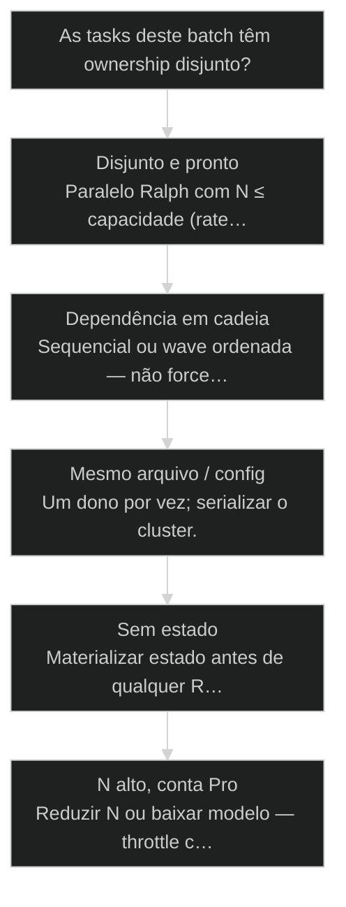
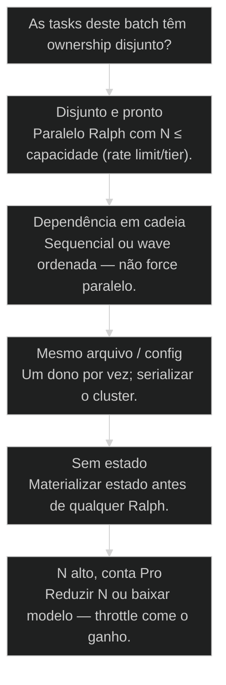

# Ralph: paralelização de múltiplos agentes

> **Papel curricular:** extensão aplicada ao AIOX. Base técnica canônica: `cursos/Introducao-a-Arquitetura-de-Sistemas/aulas/12-concorrencia-paralelismo-fanout-fanin.md`.

## Mapa desta aula

Decisão-chave da aula — As tasks deste batch têm ownership disjunto?

> Leia o diagrama antes do texto longo. Depois volte e confira.

> 4–8 agentes em paralelo com estado compartilhado, ownership de arquivo e fan-in sem atropelo.

**Objetivos de aprendizagem:**
- Explicar o que é Ralph (orquestração multi-agente paralela) e quando o padrão compensa. _(understand)_
- Particionar um batch com ownership de arquivos/tarefas sem interseção. _(apply)_
- Rodar um batch paralelo com estado compartilhado legível (status, locks, board). _(apply)_
- Detectar colisão de ownership e decidir serializar, re-partir ou abortar. _(analyze)_

---

## O que você consegue no fim desta aula

*G · Destino*

Destino claro antes de ligar 8 agentes no mesmo repo.

Ao final desta aula você vai conseguir três coisas concretas:

1. Desenhar um **batch Ralph**: N agentes, N fatias, um estado compartilhado.
2. Olhar uma lista de tasks e **marcar colisão** de ownership antes de spawnar.
3. Definir o **fan-in**: como reintegrar sem "último writer wins" por acidente.

Se você sair daqui achando que paralelo = "abre 8 chats e torce", a aula falhou.
Paralelo sem mapa é atropelamento com branding de produtividade.

- **Objetivos da aula** (Definir Ralph sem mito; Particionar com ownership explícito; Fan-in e detecção de colisão)
- **Resultado tangível**: Plano de 1 batch: tasks, paths, donos, ordem de merge.
- **Não é o destino**: Máximo de agentes possíveis. Isso é ego de throughput.

---

## O erro dos oito pedreiros na mesma laje

*P · Onde você está*

Empatia com quem confundiu swarm com pressa.

Cara, eu criei versões próprias de Ralph. Vários. E aprendi do jeito caro:
oito agentes em paralelo é poder. Também é o jeito mais rápido de corromper
o repo se o ownership for fofoca.

O filme clássico: "roda em paralelo essas stories". Dois agentes tocam
`config.yaml`. Um sobrescreve o outro. O terceiro "resolve" o merge na mão
e apaga um AC. Wall-clock parece ganho. O git blame chora.

Se você está aqui, provavelmente já sentiu:

- Conflito de merge que ninguém sabia que existia.
- Dois agentes "terminaram" e o resultado final não tem os dois.
- Board no chat — estado que some quando a sessão morre.

Beleza. A partir daqui: **estado + partição + fan-in**. Ou sequencial.

**Onde a maioria trava**
- N chats sem mapa de paths
- Estado só na cabeça / no Slack
- Merge 'quem terminar primeiro'

**Onde o operador vai**
- Partição com interseção vazia
- Board/locks/status em disco
- Fan-in com relatório antes do merge

---

## Ralph em uma frase

*S · Rota*

Orquestrar vários workers com fila, estado e fatias que não se esbarram.

**Ralph**, no sentido operacional que usamos no AIOX, é o padrão de
**paralelizar trabalho de agentes** com disciplina de sistema — não de chat.

Três pilares:

1. **Estado compartilhado** — board, fila, status, locks. Quem está em quê.
   Sem isso, cada agente inventa a verdade.
2. **Partição** — cada agente recebe fatia com **paths/tarefas exclusivos**.
   Interseção vazia = paz. Overlap = serializar ou re-partir.
3. **Fan-in** — barreira de reintegração: diff, conflitos, QG, merge order.

Waves (aula 61) elevam isso pro nível de épico. Aqui o músculo é o **batch
paralelo seguro**. A 59 aprofunda a decisão // vs seq. Esta aula é o
**como** do paralelo quando a decisão já é sim.

Eu criei vários Ralphs próprios. O que sobrou em todos: fila com estado,
fatia com dono, barreira com relatório. O resto é implementação.

- **3**: pilares (estado·partição·fan-in)
- **4–8**: agentes típicos no batch
- **0**: overlap de ownership

- **status**: ralph-paralelizacao
- **meta**: pilares=estado+particao+fan-in
- **meta**: safe=disjoint ownership
- **ready**: ready to batch

**Legenda de cores**

O que cada cor sinaliza nesta aula

- **Estado** (signal): fonte única do batch
- **Partição** (insight): fatias sem overlap
- **Worker** (bench): agente com escopo fechado
- **Fan-in** (action): barreira de reintegração
- **Colisão** (pain): dois writers, um path

**Como ler esta aula**

1. **Pilares**: Estado, partição, fan-in.
2. **Ownership**: Como fatiare paths.
3. **Caso**: Batch que colidiu.
4. **Rodar**: Plano e prática.

---

## Da cohort: vários Ralphs, nunca no dev solto

*T1 + T2 · WhatsApp*

Realidade do grupo Advanced — não é slide, é cicatriz.

Alan: vários Ralphs para ETL; **nunca** para desenvolvimento genérico.

A turma via terminal com dezenas de sessões e achava que era o novo Chrome.
Paralelo sem partição de arquivo é o jeito rápido de corromper o repo e estourar
Max no mesmo dia. Esta aula é o freio que o grupo pediu sem saber o nome.

> **Âncora de campo**: Ralph multiplica força e conflito — partição primeiro, spawn depois.

> **Materiais / FAQ**: FAQ-cohort §5 · aulas 22 e 59

---

## Estado compartilhado e partição de ownership

Sem isso, 'paralelo' é esperança distribuída.

**Estado** mínimo que eu exijo antes de spawnar:

- Lista de tasks com id e status (`pending | running | done | blocked`).
- Dono atual (agente/sessão).
- Paths tocados previstos (`file_scope` / touched_paths).
- Lock ou regra: ninguém pega task com path overlap de outra `running`.

Pode viver em YAML no repo, board no tooling, fila Ralph — o meio importa
menos que a **fonte única legível**.

**Partição** — algoritmo mental em 30 segundos:

1. Liste paths por task.
2. Desenhe grafo de overlap (aresta se interseção ≠ ∅).
3. Componentes sem aresta → paralelo ok.
4. Com aresta → mesmo batch serial **ou** reescreva escopo.

Worktrees isolados ajudam (cada agente no seu git), mas **não substituem**
partição se o fan-in mergeia no mesmo tronco. Isolamento sem ownership
só adia o conflito pro Stage fan-in.

Capacidade também é partição de **recursos**: N agents no mesmo pool de
rate limit vira fila disfarçada. Se a conta é Pro e o modelo é pesado,
N=3 bem particionado bate N=8 com 429 e retry. Throughput líquido > N bruto.

Estado em disco (YAML/JSON no repo ou tooling) vence estado no chat: sessão
morre, board permanece, resume funciona. Ralph sem resume é fogueira.

- **1. Estado**: Board/fila com status e dono. [verdade]
- **2. Partição**: Paths disjuntos por worker. [paz]
- **3. Fan-in**: Relatório + merge order + QG. [fecho]

> **Lei do overlap**: Se dois workers podem escrever o mesmo path no mesmo batch, um deles espera — ou o batch é mentira.

- **Worktree isolado** != **Ownership resolvido**: Isolamento atrasa o conflito; ownership evita.
- **Mais agentes** != **Mais throughput**: Com overlap, mais agentes = mais thrash de merge.

---

## Caso: seis stories, um config.yaml

Throughput fantasma e o fan-in que salvou o restante.

Batch de sexta: seis stories "independentes". Quatro em pastas distintas —
ok. Duas tocavam `squads/*/config.yaml` e `skills/*/SKILL.md`.
Spawnaram juntas porque "são stories diferentes".

Resultado: três merges manuais, um AC sumido, duas horas "ganhas" no
wall-clock e quatro horas pagas no fan-in caótico.

Reparo do padrão:
1. Pré-scan de touched_paths.
2. Duas stories de config → batch SEQUENCED.
3. Quatro stories disjuntas → paralelo.
4. Fan-in report **sempre** (mesmo com zero conflitos).

Então o que acontece se você pula o pré-scan? Você otimiza a largada e
sabota a chegada.

Mini-protocolo que eu gravo no CLAUDE.md do projeto quando o time escala:

- Toda task ready declara `touched_paths` (mesmo aproximado).
- Spawn só se interseção com `running` for vazia.
- Fan-in report obrigatório no fim do batch (template de 5 linhas serve).
- Path ímã (config, migrations, shared package) = fila serial por política.

**Ciclo de um batch Ralph**

1. **Fila**: Tasks ready + paths
2. **Partir**: Grafo de overlap
3. **Spawn**: Workers com escopo
4. **Barreira**: Todos done/blocked
5. **Fan-in**: Diff + merge order

---

## Ligar o paralelo ou não?

Árvore curta antes do spawn.

**Árvore de decisão**
_Paths e deps primeiro — ego de velocidade depois._

- **Disjunto e pronto** — Paths sem overlap, deps satisfeitas, estado no board.
  → _Paralelo Ralph com N ≤ capacidade (rate limit/tier)._
  Ex.: 5 stories em apps/web vs apps/api vs docs.
- **Dependência em cadeia** — B precisa do artefato de A.
  → _Sequencial ou wave ordenada — não force paralelo._
  Ex.: Schema antes da API.
- **Mesmo arquivo / config** — Overlap de path garantido.
  → _Um dono por vez; serializar o cluster._
  Ex.: Dois agents em core-config.
- **Sem estado** — Só chat, sem board/status.
  → _Materializar estado antes de qualquer Ralph._
  Ex.: Lista no WhatsApp.
- **N alto, conta Pro** — 6+ Opus no mesmo pool de rate limit.
  → _Reduzir N ou baixar modelo — throttle come o ganho._
  Ex.: 8 Opus e 429 em cascata.

**Gate:** Você consegue listar, por worker, os paths exclusivos e o critério de done? — _Se o path é 'o repo inteiro', você não particionou._

#### Rota paralelo seguro
Quando a partição limpa.
1. **Mapear: Tasks + deps + paths.
2. **Partir: Clusters sem overlap.
3. **Estado: Board com status/dono.
4. **Fan-in: Relatório + merge order.

#### Rota abortar paralelo
Quando o risco come o speedup.
1. **Detectar: Overlap ou dep oculta.
2. **Serializar: Cluster em fila.
3. **QG: Um por vez se shared.
4. **Reaprender: Anotar path perigoso.

#### Rota fan-in
Barreira sem teatro.
1. **Coletar: Branches/worktrees done.
2. **Diff: Pares ou vs main.
3. **Ordenar: Sem conflito primeiro.
4. **Handoff: DevOps/merge com checklist.

---

## Particione a semana (15 min)

Seis tasks reais — grafo no papel.

Sem o grafo, a aula vira torcida por multi-agent. Cronometra quinze minutos.

- 1. **Liste**: 6 tasks da semana (stories ou chores) com paths prováveis.
- 2. **Grafo**: Aresta se compartilham path ou dependência de artefato.
- 3. **Batches**: Marque quais rodam juntas sem colisão.
- 4. **Estado**: Escreva o mínimo de campos do board (id, status, dono, paths).
- 5. **Fan-in**: Defina ordem de merge se 3 terminarem juntas.

**Funcionou se:**

- Há grafo de overlap/deps, não só lista.
- Pelo menos um cluster serializado por overlap real.
- Board mínimo e ordem de fan-in estão escritos.

---

## Glossário sem jargão de vaidade

- **Ralph**: Padrão de orquestração multi-agente paralela com fila/estado e workers de escopo fechado.
- **Ownership**: Direito exclusivo de escrita em paths/tarefas durante o batch.
- **Partição**: Divisão do trabalho em fatias com interseção de path vazia.
- **Fan-in**: Barreira de reintegração: diffs, conflitos, ordem de merge, QG.
- **Estado compartilhado**: Fonte única (board/locks/status) que todos os workers leem e atualizam.
- **Touched paths**: Conjunto de paths que a task pretende escrever — base da partição segura.

---

## Portão da aula

Você passou quando um batch só sobe com estado, partição disjunta e plano
de fan-in. Paralelo é ferramenta. Ownership é engenharia.

A IA é a seta. O X é seu — inclusive dizer **não** pro oitavo agente.
Paralelo com estado é sistema. Paralelo sem estado é torcida organizada.

> **GATE-MODULE (auto)**: GPS Goal/Position/Steps presentes · caso + do/dont · decisão · prática com evidência · glossário. Alvo DL ≥70 atingido na construção enrich-W3.

***

---

## Origem curricular

Adaptação autocontida da aula 58 do AIOX Advanced. A fonte histórica permanece registrada em `source_path`; este curso é o dono da progressão atual.

## Navegação

[← Aula anterior](16-squad-creator.md) · [↑ M3](../modulos/M3-orquestracao-e-escala.md) · [Curso](../README.md) · [Próxima aula →](18-paralelo-vs-sequencial.md)
