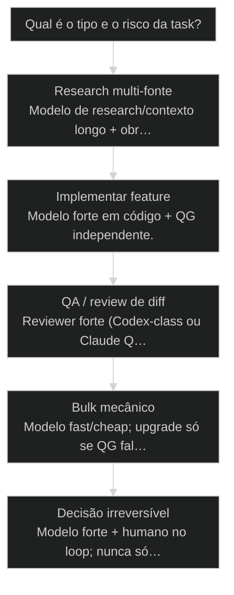
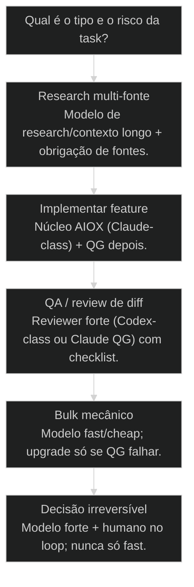

# Routing de modelos: fitness, custo, qualidade e fallback

Política canônica: Model routing + Three-brain (motores diferentes) e No-self-review — quem implementa não é o único a validar.

## Mapa desta aula

Decisão-chave da aula — Qual é o tipo e o risco da task?

> Leia o diagrama antes do texto longo. Depois volte e confira.

> Modelo certo pra tarefa certa — fitness, custo e qualidade na mesma conta.

**Objetivos de aprendizagem:**
- Definir uma política de routing por tipo de tarefa com critérios explícitos. _(apply)_
- Justificar a escolha de cada modelo por fitness, não por marca ou moda. _(evaluate)_
- Calcular trade-off custo × qualidade × latência em um fluxo real. _(analyze)_
- Medir e ajustar a política após uma semana de uso com evidência. _(evaluate)_

---

## O que você consegue no fim desta aula

*G · Destino*

Destino claro antes de qualquer war de marca de modelo.

Ao final desta aula você vai conseguir três coisas concretas:

1. Escrever uma **política de routing** (task type → modelo) em uma página.
2. Justificar "por que este modelo aqui" com **fitness**, não fanclub.
3. Olhar a fatura/latência da semana e **ajustar** a política com número.

Se você sair daqui com "uso sempre o top porque qualidade", a aula falhou.
Qualidade sem fitness é desperdício com branding de excelência.

- **Objetivos da aula** (Política task→modelo; Fitness vs moda; Medir custo/qualidade)
- **Resultado tangível**: Tabela de rotas do teu time + 1 métrica de acompanhamento.
- **Não é o destino**: Trocar de modelo toda semana por hype no Twitter/X.

---

## O erro do canhão em formiga

*P · Onde você está*

Empatia com quem roda Opus em rename de variável.

Cara, token economy não é miséria. É **alocar inteligência onde ela
multiplica**. Rodar o modelo mais caro em tudo é o equivalente a chamar
o arquiteto sênior pra formatar CSV.

O outro extremo também falha: modelo barato em decisão de arquitetura e
você paga com redesign. Routing é a faixa do meio com disciplina.

Se você está aqui, já sentiu:

- Fatura absurda com 80% de tarefas mecânicas.
- Modelo "rápido" alucinando em review de segurança.
- Time brigando de marca ("Claude vs GPT") em vez de de **papel da task**.

A partir daqui: a task define a rota. A marca é detalhe de implementação.

**Onde a maioria trava**
- Um default eterno pro mundo
- Escolha por hype da semana
- Sem métrica pós-rota

**Onde o operador vai**
- Política por tipo de task
- Fitness + fallback escrito
- Review semanal de custo/QG

---

## Routing é política, não preferência

*S · Rota*

Task type → modelo com eixos de decisão estáveis.

**Routing de modelos** = regras que escolhem provider/modelo (e às vezes
temperatura/tools) a partir do **tipo de tarefa** e do **risco**.

Exemplo didático da trilha (ajuste aos teus contratos reais):

- **Pesquisa multi-fonte / síntese larga** → modelo forte em contexto longo,
  grounding e citações verificáveis.
- **QA / review de diff / achar bug** → reviewer forte em código e crítica,
  preferencialmente independente de quem implementou.
- **Orquestração, escrita de story e implementação** → modelo principal da
  stack com tools e contratos necessários para a tarefa.
- **Bulk mecânico** (rename, format, checklist) → modelo barato/rápido.

Os nomes mudam. A **política** permanece: fitness por tarefa + fallback +
métrica. Prior-art: token economy e executores. Aqui vira **tabela de rota**.

Guerreiro de marca no time é cheiro de política fraca. Quando a tabela é
clara, a discussão vira "essa task é review ou bulk?" — não "Claude é
melhor que X". Classificar task é trabalho. Brigar de logo é hobby.

- **4**: eixos (qualidade·custo·latência·ctx)
- **1**: política versionada
- **0**: marca por ego

- **status**: routing-modelos
- **meta**: policy=task→model
- **meta**: axes=q·$·lat·ctx
- **ready**: ready to policy

**Legenda de cores**

O que cada cor sinaliza nesta aula

- **Task type** (signal): classe de trabalho estável
- **Fitness** (insight): modelo adequado ao eixo
- **Fallback** (bench): plano B quando falha/QG
- **Métrica** (action): custo, pass rate, latência
- **Monólito** (pain): um modelo pra qualquer coisa

**Como ler esta aula**

1. **Eixos**: Como julgar fitness.
2. **Política**: Tabela canônica.
3. **Caso**: Fatura vs qualidade.
4. **Ajustar**: Medir e versionar.

---

## Da cohort: Haiku explore · Sonnet implement · Opus reason

*T1 + T2 · WhatsApp*

Realidade do grupo Advanced — não é slide, é cicatriz.

O ensino de campo registrou redução material de custo ao separar exploração,
implementação e raciocínio. O percentual não é universal: deve ser medido no
próprio workload antes de virar promessa.

Mais o hábito do Alan: modelos baratos de contexto grande em subagente de leitura;
modelo top no ouro. A cohort discutiu Max semanal vs API — a resposta estrutural
é routing + determinismo, não só trocar cartão.

> **Âncora de campo**: Routing escrito vira economia; default cego vira fatura.

> **Materiais / FAQ**: 01 Token Economy · 17 Engenharia de contexto · GUIA-AUTONOMIA-ECONOMIA-TOKENS

---

## Quatro eixos e uma tabela viva

Sem eixos, routing vira opinião de stand-up.

Avalie cada rota nestes eixos:

1. **Qualidade exigida** — aceita 80% ou precisa de QG rigoroso?
2. **Custo** — volume × preço por token/chamada.
3. **Latência** — humano esperando no loop vs batch noturno.
4. **Contexto / tools** — janela, vision, web, repo tools, structured out.

Política mínima (versionada no repo, não no Slack):

| Task type        | Modelo default     | Fallback        | Gate              |
|------------------|--------------------|-----------------|-------------------|
| Research         | contexto longo + grounding | segundo modelo apto | citações/fontes |
| Implementação    | forte em código + tools | modelo principal | testes + QG |
| QA / review      | reviewer independente | segundo reviewer | checklist severo |
| Bulk / format    | fast/cheap | modelo principal | diff mecânico |
| Decisão produto  | raciocínio forte + humano | roundtable | aceite explícito |

**Fallback** é parte da política. Sem fallback, o primeiro 429 ou FAIL
vira improviso. Improviso não escala.

Lei: **troque a tabela com evidência semanal**, não com tweet.

Onde a política vive no AIOX: core-config, CLAUDE.md (atalhos), ou tabela
versionada em `docs/ops/model-routing.md`. Agentes e skills **leem** a
rota; humano **versiona** a mudança. Se a rota só existe na cabeça do
fundador, cada sessão reinventa o monólito.

Exceções: permitidas com log de uma linha (`upgrade review→opus: FAILs
3/3 no Sonnet`). Exceção sem log é regressão de política.

- **1. Classificar task**: Tipo, risco, volume. [input]
- **2. Rotear modelo**: Default + fallback. [policy]
- **3. Medir e ajustar**: Custo, pass, latência. [loop]

> **Lei do fitness**: O modelo serve a task. A task não existe pra justificar a assinatura do modelo.

- **Modelo mais caro** != **Melhor resultado**: Em bulk mecânico, caro só atrasa e enriquece o provider.
- **Troca de marca** != **Melhoria de política**: Sem métrica, troca é ritual.

---

## Caso: mesma qualidade, metade da fatura

Routing que pagou o curso do time.

Operação rodava tudo no topo de linha: research, rename, story, review,
commit message. Qualidade ok. Fatura assustava. Latency em batch alto
por throttle.

Intervenção em uma semana:
1. Classificar 2 semanas de logs por task type.
2. Bulk/format → modelo fast (queda enorme de $).
3. Research multi-PDF → modelo de contexto longo dedicado.
4. QG de PR crítico → reviewer forte + checklist.
5. Default de orquestração → modelo principal com skills e tools confirmadas.

Resultado: pass rate de QG estável, fatura ~metade, menos 429 no paralelo.

Então o que acontece se você só "troca pro modelo da moda"? Você move o
problema de marca sem mexer na política.

Sinais de que a política envelheceu:
- Pass rate de um task type caiu 2 sprints seguidas
- $ de bulk > 40% da fatura
- Humanos contornam a tabela "porque esse modelo é ruim nisso"
- Paralelo estoura 429 sempre no mesmo modelo default

Cada sinal pede **ajuste cirúrgico de uma linha**, não rebranding completo.

**Loop semanal de routing**

1. **Log**: Task types da semana
2. **Custo**: $ e tokens por tipo
3. **QG**: Pass/fail por tipo
4. **Ajuste**: Muda 1–2 rotas
5. **Versiona**: Tabela no repo

---

## Qual modelo para esta task agora?

Árvore curta alinhada à política.

**Árvore de decisão**
_Classifique antes de abrir o seletor de modelo._

- **Research multi-fonte** — Muitos docs, web, síntese larga.
  → _Modelo de research/contexto longo + obrigação de fontes._
  Ex.: Bench de libs, competitive scan.
- **Implementar feature** — Código com ACs e testes.
  → _Núcleo AIOX (Claude-class) + QG depois._
  Ex.: Story ready de API.
- **QA / review de diff** — Achar falha, severidade, prescrição.
  → _Reviewer forte (Codex-class ou Claude QG) com checklist._
  Ex.: PR de auth.
- **Bulk mecânico** — Rename, format, gerar boilerplate.
  → _Modelo fast/cheap; upgrade só se QG falhar._
  Ex.: 100 arquivos de i18n.
- **Decisão irreversível** — Produto, legal, arquitetura de alto blast.
  → _Modelo forte + humano no loop; nunca só fast._
  Ex.: Escolher multi-tenant strategy.

**Gate:** A rota escolhida está na política versionada ou é exceção justificada? — _Exceção sem log vira monólito de novo em duas sprints._

#### Rota política
Escrever o contrato do time.
1. **Tipos: 5–8 task types reais.
2. **Default: Modelo por tipo.
3. **Fallback: Plano B + gate.
4. **Repo: Versionar a tabela.

#### Rota economia
Quando a fatura grita.
1. **Log: Onde vai o $.
2. **Bulk: Descer de modelo.
3. **Manter: QG/crítico no forte.
4. **Medir: Pass rate estável?

#### Rota qualidade
Quando o QG sangra.
1. **Aislar: Qual task type falha?
2. **Subir: Só esse tipo de modelo.
3. **Prompt: Checklist antes de trocar tudo.
4. **Retest: Mesmos casos, novo score.

---

## Política de routing em uma página (20 min)

Tabela no vault ou no repo — pública pro time.

Se não escrever, amanhã cada um roteia por humor. Cronometra vinte minutos.

- 1. **Tipos**: Liste 6 task types que o teu fluxo realmente usa.
- 2. **Eixos**: Para cada: qualidade exigida, volume, latência, contexto.
- 3. **Rota**: Default + fallback + gate de aceite.
- 4. **Exceção**: Uma regra de upgrade (quando subir de modelo).
- 5. **Métrica**: O que você mede em 7 dias ($, pass rate, p95 latency).

**Funcionou se:**

- Tabela com ≥6 tipos, default e fallback.
- Pelo menos 1 tipo no modelo cheap e 1 no strong justificados.
- Métrica semanal definida de forma mensurável.

---

## Glossário sem jargão de vaidade

- **Routing de modelos**: Política que escolhe provider/modelo conforme tipo e risco da task.
- **Fitness**: Adequação do modelo aos eixos da task (qualidade, custo, latência, contexto).
- **Fallback**: Rota alternativa quando default falha, throttle ou QG rejeita.
- **Task type**: Classe estável de trabalho (research, implement, review, bulk…).
- **Monólito de modelo**: Usar um único modelo para todas as tasks por hábito ou medo.

---

## Portão da aula

Você passou quando a escolha de modelo é linha de política versionada —
com fallback e métrica — não opinião de stand-up. Codex, Gemini, Claude
(ou os nomes de amanhã) são peças. A rota é o sistema.

A IA é a seta. O X é seu — inclusive **qual cérebro** segura a ferramenta.

> **GATE-MODULE (auto)**: GPS Goal/Position/Steps presentes · caso + do/dont · decisão · prática com evidência · glossário. Alvo DL ≥70 atingido na construção enrich-W3.

***

---

## Origem curricular

Adaptação autocontida da aula 60 do AIOX Advanced. A fonte histórica permanece registrada em `source_path`; este curso é o dono da progressão atual.

## Navegação

[← Aula anterior](18-paralelo-vs-sequencial.md) · [↑ M3](../modulos/M3-orquestracao-e-escala.md) · [Curso](../README.md) · [Próxima aula →](20-wave-execute.md)
