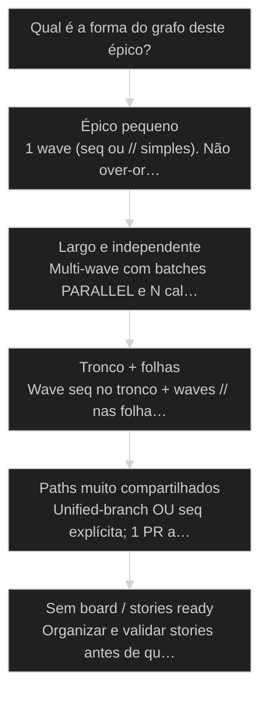
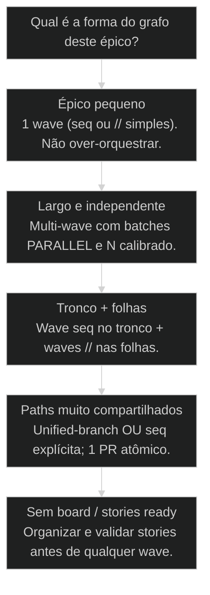

# Wave Execute: orquestração avançada com waves paralelas

← Routing de modelos: Codex para QA, Gemini para pesquisa, Claude para o resto · ↑ M10 · ⌂ Curso · → Service-as-Software: a era do serviço produtivado

## Mapa desta aula

Decisão-chave da aula — Qual é a forma do grafo deste épico?

> Leia o diagrama antes do texto longo. Depois volte e confira.

> Épico em waves: DAG, partição de ownership, dispatch, fan-in e handoff — sem virar atropelo.

**Objetivos de aprendizagem:**
- Desenhar um épico em waves com dependências e parallel_groups explícitos. _(apply)_
- Explicar o pipeline wave-execute (DAG → dispatch → fan-in → handoff) em linguagem operacional. _(understand)_
- Executar (ou dry-run) fan-out/fan-in sem perder rastreio de story e ownership. _(apply)_
- Comparar wall-clock de wave vs sequência pura e escolher unified-branch quando couber. _(analyze)_

---

## O que você consegue no fim desta aula

*G · Destino*

Destino claro antes de qualquer /wave-execute no terminal.

Ao final desta aula você vai conseguir três coisas concretas:

1. Fatiar um épico em **waves** com o que pode junto, o que espera barreira,
   o que só no final.
2. Descrever o **pipeline** (plano → pool → dispatch → fan-in → handoff) sem
   copiar manual de 2000 linhas.
3. Dizer se a wave ganhou de verdade no **wall-clock** — ou se só fez barulho.

Se você sair daqui achando que wave = "liga tudo paralelo", a aula falhou.
Wave sem grafo é Ralph embriagado de épico.

- **Objetivos da aula** (Waves com deps explícitas; Pipeline e papéis (orquestrador vs story); Fan-in + métrica de wall-clock)
- **Resultado tangível**: Plano de 3 waves de um épico seu com parallel_groups e riscos de fan-in.
- **Não é o destino**: Memorizar flags. Isso é manual — o juiz é o grafo.

---

## O erro do épico monólito sequencial (e do caos total)

*P · Onde você está*

Empatia com os dois extremos.

Cara, tem dois filmes ruins.

**Filme A:** épico de 12 stories em fila única. Cada uma espera a anterior
mesmo sem dep. Semana vira mês. Você culpa a IA. Era scheduling.

**Filme B:** "roda o épico em paralelo". Doze agents, overlap de paths,
push do orquestrador, merge no feeling. Repo sangra. Você culpa multi-agent.
Era ausência de wave.

Wave Execute é o meio: **DAG + partição + isolamento por story + barreira
+ handoff de merge pra quem tem autoridade (@devops)**.

Se você está aqui depois de Ralph e do juízo // vs seq, já tem o músculo.
Agora sobe o nível: **épico inteiro com ondas**.

**Onde a maioria trava**
- Épico sem waves (só lista)
- Orquestrador fazendo git push
- Fan-in opcional 'se der tempo'

**Onde o operador vai**
- Waves com parallel_groups
- Story em worktree; merge com dono
- Fan-in report sempre (zero conflito também)

---

## Anatomia de uma wave

*S · Rota*

Entrada ready → partição → execução → barreira → próxima onda.

No AIOX, **wave-execute** é o pipeline que pega um épico e uma wave,
monta o plano e dispara **um full-cycle por story** (validate → develop →
review → … → close) em isolamento, depois reintegra.

Anatomia mental (decore o fluxo, não o nome de cada script):

1. **BUILD-DAG / preflight** — stories da wave, status, deps, partição de
   file-ownership (o que pode // vs seq).
2. **SHOW-PLAN** — humano confirma o mapa.
3. **ACTIVATE-POOL** — worktree/slot por story.
4. **DISPATCH** — sobe full-cycle por story (paralelo no batch safe).
5. **FAN-IN** — detecta conflitos entre branches **antes** do merge.
6. **HANDOFF** — @devops merge/push; orquestrador **não** usurpa git remoto.

Modo **unified-branch**: 1 branch / 1 PR — força sequencial de propósito
quando o batch é atômico ou compartilha muito path. Trade: menos //, review
atômica. Prior-art: 58 e 59. Aqui é o **sistema** em volta.

- **6**: stages canônicos
- **1**: full-cycle por story
- **0**: push no orquestrador

- **status**: wave-execute
- **meta**: stages=6 · child=full-cycle
- **meta**: merge=@devops only
- **ready**: ready to wave

**Legenda de cores**

O que cada cor sinaliza nesta aula

- **Wave** (signal): fatia com barreira de done
- **Partição** (insight): PARALLEL vs SEQUENCED
- **Worktree** (bench): isolamento por story
- **Handoff** (action): merge com autoridade certa
- **Lead push** (pain): orquestrador no git remoto

**Como ler esta aula**

1. **Anatomia**: Stages e papéis.
2. **Partição**: Como nasce o //.
3. **Caso**: Épico em 3 waves.
4. **Plano**: Seu épico no papel.

---

## Partição de ownership e fan-in que não mente

O coração técnico da wave segura.

**Partição** (ideia, não o script):

- Se `file_scope` diz exclusive e paths não se cruzam → candidata PARALLEL.
- Se paths se cruzam (config, migrations, skills) → SEQUENCED no cluster.
- Default seguro quando ambíguo: **sequenciar**.

Cada story roda o **mesmo** full-cycle — não um executor meia-boca. O
orquestrador coordena batch boundaries; não vira Dev de plantão.

**Fan-in** sempre emite relatório:

| Branch A | Branch B | Conflitos | Files |
|----------|----------|-----------|-------|
| …        | …        | NONE/YES  | …     |

Zero conflito também reporta. Silêncio não é sucesso — é cegueira.

**Autoridade:** pipeline não faz `git push` / merge em main. Handoff YAML
pro @devops. Isso não é burocracia: é impedir que o lead vire single point
of corruption do git.

Dry-run existe pra isso: ver o plano **sem** spawnar o caos.

Capacidade e saúde da wave:
- N paralelo default calibrado pro tier (muitas vezes 3)
- Circuit breaker por story (QG retries) e timebox da wave
- Resume após interrupção: estado em disco, stories Done puladas
- Observabilidade: quem terminou, quem blocked, onde está o ACK

Wave sem estado durável é demo. Wave com estado é operação.

- **1. Plano/DAG**: Deps + parallel_groups + ownership. [mapa]
- **2. Dispatch**: Full-cycle isolado por story. [run]
- **3. Fan-in/Handoff**: Conflitos + merge com dono. [fecho]

> **Lei da wave**: Orquestrador coordena. Story executa. DevOps promove. Misturar os três é o atalho pro incidente.

- **Wave** != **Sprint de calendário**: Wave é fatia de grafo e barreira, não duas semanas mágicas.
- **Unified-branch** != **Mais velocidade**: É atomicidade de review; costuma forçar seq.

---

## Caso: épico de onboarding em três waves

Wall-clock real vs fantasia de N=12.

Épico: onboarding B2B. 11 stories.

**Wave 1 (tronco seq):** schema de org/user → policies RLS → seed.
**Wave 2 (//):** API invite, API accept, email templates, docs — paths
disjuntos após schema.
**Wave 3 (híbrido):** UI multi-step (// por pasta) + config de feature flag
(seq no cluster config).

Tentativa anterior "tudo //": UI e API divergiram; migrations brigaram;
três dias de fan-in. Com waves: wall-clock caiu porque o **retrabalho**
sumiu — não porque o modelo ficou mais esperto.

Unified-branch na Wave 3 UI? Só se o batch era um PR conceitual único.
Caso contrário, N PRs com ownership limpo revisam melhor.

Então o que acontece se você pula a Wave 1? Você paraleliza mentira em
cima de schema inexistente.

Comparativo que eu mostro pro time depois da wave:

| Métrica              | Seq pura | Wave bem partida |
|----------------------|----------|------------------|
| Wall-clock           | alto     | menor se // real |
| Retrabalho merge     | baixo    | controlado       |
| Rastreio por story   | ok       | obrigatório      |
| Risco de thrash git  | baixo    | só se partição ruim |

O objetivo não é "parecer paralelo". É **terminar o épico correto mais cedo**.

**Épico em ondas**

1. **W1 seq**: Fundação de dados
2. **Barreira**: Schema done real
3. **W2 //**: APIs e side paths
4. **Fan-in**: Conflitos + QG
5. **W3**: UI + flags com híbrido

---

## Como fatiar e executar este épico?

Árvore curta de wave design.

**Árvore de decisão**
_Desenhe deps e paths antes de escolher N ou flags._

- **Épico pequeno** — 2–3 stories, deps curtas.
  → _1 wave (seq ou // simples). Não over-orquestrar._
  Ex.: Hotfix + copy + changelog.
- **Largo e independente** — Muitas stories com paths disjuntos.
  → _Multi-wave com batches PARALLEL e N calibrado._
  Ex.: 10 telas isoladas + docs.
- **Tronco + folhas** — Core path serial, depois fan-out.
  → _Wave seq no tronco + waves // nas folhas._
  Ex.: Schema→API→várias UIs.
- **Paths muito compartilhados** — WL-5/ownership grita SEQUENCED.
  → _Unified-branch OU seq explícita; 1 PR atômico._
  Ex.: Refactor de package core.
- **Sem board / stories ready** — Caos de status, AC fraco.
  → _Organizar e validar stories antes de qualquer wave._
  Ex.: Épico só no chat.

**Gate:** Você consegue apontar parallel_groups e o dono do merge da wave? — _Se o dono do merge é 'qualquer agent', a wave não está pronta._

#### Rota planejar
Antes do dispatch.
1. **Stories: Ready com ACs e paths.
2. **Deps: Grafo e waves.
3. **Partição: // vs seq por ownership.
4. **Donos: Executor, QG, merge.

#### Rota executar
Com barreira de verdade.
1. **Plan: Dry-run / show-plan.
2. **Dispatch: Full-cycle por story.
3. **Fan-in: Relatório de conflitos.
4. **Handoff: @devops merge-back.

#### Rota unified
Quando atomicidade > //.
1. **Detectar: Overlap alto / batch atômico.
2. **Flag: Uma branch alvo.
3. **Seq: Dispatch um a um.
4. **1 PR: Review e merge únicos.

---

## Três waves no teu épico (20 min)

Papel, board ou epic-state — mas escrito.

Escolhe um épico real (mesmo pequeno). Se não tem, pega o último monólito
que sofreu. Cronometra vinte minutos.

- 1. **Épico**: Liste 6–12 stories com status e paths prováveis.
- 2. **Grafo**: Marque deps A→B e overlaps de path.
- 3. **3 waves**: Corte em ondas com barreira explícita entre elas.
- 4. **Parallel groups**: Em cada wave, o que é // e o que é seq.
- 5. **Risco de fan-in**: Onde o merge vai doer e quem é o dono.

**Funcionou se:**

- 3 waves com critério de barreira (não só 'parte 1/2/3').
- Pelo menos um cluster SERIAL por overlap ou dep.
- Dono de merge e risco de fan-in nomeados.

---

## Glossário sem jargão de vaidade

- **Wave**: Fatia do épico com conjunto de stories, partição e barreira de conclusão.
- **Wave Execute**: Pipeline que planeja, dispara full-cycles isolados e reintegra com fan-in/handoff.
- **Parallel group**: Subconjunto de stories autorizadas a rodar em paralelo na mesma wave.
- **Fan-in**: Etapa de detecção de conflitos e consolidação antes do merge.
- **Unified-branch**: Modo de 1 branch/1 PR que força sequencial em troca de review atômica.
- **Handoff @devops**: Transferência formal de merge/push para a órbita com autoridade de git remoto.

---

## Portão da aula

Você passou quando um épico seu tem waves com grafo, partição e dono de
fan-in — e você sabe por que não é "só muito agent ao mesmo tempo".
Épico em horas não é milagre. É engenharia de barreira.

A IA é a seta. O X é seu — inclusive o **ritmo das ondas** que disparam.

> **GATE-MODULE (auto)**: GPS Goal/Position/Steps presentes · caso + do/dont · decisão · prática com evidência · glossário. Alvo DL ≥70 atingido na construção enrich-W3.

***

---

## Origem curricular

Adaptação autocontida da aula 61 do AIOX Advanced. A fonte histórica permanece registrada em `source_path`; este curso é o dono da progressão atual.

## Navegação

[← Aula anterior](19-routing-de-modelos.md) · [Curso](../README.md) · [Próxima aula →](21-harness.md)
