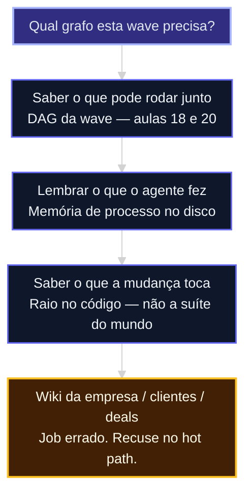
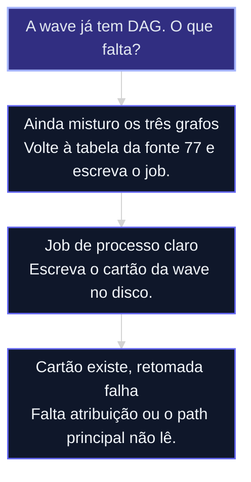

# Grafo de código e memória de processo

A wave já tem DAG. Agora o agente precisa **lembrar o processo** — o que rodou, o que tocou, o que não repetir — sem virar enciclopédia da empresa.

Pré-requisito de método: aula 76 do Advanced (`cursos/AIOX Advanced/aulas/76-orientacao-do-agente.md`). Pré-requisito de memória: [aula 12b](12b-quatro-jobs-um-store.md) (job 4 nomeado). Sem isso, esta aula vira turismo.

Evidência: [fonte 77](../sources/77-grafo-codigo-e-memoria-de-processo.md).

## Mapa desta aula

Decisão-chave da aula — Qual grafo esta wave precisa?



> Leia o diagrama antes do texto longo. Depois volte e confira.

> Depois da wave, o agente se perde de um jeito novo: o DAG existiu no plano e morreu no chat. Memória de processo é o registro que sobrevive ao fan-in.

**Objetivos de aprendizagem:**
- Separar três grafos: trabalho (DAG), processo (o que rodou) e conhecimento (o mundo). _(understand)_
- Montar a memória de uma wave no disco (ledger + raio + atribuição). _(apply)_
- Recusar grafo de conhecimento no hot path da orquestração. _(evaluate)_

---

## O que você consegue no fim desta aula

*G · Destino*

Você sai com um **cartão de processo** da wave — não com um banco de grafos.

1. Nomear qual job o pedido está pedindo (trabalho / processo / conhecimento).
2. Deixar no disco: o que rodou, o que tocou, o que não repetir.
3. Provar que a próxima sessão retoma a wave sem perguntar “qual story estava vermelha?”.

Se você sair daqui montando uma wiki de clientes “para a wave lembrar”, a aula falhou.

---

## A wave sem memória é um DAG de slides

*P · Onde você está*

A aula [20](20-wave-execute.md) te deixou com waves, parallel_groups e dono de fan-in. Isso é o **mapa do que pode acontecer**. Não é o **registro do que aconteceu**.

Filme ruim, versão M3:

O plano da wave está perfeito. Três stories em paralelo. Fan-in no papel. Na terça o agente compacta, esquece que a story B já mergeou, dispara de novo o teste do mundo inteiro e ainda pergunta o tom da marca. Você culpa o modelo. Era ausência de **memória de processo**.

O GPS do Advanced (aula 76) impede o agente de se perder *num* projeto. Esta aula impede a *capacidade* de se perder *entre* stories, worktrees e fan-in.

**Onde a maioria trava**
- Cola o plano da wave no chat e chama de handoff
- Instala “um grafo” porque a palavra apareceu
- Trata recall de empresa como se fosse estado da execução

**Onde o operador vai**
- Três grafos nomeados, um só no hot path da wave
- Ledger com atribuição (story + run + paths)
- Raio da mudança no lugar da suíte ritual

---

## Três grafos (não misture o store)

A [fonte 77](../sources/77-grafo-codigo-e-memoria-de-processo.md) é a evidência. Não precisa de produto de fora.

| Grafo | Pergunta | Onde isto já existe neste curso | O que *não* é |
|---|---|---|---|
| **Trabalho** | O que pode rodar junto? | Aulas [18](18-paralelo-vs-sequencial.md) e [20](20-wave-execute.md): DAG, overlap, parallel_groups | Enciclopédia da empresa |
| **Processo** | O que o agente *fez*? | Esta aula: cartão no disco com atribuição | Arquivo fiel do mundo ([12c](12c-arquivo-fiel-vs-sintese.md)) |
| **Conhecimento** | O que é verdade sobre o mundo? | Job 2 da [12b](12b-quatro-jobs-um-store.md). Fora do dispatch. | Fan-in da wave |

Se a wave não **lê** o cartão no fan-in, o cartão não existe — feature sem fio. A [12d](12d-grafo-projecao-nao-oraculo.md) já ensinou isso no córtex; aqui vale para o resíduo.

Acesso opcional ao material original (não é pré-requisito): [FONTES — GitHub](../FONTES.md#acesso-ao-material-github).

Banco de grafos “para lembrar o merge” é o job errado. Lista de paths + teste do raio resolve.

---

## O que entra no cartão (e o que não entra)

**Entra**
- ação + resultado, não só prosa;
- atribuição obrigatória: story + run. Linha sem isso é fofoca;
- handoff para um estranho: agora / feito / próximo / não fazer;
- *supersede* quando uma task mata a anterior (“B substitui B0”).

**Não entra**
- wiki de cliente, deal, pessoa — isso é [12c](12c-arquivo-fiel-vs-sintese.md);
- caderno pessoal do operador — job 3 da 12b;
- duas escritas canônicas (chat + arquivo + banco). Uma autoridade; o resto reconstrói.

---

## Sequência: da wave ao cartão de processo

**Quando usar:** o DAG da aula 20 existe; o agente ainda redescobre estado ou dispara ritual demais.

1. **Nomear o job.** Trabalho, processo ou conhecimento? Se for conhecimento, pare. Volte à [12b](12b-quatro-jobs-um-store.md) / [12c](12c-arquivo-fiel-vs-sintese.md) — não a esta wave.
2. **Abrir o raio.** Para cada story da wave: quais paths? O que *não* está no raio não roda suíte, rebuild nem e2e. Isso é a regra de escopo da aula 76, agora com ownership de wave.
3. **Escrever o cartão de processo** no disco da capacidade (não no chat):

```yaml
wave: W2
agora: "fan-in da story B"
feito:
  - {story: A, run: "local", paths: ["apps/web/src/copy.ts"], teste: "unit do arquivo"}
bloqueado:
  - {story: C, why: "espera schema da A"}
nao_fazer:
  - "suite plena — mudança não-estrutural"
  - "reabrir Brand Book — tom está no Brand Card"
proximo: "merge com dono de fan-in"
```

4. **Atribuir.** Toda linha tem story + run. String vazia não passa.
5. **Um writer.** O cartão é canônico. Se um dashboard visualizar, é projeção. Apagar a projeção não pode apagar a prova.
6. **Provar retomada.** Mate o terminal. Na sessão nova: “continue a W2”. Se perguntar qual story estava vermelha, o cartão falhou.
7. **Só então** decidir se o repo pede grafo de *código* — o que esta mudança toca no sistema, não no mundo. Se o projeto já tem o Core AIOX, a aula 76 aponta `aiox graph` (`--deps`, `--blast <arquivo>`). Sem Core, o raio **é** a lista de paths do cartão. Não invente ferramenta. Grafo de conhecimento (job 2) não entra aqui.

**Evite**
- Wiki da empresa no dispatch.
- Extract automático de “trabalha em” a partir da pasta da story.
- Health bonito com cartão vazio.
- Compactar o chat e chamar o resumo de memória de processo.

**Faça**
- Job nomeado antes da ferramenta.
- Cartão no disco com atribuição.
- Raio no lugar da suíte ritual.
- Recusa explícita do grafo de conhecimento.

---

## Router de decisão



- **Ainda misturo os três grafos** — “grafo” na boca, wiki na cabeça, wave no prazo.
  → _Uma frase: esta wave precisa lembrar *execução*, não *empresa*._
- **Job de processo claro** — você pediria o cartão, não o córtex.
  → _YAML acima, no repo, commitado ou no artifact da wave._
- **Retomada falha** — arquivo existe, agente ignora.
  → _O path principal (você, o orquestrador, o handoff) tem que *ler* o cartão._

---

## Distinções

| Parece avançado | É o trabalho |
|---|---|
| Instalar knowledge graph | Escrever o que a W2 já fez |
| Banco de grafos no fan-in | Lista de paths + teste do raio |
| “O agente vai lembrar” | `continue` no disco |
| Córtex da empresa (job 2) | Job errado para fan-in |

---

## Exercício: memória da última wave

Pegue o épico da aula 20 (ou o último monólito que sofreu). Vinte minutos. Sem store novo.

1. **Job:** uma frase — trabalho, processo ou conhecimento?
2. **Recusa:** o que *não* entra neste cartão.
3. **Raio:** paths por story. O que está fora não roda suíte.
4. **Cartão:** YAML da seção acima, preenchido com fatos reais (ou “não sei” explícito — não invente run).
5. **Prova:** sessão nova, “continue a W_”. Cole a primeira resposta ao lado do cartão.

**Funcionou se:**
- O job não é “conhecimento da empresa”.
- O cartão tem atribuição e um `nao_fazer`.
- A retomada não pergunta o estado que o cartão já tem.
- Zero wiki / grafo de conhecimento no dispatch.

---

## Glossário sem jargão de vaidade

- **Grafo de trabalho:** DAG da wave — dependência e overlap. Aulas 18 e 20.
- **Memória de processo:** registro do que o agente/run fez, com atribuição. Forma barata = cartão no disco.
- **Grafo de conhecimento:** entidades do mundo. Job 2. Fora do dispatch.
- **Raio da mudança:** paths que a story realmente toca. Define o teste justo.
- **Dual-SoT:** duas escritas “canônicas” (ex.: chat e arquivo). Falha cara — uma autoridade só.
- **Grafo ≠ oráculo:** aresta não autoriza conclusão; no máximo ajuda a achar.

---

## Portão da aula

Você passou quando uma wave sua tem **DAG + cartão de processo + raio**, e você sabe dizer por que a wiki da empresa não entra no fan-in.

A IA é a seta. O X é seu — inclusive **o que a wave já sabe sem perguntar de novo**.

---

## Origem curricular

Aula nova de síntese ([fonte 77](../sources/77-grafo-codigo-e-memoria-de-processo.md)), não seed migrado do Advanced. O GPS de método permanece na aula 76; a classificação de jobs, na 12b. Este curso é dono da progressão de capacidade.

## Navegação

[← Aula anterior](20-wave-execute.md) · [↑ M3](../modulos/M3-orquestracao-e-escala.md) · [Curso](../README.md) · [Próxima aula →](21-harness.md)
