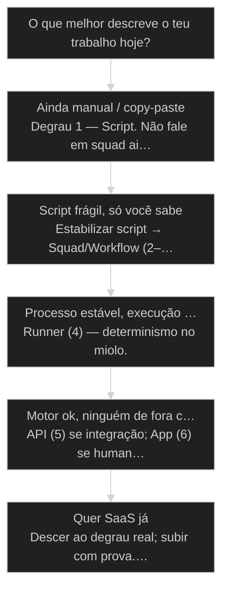
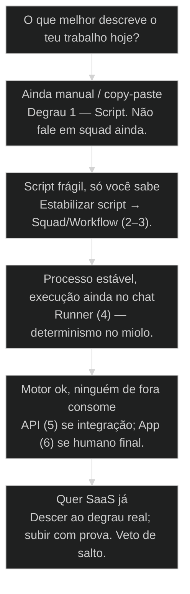

# Escada Progressiva: Script → Squad → Workflow → Runner → API → App → SaaS

## Mapa desta aula

Decisão-chave da aula — O que melhor descreve o teu trabalho hoje?

> Leia o diagrama antes do texto longo. Depois volte e confira.

> Sete degraus com critério de subida — saiba onde está e qual é o próximo, sem pular por vaidade de LinkedIn.

**Objetivos de aprendizagem:**
- Nomear os 7 degraus da escada progressiva AIOX na ordem correta sem cheatsheet. _(remember)_
- Posicionar o próprio trabalho em um degrau atual com evidência verificável. _(analyze)_
- Definir o próximo degrau com um critério de subida e um veto de salto. _(apply)_
- Reconhecer o anti-padrão do teleporte (SaaS sem degraus do meio) e redirecionar. _(evaluate)_

---

## O que você consegue no fim desta aula

*G · Destino*

Destino claro antes de qualquer jargão de stack.

Ao final desta aula você vai conseguir três coisas concretas:

1. Desenhar de cabeça a **escada dos sete degraus** — Script até SaaS.
2. Olhar o teu projeto e marcar **onde está de verdade** (não onde o ego quer).
3. Escrever o **próximo degrau** com critério de subida e veto de salto.

Se você sair daqui ainda pensando em "vou fazer SaaS essa semana" sem motor
estável no degrau atual, a aula falhou. Escada não é teleporte. É freio de ego
com mapa de maturidade.

- **Objetivos da aula** (Nomear os 7 degraus na ordem; Posicionar o teu trabalho com prova; Definir próximo degrau + veto de salto)
- **Resultado tangível**: Uma linha: degrau atual · evidência · próximo · critério de subida.
- **Não é o destino**: Landing page com pricing e zero automação estável. Isso é fantasia de SaaS.

---

## O erro do salto de ego

*P · Onde você está*

Empatia com o ponto de partida real do operador.

Cara, eu vejo o mesmo filme toda semana. A pessoa tem um script que roda
na máquina dela — às vezes nem commitado — e já está desenhando pricing page,
multi-tenant e Stripe. Isso não é ambição. É **teleporte**.

A escada progressiva existe porque cada degrau paga uma escola diferente:
o script ensina o fluxo; o squad ensina papéis; o workflow ensina ritual; o
runner ensina determinismo; a API ensina contrato; o app ensina superfície;
o SaaS ensina operação sob carga de gente real.

Se você está aqui, provavelmente já sentiu um destes sintomas:

- "Automatizei" mas só roda se você estiver acordado.
- Tem squad no repo e processo na cabeça — os dois não batem.
- Quer API porque "fica profissional", sem job estável por baixo.
- Landing no ar, motor no Notion.

Beleza. A partir daqui a gente troca vaidade de stack por **mapa de degrau**.

**Onde a maioria trava**
- SaaS como primeiro commit
- Pular runner porque 'é só um bash'
- Confundir app bonito com produto operável

**Onde o operador vai**
- Degrau atual com prova de estabilidade
- Sobe um degrau por vez
- Veto explícito de salto

---

## A escada em uma tela

*S · Rota*

Sete degraus batizados. Cada um com o que prova e o que não prova.

Eu chamo de **escada progressiva** pra colar na cabeça: não é roadmap de
marketing. É mapa de maturidade do que você já industrializou.

Prior-art comercial (fora deste curso): `cursos/AIOX-Productizacao/`
(Service-as-Software, distribuição, estágios de monetização). Prior-art
técnica neste curso: harness (aula 21). Aqui a gente **amarra o degrau
técnico** — onde você pisa agora e o que justifica o próximo.

A regra de ouro: **só sobe quando o degrau atual entediou de tão estável.**
Se ainda dói, se ainda depende de você, se ainda quebra em silêncio — você
não subiu. Você fantasiou.

- **7**: degraus batizados
- **1**: degrau por subida
- **0**: teleportes permitidos

- **status**: progressive ladder
- **meta**: steps=7 · climb=1-at-a-time
- **meta**: gate=evidence-of-stability
- **ready**: ready to map

**Legenda de cores**

O que cada cor sinaliza nesta aula

- **Degrau** (signal): nível com definição e prova
- **Critério** (insight): quando está pronto pra subir
- **Subida** (bench): empacota o atual e sobe um
- **Mapa** (action): posição + próximo passo
- **Teleporte** (pain): pulo sem motor no meio

**Como ler esta aula**

1. **Os 7**: Nome, o que entrega, o que prova.
2. **Critério**: Quando o degrau atual libera subida.
3. **Caso**: Quem teleportou e quem subiu.
4. **Mapa**: Teu degrau + próximo com veto.

---

## Os sete degraus: o que é e o que prova

Memoriza a ordem e a prova — não o marketing do nome.

Lista operacional — o que cada degrau carrega na prática AIOX:

1. **Script** — fluxo manual virando comando. Prova: roda duas vezes iguais
   sem você relembrar o passo a passo de cabeça.
2. **Squad** — papéis, agentes, autoridade. Prova: handoff claro entre órbitas
   sem "qualquer um faz".
3. **Workflow** — ritual com gates e greeting. Prova: outra pessoa (ou você
   amanhã) executa o mesmo processo sem improvisar.
4. **Runner** — executável determinístico. Prova: input → output sem chat
   improvisado no meio do caminho crítico.
5. **API** — contrato de chamada. Prova: outro sistema consome sem abrir o repo.
6. **App** — superfície humana. Prova: usuário não-técnico completa o job.
7. **SaaS** — operação multi-usuário com billing/ops. Prova: roda enquanto você
   dorme, com conta, limite e suporte mínimo.

Olha só: se o teu "SaaS" é um app sem runner estável e sem API de verdade,
você está no degrau 6 fantasiando o 7 — ou no 1 com landing page.

- **1. Base (1–3)**: Script → Squad → Workflow: processo e papéis. [processo]
- **2. Motor (4–5)**: Runner → API: determinismo e contrato. [motor]
- **3. Mercado (6–7)**: App → SaaS: superfície e operação. [mercado]

> **Lei da escada**: Cada degrau superior assume que o inferior está entediantemente estável. Se o inferior treme, o superior é teatro.

- **App no ar** != **SaaS**: SaaS exige operação multi-user, não só URL pública.
- **Bash no cron** != **Runner**: Runner tem contrato, logs e falha previsível — não só 'funciona na minha.'

---

## Critério de subida e veto de salto

Quando sobe. Quando desce. Quando fica.

Critério de subida — decora:

- O degrau atual **rodou N vezes** sem você reescrever o caminho.
- Falhas são **visíveis** (log, status, gate) — não "acho que foi".
- Outra pessoa (ou você em 30 dias) **repete** sem mentoria oral.
- O gargalo agora é o **próximo degrau**, não o atual.

Veto de salto — se qualquer um for verdade, você **não sobe**:

- Ainda depende de copiar prompt do Notion.
- Só você sabe o "jeitinho".
- Pricing page existe e motor não.
- Você sobe porque o concorrente "já tem SaaS" no tweet.

Então o que acontece se você força a subida? Você carrega dívida de processo
pro próximo nível. Cada degrau amplifica o que está embaixo — inclusive o podre.

> **Teste do tédio**: Se o degrau atual ainda te dá adrenalina de gambiarra, não está estável. Estável é chato. Chato é o sinal de subir.

**Sinal de cada zona**

- **Base frágil**: Fica em script/squad até handoff claro
- **Motor frágil**: Não faça app bonito em cima de chat
- **Mercado cedo**: App ok; SaaS só com ops mínima
- **Ego alto**: Volte um degrau e prove de novo

---

## Caso: o SaaS que era um script com UI

História real de teleporte — e o que a escada mandaria fazer.

Um aluno vendeu "plataforma de relatórios com IA". Em 48h tinha landing,
Stripe de teste e um formulário. Por baixo: um script Python que ele rodava
na mão quando chegava e-mail. Cliente 2 pediu multi-tenant. Cliente 3 pediu
horário. O script virou monstro. O "SaaS" virou plantão.

A escada teria dito: **Script estável** (mesmo input, mesmo PDF). Depois
**workflow** com checklist. Depois **runner** no cron com log. Depois **API**
se outro sistema precisasse. **App** quando o cliente final não pudesse ser
o operador. **SaaS** quando tivesse isolamento, billing e suporte mínimo.

Ele não falhou por falta de habilidade. Falhou por **mapa**. Subiu pro 7
com prova do 1. O mercado cobrou o restante com juros de fim de semana.

**Rota que salvava o caso**

1. **Script**: PDF idêntico 10x
2. **Workflow**: Ritual + gate de qualidade
3. **Runner**: Cron + log + falha clara
4. **API/App**: Só se o consumo exigir
5. **SaaS**: Multi-user + ops mínima

---

## Em qual degrau você está — e o que fazer agora?

Árvore curta pra não errar a subida.

**Árvore de decisão**
_Responda pelo que roda de verdade — não pelo pitch._

- **Ainda manual / copy-paste** — Fluxo na cabeça ou no chat, sem comando estável.
  → _Degrau 1 — Script. Não fale em squad ainda._
  Ex.: Relatório montado na mão toda sexta.
- **Script frágil, só você sabe** — Roda, mas quebra e o conhecimento é oral.
  → _Estabilizar script → Squad/Workflow (2–3)._
  Ex.: Bash sagrado no laptop.
- **Processo estável, execução ainda no chat** — Ritual existe, mas o caminho crítico é conversa.
  → _Runner (4) — determinismo no miolo._
  Ex.: Workflow AIOX sem runner no job diário.
- **Motor ok, ninguém de fora consome** — Runner/local ok; integração zero.
  → _API (5) se integração; App (6) se humano final._
  Ex.: Job noturno sem endpoint.
- **Quer SaaS já** — Landing/pricing sem ops multi-user.
  → _Descer ao degrau real; subir com prova. Veto de salto._
  Ex.: Stripe + zero isolamento de tenant.

**Gate:** Você consegue apontar evidência do degrau atual em uma frase verificável? — _Se a evidência é 'eu acho que está estável', ainda é achismo._

#### Rota subir
Um degrau com prova.
1. **Nomear: Degrau atual em uma palavra.
2. **Provar: Evidência de estabilidade (N runs, log, handoff).
3. **Empacotar: Documentar o que o degrau entrega.
4. **Subir um: Só o próximo — com critério escrito.

#### Rota estabilizar
Não sobe; fecha o buraco.
1. **Dor: Onde ainda depende de você.
2. **Gate: Torne a falha visível.
3. **Repetir: Outra pessoa ou você em 30 dias.
4. **Só então: Reavaliar critério de subida.

#### Rota veto
Ego check antes do pitch.
1. **Onde estou: Degrau real, não aspiracional.
2. **O que falta: Lista crua do gap.
3. **Veto: Uma frase: por que NÃO sou SaaS ainda.
4. **Próximo honesto: Ação de 7 dias no degrau certo.

---

## Mapeie sua escada (15 min)

Papel, vault ou board — mas escrito.

Vamos lá. Sem isso a aula vira podcast de maturidade. Cronometra quinze minutos.

- 1. **Lista**: Escreva os 7 degraus de memória. Confira só depois.
- 2. **Posição**: Marque o degrau atual do teu produto/automação principal.
- 3. **Prova**: Uma evidência verificável (comando, log, handoff, N runs).
- 4. **Próximo**: Um degrau acima + critério de subida em uma linha.
- 5. **Veto**: Uma frase de veto de salto (o que te impede de pular).

**Funcionou se:**

- Você listou os 7 na ordem sem colar.
- O degrau atual tem evidência, não desejo.
- Há próximo degrau + critério + veto escritos.

---

## Glossário sem jargão de vaidade

- **Escada progressiva**: Mapa de sete degraus de maturidade (Script→SaaS) com critério de subida.
- **Teleporte**: Pular degraus por vaidade — típico: SaaS sem motor estável.
- **Critério de subida**: Evidência de que o degrau atual está entediantemente estável.
- **Veto de salto**: Regra explícita que proíbe subir sem prova do degrau atual.
- **Teste do tédio**: Se ainda dá adrenalina de gambiarra, não está pronto pra subir.

---

## Portão da aula

Você passou quando, sem cheatsheet, responde: em qual degrau estou, com que
prova, e qual é o próximo com veto de salto. SaaS sem escada é pitch. Escada
sem vaidade é engenharia de produto.

A IA é a seta. O X é seu — inclusive escolher **não** pular o degrau chato.

> **GATE-MODULE (auto)**: GPS Goal/Position/Steps presentes · caso + do/dont · decisão 5 branches · prática com evidência · glossário. Alvo DL ≥70 atingido na construção enrich-W5.

***

---

## Origem curricular

Adaptação autocontida da aula 69 do AIOX Advanced. A fonte histórica permanece registrada em `source_path`; este curso é o dono da progressão atual.

## Navegação

[← Aula anterior](22-squad-fora-da-ide.md) · [↑ M4](../modulos/M4-runtime-fora-da-ide.md) · [Curso](../README.md) · [Próxima aula →](24-supabase-via-data-engineer.md)
