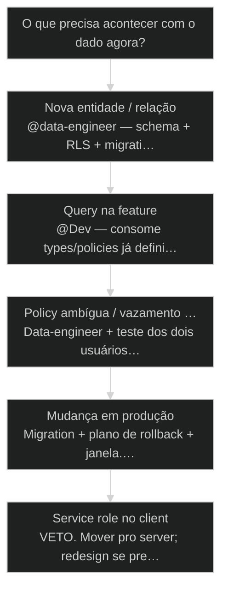
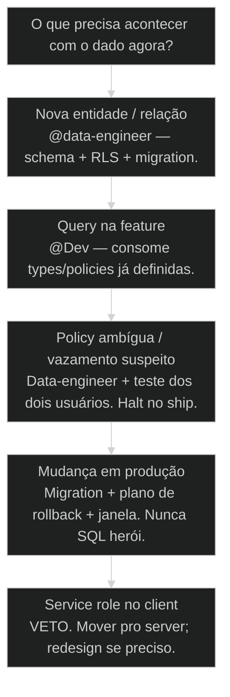

# Supabase: setup via @data-engineer

← Escada Progressiva: Script → Squad → Workflow → Runner → API → App → SaaS · ↑ M12 · ⌂ Curso · → Vercel Deploy: do localhost ao mundo

## Mapa desta aula

Decisão-chave da aula — O que precisa acontecer com o dado agora?

> Leia o diagrama antes do texto longo. Depois volte e confira.

> Schema, migração e RLS com o agente certo — não 'liga o Postgres e torce pro Dev resolver'.

**Objetivos de aprendizagem:**
- Executar um setup Supabase mínimo com papéis, schema e RLS básico roteado por @data-engineer. _(apply)_
- Explicar por que RLS é obrigatório em multi-user e o que falha sem ele. _(understand)_
- Separar o que é órbita do data-engineer versus do Dev na Story de dados. _(analyze)_
- Aplicar checklist de migração segura antes de tocar produção. _(apply)_

---

## O que você consegue no fim desta aula

*G · Destino*

Destino claro antes de qualquer tutorial de dashboard.

Ao final desta aula você vai conseguir três coisas concretas:

1. Chamar **@data-engineer** (ou o ritual equivalente) com um brief de schema
   que não é "cria umas tabelas aí".
2. Entender **RLS como lei**, não como feature opcional do free tier.
3. Desenhar a **fronteira**: o que o data-engineer fecha vs o que o Dev consome.

Se você sair daqui ainda pensando que Supabase é "Firebase com SQL" e que
service role no frontend resolve, a aula falhou. Dados sem órbita viram
incidente com sobrenome de cliente.

- **Objetivos da aula** (Setup com schema + RLS básico; Por que multi-user sem RLS é bomba; Rota data-engineer vs Dev)
- **Resultado tangível**: Checklist de schema/migração/RLS + dono nomeado por passo.
- **Não é o destino**: Colar SQL no SQL Editor e chamar de 'arquitetura de dados'.

---

## O erro do Dev-com-SQL

*P · Onde você está*

Empatia com o ponto de partida real do operador.

Cara, eu vejo o mesmo filme toda semana. A Story pede "persistir usuário e
projeto". O operador chama @Dev. O Dev cria tabela, solta a service role no
client, testa no happy path e marca done. Dois tenants depois: vazamento.
Ou pior — "funciona na demo" e RLS nunca existiu.

No mapa orbital AIOX, **Data / DB** é órbita exclusiva. Não é "Dev que sabe
SQL". Schema, migração, RLS, índices sensíveis, políticas de acesso: isso tem
dono. O Dev consome contrato. O data-engineer define o solo.

Se você está aqui, provavelmente já sentiu um destes sintomas:

- Tabela criada no calor do PR sem migration file.
- `anon` com select * porque "depois a gente trava".
- Service role no browser "só pra testar".
- Policy copiada de tutorial sem bater com o teu auth.uid().

Beleza. A partir daqui a gente troca pressa de feature por **solo de dados**.

**Onde a maioria trava**
- @Dev pra schema e política
- RLS depois do launch
- SQL solto sem migração

**Onde o operador vai**
- @data-engineer dono do solo
- RLS no mesmo PR do schema
- Migração versionada + teste de policy

---

## Supabase no AIOX: solo, não plugin

*S · Rota*

Projeto, schema, RLS, migração — ordem que evita retrabalho.

Supabase no AIOX não é "subir Postgres e seguir". É **plataforma de dados**
com auth, policies e edge. O atalho que mata é tratar como storage burro.

Ordem mental:

1. **Projeto e ambientes** (local/staging/prod) com secrets no lugar certo.
2. **Schema** alinhado às entidades do produto (não à tela da semana).
3. **RLS** no mesmo ciclo do create table.
4. **Migração** como artefato de repo — não clique no dashboard.
5. **Contrato pro Dev**: types, views seguras, RPCs quando fizer sentido.

Prior-art: agentes orbitais (45), ambientes (05), escada (69). Aqui a gente
**instancia o solo** pra tudo que sobe depois (deploy, CI, go-live).

- **1**: órbita de dados
- **0**: tabelas sem dono de policy
- **N**: migrações > SQL solto

- **status**: supabase + data-engineer
- **meta**: schema · rls · migrations
- **meta**: owner=data-orbit
- **ready**: ready to model

**Legenda de cores**

O que cada cor sinaliza nesta aula

- **Schema** (signal): entidades e relações estáveis
- **RLS** (insight): isolamento por user/tenant
- **Migração** (bench): mudança auditável no git
- **Órbita** (action): quem manda no solo
- **Bomba** (pain): dado aberto ou secret vazado

**Como ler esta aula**

1. **Órbita**: Por que não é job do Dev genérico.
2. **RLS**: Política como lei do multi-user.
3. **Caso**: Vazamento que a policy evitava.
4. **Checklist**: Setup e migração com dono.

---

## Da cohort: backend zero não é backend de brinquedo

*T1 + T2 · WhatsApp*

Realidade do grupo Advanced — cicatriz, não slide.

Deploy e Supabase aparecem no grupo misturados com pânico de produção e
aviso de segurança (ex.: Vercel + Google Workspace). O fio desta aula: **RLS e
schema com dono** (@data-engineer), não 'liga o Postgres e torce'.

Quando a cohort fala em app de verdade, a conversa migra de squad zip para
dados e permissão. Quem pula RLS aprende no incidente — a aula prefere no checklist.

> **Âncora de campo**: service_role no client é o jeito fancy de vazar a casa.

> **Materiais / FAQ**: Aulas 71–73 · produção é checklist, não URL

---

## A órbita do data-engineer

Autoridade exclusiva — o que entra e o que não entra.

Papel do **@data-engineer** (Data/DB orbital):

- Modelar entidades e relações a partir do PRD/stories — não da UI solta.
- Escrever/revisar **migrations** e policies RLS.
- Definir índices, constraints e limites de acesso (anon/authenticated/service).
- Documentar contrato de leitura/escrita pro Dev e pro app.

Anti-papel (o que NÃO faz):

- Implementar tela e fluxo de produto no lugar do Dev.
- "Ajustar rapidinho em prod" sem migration.
- Liberar service role pro frontend porque o prazo apertou.

O Dev implementa queries e mutations **dentro** do contrato. Se o contrato
está errado, volta pro data-engineer — não contorna com key de admin.

- **1. Produto**: Entidades no PRD/story com aceite de dado. [o quê]
- **2. Solo**: Schema + RLS + migration sob data-engineer. [como persiste]
- **3. App**: Dev consome contrato; UI não dita o modelo. [como usa]

> **Lei da órbita de dados**: Quem cria a tabela assina a policy. Se a policy não existe no mesmo ciclo, a tabela não está done.

- **Sabe SQL** != **É data-engineer**: Órbita é autoridade e checklist, não habilidade pontual.
- **Funciona no client** != **Está seguro**: Happy path com service role mente pra você.

---

## RLS: a lei do multi-user

Sem policy, você não tem multi-tenant — tem planilha compartilhada.

**Row Level Security** não é otimização. É o portão que diz: esta linha é do
usuário A, não do B. No Supabase, auth.uid() e claims de tenant são o chão
das policies. Sem RLS (ou com policy permissiva demais), a API pública vira
cano aberto.

Mínimo mental por tabela sensível:

1. RLS **enabled**.
2. Policies de SELECT/INSERT/UPDATE/DELETE explícitas — "deny by default".
3. Teste com dois usuários: A não lê B.
4. Service role **só no server**, nunca no bundle do browser.
5. Seeds e fixtures respeitam o mesmo modelo (não criam superburaco).

Por quê no mesmo PR do schema? Porque "depois a gente trava" é a frase mais
cara do Postgres gerenciado. Depois = tráfego real + esquecimento.

> **Teste dos dois usuários**: Crie user A e user B. Se A vê linha de B, você não tem produto multi-user — tem bug de segurança com roadmap.

**Onde cada chave vive**

- **anon**: Público mínimo; quase sempre atrás de policy dura
- **authenticated**: User logado; base das policies por uid/tenant
- **service_role**: Server only — jobs, admin, never client
- **Dashboard SQL**: Dev tool; não é pipeline de produção

- **Policy**: Regra SQL que libera ou nega linha/ação sob RLS.
- **Migration**: Arquivo versionado que muda schema/policies de forma repetível.
- **Tenant**: Unidade de isolamento (org/local_docs) acima do user quando multi-org.

---

## Caso: o select * que vazou o cliente

Quando o happy path esconde o buraco.

Time pequeno. App de propostas. Tabela `proposals` com `user_id`. RLS
"ligado" num tutorial — mas a policy de SELECT era `true` "pra facilitar o
dev". Em staging, ninguém percebeu. Em prod, o primeiro power user abriu o
network tab, mudou um id na query e leu a proposta do concorrente do mesmo
local_docs... e de outros.

O fix não foi "contratar pentester na hora". Foi: **data-engineer dono**,
policy `auth.uid() = user_id` (e depois org_id), teste dos dois usuários no
checklist de story, service role fora do client, migration revertível.

Custo: um cliente bravo e um fim de semana. Preço da órbita ignorada.

**Rota correta do schema**

1. **Story**: Entidade + aceite de isolamento
2. **Data**: Schema + RLS no mesmo ciclo
3. **Teste**: Dois usuários / dois tenants
4. **Dev**: Consome contrato no app
5. **QG**: Policy no review — não só UI

---

## Quem mexe no dado agora?

Árvore curta pra não errar a órbita.

**Árvore de decisão**
_A natureza da mudança define o dono — não a pressa do PR._

- **Nova entidade / relação** — Tabela, FK, constraint, modelo de domínio.
  → _@data-engineer — schema + RLS + migration._
  Ex.: Criar organizações e vínculos de membros.
- **Query na feature** — Ler/escrever dentro do contrato existente.
  → _@Dev — consome types/policies já definidas._
  Ex.: Listar propostas do user logado.
- **Policy ambígua / vazamento suspeito** — Dúvida de quem pode ver o quê.
  → _Data-engineer + teste dos dois usuários. Halt no ship._
  Ex.: User A vê id de B no network.
- **Mudança em produção** — Alter table / backfill / policy em prod.
  → _Migration + plano de rollback + janela. Nunca SQL herói._
  Ex.: Adicionar coluna NOT NULL sem default.
- **Service role no client** — Qualquer key admin no browser/mobile.
  → _VETO. Mover pro server; redesign se preciso._
  Ex.: NEXT_PUBLIC_ com service role.

**Gate:** A story de dado tem policy e teste de isolamento no aceite? — _Se o aceite só fala UI, o solo está fora do DoD._

#### Rota schema novo
Do PRD ao solo versionado.
1. **Entidades: Nomear tabelas e donos de linha.
2. **Migration: Arquivo no repo, não só dashboard.
3. **RLS: Policies no mesmo ciclo.
4. **Prova: Dois users; A ≠ B.

#### Rota feature no app
Dev dentro do contrato.
1. **Contrato: Types/views/RPC existentes.
2. **Client: Chaves corretas por ambiente.
3. **Erro: Tratar deny de policy como sinal.
4. **Se faltar: Volta pro data-engineer — não contorna.

#### Rota incidente
Suspeita de vazamento.
1. **Halt: Não shipar em cima.
2. **Reproduzir: Dois users / token.
3. **Policy: Corrigir + migration.
4. **Postmortem: Por que o QG deixou passar.

---

## Checklist Supabase do teu projeto (20 min)

Projeto real ou sand box — mas escrito e verificável.

Vamos lá. Sem checklist a aula vira tutorial genérico de dashboard.

- 1. **Inventário**: Liste tabelas sensíveis (user data, tenant, pagamento, conteúdo privado).
- 2. **Dono**: Para cada uma: RLS on? Policies por ação? Quem assina?
- 3. **Chaves**: Onde está anon / authenticated / service_role? Alguma no client indevida?
- 4. **Migração**: A última mudança de schema está no git ou só no dashboard?
- 5. **Teste**: Escreva o roteiro dos dois usuários para a tabela mais crítica.
- 6. **Story**: Redija 1 AC de isolamento que faltava no DoD.

**Funcionou se:**

- Há inventário de tabelas sensíveis com status de RLS.
- Nenhuma service role no client sem plano de remoção.
- Pelo menos um teste de dois usuários está escrito.

---

## Glossário sem jargão de vaidade

- **RLS**: Row Level Security — políticas que filtram linhas por regra (ex.: auth.uid()).
- **Migration**: Mudança de schema/policy versionada e repetível entre ambientes.
- **Service role**: Chave admin do Supabase; uso exclusivo em servidor confiável.
- **Teste dos dois usuários**: Prova de que A não lê/escreve o que é de B.
- **Contrato de dados**: O que o app pode ler/escrever sem contornar policy.

---

## Portão da aula

Você passou quando schema, RLS e migração têm dono explícito — e o Dev não é
mais DBA acidental. Multi-user sem policy é demo. Policy no mesmo ciclo do
create table é produto.

A IA é a seta. O X é seu — inclusive recusar service role no browser.

> **GATE-MODULE (auto)**: GPS Goal/Position/Steps presentes · caso + do/dont · decisão 5 branches · prática com evidência · glossário. Alvo DL ≥70 atingido na construção enrich-W5.

***

---

## Origem curricular

Adaptação autocontida da aula 70 do AIOX Advanced. A fonte histórica permanece registrada em `source_path`; este curso é o dono da progressão atual.

## Navegação

[← Aula anterior](23-escada-progressiva.md) · [Curso](../README.md) · [Próxima aula →](25-vercel-deploy.md)
