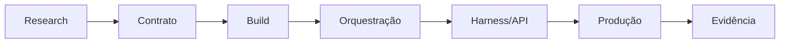

# Capstone: capacidade agentic em produção

## Resultado

Você integra as decisões do curso em uma capacidade executável, auditável e operável por outra pessoa.

## Mapa visual



## Quando usar — e quando não usar

Use para uma missão real, pequena o suficiente para ser concluída e importante o suficiente para revelar dependências. Não use uma demo artificial que omita autoridade, falhas ou handoff.

## Prática

Execute o [Projeto Integrador](../Projeto-Integrador.md). Registre cada gate antes de avançar e interrompa efeitos externos até obter autorização.

## Pergunte ao seu agente

```text
Atue como revisor do capstone de Agent Engineering. Avalie meu pacote pela Rubrica.md. Não aceite afirmações sem evidência reproduzível e não execute efeitos externos.
```

## Evidência de conclusão

Pacote completo avaliado com pelo menos 80/100 e sem risco crítico omitido.

## Navegação

[← Aula anterior](27-prontidao-de-producao.md) · [Curso](../README.md) · [Projeto](../Projeto-Integrador.md)
