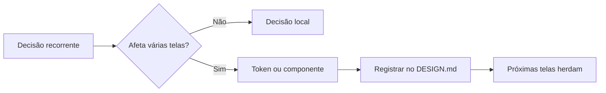

# Design system é decisão, não estética

[⌂ Curso](../README.md) · [↑ M0](../modulos/M0.md) · [Próxima →](02-design-system-greenfield-brownfield.md)

## Resultado

Você separa uma escolha visual pontual de uma decisão que precisa virar token, componente ou regra reutilizável.

## Mapa visual



## Quando usar — e quando não usar

**Use** quando a mesma discussão sobre cor, espaçamento, tipografia, estado ou componente reaparece em mais de uma tela.

**Não use** para transformar toda preferência em regra global. Um design system reduz decisões repetidas; não elimina julgamento contextual.

## A mudança de pergunta

Sem contrato, a equipe pergunta: “qual cor fica bonita aqui?”. Com sistema, pergunta: “esta tela consome uma decisão existente ou revelou uma lacuna real no contrato?”.

| Situação | Tratamento |
|---|---|
| Cor principal da ação em todo o produto | token semântico |
| Estado disabled de Button | variante do componente |
| Ilustração única de uma campanha | decisão local |
| Novo padrão repetido em três fluxos | candidato ao contrato |

O ganho não é “ter componentes”. É **decidir uma vez, registrar e permitir que humano e agente reutilizem a mesma decisão**.

## Caso rápido

Três telas usam botões com alturas diferentes porque cada prompt pediu “um CTA moderno”. A correção não é editar três paddings. É definir `Button`, suas variantes e o token de altura; depois fazer as telas consumirem o catálogo.

## Âncora no acervo

O julgamento é ensinado aqui. A construção e a governança operacional vivem nos pacotes `squads/design-system/` e `squads/design-ops/`, acionados somente depois de existir um contrato mínimo.

## Prática

Escolha cinco decisões visuais do seu produto e classifique:

1. local;
2. token;
3. componente/variante;
4. regra de uso.

Para cada decisão global, escreva uma frase explicando por que ela merece ser herdada por outras telas.

## Pergunte ao seu agente

```text
Vou listar cinco escolhas visuais. Classifique cada uma como decisão local, token, componente/variante ou regra. Questione apenas os casos ambíguos e explique qual repetição justificaria promovê-la ao design system.
```

## Evidência de conclusão

Lista classificada com pelo menos duas decisões globais justificadas e uma escolha mantida conscientemente como local.

## Navegação

[⌂ Curso](../README.md) · [↑ M0](../modulos/M0.md) · [Próxima →](02-design-system-greenfield-brownfield.md)
