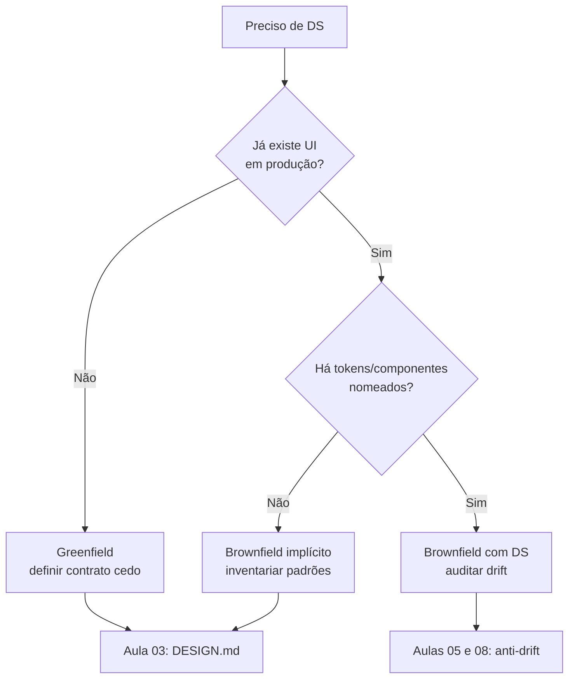

# Greenfield vs brownfield de design system

[⌂ Curso](../README.md) · [↑ M0](../modulos/M0.md) · [← Anterior](01-design-system-e-decisao.md) · [Próxima →](03-repertorio-e-referencias.md)

## Resultado

Você classifica o contexto do produto (greenfield DS, brownfield com padrão implícito, brownfield com DS legado) e nomeia a **primeira ação** correta — sem reescrever tudo por impulso.

## Mapa visual



## Quando usar — e quando não usar

**Use** antes de “padronizar tudo” ou instalar um kit visual no legado.

**Não use** para descoberta de **código de negócio** (isso é brownfield de domínio/código — Advanced M4 / code-anatomist). Aqui o objeto é **interface e tokens**.

## Três portas

1. **Greenfield** — ainda não há UI real. Melhor momento: contrato antes da terceira tela.
2. **Brownfield implícito** — há telas, mas o “padrão” está só na cabeça das pessoas e nos prompts. Primeira ação: **inventário**, não reescrita.
3. **Brownfield com DS** — há biblioteca ou tokens; o problema é **drift** e governança.

| Contexto | Primeira ação | Erro clássico |
|----------|---------------|---------------|
| Greenfield | DESIGN.md mínimo + 1 componente | Comprar kit inteiro sem decisão |
| Implícito | 5–10 telas → padrões reais | “Vamos migrar tudo para ShadCN amanhã” |
| Com DS | Auditar violações do contrato | Reescrever o DS em vez de fechar drift |

## Caso rápido

SaaS com 40 telas e botões de 6 alturas diferentes. Porta: **implícito**. Inventário mostra “quase sempre 40px e primary azul”. Você **promove** isso a token — não inventa um sistema novo de 200 componentes no dia 1.


## Âncora no acervo

`squads/design-system/` (construir) vs `squads/design-ops/` (governar) — detalhe na aula 09.

## Prática

Escolha **um** produto (o seu ou um que use) e responda em 6 linhas:

1. Greenfield / implícito / com DS — qual?
2. Evidência (o que você viu).
3. Primeira ação (1 frase).
4. O que **não** fará nesta semana.
5. Risco se padronizar tudo já.
6. Uma tela “cânone” candidata a referência.


## Pergunte ao seu agente

```text
Classifique meu contexto de design system (greenfield, brownfield implícito, brownfield com DS). Faça no máximo 5 perguntas. Depois diga só a primeira ação e o anti-escopo da primeira semana. Não proponha reescrita total.
```

## Evidência de conclusão

Classificação + primeira ação + anti-escopo da semana, em texto curto reutilizável no capstone.

## Navegação

[⌂ Curso](../README.md) · [↑ M0](../modulos/M0.md) · [← Anterior](01-design-system-e-decisao.md) · [Próxima →](03-repertorio-e-referencias.md)
