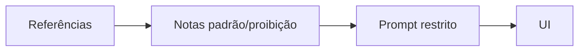

# Repertório e referências antes da IA

[⌂ Curso](../README.md) · [↑ M0](../modulos/M0.md) · [← Anterior](02-design-system-greenfield-brownfield.md) · [Próxima →](04-tema-visual-vs-design-system.md)

## Resultado

Você monta um repertório curado e anota padrões/proibições **antes** de pedir UI à IA.

## Mapa visual



## Quando usar — e quando não usar

**Use** antes de qualquer geração de UI.

**Não use** como desculpa para adiar o contrato: repertório sem DESIGN.md ainda vira moda.

## A mudança de pergunta

Sem repertório, o prompt é “faz uma tela moderna”. Com repertório, o prompt é “componha a partir **destas** referências e **destes** tokens — e não invente o resto”.

| Entrada | Efeito na IA |
|---------|----------------|
| Zero referência | UI genérica / AI-look |
| Moodboard vago | Mistura estilos sem critério |
| Pasta curada (5–15 peças) + notas | Consistência e direção |

## Processo mínimo de repertório

1. **Definir o contexto de uso** (quem olha, em que dispositivo, que tom).
2. **Coletar referências** (Pinterest, sites, apps, prints) — qualidade > quantidade.
3. **Anotar o que copiar** (ritmo, densidade, hierarquia) e o que **proibir**.
4. **Só então** pedir geração ou componente à IA.

## Caso rápido (live)

Nas aulas de Design do Advanced, o fluxo recomendado a quem está de primeira viagem era: pesquisar referências e cores → criar pastas de referência → **depois** gerar. Pedir “bonito” sem pasta de referência era o caminho mais rápido para o genérico.

## Protocolo 12–3–1

Um banco de referências útil não é uma pasta de imagens favoritas. Cada item precisa responder **o que observar**, **por que serve ao problema** e **o que não copiar**.

1. Colete **12 referências** de produtos, editoriais, sinalização, arquitetura ou outras superfícies pertinentes.
2. Extraia **3 padrões recorrentes** que apoiam a intenção do produto.
3. Escreva **1 direção provisória** em critérios observáveis.

| Campo por referência | Exemplo |
|---|---|
| Sinal útil | hierarquia tipográfica muito clara |
| Decisão transferível | título domina; metadado recua sem perder contraste |
| Anti-cópia | não reproduzir layout ou ilustração literalmente |
| Hipótese | menos superfícies elevadas melhora a leitura de dados |

“Interface premium” não é uma direção. “Alta densidade com leitura calma, uma cor de ação, superfícies planas e dados alinhados” já permite gerar e revisar.

### Diversidade deliberada

Se todas as referências vêm do mesmo template ou produto, o repertório apenas confirma uma resposta pronta. Inclua pelo menos:

- duas referências do mesmo domínio;
- duas de outro domínio com problema de informação parecido;
- uma referência que você rejeita, com motivo;
- uma referência fora de software para ampliar composição, ritmo ou materialidade.

## Âncora no acervo

Repertório alimenta o contrato (`DESIGN.md`) e o Brand Book. Marca estratégica: `squads/brand/`. Tradução visual: este curso e `ponte/brand-book-para-contrato.md`.

## Prática

Crie uma pasta `repertorio/` (no seu projeto ou em `notas/`) com **12 referências** e, para cada uma, uma linha: *sinal útil / decisão transferível / o que NÃO copiar*. Feche com três padrões e uma direção provisória.

## Pergunte ao seu agente

```text
Vou descrever 8 referências visuais. Ajude a extrair padrões reutilizáveis (hierarquia, densidade, cor semântica) e 5 proibições. Não gere tela ainda. Não invente tokens que eu não aprovei.
```

## Evidência de conclusão

Pasta com 12 referências + síntese 3–1. Você passou se outra pessoa consegue remover as imagens e ainda entender a direção pelas anotações.

## Navegação

[⌂ Curso](../README.md) · [↑ M0](../modulos/M0.md) · [← Anterior](02-design-system-greenfield-brownfield.md) · [Próxima →](04-tema-visual-vs-design-system.md)
