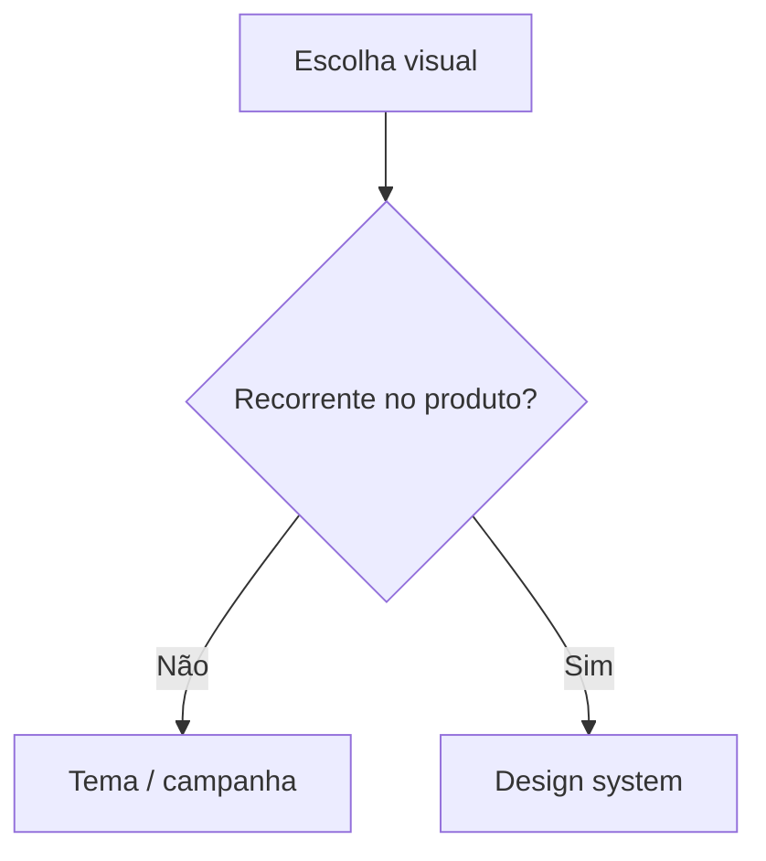

# Tema visual versus design system

[⌂ Curso](../README.md) · [↑ M1](../modulos/M1.md) · [← Anterior](03-repertorio-e-referencias.md) · [Próxima →](05-top-down-vs-bottom-up.md)

## Resultado

Você distingue tema visual pontual de design system herdável com critério de recorrência.

## Mapa visual



## Quando usar — e quando não usar

**Use** quando o time chama tudo de “tema”.

**Não use** para proibir campanhas pontuais legítimas.

## A mudança de pergunta

| Tema visual | Design system |
|-------------|----------------|
| Aparência de uma superfície (landing, deck) | Decisões herdáveis em **várias** superfícies |
| Pode ser campanha pontual | Precisa de token, componente e regra |
| Muda com a peça | Muda com o produto |

Tema sem sistema = cada tela redecide. Sistema sem tema = catálogo sem intenção.

## Quando o “tema” vira dívida

- Três landings com a mesma cor “primary” em hex diferentes.  
- Dark mode só em uma página.  
- Card de pricing reinventado a cada prompt.

## Caso rápido

Um “tema roxo moderno” no Lovable não é DS. Vira DS quando primary, radius, Button e proibições existem no contrato e no Storybook.

## Âncora no acervo

`skills/design-md/SKILL.md` — formalizar o que sobrou do tema como contrato.

## Prática

Pegue uma UI gerada “por tema” e liste: (1) o que é tema de campanha, (2) o que deveria ser token, (3) o que deveria ser componente.

## Pergunte ao seu agente

```text
Classifique os elementos desta tela em tema pontual vs candidato a design system. Exija critério de recorrência. Não proponha biblioteca nova.
```

## Evidência de conclusão

Tabela com ≥6 elementos classificados. Passou se nenhum “hex solto recorrente” ficou só como tema.

## Navegação

[⌂ Curso](../README.md) · [↑ M1](../modulos/M1.md) · [← Anterior](03-repertorio-e-referencias.md) · [Próxima →](05-top-down-vs-bottom-up.md)
