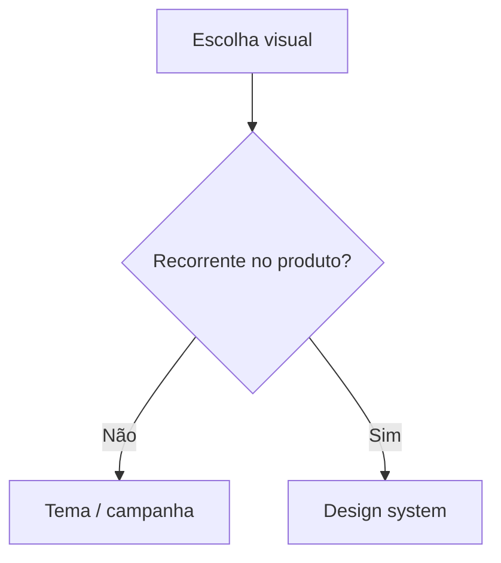

# Tema visual versus design system

[⌂ Curso](../README.md) · [↑ M1](../modulos/M1.md) · [← Anterior](03-repertorio-e-referencias.md) · [Próxima →](05-top-down-vs-bottom-up.md)

## Resultado

Você distingue tema visual pontual de design system herdável com critério de recorrência.

## Mapa visual



## Quando usar — e quando não usar

**Use** quando o time chama tudo de “tema”.

**Não use** para proibir campanhas pontuais legítimas.

## A mudança de pergunta

| Tema visual | Design system |
|-------------|----------------|
| Aparência de uma superfície (landing, deck) | Decisões herdáveis em **várias** superfícies |
| Pode ser campanha pontual | Precisa de token, componente e regra |
| Muda com a peça | Muda com o produto |

Tema sem sistema = cada tela redecide. Sistema sem tema = catálogo sem intenção.

## Quando o “tema” vira dívida

- Três landings com a mesma cor “primary” em hex diferentes.
- Dark mode só em uma página.
- Card de pricing reinventado a cada prompt.

## Caso rápido

Um “tema roxo moderno” no Lovable não é DS. Vira DS quando primary, radius, Button e proibições existem no contrato e no Storybook.

## Quatro objetos que costumam ser confundidos

| Objeto | Contém | Não garante |
|---|---|---|
| Tema | cores, tipografia, radius, sombra | comportamento e estados |
| UI kit | peças desenhadas e composições | código, ownership ou mudança segura |
| Biblioteca | componentes reutilizáveis implementados | intenção coerente e governança |
| Design system | contrato, tokens, catálogo, uso e mudança | qualidade automática sem operação |

Um kit comprado pode acelerar a biblioteca, mas não decide a semântica do produto. Dark mode normalmente é um conjunto de valores dentro do mesmo contrato, não um segundo design system.

### Teste dos quatro verbos

Para saber o que você realmente tem, verifique se a equipe consegue:

1. **decidir** — explicar por que a regra existe;
2. **encontrar** — localizar o componente canônico;
3. **provar** — mostrar estados e conformidade;
4. **mudar** — evoluir sem quebrar consumidores silenciosamente.

Se o time apenas aplica cores, há tema. Se encontra componentes, mas ninguém sabe como alterar ou depreciar, há biblioteca. O sistema surge quando os quatro verbos se conectam.

## Âncora no acervo

`skills/design-md/SKILL.md` — formalizar o que sobrou do tema como contrato.

## Prática

Pegue uma UI gerada “por tema”, classifique pelo teste dos quatro verbos e liste: (1) o que é campanha, (2) o que deveria ser token, (3) o que deveria ser componente, (4) qual é o próximo incremento suficiente.

## Pergunte ao seu agente

```text
Classifique os elementos desta tela em tema pontual vs candidato a design system. Exija critério de recorrência. Não proponha biblioteca nova.
```

## Evidência de conclusão

Tabela com ≥6 elementos + diagnóstico tema/UI kit/biblioteca/DS. Passou se nenhum “hex solto recorrente” ficou só como tema e o próximo incremento não exige transformação desnecessária.

## Navegação

[⌂ Curso](../README.md) · [↑ M1](../modulos/M1.md) · [← Anterior](03-repertorio-e-referencias.md) · [Próxima →](05-top-down-vs-bottom-up.md)
