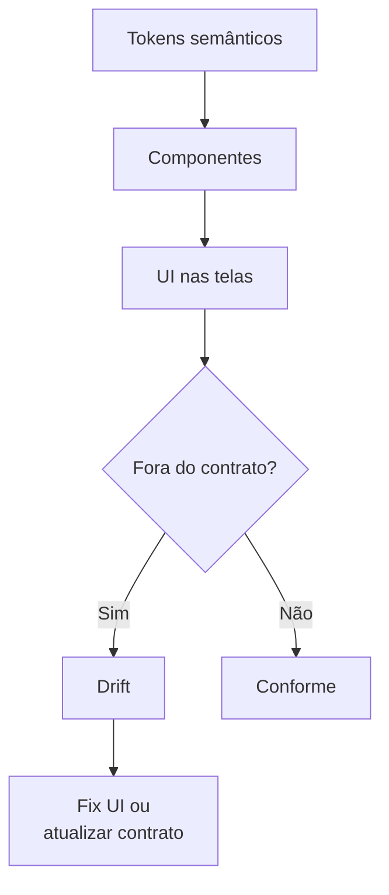

# Tokens, componentes e anti-drift

[⌂ Curso](../README.md) · [↑ M1](../modulos/M1.md) · [← Anterior](04-taxonomia-atomica.md) · [Próxima →](06-stack-tailwind-shadcn-storybook.md)

## Resultado

Você completa o contrato com tokens semânticos, estados de componente e uma definição operacional de **drift** — o que medir e o que fazer.

## Mapa visual



## Quando usar — e quando não usar

**Use** depois do DESIGN.md mínimo, quando a UI começa a “escapar”.

**Não use** para polish de microinteração (isso é craft / `impeccable` **depois** do portão).

## Token bruto vs semântico

- Bruto: `#2563eb`, `16px`  
- Semântico: `color.primary`, `space.md`  

Agentes e humanos erram menos com **semântica**. O valor bruto fica na definição do token, não espalhado no JSX.

## Drift

**Drift** = UI que foge do contrato **sem** o contrato ter sido atualizado de propósito.

Sintomas:

- hex solto no código  
- quarto raio de borda “só nessa tela”  
- botão com padding único  

Ação:

1. A UI está errada → **voltar ao token**  
2. O produto mudou de verdade → **atualizar DESIGN.md** e só então a UI  

## Anti-AI-look (nível decisão)

Consistência e restrição batem “originalidade aleatória”. O contrato **reduz o espaço de busca** do modelo — de propósito.


## Âncora no acervo

`squads/design-ops/` e `skills/design-ops/SKILL.md` — governança no tempo (maturidade study no catalog: estudar anatomia; não prometer run autônomo).

## Prática

1. Amplie seu DESIGN.md: escala de tipo (3 tamanhos), Button com `default` e `disabled`, regra “proibido cor hardcoded”.  
2. Liste **3 sintomas de drift** no seu contexto.  
3. Para cada um: fix UI ou atualizar contrato?


## Pergunte ao seu agente

```text
Com base neste DESIGN.md, gere 5 checks de auditoria de drift que eu possa rodar manualmente ou pedir a um agente. Cada check: o que procurar, severidade, ação.
```

## Evidência de conclusão

DESIGN.md atualizado + lista de 3 drifts com ação.

## Navegação

[⌂ Curso](../README.md) · [↑ M1](../modulos/M1.md) · [← Anterior](04-taxonomia-atomica.md) · [Próxima →](06-stack-tailwind-shadcn-storybook.md)
