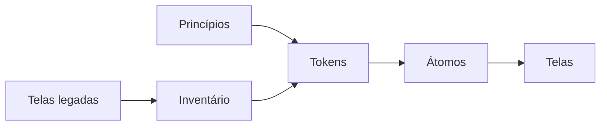

# Top-down versus bottom-up

[⌂ Curso](../README.md) · [↑ M1](../modulos/M1.md) · [← Anterior](04-tema-visual-vs-design-system.md) · [Próxima →](06-brand-book-para-tokens.md)

## Resultado

Você escolhe top-down, bottom-up ou híbrido e define a primeira ação da semana.

## Mapa visual



## Quando usar — e quando não usar

**Use** no início de um DS novo ou de uma reestruturação.

**Não use** para justificar 3 meses de DS sem tela.

## Duas rotas legítimas

| Top-down | Bottom-up |
|----------|-----------|
| Princípios → tokens → átomos → telas | Telas reais → extrair padrões → tokens |
| Forte em greenfield com marca clara | Forte em brownfield com UI legada |
| Risco: DS no vácuo | Risco: codificar o caos |

## Como escolher

1. **Marca/brief claro e pouca UI** → top-down.
2. **Muitas telas inconsistentes** → bottom-up com inventário (aula 02).
3. **Híbrido comum:** princípios + 3 telas âncora → extrair o resto.

## Caso rápido (live)

Fluxos ao vivo misturavam: Brand Book / referências (cima) **e** extrair componentes de telas já geradas (baixo) antes de fechar o Storybook. O erro era pular o inventário no brownfield ou pular o contrato no greenfield.

## Riscos complementares

### Top-down

Parte de marca, referências e princípios; desce para tokens, componentes e telas.

- preserva intenção e é forte em greenfield;
- ajuda quem ainda não domina a técnica do design system;
- risco: criar um catálogo elegante que nunca encontrou casos reais.

### Bottom-up

Parte de telas ou código; sobe por inventário, agrupamento e consolidação.

- respeita restrições e padrões observados no brownfield;
- permite migrar por fatias;
- risco: transformar acidentes históricos em regra oficial.

### Loop híbrido recomendado

1. Defina direção mínima top-down.
2. Inventarie de cinco a dez telas bottom-up.
3. Confronte intenção com uso observado.
4. Materialize poucos tokens e componentes.
5. Teste em uma fatia real antes de expandir.

Use uma stop rule: nenhum novo componente entra enquanto um existente puder ser reutilizado ou adaptado com responsabilidade equivalente.

## Âncora no acervo

Brownfield de DS: aula 02. Brand → tokens: aula 06 e `ponte/brand-book-para-contrato.md`.

## Prática

Escreva um plano de duas semanas: rota dominante, três evidências, primeiro movimento oposto para equilibrar o risco, tela piloto e stop rule antes de criar componente.

## Pergunte ao seu agente

```text
Com este contexto de produto (greenfield/brownfield, marca sim/não, N telas), recomende top-down, bottom-up ou híbrido com anti-escopo de 7 dias. Não reescreva o DS inteiro.
```

## Evidência de conclusão

Decisão de rota + plano curto que contenha movimentos top-down e bottom-up, mesmo que um deles seja dominante.

## Navegação

[⌂ Curso](../README.md) · [↑ M1](../modulos/M1.md) · [← Anterior](04-tema-visual-vs-design-system.md) · [Próxima →](06-brand-book-para-tokens.md)
