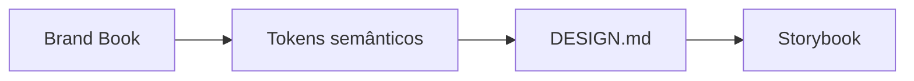

# Do Brand Book aos tokens

[⌂ Curso](../README.md) · [↑ M1](../modulos/M1.md) · [← Anterior](05-top-down-vs-bottom-up.md) · [Próxima →](07-anti-ai-look-e-exploracao.md)

## Resultado

Você traduz um brand pack mínimo em tokens semânticos e proibições no caminho do DESIGN.md.

## Mapa visual



## Quando usar — e quando não usar

**Use** quando existe (ou deveria existir) brand pack.

**Não use** para reescrever posicionamento de marca (isso é brand squad).

## Fronteira (não negociável)

- **Brand estratégico** (voz, posicionamento, narrativa) → `squads/brand/`.  
- **Tradução visual** (tokens, proibições, componentes) → **este curso**.

## Processo Brand Book → contrato

1. Ler princípios e “o que não é a marca”.  
2. Mapear cores/tipo/espaço para **tokens semânticos** (`color.primary`, não só `#hex`).  
3. Escrever proibições (neon, sombra aleatória, 4 fontes…).  
4. Registrar no DESIGN.md.  
5. Só então materializar no Storybook (M3).

## Caso rápido (live)

Brand Book construído ao vivo e depois levado a shadcn/DS: a marca não era o produto; era a **restrição** que impedia a IA de reinventar a identidade a cada tela.

## Âncora no acervo

`ponte/brand-book-para-contrato.md` · `squads/brand/` · `skills/design-md/SKILL.md`.

## Prática

Preencha o YAML de handoff da ponte brand (ou invente um brand mínimo) e derive **6 tokens semânticos** + **4 proibições**.

## Pergunte ao seu agente

```text
A partir deste brand pack, proponha tokens semânticos e proibições. Não invente voz de marca. Não gere componentes React ainda.
```

## Evidência de conclusão

Lista de tokens + proibições rastreáveis ao brand (ou declaração de gap se brand ausente).

## Navegação

[⌂ Curso](../README.md) · [↑ M1](../modulos/M1.md) · [← Anterior](05-top-down-vs-bottom-up.md) · [Próxima →](07-anti-ai-look-e-exploracao.md)
