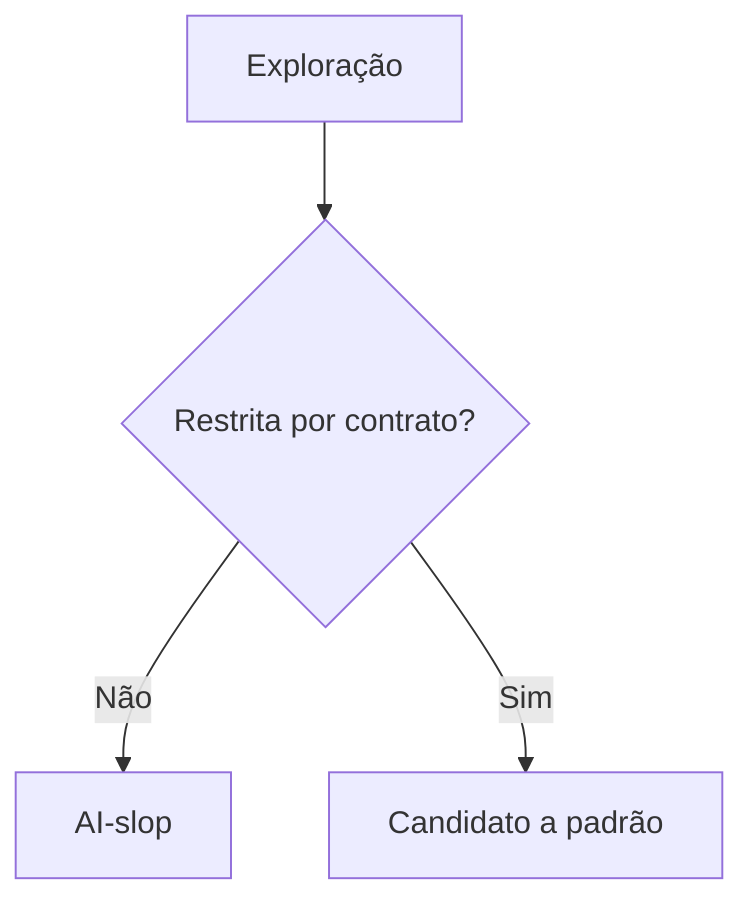

# Anti-AI-look e exploração controlada

[⌂ Curso](../README.md) · [↑ M2](../modulos/M2.md) · [← Anterior](06-brand-book-para-tokens.md) · [Próxima →](08-design-md-contrato.md)

## Resultado

Você restringe exploração (Lovable/Cloud Design etc.) e reduz AI-look com contrato e repertório.

## Mapa visual



## Quando usar — e quando não usar

**Use** em exploração com geradores de UI.

**Não use** para banir exploração — só para impedir que ela vire SoT.

## O problema

Modelos treinam em UI genérica. Sem restrição, eles **reproduzem AI-look** (cards inchados, gradientes de moda, tipografia sem hierarquia).

## Exploração controlada

Ferramentas tipo Cloud Design / Lovable / geradores HTML servem para **explorar**, não para ser a fonte da verdade.

| Permitido | Proibido como SoT |
|-----------|-------------------|
| Explorar layout com referências | Substituir DESIGN.md |
| Gerar rascunho e **extrair** padrões | Aceitar hex soltos no app |
| Comparar 2–3 direções | 20 variações sem critério |

## Reduzir genérico com IA

1. Repertório + proibições no prompt.
2. “Use **apenas** tokens/componentes do contrato”.
3. Screenshot → diff com a referência (aula 17).
4. Corrigir o **contrato** se o padrão for legítimo e recorrente.

## Explorar sem entrar em variação infinita

Todas as alternativas devem manter intenção, conteúdo essencial, restrições e breakpoint. O que varia é a **hipótese visual**. Caso conteúdo e funcionalidade também mudem, você deixa de comparar direções.

Gere no máximo três alternativas:

1. **Conservadora:** próxima ao padrão consolidado e de baixo risco.
2. **Distintiva:** reforça uma assinatura coerente com a marca.
3. **Contraste:** testa uma hipótese oposta para revelar preferências ocultas.

Compare-as pela mesma grade:

| Critério | Pergunta |
|---|---|
| Adequação | serve ao usuário e à tarefa? |
| Coerência | parece pertencer à marca e ao produto? |
| Clareza | a hierarquia é compreendida rapidamente? |
| Implementabilidade | cabe no stack e no prazo? |
| Diferenciação | evita a média genérica sem virar ruído? |

Feche com um decision record: alternativa escolhida, evidências, riscos, decisões abertas e condição objetiva para reabrir a direção.

## Âncora no acervo

`skills/impeccable` = craft **depois** da conformidade. `skills/design-md` = contrato.

## Prática

Gere ou selecione três alternativas da mesma tela. Preencha a grade, escolha uma e liste cinco violações da direção nas opções descartadas. Para cada uma: corrigir UI vs atualizar contrato.

## Pergunte ao seu agente

```text
Revise esta UI contra o repertório e proibições anexados. Separe genérico vs coerente. Não reescreva tudo — menor patch.
```

## Evidência de conclusão

Três alternativas comparáveis + grade + decision record + um prompt restritivo reutilizável.

## Navegação

[⌂ Curso](../README.md) · [↑ M2](../modulos/M2.md) · [← Anterior](06-brand-book-para-tokens.md) · [Próxima →](08-design-md-contrato.md)
