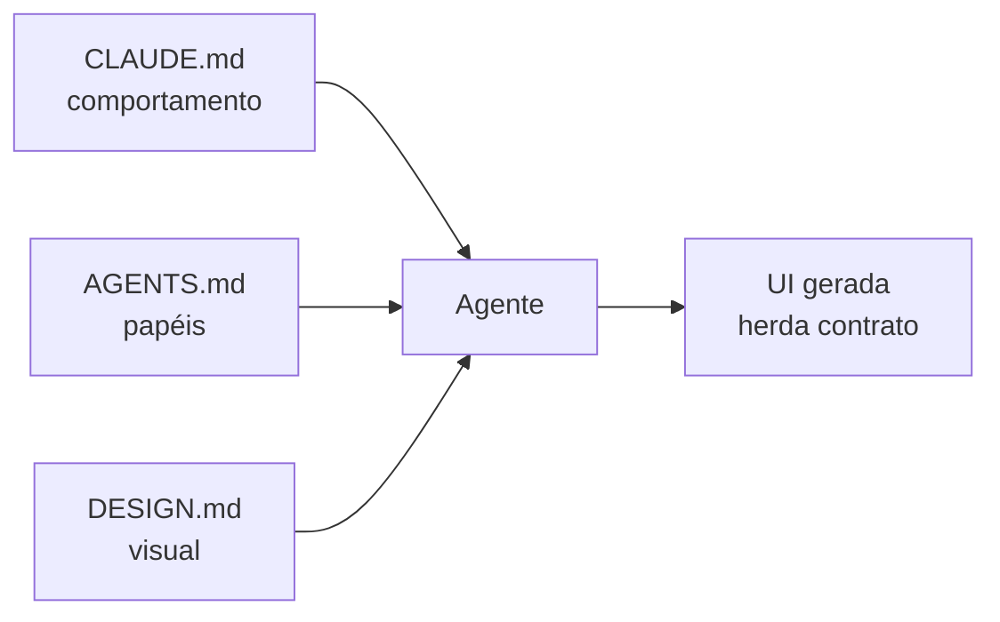

# DESIGN.md: o contrato que a IA lê antes da tela

[⌂ Curso](../README.md) · [↑ M2](../modulos/M2.md) · [← Anterior](07-anti-ai-look-e-exploracao.md) · [Próxima →](09-tokens-componentes-anti-drift.md)

## Resultado

Você escreve um DESIGN.md mínimo que um agente consegue ler **antes** de gerar UI: princípios, tokens base, componentes canônicos e proibições.

## Mapa visual



## Quando usar — e quando não usar

**Use** antes de pedir a um agente a terceira tela do produto.

**Não use** como substituto de brand book de agência nem como dump de prints. Contrato é **decisão legível**, não moodboard.

## O terceiro contrato

No AIOX, o agente já tem (ou deveria ter):

- **CLAUDE.md / AGENTS.md** — como se comportar e quem faz o quê.
- **DESIGN.md** — o que é permitido no visual.

Sem DESIGN.md, cada geração **inventa** estética. Com DESIGN.md, a geração **herda**.

### Seções mínimas recomendadas

1. **Princípios** (3–5 frases: densidade, tom, o que evitar).
2. **Tokens base** (cor, espaço, tipo — poucos, semânticos).
3. **Componentes canônicos** (nome + quando usar + quando não).
4. **Proibições** (“nunca hardcode de cor no JSX”, “nunca sombra aleatória”).
5. **Como a IA deve ler** (ordem: tokens → componentes → proibições).

## Caso rápido

Prompt solto: “faz um dashboard moderno”. Resultado: neon, cards inchados, 4 fontes.
Com DESIGN.md: primary, radius, Button, “sem gradiente de marketing”. Resultado: **mesma família visual** em 3 iterações.


## Âncora no acervo

`skills/design-md/SKILL.md` (maturidade portable no catalog) — use no projeto destino para lintar/manter o contrato.

## Prática

Crie (em `notas/` ou no seu projeto) um **DESIGN.md mínimo** com:

- 3 princípios
- `color.primary`, `space.unit`, `radius.md`
- componente `Button` (variantes: default, disabled)
- 3 proibições
- 1 parágrafo “como a IA deve usar este arquivo”

Não precisa compilar nada — precisa ser **legível e acionável**.


## Pergunte ao seu agente

```text
Audite este DESIGN.md. Aponte ambiguidades que fariam um agente inventar UI. Sugira só cortes e cláusulas faltantes. Não reescreva o arquivo inteiro sem eu pedir. Não adicione tokens "por while".
```

## Evidência de conclusão

Arquivo DESIGN.md com as cinco seções mínimas e Button descrito.

## Navegação

[⌂ Curso](../README.md) · [↑ M2](../modulos/M2.md) · [← Anterior](07-anti-ai-look-e-exploracao.md) · [Próxima →](09-tokens-componentes-anti-drift.md)
