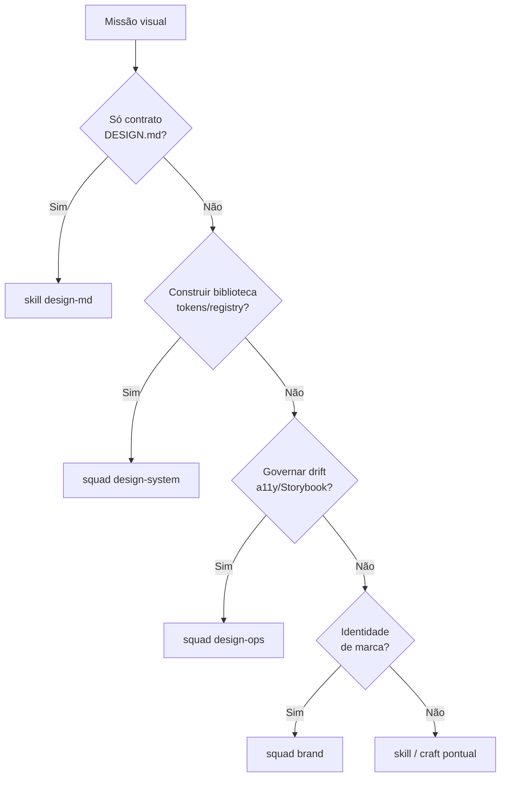

# Skill, squad e marca: o menor mecanismo suficiente

[⌂ Curso](../README.md) · [↑ M3](../modulos/M3.md) · [← Anterior](08-portao-qualidade-visual.md) · [Próxima →](10-capstone-contrato-e-componente.md)

## Resultado

Você escolhe, para missões reais, entre skill isolada, `design-system`, `design-ops`, `brand` ou sequência — com anti-escopo e maturidade declarada.

## Mapa visual



## Quando usar — e quando não usar

**Use** antes de copiar um squad inteiro “por precaução”.

**Não use** esta aula como runbook das 100+ tasks — isso está no curso **AIOX Advanced Squads** (aulas 13–15).

## Mapa rápido (acervo)

| Mecanismo | Path | Quando |
|-----------|------|--------|
| design-md | `skills/design-md/` | Criar/lintar contrato |
| design-system | `squads/design-system/` | Construir biblioteca |
| design-ops | `squads/design-ops/` | Governar no tempo |
| brand | `squads/brand/` | Identidade / marca |
| impeccable | `skills/impeccable/` | Craft pós-conformidade |
| design-chief | agents nos squads design | Orquestrar fluxo de design |

**Maturidade (catalog):** vários packs design estão em `study` / `partial`. Estude anatomia; **copie** para o projeto; não finja execução autônoma neste vault.

```bash
cp -R squads/design-system /caminho/do/seu-projeto/squads/
cp -R skills/design-md /caminho/do/seu-projeto/.claude/skills/   # se usar skill
```

Este repositório é **biblioteca**, não runtime.


## Âncora no acervo

Aulas operacionais: `cursos/AIOX-Advanced-Squads/aulas/13-brand.md`, `14-design-system.md`, `15-design-ops.md`.

## Prática

Para cada missão, escolha mecanismo + evidência + anti-escopo (1 linha):

1. “Não temos DESIGN.md e a IA inventa cor.”  
2. “Precisamos do primeiro set de tokens e Button no repo.”  
3. “O DS existe mas 30% das telas driftam; falta a11y.”  
4. “Rebranding de logo e voz visual da marca.”  
5. “Botão conforme, só quero mais polish.”


## Pergunte ao seu agente

```text
Missão: {descreva}. Com base no mapa skill vs design-system vs design-ops vs brand vs impeccable, escolha o menor mecanismo. Declare maturidade study/partial se for o caso. Diga o que NÃO fazer. Não execute efeitos externos.
```

## Evidência de conclusão

Tabela 5 missões → mecanismo → evidência → anti-escopo.

## Navegação

[⌂ Curso](../README.md) · [↑ M3](../modulos/M3.md) · [← Anterior](08-portao-qualidade-visual.md) · [Próxima →](10-capstone-contrato-e-componente.md)
