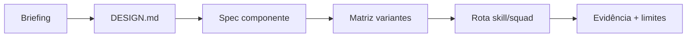

# Capstone: do briefing ao contrato com prova

[⌂ Curso](../README.md) · [↑ M3](../modulos/M3.md) · [← Anterior](09-skill-vs-squad-design.md) · → Capstone/fim

## Resultado

Você entrega um pacote mínimo: briefing, DESIGN.md utilizável, spec de 1 componente, matriz de variantes, rota operacional e autocrítica — sem inventar runtime.

## Mapa visual



## Quando usar — e quando não usar

**Use** para fechar o curso ou para destravar UI de um projeto real em um ciclo curto.

**Não use** para prometer Storybook + Chromatic + 40 componentes no mesmo dia.

## Pacote de entrega

1. **Briefing** (5–10 linhas): usuário, tela/feature, restrições.  
2. **DESIGN.md** (mínimo do curso, coerente).  
3. **Spec do componente:** nome, camada taxonômica, props/variantes, REUSE/ADAPT/CREATE.  
4. **Matriz de variantes** (mesmo se só documental).  
5. **Rota operacional:** skill/squad + maturidade + o que copiar.  
6. **Autocrítica:** o que falta para produção.

## Definition of Done (capstone)

- Contrato legível por agente  
- Zero falha crítica da [Rubrica](../Rubrica.md)  
- Anti-escopo de operação honesto  
- Storybook rodando = **bônus**, não obrigatório


## Âncora no acervo

- Contrato: `skills/design-md/SKILL.md` (validar/manter DESIGN.md no projeto destino).
- Construir biblioteca: `squads/design-system/` · governar: `squads/design-ops/` · marca: `squads/brand/`.
- Craft pós-gate: `skills/impeccable/SKILL.md`.
- Hub deste curso: [README](../README.md) · operação com briefing: `cursos/AIOX-Advanced-Squads/aulas/14-design-system.md` e `15-design-ops.md` (paths monoespaçados; curso irmão).

## Prática

Execute o pacote acima no **seu** produto (ou no cenário: “app de agenda — tela de novo evento + Button primário e secondary”).

Salve em `notas/` (não sobrescreva aulas canônicas).


## Pergunte ao seu agente

```text
Vou colar meu pacote de capstone AIOX Design. Avalie pela rubrica do curso (contrato, taxonomia, variantes, portão vs craft, rota operacional, clareza). Nota por critério e falhas críticas. Não reescreva tudo — diga o menor patch para passar.
```

## Evidência de conclusão

Pacote completo em `notas/` + autoavaliação com nota estimada por critério da rubrica.

## Navegação

[⌂ Curso](../README.md) · [↑ M3](../modulos/M3.md) · [← Anterior](09-skill-vs-squad-design.md) · → Capstone/fim
