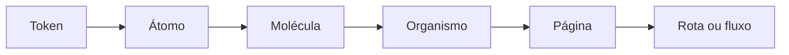

# Taxonomia atômica: do token à página

[⌂ Curso](../README.md) · [↑ M2](../modulos/M2.md) · [← Anterior](09-tokens-componentes-anti-drift.md) · [Próxima →](11-storybook-fonte-da-verdade.md)

## Resultado

Você classifica elementos de interface por nível de composição e identifica onde uma mudança deve ser feita para propagar sem duplicação.

## Mapa visual



## Quando usar — e quando não usar

**Use** para organizar catálogo, ownership e impacto de mudança antes de gerar novas telas.

**Não use** como dogma de nomes. A taxonomia serve para localizar responsabilidade e reuso; um projeto pequeno pode combinar níveis sem perder clareza.

## Os níveis como decisão de manutenção

- **Token:** valor semântico compartilhado, como `color.primary`.
- **Átomo:** unidade mínima interativa ou visual, como Button ou Icon.
- **Molécula:** combinação pequena com uma função, como SearchField.
- **Organismo:** seção autônoma, como Header ou PricingTable.
- **Página:** composição ligada a uma intenção do usuário.
- **Fluxo:** sequência de páginas e estados que entrega um resultado.

Pergunta operacional: **se isto mudar, onde altero uma vez para que todos os consumidores corretos herdem?**

## Caso rápido

Uma tela contém `Input + Button + mensagem de erro`. Se esse conjunto reaparece com a mesma responsabilidade, ele é uma molécula de formulário. Copiá-lo página a página transforma correções de acessibilidade em caça manual.

## REUSE > ADAPT > CREATE no visual

1. **REUSE:** o catálogo já possui a peça e a variante necessária.
2. **ADAPT:** a responsabilidade é a mesma, mas falta um estado legítimo.
3. **CREATE:** existe uma responsabilidade nova e repetível que não cabe no catálogo atual.

## Âncora no acervo

O `DESIGN.md` produzido na aula anterior aponta os componentes canônicos. Esta taxonomia torna o contrato navegável para pessoas e agentes.

Registro e construção no acervo: `skills/design-system/SKILL.md` e `squads/design-system/` (operação detalhada no curso Squads, aula 14).

## Prática

Escolha uma tela real e liste:

- três tokens;
- três átomos;
- duas moléculas;
- um organismo;
- a intenção da página.

Marque uma peça que deve ser reutilizada e uma que talvez precise de nova variante. Justifique sem usar “porque ficou bonito”.

## Pergunte ao seu agente

```text
Classifique os elementos desta tela na taxonomia do curso. Depois indique onde há duplicação, onde falta variante e onde a criação de componente seria prematura. Use REUSE > ADAPT > CREATE.
```

## Evidência de conclusão

Mapa da tela por níveis, com uma decisão REUSE/ADAPT/CREATE defendida por responsabilidade e recorrência.

## Navegação

[⌂ Curso](../README.md) · [↑ M2](../modulos/M2.md) · [← Anterior](09-tokens-componentes-anti-drift.md) · [Próxima →](11-storybook-fonte-da-verdade.md)
