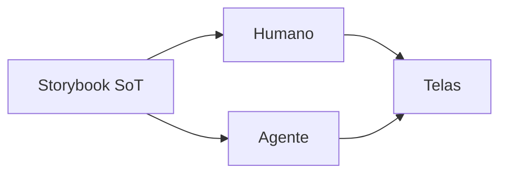

# Storybook como fonte da verdade

[⌂ Curso](../README.md) · [↑ M3](../modulos/M3.md) · [← Anterior](10-taxonomia-atomica.md) · [Próxima →](12-stack-tailwind-shadcn-storybook.md)

## Resultado

Você define e aplica a política de Storybook como fonte da verdade.

## Mapa visual



## Quando usar — e quando não usar

**Use** antes de instalar ferramentas.

**Não use** Storybook como pasta morta de screenshots.

## A mudança de pergunta

Sem Storybook: “onde está o Button certo?”.  
Com Storybook como **fonte da verdade (SoT)**: “o que está no catálogo é o que a IA e o humano podem usar”.

## O que o Storybook prova

- Componente existe e renderiza.  
- Variantes nomeadas (não “versão do prompt de ontem”).  
- Documentação viva (não README morto).  
- Base para a11y e regressão (próximas aulas).

## Regra de ouro (live)

Nas aulas ao vivo: alterar o DS **no Storybook/contrato**; telas **consomem**. Se a tela inventa um Button, o sistema perdeu.

## Âncora no acervo

`squads/design-system/` · `squads/design-ops/` · stack na aula 12.

## Prática

Escreva a política em 4 linhas: (1) o que é SoT, (2) o que um agente pode criar, (3) o que precisa de PR no DS, (4) o que é proibido.

## Pergunte ao seu agente

```text
Redija uma policy de 10 linhas: Storybook é SoT. Inclua o que fazer se faltar componente. Não instale nada ainda.
```

## Evidência de conclusão

Policy SoT assinada (você). Passou se proíbe “componente só na página”.

## Navegação

[⌂ Curso](../README.md) · [↑ M3](../modulos/M3.md) · [← Anterior](10-taxonomia-atomica.md) · [Próxima →](12-stack-tailwind-shadcn-storybook.md)
