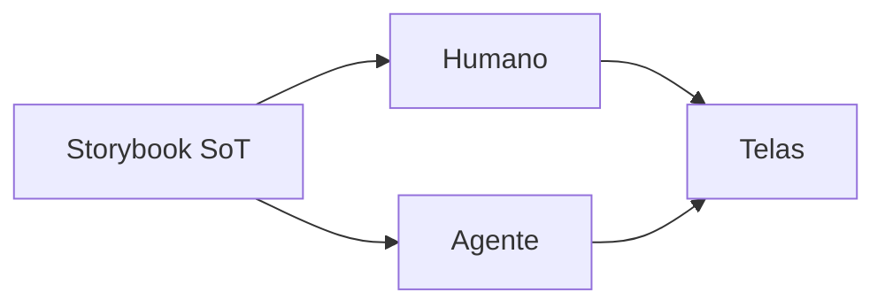

# Storybook como fonte da verdade

[⌂ Curso](../README.md) · [↑ M3](../modulos/M3.md) · [← Anterior](10-taxonomia-atomica.md) · [Próxima →](12-stack-tailwind-shadcn-storybook.md)

## Resultado

Você define e aplica a política de Storybook como fonte da verdade.

## Mapa visual



## Quando usar — e quando não usar

**Use** antes de instalar ferramentas.

**Não use** Storybook como pasta morta de screenshots.

## A mudança de pergunta

Sem Storybook: “onde está o Button certo?”.
Com Storybook como **fonte da verdade (SoT)**: “o que está no catálogo é o que a IA e o humano podem usar”.

## O que o Storybook prova

- Componente existe e renderiza.
- Variantes nomeadas (não “versão do prompt de ontem”).
- Documentação viva (não README morto).
- Base para a11y e regressão (próximas aulas).

## Regra de ouro (live)

Nas aulas ao vivo: alterar o DS **no Storybook/contrato**; telas **consomem**. Se a tela inventa um Button, o sistema perdeu.

## O contrato de publicação

Storybook deixa de ser vitrine quando responde, para humanos e agentes:

- qual componente é canônico;
- qual API pública está suportada;
- quais variantes e estados existem;
- quais tokens são consumidos;
- quais requisitos de acessibilidade foram provados;
- quem mantém a peça;
- qual alternativa substitui uma opção depreciada.

### Estados de catálogo

| Estado | Significado | Pode entrar em código novo? |
|---|---|---|
| experimental | hipótese em validação | apenas com autorização explícita |
| canonical | caminho padrão suportado | sim |
| deprecated | existe, mas tem substituto | não |
| internal | detalhe de composição | não como API pública |

Um componente pode funcionar no código e ainda não estar publicado como capacidade segura de reuso. Para promover a `canonical`, exija responsabilidade clara, API mínima, stories críticas, acessibilidade básica e owner.

No squad `design-system` deste acervo o mesmo ciclo aparece expandido como CANDIDATE → EXPERIMENTAL → STABLE → CANONICAL → DEPRECATED (`squads/design-system/tasks/ds-critical-eye-decide.md`); a tabela acima é a visão mínima desse ciclo, com `internal` cobrindo peças fora da API pública.

### Falha de sincronização

Se a story não representa o componente real, ela não é documentação: é drift. Código, contrato e catálogo devem mudar no mesmo ciclo ou declarar explicitamente uma transição.

## Âncora no acervo

`squads/design-system/` · `squads/design-ops/` · stack na aula 12.

## Prática

Escreva a política em 4 linhas e publique o contrato de um componente: responsabilidade, owner, status, props públicas, tokens, stories obrigatórias e critério de promoção.

## Pergunte ao seu agente

```text
Redija uma policy de 10 linhas: Storybook é SoT. Inclua o que fazer se faltar componente. Não instale nada ainda.
```

## Evidência de conclusão

Policy SoT + contrato de publicação de um componente. Passou se proíbe “componente só na página” e diferencia experimental de canônico.

## Navegação

[⌂ Curso](../README.md) · [↑ M3](../modulos/M3.md) · [← Anterior](10-taxonomia-atomica.md) · [Próxima →](12-stack-tailwind-shadcn-storybook.md)
