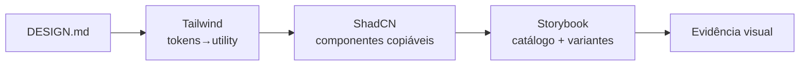

# Tailwind + ShadCN + Storybook: stack canônica para IA

[⌂ Curso](../README.md) · [↑ M3](../modulos/M3.md) · [← Anterior](11-storybook-fonte-da-verdade.md) · [Próxima →](13-storybook-install-e-stories.md)

## Resultado

Você justifica por que essa stack ajuda **agentes** a gerar UI coerente — e nomeia dois casos em que outra stack é aceitável.

## Mapa visual



## Quando usar — e quando não usar

**Use** ao escolher stack de UI **com** geração por IA no loop.

**Não use** como religião: canônico ≠ único. E stack **sem** DESIGN.md **não** resolve deriva.

## Por que essa combinação ajuda a IA

| Peça | Papel para o agente |
|------|---------------------|
| **Tailwind** | Utilitários previsíveis; tokens mapeáveis em classes |
| **ShadCN-style** | Componentes no **seu** repo (copiáveis), não caixa preta opaca |
| **Storybook** | Catálogo e variantes legíveis como especificação viva |

### O que a stack **não** resolve

- Falta de contrato (DESIGN.md)
- Produto sem hierarquia de informação
- Marca inexistente (aí entra brand, não “mais um plugin”)

### Quando outra stack é ok

1. Legado já consolidado (ex.: CSS Modules + DS interno) — **ADAPT**, não reescrever.
2. Plataforma mobile nativa — padrões nativos + tokens compartilhados.


## Âncora no acervo

Implementação: docs oficiais da stack no seu projeto. Neste acervo, o **critério** vive neste curso; a **operação** de DS em `squads/design-system/`.

## Prática

Escreva um parágrafo (5–8 linhas) “Por que usamos / não usamos esta stack no meu produto” com:

- 1 benefício para IA
- 1 risco
- 1 alternativa aceitável
- relação com seu DESIGN.md (“stack implementa o contrato” ou “contrato primeiro”)


## Pergunte ao seu agente

```text
Avalie se Tailwind+ShadCN+Storybook faz sentido no meu contexto (vou descrever stack atual). Compare com manter o legado. Decida com trade-offs. Não force migração total.
```

## Evidência de conclusão

Parágrafo de decisão de stack assinado (você) com trade-off explícito.

## Navegação

[⌂ Curso](../README.md) · [↑ M3](../modulos/M3.md) · [← Anterior](11-storybook-fonte-da-verdade.md) · [Próxima →](13-storybook-install-e-stories.md)
