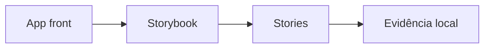

# Instalar Storybook e gerar stories vivas

[⌂ Curso](../README.md) · [↑ M3](../modulos/M3.md) · [← Anterior](12-stack-tailwind-shadcn-storybook.md) · [Próxima →](14-storybook-variantes.md)

## Resultado

Você instala Storybook (ou documenta bloqueio real) e publica ao menos uma story de átomo.

## Mapa visual



## Quando usar — e quando não usar

**Use** quando o contrato mínimo já existe.

**Não use** para pular DESIGN.md.

## Resultado prático

Ao final você tem (ou documenta o bloqueio real de ambiente com evidência): Storybook **instalado** no repo de front e **pelo menos 1 story** de um átomo (Button ou equivalente).

## Sequência (conceito)

1. App front existente ou scaffold mínimo (Vite/Next + React, ou o stack do seu projeto).
2. Adicionar Storybook compatível com a stack.
3. Gerar/escrever story do átomo canônico.
4. Rodar localmente e capturar evidência (URL local + print ou log).

Comandos exatos variam por stack — use a documentação da sua versão; o curso exige o **resultado**, não um vendor lock de CLI.

## Tema de casa das lives

Na T1 de Design System, o exercício de casa era **ter o Storybook com o design system materializado** — não um PDF de tokens. Esta aula restaura esse portão.

## Contrato da primeira story

A instalação só cria uma superfície vazia. A primeira story precisa provar que o componente consome o sistema:

1. importa o componente real, não uma cópia criada para documentação;
2. usa tokens ou classes canônicas;
3. expõe somente props suportadas;
4. cobre `default` e um estado de risco, como `disabled`;
5. registra nome, responsabilidade e status do catálogo;
6. renderiza sem depender da aplicação inteira.

### Checklist de ambiente

Antes de atribuir falha ao Storybook, registre:

- stack e versões relevantes;
- gerenciador de pacotes do projeto;
- comando executado;
- primeiro erro reproduzível;
- addon ou configuração mínima faltante;
- próximo teste objetivo.

Não troque o gerenciador do projeto apenas para seguir um tutorial. Use documentação compatível com a versão instalada. O objetivo é o resultado executável, não memorizar um comando que envelhece.

### Portão da aula

Bloqueio documentado fecha **esta aula** com honestidade, mas não o capstone. A diferença evita fingir execução sem impedir que o aluno registre o diagnóstico e continue a remediação.

## Âncora no acervo

Aula 12 (stack). Skills/squads de design quando for operar em escala.

## Prática

1. Rode Storybook local **ou** registre bloqueio (Node ausente, monorepo, etc.) com passo que falta.
2. Se rodou: 1 story de Button com `default` + `disabled`, consumindo tokens canônicos e com status de catálogo.

## Pergunte ao seu agente

```text
No meu repo (descrevo stack), planeje a instalação do Storybook em passos mínimos e a primeira story do Button alinhada ao DESIGN.md. Não invente tokens.
```

## Evidência de conclusão

Print/log de Storybook rodando + story real; ou bloqueio reproduzível com próximo teste. Somente a primeira opção satisfaz o futuro capstone.

## Navegação

[⌂ Curso](../README.md) · [↑ M3](../modulos/M3.md) · [← Anterior](12-stack-tailwind-shadcn-storybook.md) · [Próxima →](14-storybook-variantes.md)
